# Architecture

Technical architecture of **Witness: A Journey Through Scripture** as it exists in this repository (four chapters, starting with *The Road to Jericho*). Everything here is meant to be checkable against the code, and the links point at the source of truth. The reasoning behind each major choice is in the [Architecture Decision Records](adr/README.md).

**Contents**

1. [Goals and constraints](#1-goals-and-constraints)
2. [Layers and dependency rules](#2-layers-and-dependency-rules)
3. [Repository structure](#3-repository-structure)
4. [Module and component responsibilities](#4-module-and-component-responsibilities)
5. [Domain model](#5-domain-model)
6. [The Condition and Effect DSLs](#6-the-condition-and-effect-dsls)
7. [The rules runner](#7-the-rules-runner)
8. [Typed event model](#8-typed-event-model)
9. [Data flows](#9-data-flows)
10. [State management boundaries](#10-state-management-boundaries)
11. [The React ↔ Phaser boundary](#11-the-react--phaser-boundary)
12. [Input abstraction](#12-input-abstraction)
13. [Error handling](#13-error-handling)
14. [Performance design](#14-performance-design)
15. [Test seams](#15-test-seams)
16. [Known gaps observed in the code](#16-known-gaps-observed-in-the-code)

---

## 1. Goals and constraints

| Goal / constraint | How the code meets it | Enforced or checked by |
|---|---|---|
| **Local-first, no backend** | All player data lives in browser IndexedDB (`witness-game`), with a memory fallback. No code in `src/` calls a network API. The only traffic is the browser loading the app's own files and service worker. | [tests/architecture/layers.test.ts](../tests/architecture/layers.test.ts) rejects `fetch(`, `XMLHttpRequest`, `navigator.sendBeacon` and `new WebSocket` anywhere in `src/` |
| **Static hosting** | A plain Vite build. `VITE_BASE_PATH` sets `base`, and the asset URLs, service-worker scope and manifest `start_url` all come from it. | [vite.config.ts](../vite.config.ts) |
| **Works offline (PWA)** | Workbox precaches `js, css, html, svg, png, woff2, webmanifest`, including the Phaser chunk (`maximumFileSizeToCacheInBytes` is 3 MB). | [e2e/pwa.spec.ts](../e2e/pwa.spec.ts) |
| **Small first download** | Phaser (`src/game`) and chapter content load only through dynamic `import()`. | Architecture tests: *keeps Phaser out of the initial bundle*, *keeps chapter content lazy* |
| **Deterministic, testable rules** | Game rules are pure functions in `src/domain`. The `Clock` is injected, and rule timestamps come from `GameState.playTimeMs`. | Unit tests, including *is deterministic: same effects, same state and events* ([tests/unit/domain/quests.test.ts](../tests/unit/domain/quests.test.ts)) |
| **Content is data, never code** | Conditions and effects are Zod-validated discriminated unions. Chapters are checked for both shape and referential integrity. | `npm run content:validate` (also run first by `npm run build`), plus the architecture test that forbids `eval(` and `new Function(` |
| **Scripture integrity** | References are stored separately from verse text. Text only comes through a `ScriptureTextProvider`, which returns a placeholder by default. | `checkRecordIntegrity` ([src/domain/content-records.ts](../src/domain/content-records.ts)), [tests/unit/infrastructure/scripture.test.ts](../tests/unit/infrastructure/scripture.test.ts) |
| **No spiritual scoring** | Trust is a small clamped relationship value that the UI shows only as words. The summary reports facts. | [tests/content/road-to-jericho.test.ts](../tests/content/road-to-jericho.test.ts), ADR [0010](adr/0010-no-numeric-spiritual-scoring.md) |
| **Accessible by construction** | Every world interaction is also reachable through HTML (HUD, prompt, "Go to…" list). The canvas is `aria-hidden`. | UI tests ([tests/ui/](../tests/ui/)), [e2e/a11y.spec.ts](../e2e/a11y.spec.ts), `jsx-a11y` strict lint |
| **Privacy** | Reflection text stays on the device. Analytics are off by default, whitelisted and slug-only. | Architecture test *never passes the reflection text to analytics, sync, AI or other infrastructure*, plus analytics tests in [tests/unit/application/services.test.ts](../tests/unit/application/services.test.ts) |
| **Type safety** | TypeScript `strict` with `noUncheckedIndexedAccess`, `noImplicitOverride` and `verbatimModuleSyntax`. No explicit `any`. | `npm run typecheck`, ESLint `no-explicit-any`, architecture test *has no explicit `any` type* |
| **Modest hardware** | The Phaser renderer requests `powerPreference: 'low-power'` with a 60 fps target. The world is painted into a few cached canvas textures. | [e2e/perf.spec.ts](../e2e/perf.spec.ts) (a conservative floor of >20 fps in headless CI) |

## 2. Layers and dependency rules

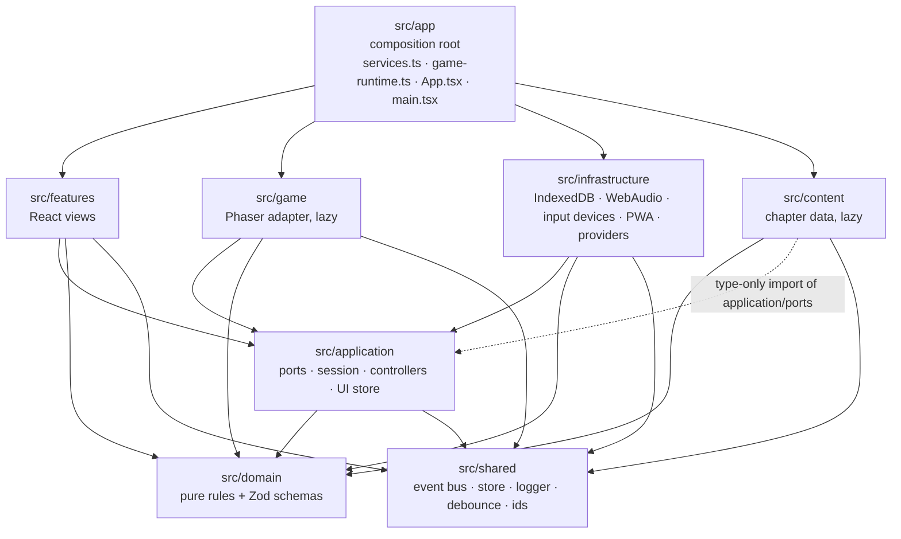

`src/app` may import any layer; the diagram omits those edges. `src/domain` imports only itself and `zod`. It does **not** import `src/shared`.

**Allowed imports**, exactly as encoded in the `ALLOWED` table of [tests/architecture/layers.test.ts](../tests/architecture/layers.test.ts):

| Layer | May import | Why (from the test's `WHY` table) |
|---|---|---|
| `src/domain` | `domain` | Keeps game rules pure, so they are unit-testable and reusable across chapters. |
| `src/shared` | `shared` | Tiny framework-free utilities that every other layer may use. |
| `src/application` | `application`, `domain`, `shared` | Depends on ports (interfaces), never on concrete infrastructure, UI or Phaser. |
| `src/content` | `content`, `domain`, `shared`, plus **type-only** imports whose specifier ends in `/ports` | Chapter content is data, validated by domain schemas. |
| `src/infrastructure` | `infrastructure`, `application`, `domain`, `shared` | Adapters implement application ports. They don't know about the UI or the renderer. |
| `src/game` | `game`, `application`, `domain`, `shared` | The world renders what it is told and reports events back. No React, no storage. |
| `src/features` | `features`, `application`, `domain`, `shared` | React talks only to the application layer. Phaser and IndexedDB stay behind ports. |
| `src/app` | everything | The composition root. |

**Framework containment** (same test file):

| Rule | Detail |
|---|---|
| Only `src/game/` imports `phaser` | Phaser owns only rendering, movement and pointer input. |
| Only `src/infrastructure/persistence/` imports `idb` / `fake-indexeddb` **or** mentions `indexedDB`, `localStorage`, `sessionStorage` | Every read goes through validated, migrated repositories. |
| Only `src/features/` and `src/app/` import `react` / `react-dom` | Domain, application, content and game code run without React. |
| Outside `src/game`, imports of `src/game` must be dynamic `import()` (or type-only) | Keeps Phaser out of the first download. See `GameRuntime.mountWorld` in [src/app/game-runtime.ts](../src/app/game-runtime.ts). |
| Outside `src/content`, imports of `src/content/chapters/**` must be dynamic (or type-only) | Chapters download only when played. See the registry in [src/content/index.ts](../src/content/index.ts). |

**Safety and privacy rules** (checked on source with comments and string literals stripped): no network calls (`fetch(`, `XMLHttpRequest`, `navigator.sendBeacon`, `new WebSocket`), no `eval(` / `new Function(`, no explicit `any`, no `console.log(`, and no `.reflection` access in `src/infrastructure/**` or analytics files.

The test scans `import … from`, `export … from`, side-effect `import '…'` and dynamic `import('…')` statements. It resolves `@/` and relative specifiers, and prints *what / why / how to fix* for every violation.

## 3. Repository structure

```text
.
├── src/                    application source, one folder per layer (below)
├── tests/                  Vitest: unit, integration, content, architecture, ui (+ fixtures, support)
├── e2e/                    Playwright specs against the production build
├── scripts/                content validation, bundle report, icon rasteriser, git hooks, policy
├── public/icons/           icon.svg + PNGs rasterised from it (npm run icons)
├── docs/                   design, architecture, ADRs, governance, operations
├── .github/workflows/      ci.yml, deploy-pages.yml
├── index.html              app shell (boot message, <noscript>)
├── vite.config.ts          build, PWA plugin, Vitest projects
├── playwright.config.ts    desktop / mobile / tablet projects, preview server on :4391
├── init.sh · agent-status.sh · quality-sweep.sh · harden-github.sh   harness scripts
└── AGENTS.md · feature_list.json                                     agent entry point, feature registry
```

| Folder | Holds | Why it is its own folder |
|---|---|---|
| `src/app` | `main.tsx` (bootstrap), `services.ts` (composition root), `game-runtime.ts` (one chapter run), `App.tsx` (screen state machine), `ErrorBoundary.tsx`, `config.ts`, styles | The only place where concrete implementations are chosen and layers are wired together, and the only layer allowed to import everything. |
| `src/domain` | Zod schemas and pure functions: conditions, effects, rules, quests, dialogue, puzzles, inventory, journal, world/navigation, saves, settings, profiles, content records, Scripture references, guide policy | Rules must run identically in tests, the content validator, the browser and any future server, so they depend on nothing but `zod`. |
| `src/application` | Ports (interfaces), `GameSession`, `GameController`, dialogue/puzzle controllers, `UiStore`, save/profile/settings services, autosave, analytics policy, `VirtualInput`, world render model | Orchestration and use cases. Depends on interfaces only, so the same code drives the real game and the headless test harness. |
| `src/game` | The Phaser adapter: `mount-world.ts`, the single `WorldScene`, procedural art, pure collision/focus systems | Isolates the roughly 1 MB engine behind `WorldPort`, loaded lazily. |
| `src/features` | React components by feature: menu, profiles, game screen, HUD, dialogue, journal, satchel, quests, puzzles, chapter ending, settings, pause, "Go to…" | UI views that only render stores and call application services. |
| `src/content` | The chapter registry and loader (`index.ts`), extra validation (`validation.ts`), Chapter 1 data, shared sources and governance presets, the Scripture translation registry | Content is data validated by domain schemas. Keeping it separate lets new chapters be added without engine changes, and lets content load lazily. |
| `src/infrastructure` | IndexedDB and memory repositories, WebAudio synth, keyboard and gamepad sources, service-worker registration, Scripture provider, analytics providers, local-only sync/auth, disabled study guide | Everything that touches a browser API other than the DOM. Swappable adapters behind ports. |
| `src/shared` | `TypedEventBus`, `Store`, `createLogger`, `debounce`, `createId` | Framework-free utilities used by every layer except `domain`. |
| `tests/` | `unit/` (per layer), `integration/` (full playthroughs), `content/`, `architecture/`, `ui/` (React Testing Library, jsdom), `fixtures/saves/`, `support/` (headless harness) | Vitest projects `unit` (node) and `ui` (jsdom) defined in `vite.config.ts`. |
| `e2e/` | `smoke`, `chapter`, `saves`, `pwa`, `a11y`, `mobile`, `perf` specs | Runs against `vite preview` of the production build, so the service worker and lazy chunks behave as they do for players. |
| `scripts/` | `validate-content.ts`, `report-bundle.mjs`, `generate-icons.mjs`, `hooks/`, `lib/policy.sh` | Build-time and harness tooling. |
| `public/` | PWA icons only | The only static files. There is no other binary art or audio. |
| `docs/` | This document, [adr/](adr/README.md), [save-data.md](save-data.md), [future-aws.md](future-aws.md) and the other guides linked from `AGENTS.md` | Durable design knowledge next to the code. |

## 4. Module and component responsibilities

| Module | Layer | Responsibility | Collaborates with |
|---|---|---|---|
| [domain/conditions.ts](../src/domain/conditions.ts) | domain | `Condition` union, `ConditionSchema`, `evaluate()` (pure and total), `conditionReferences()` for integrity checks | everything that gates content |
| [domain/effects.ts](../src/domain/effects.ts) | domain | `Effect` union, `EffectSchema`, `applyEffect()` returning `(state, events)`, trust clamp | rules runner |
| [domain/rules.ts](../src/domain/rules.ts) | domain | `runEffects()`: effect queue, quest fixpoint, journal auto-unlocks | `GameSession.dispatch` |
| [domain/quests.ts](../src/domain/quests.ts) | domain | Quest schema, `startQuest` / `completeObjective` / `stepQuest`, quest log, HUD objective | rules runner, HUD, save labels |
| [domain/dialogue.ts](../src/domain/dialogue.ts) | domain | Dialogue schema, entry selection, `visibleChoices`, `continuationOf`, `{player}` interpolation | `DialogueController` |
| [domain/puzzles.ts](../src/domain/puzzles.ts) | domain | Four puzzle schemas and pure checkers (packing, measuring, deduction, sequence), tiered hints | `PuzzleController` |
| [domain/world.ts](../src/domain/world.ts), [navigation.ts](../src/domain/navigation.ts) | domain | Scene/entity/exit/trigger schemas, tile catalogue, ASCII `parseLayout`, BFS `findPath`, `approachTiles` | world model, WorldScene, content validation |
| [domain/chapter.ts](../src/domain/chapter.ts), [chapter-integrity.ts](../src/domain/chapter-integrity.ts) | domain | `ChapterSchema` (shape) and `validateChapterIntegrity` (every referenced id exists) | content loader, validator |
| [domain/content-records.ts](../src/domain/content-records.ts), [scripture.ts](../src/domain/scripture.ts) | domain | Content kinds, governance workflow, per-kind integrity rules, Scripture references and placeholder | UI content blocks, validator |
| [domain/save.ts](../src/domain/save.ts), [state/game-state.ts](../src/domain/state/game-state.ts) | domain | Persistent state schema, save schema, versioned migrations | `SaveService` ([save-data.md](save-data.md)) |
| [domain/settings.ts](../src/domain/settings.ts), [profile.ts](../src/domain/profile.ts) | domain | Device settings schema with field-by-field fallback, key rebinding, profile schema and name rules | settings/profile services |
| [domain/chapter-summary.ts](../src/domain/chapter-summary.ts) | domain | End-of-chapter summary from concrete facts | `ChapterSummary` view |
| [domain/guide-policy.ts](../src/domain/guide-policy.ts) | domain | Acceptance policy for a *future* study guide | [future-aws.md](future-aws.md) |
| [application/ports.ts](../src/application/ports.ts) | application | Every interface that infrastructure or Phaser implements | all adapters |
| [application/game-session.ts](../src/application/game-session.ts) | application | Owns `Store<GameState>` for one run. `dispatch(effects)`, scene entry, FIFO event publication | domain rules, bus |
| [application/game-controller.ts](../src/application/game-controller.ts) | application | Boundary between world, story and UI: handles `WorldEvent`s, reacts to `DomainEvent`s, deferred request queue, triggers, toasts, audio cues | session, controllers, `UiStore`, `WorldPort`, `AudioPort` |
| [application/dialogue-controller.ts](../src/application/dialogue-controller.ts) | application | Runs one conversation at a time, applies node/choice effects, keeps the dialogue log | session, `UiStore` |
| [application/puzzle-controller.ts](../src/application/puzzle-controller.ts) | application | Opens and closes puzzles, validates attempts with domain checkers, hints, `onSolved` effects | session, `UiStore` |
| [application/ui-store.ts](../src/application/ui-store.ts) | application | Ephemeral UI state (overlays, dialogue view, puzzle, panel, focus, toasts, announcements) and `explorationAllowed` | React, controller |
| [application/save-service.ts](../src/application/save-service.ts), [autosaver.ts](../src/application/autosaver.ts) | application | Build/list/load saves (migrate and validate on every read), debounced autosave | `SaveRepository` |
| [application/profile-service.ts](../src/application/profile-service.ts), [settings-service.ts](../src/application/settings-service.ts) | application | Profiles (max 8 per device, deleting a profile deletes its saves), device settings store | repositories |
| [application/analytics.ts](../src/application/analytics.ts) | application | Consent gate, whitelist and slug sanitiser, domain-event → analytics mapping | `AnalyticsProvider` |
| [application/input.ts](../src/application/input.ts) | application | `VirtualInput`: device-independent held and edge-triggered actions | input sources, `WorldScene`, `GameScreen` |
| [application/world-model.ts](../src/application/world-model.ts) | application | Content + state → `WorldSceneModel`, visible entities, "Go to…" destinations | controller |
| [game/phaser/mount-world.ts](../src/game/phaser/mount-world.ts) | game | Creates `Phaser.Game`, returns a `WorldPort`, marks the canvas `aria-hidden` | `GameRuntime` |
| [game/scenes/world-scene.ts](../src/game/scenes/world-scene.ts) | game | The single scene: movement, path following, focus, tap-to-move, camera, light; delegates to `actors.ts` (people: blink, turn, talk, poses), `ambient.ts` (passers-by, pigeons, birds, hawk shadow, swaying palms, light flicker), `feedback.ts` (focus ring and verb symbol, clue glints, exit chevrons, flourishes) and `textures.ts`; `src/game/fx/` draws weather (`weather-layer.ts`), live water (`water-surface.ts`) and the camera's post-processing (`post-fx.ts`); `src/game/phaser/viewport.ts` keeps the canvas at device pixels ([ADR-0015](adr/0015-world-rendering-effects.md)) | `VirtualInput`, `WorldEvent` listener |
| [game/systems/](../src/game/systems/) | game | Pure, unit-tested rules: collision, focus picking, camera framing and look-ahead, lighting, automatic quality levels, render resolution, weather (easing, gusts, particle budgets, lightning rationing), the post-processing grade, water, signs of life (noticing, blinking, talking, crowds, pigeons) | `WorldScene` and helpers |
| [game/art/](../src/game/art/) | game | Art direction per mood (`direction.ts`), site reading (`site.ts`), the scene painter and its passes (terrain, architecture, nature, furnishings, shading), character sheets and poses, entity props | `WorldScene` |
| [infrastructure/persistence/](../src/infrastructure/persistence/) | infrastructure | IndexedDB repositories, memory fallback, `createRepositories()` | `SaveService`, `ProfileService`, `SettingsService` |
| [infrastructure/audio/synth-audio.ts](../src/infrastructure/audio/synth-audio.ts) | infrastructure | `SynthAudio` (procedural WebAudio + captions) and `SilentAudio` | `AudioPort` |
| [infrastructure/input/](../src/infrastructure/input/) | infrastructure | Keyboard (remappable) and gamepad (standard mapping) → `VirtualInput`; gamepad focus navigation of menus and dialogue | `App` |
| [infrastructure/pwa/register-sw.ts](../src/infrastructure/pwa/register-sw.ts) | infrastructure | Service-worker registration with a prompt-to-update flow | `main.tsx` |
| [infrastructure/scripture/scripture-provider.ts](../src/infrastructure/scripture/scripture-provider.ts) | infrastructure | `StaticScriptureProvider`: approved stored text or the placeholder | `ContentBlock` |
| [infrastructure/sync](../src/infrastructure/sync/local-only.ts), [ai](../src/infrastructure/ai/disabled-study-guide.ts), [analytics](../src/infrastructure/analytics/providers.ts) | infrastructure | Local-only sync/auth, disabled study guide, no-op and log analytics | [future-aws.md](future-aws.md) |
| [content/index.ts](../src/content/index.ts), [validation.ts](../src/content/validation.ts) | content | Lazy chapter registry, `parseChapter` (schema + integrity), reachability and governance report | `ChapterSource`, `scripts/validate-content.ts` |
| [shared/event-bus.ts](../src/shared/event-bus.ts), [store.ts](../src/shared/store.ts), [logger.ts](../src/shared/logger.ts) | shared | Typed bus with handler isolation, observable store (works with `useSyncExternalStore`), ring-buffer logger | everyone except domain |
| [app/services.ts](../src/app/services.ts) | app | Chooses every implementation, loads settings before first render | `main.tsx` |
| [app/game-runtime.ts](../src/app/game-runtime.ts) | app | Everything for one chapter run: bus, session, controllers, `UiStore`, autosaver, lazy world | `App.tsx`, `GameScreen` |
| [features/game/GameScreen.tsx](../src/features/game/GameScreen.tsx), [GameViewport.tsx](../src/features/game/GameViewport.tsx) | features | Game screen layout, input-action routing, play-time tick, autosave flush, audio unlock, world host | runtime |
| [features/*](../src/features/) (HUD, dialogue, journal, satchel, quests, puzzles, chapter ending, settings, menus) | features | HTML views of stores. Overlays (journal, satchel, quests, "Go to…", pause, puzzles, ending panels, settings, dialogue history) use the focus-trapping `Modal`. The dialogue box is a non-modal `role="dialog"` panel. | runtime, services |

## 5. Domain model

Content refers to other content **by string id**, not by object reference. Shape is checked by `ChapterSchema`, and every id is resolved by `validateChapterIntegrity` when a chapter loads and at build time. In the diagrams, `Record~T~` means a string-keyed record, `?` marks an optional field, and dashed arrows are id references.

### 5.1 Chapter content: world and narrative

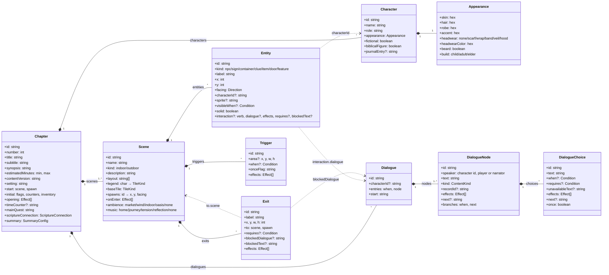

Notes:

- **Entities** are placed things. `interaction.verb` is one of `talk, examine, read, open, take, use, enter`. When the player interacts, `requires` is checked first (failure shows `blockedText`), then `effects` are dispatched, then `dialogue` starts.
- **Triggers** fire once, guarded by the `onceFlag`. *Area* triggers (with `area`) fire when the player enters the rectangle and `when` holds. *State* triggers (no `area`, `when` required by a schema refinement) fire when `when` becomes true while the player is in the scene.
- **Dialogue** speakers are character ids or the reserved `player` and `narrator`. A node whose `kind` is `paraphrase` or `scripture` must link a matching `ContentRecord` through `recordId` (integrity check).
- **Appearance** drives both the Phaser sprite sheet ([game/art/people/](../src/game/art/people/) when painted; pre-rendered sheets from [tools/art/](../tools/art/) in places with pre-rendered art) and the React SVG portrait ([features/common/Portrait.tsx](../src/features/common/Portrait.tsx)). Player looks are the presets in `PLAYER_APPEARANCES`.

### 5.2 Chapter content: progression, items, knowledge, puzzles

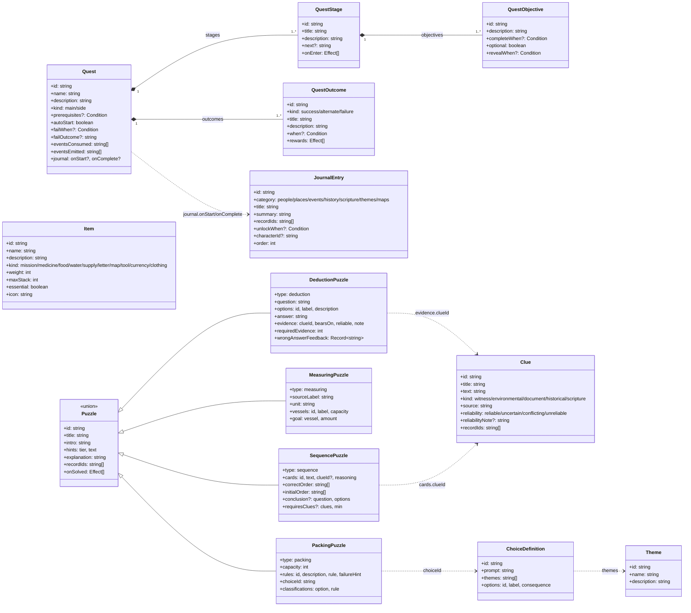

A chapter holds arrays of all of these (`quests` at least one, `scenes` at least one). `Chapter.mainQuest` names the main quest. Packing rules (`PackRule`) are their own small union: `includes`, `withinCapacity`, `state` (wraps a `Condition`), `allOf`, `anyOf`. Every puzzle has at least two hint tiers, and only the last tier explains the answer.

### 5.3 Content integrity model

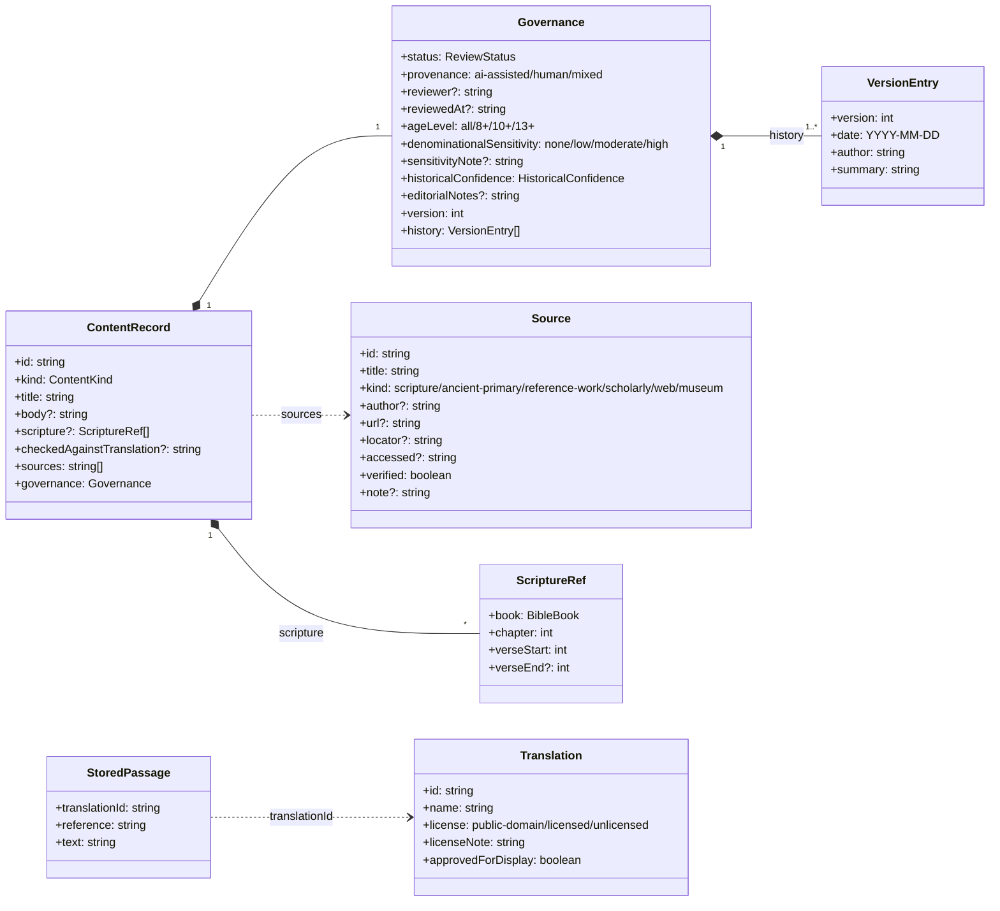

- `ContentKind` is one of `scripture, paraphrase, historical, reconstruction, interpretation, fiction, instruction`. The first five are `EDUCATIONAL_KINDS`, and are "publishable" only once their status is `approved` or `published`.
- `ReviewStatus` is one of `ai-draft, human-draft, sources-attached, citations-verified, validated, in-review, approved, published, rejected`. `transitionReview()` allows only the next step (or `rejected`), requires a named reviewer for `approved`, and bumps `version` on `published`.
- `checkRecordIntegrity()`: `scripture` records must not have a `body` and need at least one reference. `paraphrase` records must cite a passage. `historical` and `reconstruction` records need a body, a source or Scripture reference, and a confidence level other than `not-applicable`. Sensitive `interpretation` records need a `sensitivityNote`. `fiction` must not carry Scripture references. `approved`/`published` records need a reviewer, and `governance.version` must match the latest history entry.
- `Translation` and `StoredPassage` live in [src/content/scripture/translations.ts](../src/content/scripture/translations.ts). See [ADR-0008](adr/0008-scripture-text-provider.md).

### 5.4 Runtime state and persistence

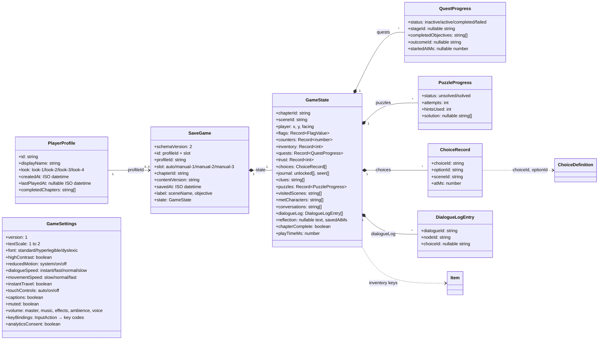

- **Inventory** is a plain `Record<itemId, count>` in `GameState.inventory`, and **Item** holds the definition. `addItem` caps a stack at `Item.maxStack` (or 1 if the item is unknown to the rules runner). `removeItem` deletes empty stacks. `totalWeight` and `packingWeight` use `Item.weight` for the satchel puzzle. Items are never "loot": `essential` marks mission items.
- **Trust** values are clamped to `TRUST_MIN = -2` … `TRUST_MAX = 3` and shown only through `trustLabel()` words (for example "Trusts you"), never as numbers.
- `GameState` is the **only** thing saved. It has no rendering data and no UI state. Field-by-field details are in [save-data.md](save-data.md).
- `PlayerProfile` holds a nickname and a look only. `GameSettings` is device-level (see [ADR-0007](adr/0007-device-level-settings.md)).

## 6. The Condition and Effect DSLs

Content never contains executable code. Every predicate is a `Condition` and every state change is an `Effect`. Both are Zod discriminated unions on `type`, so a chapter file is plain data that can be reviewed in a diff, and every branch is unit-testable.

### 6.1 Conditions ([src/domain/conditions.ts](../src/domain/conditions.ts))

`evaluate(condition, state)` is pure and total. An **absent** condition (`undefined`) evaluates to `true`.

| `type` | Fields | True when |
|---|---|---|
| `always` | — | always |
| `flag` | `flag`, `equals?` (boolean, number or string) | Without `equals`: the flag is set and not `false`. With `equals`: strict equality. |
| `hasItem` | `item`, `min?` (positive int, default 1) | `inventory[item] >= min` |
| `questStatus` | `quest`, `status` (`inactive, active, completed, failed`) | The quest's status equals `status`. A missing quest counts as `inactive`. |
| `questStage` | `quest`, `stage` | The quest is `active` **and** its current `stageId` equals `stage` |
| `objectiveDone` | `quest`, `objective` | The objective is in the quest's `completedObjectives` |
| `choiceMade` | `choice`, `option?` | A `ChoiceRecord` exists for `choice` (and for `option`, if given) |
| `clueFound` | `clue` | `clues` includes it |
| `cluesFound` | `clues` (≥1), `min` | At least `min` of the listed clues are found |
| `puzzleSolved` | `puzzle` | The puzzle's progress status is `solved` |
| `visited` | `scene` | `visitedScenes` includes it |
| `met` | `character` | `metCharacters` includes it |
| `conversationDone` | `dialogue` | `conversations` includes it (set when a conversation ends) |
| `counter` | `counter`, `gte?`, `lte?`, `eq?` | The counter value (default 0) satisfies every bound given |
| `trust` | `character`, `gte?`, `lte?` | The trust value (default 0) satisfies every bound given |
| `journalUnlocked` | `entry` | `journal.unlocked` includes it |
| `all` | `of: Condition[]` | Every sub-condition holds (an empty list is true) |
| `any` | `of: Condition[]` | Some sub-condition holds (an empty list is false) |
| `not` | `condition` | The sub-condition does not hold |

`conditionReferences()` collects every id a condition mentions (items, quests, choices, clues, puzzles, scenes, characters, dialogues, journal) so that `validateChapterIntegrity` can check them. It also checks quest stages, objectives and choice options.

### 6.2 Effects ([src/domain/effects.ts](../src/domain/effects.ts))

`applyEffect(state, effect, ctx)` returns a new state plus the events describing the change. It never mutates its input. An effect that changes nothing emits nothing.

| `type` | Fields | Kind | State change | Events |
|---|---|---|---|---|
| `setFlag` | `flag`, `value` | state | `flags[flag] = value` | `FlagChanged` (only if the value differs) |
| `giveItem` | `item`, `quantity?` (default 1) | state | Adds items, capped at the item's `maxStack` | `ItemCollected {quantity added, total}` |
| `takeItem` | `item`, `quantity?` (default 1) | state | Removes up to what is held. Empty stacks are deleted. | `ItemRemoved {quantity removed, total}` |
| `startQuest` | `quest` | quest | Handled by the rules runner → `startQuest()` | `QuestStarted` |
| `completeObjective` | `quest`, `objective` | quest | Handled by the rules runner → `completeObjective()` | `QuestObjectiveCompleted` |
| `unlockJournal` | `entry` | state | Appends to `journal.unlocked` | `JournalEntryUnlocked` |
| `discoverClue` | `clue` | state | Appends to `clues` | `ClueDiscovered` |
| `adjustTrust` | `character`, `delta` (int) | state | Adds `delta`, clamped to −2…3 | `TrustChanged {from, to}` |
| `adjustCounter` | `counter`, `delta` | state | Adds `delta` | `CounterChanged {from, to}` |
| `setCounter` | `counter`, `value` | state | Sets the value | `CounterChanged {from, to}` |
| `recordChoice` | `choice`, `option` | state | Appends a `ChoiceRecord` (current `sceneId`, `atMs = ctx.nowMs`). **The first answer is kept.** | `ChoiceRecorded` |
| `meetCharacter` | `character` | state | Appends to `metCharacters` | `CharacterMet` |
| `completeChapter` | — | state | `chapterComplete = true` (once) | `ChapterCompleted`, `SaveRequested {reason: 'chapter-complete'}` |
| `openPuzzle` | `puzzle` | request | none | `PuzzleRequested` |
| `transition` | `scene`, `spawn` | request | none | `SceneTransitionRequested` |
| `startDialogue` | `dialogue` | request | none | `DialogueRequested` |
| `openPanel` | `panel` (`scripture-connection, reflection, summary, journal, satchel`) | request | none | `PanelRequested` |
| `showMessage` | `text`, `tone?` (`narration, info, warning`, default `narration`) | request | none | `MessageRequested` |
| `playSound` | `sound` | request | none | `SoundRequested` |

*Request* effects never change state. They ask the application layer to do something the pure domain cannot. `validateChapterIntegrity` checks every id that an effect names (items, quests and objectives, journal entries, clues, characters, choices and options, puzzles, scenes and spawns, dialogues).

**Example** (from [miriam-house.ts](../src/content/chapters/road-to-jericho/scenes/miriam-house.ts)): an exit that stays closed until the main quest starts, and explains why:

```ts
{
  id: 'house-door', label: 'the market', x: 7, y: 9, w: 2, h: 1,
  to: { scene: 'jerusalem-market', spawn: 'from-house' },
  requires: { type: 'questStatus', quest: 'q-remedy', status: 'active' },
  blockedText: 'Aunt Miriam is still talking to you.',
}
```

## 7. The rules runner

[`runEffects(state, effects, { chapter, nowMs })`](../src/domain/rules.ts) is the single deterministic entry point for story changes. `GameSession.dispatch` calls it with `nowMs = state.playTimeMs`, so timestamps inside the rules come from play time, not the wall clock. The same input always gives the same state and the same ordered events.

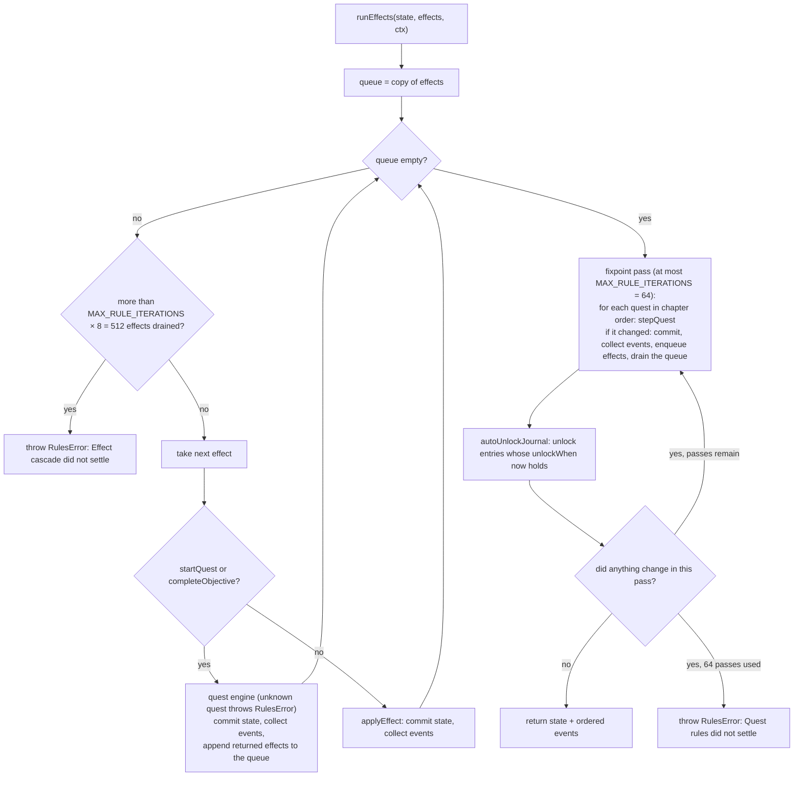

**Quest stepping.** Each call to `stepQuest(state, quest, nowMs)` makes **at most one** change, in this order:

1. An inactive quest with `autoStart` starts, if its `prerequisites` hold. It becomes `active` on its first stage, and the rules enqueue that stage's `onEnter` plus the `unlockJournal` for `journal.onStart`.
2. An active quest whose `failWhen` holds becomes `failed` with `failOutcome`, and the rules enqueue that outcome's `rewards`. This is an alternate ending, not a punishment.
3. Objectives of the current stage whose `completeWhen` now holds are completed. There is one `QuestObjectiveCompleted` per objective.
4. When every **non-optional** objective is done, the quest either advances to `next` (`QuestStageAdvanced` + `SaveRequested {quest-progress}`, then the next stage's `onEnter`) or, on the final stage, completes. Completion uses the first non-`failure` outcome whose `when` holds, falling back to `outcomes[0]`. It emits `QuestCompleted` + `SaveRequested {quest-progress}` and enqueues the outcome's `rewards` and `journal.onComplete`.

The fixpoint loop repeats until a whole pass (every quest, then journal auto-unlocks) changes nothing.

**Errors.** `completeObjective` throws `QuestTransitionError` for an objective that is not in the quest's current stage. `stepQuest` throws it for an unknown stage, a `failWhen` without a matching `failOutcome`, or a quest with no outcomes. The runner throws `RulesError` for an unknown quest id or an unsettled cascade. None of these escape: `GameSession.dispatch` catches them, logs `Effect dispatch failed`, and **commits nothing**. Because `runEffects` is pure, the whole batch is dropped atomically (tested by *logs and survives invalid quest transitions in content*).

## 8. Typed event model

[`DomainEvent`](../src/domain/events.ts) is a closed union. The bus ([src/shared/event-bus.ts](../src/shared/event-bus.ts)) is typed by the `type` discriminant: `bus.on('QuestStarted', e => e.questId)`. The code splits events into two families:

- **Facts**: something happened in the story world.
- **Requests**: the domain asks the application layer to do something it cannot do purely (load a scene, open a puzzle, show a message).

**Publication.** The only place that emits onto the bus is `GameSession.publish()`. Controllers and the runtime hand it their events. It uses a FIFO queue: events published while another event is being delivered are appended and delivered afterwards, which gives a deterministic, breadth-first order even when a handler dispatches more effects. `dispatch()` commits the new state **before** publishing, so handlers always see the state the event describes. The bus isolates handlers: an exception in one handler goes to `onHandlerError` (the runtime logs `Event handler failed for <type>`) and the other handlers still run. React never subscribes to the bus. It renders stores (§10).

**All 31 event types.** The *Owner* column is copied from `EVENT_OWNERS`, the list of modules that build each event. [tests/unit/domain/event-owners.test.ts](../tests/unit/domain/event-owners.test.ts) scans `src/` and fails if the code builds an event anywhere else (or no longer builds it where the list says).

| Event | Family | Payload | Owner (`EVENT_OWNERS`) | Constructed in | Consumed by |
|---|---|---|---|---|---|
| `ChapterStarted` | fact | `chapterId` | application/game-controller | `GameController.attachWorld`, once, when the opening runs (after every subscriber is listening) | analytics |
| `ChapterCompleted` | fact | `chapterId` | domain/effects | `completeChapter` effect | analytics, `onChapterComplete` → `ProfileService.markChapterComplete` |
| `SceneEntered` | fact | `sceneId`, `spawnId` | application/game-session | `GameSession.enterScene` | state-trigger re-check |
| `ItemCollected` | fact | `itemId`, `quantity`, `total` | domain/effects | `giveItem` | toast "Received", `item` sound, state-trigger re-check |
| `ItemRemoved` | fact | `itemId`, `quantity`, `total` | domain/effects | `takeItem` | toast "Used" (suppressed while a puzzle is open), dialogue re-render, state-trigger re-check |
| `ConversationStarted` | fact | `dialogueId`, `characterId` | application/dialogue-controller | `DialogueController.start` | — |
| `ConversationCompleted` | fact | `dialogueId` | application/dialogue-controller | `DialogueController.end` | flushes the deferred request queue |
| `QuestStarted` | fact | `questId` | domain/quests | `startQuest` | toast "New quest" / "Side quest", `quest` sound |
| `QuestObjectiveCompleted` | fact | `questId`, `objectiveId` | domain/quests | `completeObjective`, `stepQuest` | — |
| `QuestStageAdvanced` | fact | `questId`, `fromStage`, `toStage` | domain/quests | `stepQuest` | toast "Next step" |
| `QuestCompleted` | fact | `questId`, `outcomeId` | domain/quests | `stepQuest` | toast "Quest resolved", `quest` sound, analytics `OptionalQuestCompleted` for side quests |
| `QuestFailed` | fact | `questId`, `outcomeId` | domain/quests | `stepQuest` | toast "Quest resolved", `quest` sound |
| `ChoiceRecorded` | fact | `choiceId`, `optionId` | domain/effects | `recordChoice` | state-trigger re-check |
| `JournalEntryUnlocked` | fact | `entryId` | domain/effects, domain/journal | `autoUnlockJournal` **and** the `unlockJournal` effect | toast "Journal" (not for `people` entries) |
| `ClueDiscovered` | fact | `clueId` | domain/effects | `discoverClue` | toast "New clue", `journal` sound, state-trigger re-check |
| `CharacterMet` | fact | `characterId` | domain/effects | `meetCharacter` | — |
| `TrustChanged` | fact | `characterId`, `from`, `to` | domain/effects | `adjustTrust` | — |
| `FlagChanged` | fact | `flag`, `value` | domain/effects | `setFlag` | dialogue re-render, state-trigger re-check |
| `CounterChanged` | fact | `counter`, `from`, `to` | domain/effects | `adjustCounter`, `setCounter` | "Time passes" toast when the chapter's `timeCounter` crosses a `timeOfDayLabel` boundary |
| `PuzzleStarted` | fact | `puzzleId` | application/puzzle-controller | `PuzzleController.open` | — |
| `PuzzleAttempted` | fact | `puzzleId`, `correct`, `attempt` | application/puzzle-controller | `PuzzleController` submit methods | analytics |
| `PuzzleCompleted` | fact | `puzzleId`, `attempts`, `hintsUsed` | application/puzzle-controller | `PuzzleController.complete` | `solved` sound, analytics, state-trigger re-check |
| `HintRequested` | fact | `puzzleId`, `tier` | application/puzzle-controller | `PuzzleController.requestHint` | analytics |
| `SaveRequested` | fact | `reason`: `scene-change, quest-progress, puzzle, chapter-complete, manual` | application/game-session, application/puzzle-controller, domain/effects, domain/quests | `GameSession` (scene-change, manual), `domain/quests` (quest-progress), `domain/effects` (chapter-complete), `PuzzleController` (puzzle) | `Autosaver` |
| `SaveRestored` | fact | `saveId`, `fromSchemaVersion` | application/game-controller | `GameController.noteRestored`, called by the `GameRuntime` constructor once the controller is subscribed | analytics |
| `SceneTransitionRequested` | request | `sceneId`, `spawnId` | domain/effects | `transition` | deferred queue → `changeScene` |
| `PuzzleRequested` | request | `puzzleId` | domain/effects | `openPuzzle` | deferred queue → `PuzzleController.open` |
| `DialogueRequested` | request | `dialogueId` | domain/effects | `startDialogue` | deferred queue → `DialogueController.start` |
| `PanelRequested` | request | `panel` | domain/effects | `openPanel` | deferred queue → journal/satchel overlay or ending panel |
| `MessageRequested` | request | `text`, `tone` | domain/effects | `showMessage` | toast immediately ("Careful" for `warning`, otherwise "Note") |
| `SoundRequested` | request | `sound` | domain/effects | `playSound` | `AudioPort.playSfx` immediately |

"Consumed by" means `GameController.onDomainEvent` (a single `bus.onAny` handler) unless it says otherwise. `Autosaver` uses `bus.on('SaveRequested')`. Analytics are reached through `AnalyticsService.fromDomainEvent`, called from the controller. Quest definitions also carry `eventsConsumed` / `eventsEmitted` lists. These are documentation metadata, and the integrity check only verifies that each name is a real event type.

**Deferred requests.** Four request types need the screen: `SceneTransitionRequested`, `PuzzleRequested`, `DialogueRequested` and `PanelRequested`. `GameController` pushes them onto a FIFO `deferred` queue and flushes it in a microtask, so the effect batch that produced them finishes first. `flushDeferred()` runs requests in order only while `isBusy()` is false. The controller is busy when a dialogue is active, a puzzle is open, a panel is shown, or a scene transition is in progress. The queue is flushed again after a scene load, after `ConversationCompleted`, after a puzzle closes (`closePuzzle`), and after the summary panel closes. Content can therefore chain "say this, then open a puzzle, then change scene" safely.

## 9. Data flows

### 9.1 Talking to an NPC

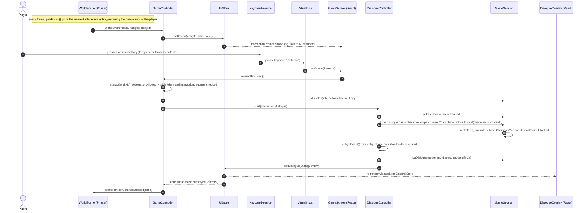

The same `interactFocused()` call is made by the HTML interaction-prompt button, the on-screen ✋ button and a gamepad A press (through `VirtualInput`). "Go to…" and tap-to-move reach `interact()` through the `arrived` world event (§12).

### 9.2 A dialogue choice that requests a puzzle while the conversation is open

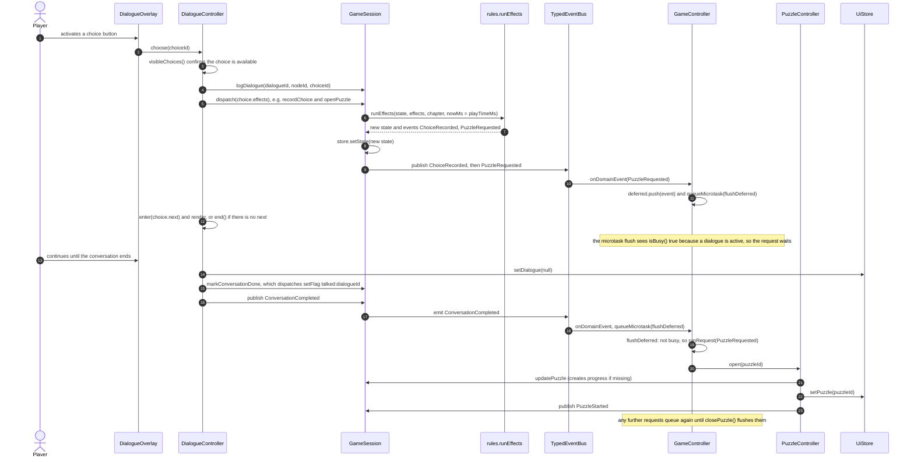

This exact behaviour is tested by *queues screen requests while a conversation is open and runs them in order afterwards* ([tests/unit/application/session-controllers.test.ts](../tests/unit/application/session-controllers.test.ts)), which uses `openPuzzle p-satchel` during the opening conversation.

### 9.3 A scene transition

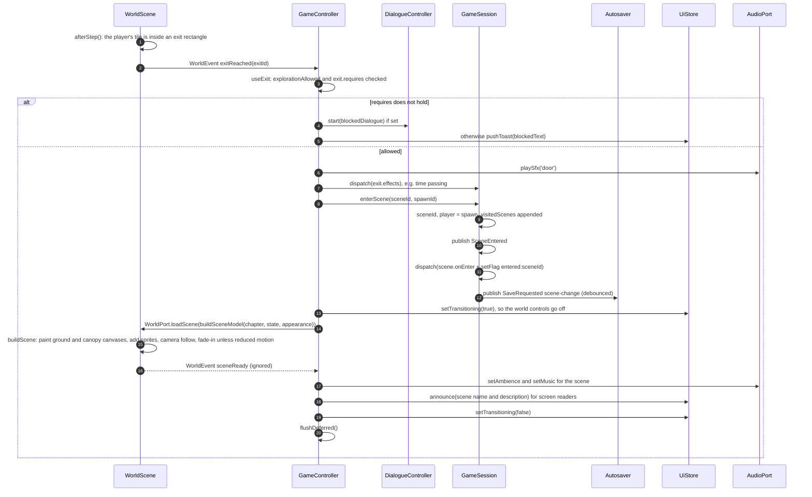

A `transition` effect takes the same path, starting from `runRequest(SceneTransitionRequested)` → `changeScene()`. If building the scene throws, the controller logs `Scene failed to load` and sets the fatal-error modal ("This area could not be loaded…").

### 9.4 Autosave

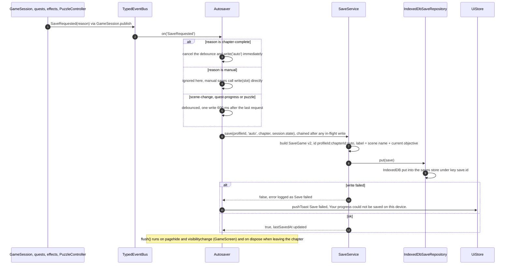

Manual saves ("Save to slot 1–3" and "Save and quit to title" in the pause menu) call `GameRuntime.saveTo(slot)`, which uses the same serialized `Autosaver.write()` and shows a "Saved" / "Save failed" toast. Details: [save-data.md](save-data.md).

### 9.5 Loading a save (with migration)

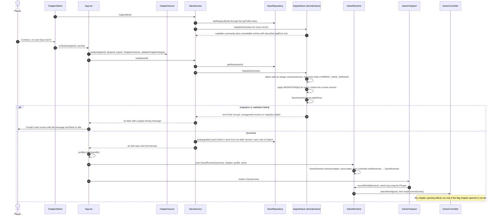

## 10. State management boundaries

There is no global state object. Each slice of state has one owner, a known lifetime and a clear persistence rule. All observable state uses the tiny [`Store<T>`](../src/shared/store.ts), whose `setState` ignores identical values. React subscribes through `useSyncExternalStore` ([features/common/hooks.ts](../src/features/common/hooks.ts)).

| State | Owner | Lifetime | Persisted | Written by | Read by |
|---|---|---|---|---|---|
| **GameState** (story facts) | `GameSession.store` | One chapter run (`GameRuntime`) | Yes, as `SaveGame.state` | Only `GameSession` methods: `dispatch` (rules), `enterScene`, `updatePlayer`, `logDialogue`, `markConversationDone`, `updatePuzzle`, `markJournalSeen`, `setReflection`, `addPlayTime` | React views, controllers, `SaveService.build` |
| **UiState** (overlays, dialogue view, puzzle id, panel, focus prompt, toasts, announcement, transitioning, fatal error, storage warning) | `UiStore` | One chapter run | Never | Application controllers, plus React handlers for overlay open/close | React, and `GameController` (via `explorationAllowed` → `WorldPort.setControlsEnabled`) |
| **Phaser scene state** (map textures, sprites, sub-tile player position, path, focus id, camera) | `WorldScene` private fields | Mounted world | Never | `WorldScene` only | `WorldScene`. It reports out as `WorldEvent`s, and `playerMoved` writes the **tile** position into `GameState.player`. |
| **Settings** (`GameSettings`) | `SettingsService.store` | App lifetime, device-wide | IndexedDB `settings` store, key `device` | `SettingsService.update/reset` | `App` (document attributes), audio, controller, keyboard source, views |
| **Profiles** (`PlayerProfile`) | `ProfileRepository` via `ProfileService`. The selected profile lives in `App` screen state and `GameRuntime.profile`. | Persistent | IndexedDB `profiles` store | `ProfileService` | menus, runtime (`displayName` for `{player}`, `look` for appearance) |
| **App notices** (captions, update available, offline ready, storage warning) | `services.notices` | App lifetime | Never | `main.tsx` (PWA callbacks), `services.ts` (captions, storage status) | Title screen notices, `Captions` |
| **Screen** (title, profiles, chapters, loading, game, error) | `App` `useState` | App lifetime | Never | `App` | `App` |
| **Held input** | `VirtualInput` (held actions per source) | App lifetime | Never | Input sources | `WorldScene`, `GameScreen` |

Rules of thumb that follow from this:

- **Phaser never reads or writes `GameState`.** It receives a `WorldSceneModel` that the application computes, and it reports events. Visibility conditions are evaluated in [world-model.ts](../src/application/world-model.ts), never in the scene.
- **UI state is never saved.** On load, everything the UI needs is derived from `GameState` again.
- A `GameRuntime` is created per chapter run and disposed when the player quits. `dispose()` flushes autosave, destroys the Phaser game, unsubscribes the controller, clears the bus and releases held input.

## 11. The React ↔ Phaser boundary

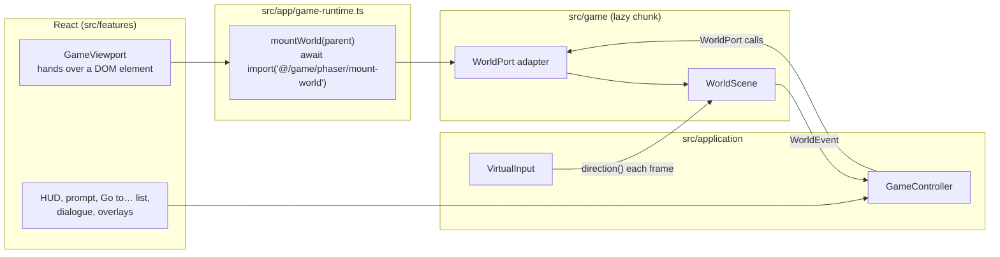

- **Lazy loading.** `GameViewport` only calls `runtime.mountWorld(el)`. The `features` layer cannot import `src/game`, and only `src/app/game-runtime.ts` does, with `await import('@/game/phaser/mount-world')`. `mountWorld` creates a `Phaser.Game` and resolves with a `WorldPort` once the scene's `create()` runs.
- **`WorldPort`** (application → world): `loadScene(model)` (async: for places with pre-rendered art the adapter first loads it, see [ADR-0014](adr/0014-prerendered-places.md)), `updateEntities(entities)`, `setPlayerMarks(marks)` (what the player visibly carries or has given away), `travelTo(targetId, instant)`, `setControlsEnabled(enabled)`, `setMotion({ reducedMotion, tilesPerSecond })`, `setLighting({ hour, lamp })`, `setConversation({ with, speaking } | null)` (the controller stages who you talk with and who is speaking; the world frames them with the camera and animates the speaker), `emphasize({ kind, at })` (a decorative flourish for a clue, item, solved puzzle or new objective; text feedback always comes too) and `destroy()`. The render model carries each place's `mood` (art direction, [ADR-0013](adr/0013-art-direction-system.md)) and each entity's `pose`, `verb` and `marks`. Pose, facing and marks come from content **looks** (`Entity.looks`, `Chapter.playerLooks`), resolved by the pure `resolveLook` in [src/domain/looks.ts](../src/domain/looks.ts): how the story visibly changes someone (bandages from your linen or your own tunic, your cloak around a traveler, the gear you packed).
- **`WorldEvent`** (world → application): `focusChanged`, `playerMoved` (tile coordinates), `tileEntered`, `exitReached`, `arrived`, `sceneReady`, `footstep` (a foot touched the ground on a tile; the controller picks the surface sound with `footstepSurface` and calls `AudioPort.playFootstep`), plus `interact`. The controller handles `interact`, but the Phaser adapter never emits it: interaction comes from the `interact` input action and from `arrived`.
- **Engine configuration** ([mount-world.ts](../src/game/phaser/mount-world.ts)): `Phaser.AUTO` renderer, `Scale.RESIZE`, `powerPreference: 'low-power'`, `fps.target: 60`. Phaser's own keyboard and gamepad input are **disabled** (`input: { keyboard: false, gamepad: false, touch: true, mouse: true }`), because keys and pads go through `VirtualInput`. Phaser audio is disabled (`noAudio`), because sound is `AudioPort`'s job.
- **Accessibility.** On ready, the canvas gets `aria-hidden="true"` and `tabindex="-1"`. The canvas is decorative for assistive technology: scene names are announced through `UiStore.announce` into a polite live region, and every person, object and exit is reachable from the HTML "Go to…" list (ADR [0009](adr/0009-accessible-go-to-navigation.md)).
- **Failure isolation.** If `mountWorld` rejects (for example, `Phaser.Game` throws while constructing), `GameViewport` shows a recoverable modal (§13) and the rest of the UI keeps working.

## 12. Input abstraction

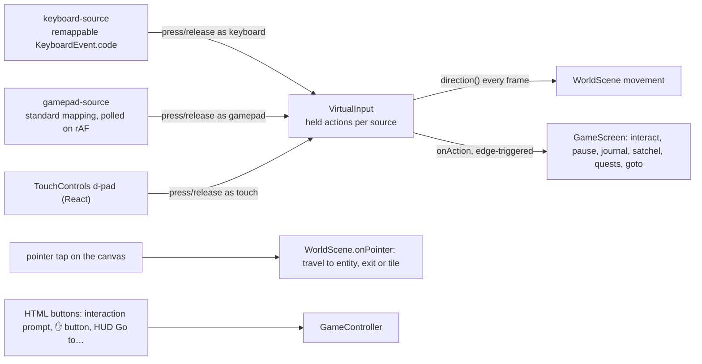

- [`VirtualInput`](../src/application/input.ts) tracks held actions **per source**. `press()` fires `onAction` listeners only when an action goes from inactive to active across all sources, and `direction()` returns the normalised held movement. Nothing else needs to know which device is in use.
- **Keyboard** ([keyboard-source.ts](../src/infrastructure/input/keyboard-source.ts)): uses the bindings from settings (defaults: arrows/WASD, `E`/Space/Enter interact, Esc/`P` pause, `J` journal, `I` satchel, `Q` quests, `G` "Go to…"). It ignores typing targets. Movement and interact keys belong to the world only while `explorationAllowed` (otherwise menus keep native keys). Auto-repeat is ignored except for movement, and focus loss (blur) releases every key.
- **Gamepad** ([gamepad-source.ts](../src/infrastructure/input/gamepad-source.ts)): d-pad or left stick (dead zone 0.4) moves, A interacts, B and Start pause/go back, Y opens the journal, X the satchel, Select the quests, LB the "Go to…" list. Listeners receive the action's source, and [gamepad-navigation.ts](../src/infrastructure/input/gamepad-navigation.ts) uses gamepad actions to drive the HTML UI whenever the world isn't taking movement: directions move focus through the top-most dialog (wrapping), A clicks the focused control, B sends Escape outside the game screen. In the game it acts only inside an open dialog, so the press that starts a conversation can't also click a HUD button.
- **Touch**: an on-screen d-pad (shown when `touchControls` is `on`, or `auto` on a coarse pointer) presses and releases as source `touch`. The ✋ button calls `interactFocused()` directly.
- **"Go to…" travel** ([GoToList.tsx](../src/features/navigation/GoToList.tsx) → `GameController.travelTo` → `WorldPort.travelTo(targetId, settings.instantTravel)`): the list comes from `destinations()`, which contains every visible interactive entity plus every exit (blocked exits too, which then explain themselves). The scene computes goal tiles (an entity's `approachTiles`, or every tile of an exit rectangle) and a BFS path with `findPath`.
  - **Walking**: the path is followed at the configured tiles-per-second. Any held direction cancels it.
  - **Instant travel**: the player is stepped through **every tile of the path** in one frame, and `afterStep()` runs for each tile. So `playerMoved`, `tileEntered` (area triggers) and `exitReached` fire in path order, exactly as if the player had walked. This is the *"Pass through every tile so triggers along the way still fire in order"* branch in `WorldScene.travelTo`.
  - On arrival at an entity, the player faces it, the NPC turns to face the player, and `arrived` makes the controller call `interact()`. Arriving on an exit raises `exitReached`.
- Tap-to-move uses the same path finder: tapping near an interactive entity (within 0.9 tiles) travels to it, tapping an exit travels to it, and tapping a walkable tile walks there.

## 13. Error handling

The principle: **content or storage problems are logged and survived, never shown as stack traces, and never allowed to corrupt saved progress.** Log messages go to the ring-buffer logger ([src/shared/logger.ts](../src/shared/logger.ts), 200 entries, echoed to the console only in development). Player free text is never logged.

| Failure | Where handled | What happens |
|---|---|---|
| Chapter content fails the schema or integrity check | `parseChapter` throws `ChapterLoadError(message, issues)` ([content/index.ts](../src/content/index.ts)). `App.startChapter` catches it. | "Couldn't start" screen: *This chapter could not be loaded. Please try again.* The individual issues are listed only in development builds. At build time, `npm run build` runs `content:validate` first, so a broken chapter does not ship. |
| Dialogue points at a missing node | `DialogueController.enter` catches `DialogueError` | Logs the error and ends the conversation gracefully (it is marked done). Tested. |
| Unknown dialogue, puzzle or scene id at runtime | `DialogueController.start`, `PuzzleController.open`, `GameSession.enterScene` | Logged, then ignored. A dialogue requested while another is active is logged as a warning and refused. |
| Invalid quest transition / unsettled rules | `GameSession.dispatch` catches `QuestTransitionError` and `RulesError` | Logged as `Effect dispatch failed`. **Nothing is committed** (the batch is atomic). Tested. |
| A throwing event handler | `TypedEventBus.emit` | Isolated: logged as `Event handler failed for <type>`, and other handlers still run. |
| Corrupt, future-version or unmigratable save | `migrateSave` never throws. `SaveService.list` / `load` return player-facing messages from `describeLoadError`. | The save list shows unreadable saves as a warning without hiding the others, and loading one shows the message on the error screen. See [save-data.md](save-data.md#6-failure-handling-and-player-facing-messages). |
| IndexedDB unavailable (for example some private-browsing modes) | `createRepositories()` falls back to the memory repositories | `status.persistent = false`. The warning *This browser is not allowing the game to save …* appears on the title screen (`notices.storageWarning`) and in-game (`UiStore.storageWarning`). |
| A save write fails (quota, storage errors) | `SaveService.save` returns `false` | Autosave shows the toast *Your progress could not be saved on this device.*, and manual saves show *The game could not be saved.* |
| Settings unreadable or partially invalid | `parseSettings` / `SettingsService.load` | Falls back **field by field** to defaults. Load and save failures are logged as warnings. |
| Stored profile invalid | `ProfileService.list` | Skipped, with a warning. |
| Audio cannot start (autoplay policy, no device) | `SynthAudio.unlock` try/catch. `SilentAudio` is used when `AudioContext` is missing. | Logged as a warning, and `unlock()` resolves `false`. `playSfx` is a no-op unless the context is running. The game never depends on sound, and ambience and music changes can be captioned. |
| Service worker cannot register | `registerServiceWorker` | Logged as a warning and returns `null`. The game works online-only. |
| Phaser fails to boot | `mountWorld` rejects (constructor error). `GameViewport` catches it. | `UiStore.setFatalError('The game world could not start on this device (graphics may be unavailable). Your progress is saved.')` shows a `Modal` titled "Something went wrong" with **Return to title**. |
| A scene fails to build | `GameController.loadCurrentScene` try/catch | Fatal-error modal: *This area could not be loaded. Your progress is saved — try returning to the menu.* |
| Unknown prop sprite name in content | `paintProp` / `ensurePropTexture` | Draws a neutral fallback marker and logs a warning, so a typo never produces an invisible object. |
| No path for "Go to…" | `WorldScene.travelTo` | Logged as a warning, and the player stays put. Content validation (`reachabilityIssues`) makes sure every interactive entity and exit is reachable from every spawn. |
| Any render error | [`ErrorBoundary`](../src/app/ErrorBoundary.tsx) around every screen | Logs `UI crashed` (message and the first 400 characters of the component stack), then shows *Something went wrong* with **Back to the title screen** and **Reload the game**. Saved data is untouched. |
| Startup fails before React renders | `main.tsx` `.catch` | Replaces the root with a static "The game could not start" message. |

## 14. Performance design

- **Lazy chunks.** The first download is the app shell (React, application, domain, features, fonts CSS). Three kinds of code load on demand: the Phaser chunk (`mount-world-*`, Phaser plus `src/game`) when a chapter's world mounts, the chapter chunk (`road-to-jericho-*`) when a chapter is loaded, and the PWA registration helper (`virtual_pwa-register-*`, `workbox-window*`) in production only. Architecture tests keep the first two lazy. Workbox precaches all of them so the lazy chunks also work offline. `chunkSizeWarningLimit` is raised to 1600 kB for the Phaser chunk. Measure with `npm run build && npm run perf:bundle` ([scripts/report-bundle.mjs](../scripts/report-bundle.mjs)).
- **One ground texture per scene.** `WorldScene.buildScene` paints every ground tile and prop tile once into a single off-screen `<canvas>`, and tree tops (canopy) into a second one. Each becomes one image, so a map costs two draw calls regardless of size. Textures are keyed by a generation counter and removed when the next scene is built.
- **Cached sprite sheets.** Each distinct `Appearance` is painted once into a 4-direction × 3-frame sheet (`appearanceKey`) and reused across scenes. Prop textures are cached by name.
- **Depth sorting by y.** Ground is at depth 0. The player (`10 + y × 100`, using its continuous y) and entities (`10 + (y + 0.5) × 100`) sort so figures overlap correctly. The canopy draws above everything at 100 000, and the focus marker at 100 001.
- **Cheap frame loop.** Frame time is clamped to 50 ms. Movement is pure axis-separated collision against a `blocked(x, y)` function that is rebuilt only when entities change. Focus picking is linear over interactive entities, and idle animation is skipped under reduced motion.
- **No redundant world updates.** `GameSession.updatePlayer` is silent (no events) and a no-op when nothing moved. `GameController.refreshEntities` recomputes visible entities only when a *story* field changed (a reference comparison over `STORY_KEYS`) and skips identical lists (a JSON key).
- **Bounded memory.** `dialogueLog` is capped at `MAX_DIALOGUE_LOG = 400`, toasts at 4, captions at 2, and the logger at 200 entries. The BFS explores at most 20 000 nodes.
- **Batched I/O.** Autosave is debounced (600 ms) and writes are serialized, so a burst of quest events produces one IndexedDB write.
- **Camera.** Zoom is chosen so about 9 tiles (narrow screens), 12 (portrait) or 17 (landscape) fit across, rounded to quarter steps. Small maps are centered.
- **Measured** by [e2e/perf.spec.ts](../e2e/perf.spec.ts), which walks in the market and asserts a conservative floor of >20 fps in headless CI (software rendering). Recorded numbers belong in `docs/performance.md`.

## 15. Test seams

The ports make the whole game run headless. [tests/support/harness.ts](../tests/support/harness.ts) wires the real `GameSession`, controllers and `UiStore` to a `FakeWorld` (a recording `WorldPort`), `SilentAudio` and memory repositories. A scripted `Player` then drives full playthroughs on every branch ([tests/integration/playthrough.test.ts](../tests/integration/playthrough.test.ts)). The pure systems (`collision`, `focus`, `navigation`) are tested without Phaser. Browser behaviour that needs the real engine, service worker and IndexedDB is covered by [e2e/](../e2e/).

## 16. Known gaps observed in the code

These are facts about the current code, recorded so that nobody relies on behaviour that does not exist.

- The update prompt is shown only on the title screen (see [ADR-0006](adr/0006-pwa-prompt-updates.md)); a player mid-chapter learns about a new version when they next return to the title.
