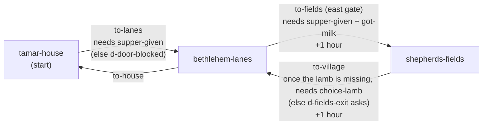

# Chapter 3: *A Journey to Bethlehem*

**Passage:** Luke 2:1–20. **Play time:** about 20–30 minutes is the target (`estimatedMinutes`); an estimate by word count, not pinned by a test (see [§11](#11-how-long-it-plays)). **Status:** playable end to end; approval status in [§12](#12-content-and-approval-status).
**Content:** [`src/content/chapters/journey-to-bethlehem/`](../../src/content/chapters/journey-to-bethlehem/) is the source of truth; this document describes the chapter as built. Engine-wide design (controls, puzzle types, the ending contract, the play-time model): [game-design.md](../game-design.md).

## 1. The idea and the passage

Luke 2:17–18 says that when the shepherds had seen the child, they made known what they had been told about him, and *all who heard it wondered*. The player is one of those people.

The player is a fictional child (ungendered, as in every chapter) of a Bethlehem household during the emperor's registration. Relatives have come home to be registered, so the house is full. Over one afternoon and night the player:

1. sets the places for supper while the guests' bread bakes;
2. decides what stays in the small guest room;
3. may help the clerk write down Uncle Asa's household (optional side quest);
4. fetches milk for little Dodi from Hagit, whose runaway kid has to be found first;
5. takes supper to a cousin at the sheepfold, and may share the milk with Old Yoram's newborn lamb;
6. tracks a lost lamb, or goes home;
7. eats supper with the whole household, tells them about the day, and decides what happens to the last loaf;
8. decides where a late stranger sleeps;
9. late at night, hears from a neighbour what shepherds from the fields have been telling everyone.

Then the game shows what Luke 2:1–20 actually says. Scripture, paraphrase, history and interpretation are each labelled.

**What stays off-stage.** Mary, Joseph, the baby, the shepherds of Luke 2 and the angels never appear, never speak and are never played. The player meets them only through:

- Scripture records (references; the text comes from the translation registry, [§9](#9-scripture-connection-and-summary));
- the labelled paraphrase record `rec-para-luke-2`;
- Hagit's labelled paraphrase (`rec-para-report`) of what the shepherds said.

The house, its guests and the stranger are the player's own fiction. The house is not presented as the place of the birth, and nobody in the game turns Mary and Joseph away. When the player asks to go and see, Hagit says the shepherds didn't say which house, and that the mother and baby should be left to sleep.

**Other passages the content uses**, each as a labelled paraphrase line linked to a paraphrase record:

| Record | Reference | Who says it |
|---|---|---|
| `rec-para-abraham` | Genesis 18:6 | Tamar, on why the guests get three measures of flour |
| `rec-para-well` | 2 Samuel 23:15–16 | Saba Amram, about the well by the gate |
| `rec-para-ruth` | Ruth 1:1, 1:19, 3:2 | Saba Amram at supper (Naomi and Ruth come home; Boaz winnowing on the threshing floor) |
| `rec-para-david` | 1 Samuel 16:11, 17:15 | Saba Amram after the news (David kept sheep on these hills) |
| `rec-para-report` | Luke 2:8–20 | Hagit, retelling the shepherds' report |

**Guardrails, enforced by [`tests/content/journey-to-bethlehem.test.ts`](../../tests/content/journey-to-bethlehem.test.ts):** Scripture records hold references only and no distinctive WEB wording appears in the chapter; every line that retells Scripture (angels, Abraham, David, the mighty men…) is a `paraphrase` line linked to a paraphrase record; every character is fictional and the people of Luke 2 never appear, speak or are played; no faith, holiness or favour scoring language; the census date is presented as uncertain; interpretation records carry sensitivity notes where Christians differ.

## 2. Acts

| Act | Where | What happens | Puzzle / choice |
|---|---|---|---|
| **1. A full house** | `tamar-house` | Tamar explains the registration, hedged ("*They say* everyone must be written down in their own family's town"). She asks for bread (three measures, the guest measure, with Abraham's bread as the reason) and the places set for supper while it bakes. | `p-bread` (logic grid) |
| **2. Making room** | `tamar-house` | The guest room floor is five squares by three, around the water jar, the roof post and the way to the door. Both beds must go in; the barley, the loom and Asa's tools compete for what is left, and only one of them ever fits. The barley may leave the room only if the player has examined the ladder and knows about the dry corner on the roof. Tamar then hands over Yonatan's supper, his cloak and a lamp, and asks for milk from Hagit and (optionally) straw from the threshing floor. | `p-room` (floor plan) → `choice-room` |
| **3. The crowded village** | `bethlehem-lanes` | Saba Amram helps the clerk and tells the well story (labelled paraphrase). Uncle Asa has waited in line since midday. Hagit offers her roof "to a tired soul" if asked. Clean straw lies by the threshing floor. | Optional side quest `q-queue`: `p-register` (sequence) |
| **4. Hagit's runaway kid** | `bethlehem-lanes` | Hagit can't milk her goat while its white kid is out, and her knees won't take the chase. Saba Amram, Uncle Asa (in the line, or at home if the player helped the clerk) and Kallias each saw one part of its afternoon. Put in order, the last stop is the threshing floor, where the kid is burrowed into the chaff. The player carries her back; Hagit gives the milk and tells how her father once found her lost kid. The east gate stays shut to the fold until the milk is in hand. Uncle Asa's "lamb with little horns" turns out to have been this kid. | `p-kid` (logic grid) |
| **5. The fold at dusk** | `shepherds-fields` | Yonatan takes the supper and counts the flock through the gate: thirty-nine of forty. The player searches or goes home. Searching means reading signs; one sighting (Asa's "lamb") is unreliable. Old Yoram's newborn lamb is hungry, and half the milk can go to it. After the lamb is settled Yonatan will talk about the night watch. | `p-lamb` (deduction) → `choice-lamb`; optional `choice-milk` |
| **6. Supper by the fire** | `tamar-house`, nightfall | The household eats in the places set in Act 1. Peninah gets the milk (a whole jar or half). The player tells them about the day: the topics offered follow what was done (the lamb found or left, the kid, Asa's line). Saba retells three verses of Ruth (labelled paraphrase). One loaf is left: keep it by the oven for whoever knocks, save it for Yonatan's breakfast, or share it round. | `choice-loaf` |
| **7. A knock at the door** | `tamar-house`, night | Zerah, an old basket-maker from Tekoa, has found every door full. Tamar leaves the decision to the player. The five options depend on earlier choices (a space left in the guest room, straw from the threshing floor, Hagit's offer); unavailable options stay visible with the reason. If the loaf was kept, Zerah gets it, even if turned away (the player runs after him). Afterwards he will talk about Tekoa, his grandfather and his baskets; Tamar will talk by the fire. | `choice-stranger` |
| **8. News in the night** | `tamar-house`, late | The player lies down; Hagit knocks. Her retelling of the shepherds' report is a labelled paraphrase. The player wakes the house or keeps it to think about. Saba Amram remembers David the shepherd (paraphrase). | `choice-news` → Scripture Connection |
| **9. Reflection and summary** | Panels | The Scripture Connection, an optional private reflection, then a summary of what happened. Nothing is graded. | — |

## 3. Places

Three hand-authored maps, all passing the reachability validator (content test). Each is pre-rendered in 3D ([§10](#10-art)).

| Scene | Kind, size | Mood / ambience / music | Weather |
|---|---|---|---|
| `tamar-house` | indoor, 26×11 | `home` / indoor / home | none set (indoors) |
| `bethlehem-lanes` | outdoor, 38×24 | `city` / market / home | `clear` |
| `shepherds-fields` | outdoor, 42×28 | `wilderness` / wind / journey | `wind`, changing to `clear` once `choice-lamb` is made |

### `tamar-house`: Tamar's house

A fictional village house built the way many scholars reconstruct one (record `rec-recon-house`, confidence *probable*):

- **West:** the lower, straw-strewn end (`straw`) where the animals sleep: the family donkey, Asa's pack donkey, the milk goat, and heaps of `hay`.
- **Edge of the family floor:** a column of stone mangers (`manger`), with `steps` up.
- **Centre:** the raised family floor (`platform`) with the oven, jars, a rug, mats and a table.
- **East, through a doorway:** the small guest room (`bedroll` tiles).
- **Door:** the single door opens onto the lane at the animals' end.

| Element | Details |
|---|---|
| Spawns | `start` (13,6); `from-lanes` (5,9) |
| Tamar | `d-tamar`: bread → room → hands over supper, cloak and lamp, asks for milk and straw → busy → by the fire at night. Sits once `evening` is set. |
| Kneading trough and flour jar | Opens `p-bread` (while `q-room` is active); becomes fresh bread once solved |
| Ladder to the roof | Examine: sets `roof-store-known` (changes the guest room rule) |
| The stone mangers | Examine (`saw-manger`) |
| Guests' things to arrange | Gives the five room items and opens `p-room` |
| Loom, barley jars, tool bag | In the guest room until `p-room` is solved; afterwards in the guest room only if kept there. The loom and tools are shown moved down to the animals' end otherwise. |
| The space you left | A spare mat, visible with `made-space` |
| Aunt Peninah, little Dodi | In the guest room all chapter; Peninah's lines follow `choice-room` |
| Uncle Asa (home) | Visible once `p-register` is solved or `choice-lamb` is made |
| Saba Amram (home) | Visible once `choice-lamb` is made (he is at the clerk's table until then) |
| Zerah | At the door after supper, then by the fire, in the guest room or on straw, depending on `choice-stranger` |
| Hagit at the door | During the night news |
| Your sleeping mat / your bed in the straw | Starts `d-night-news` (it says "It isn't time to sleep yet" before `choice-stranger`) |
| Exit `to-lanes` | Needs `supper-given`; `d-door-blocked` says what is still to do |
| Trigger `evening` | Once `choice-lamb` is made: `d-evening` (hour set to 20) → `d-supper` → Zerah knocks |

### `bethlehem-lanes`: the lanes of Bethlehem

A fictional picture of the village crowded for the registration (record `rec-pl-lanes`):

- **North:** stone houses along a lane (Tamar's door is in the north-west).
- **In the lane:** travellers camped outside because every house is full (bedrolls, mats, a cart, tethered donkeys).
- **By the east gate:** a paved square with the well and the clerk's table.
- **South-west:** Hagit's house and goat yard.
- **South-east:** a threshing floor (`threshing`) at the windy edge of the village above a terrace wall (`terrace`).

| Element | Details |
|---|---|
| Spawns | `from-house` (5,4); `from-fields` (36,9) |
| Trigger `lanes-intro` | First visit: where Saba Amram is, and the way to the fold |
| Saba Amram, Kallias, the tablets, Uncle Asa in line | Daytime only: hidden once `choice-lamb` is made. Asa leaves the line once `p-register` is solved. |
| The finished tablet | Clue `clue-model-order` |
| The blank tablet | `d-register`: explains what is missing, or opens `p-register` |
| The well by the gate, the east gate sign | Examine |
| Hagit | `d-hagit`: the milk (once `supper-given`), her offer (`hagit-offered`), the flock (`clue-hagit-water`), the kid, and at night news of Zerah if he is with her |
| Heap of clean straw | One armful (`straw`, `took-straw`) |
| Barley by the travellers' cart, washing by the square, bedrolls in the lane | Examine: where the kid has been, and who sleeps outdoors tonight (`sprite: 'none'`, nothing extra drawn) |
| Something chewing in the chaff heap | Hagit's kid, once `p-kid` is solved: take her (`carrying-kid`), bring her to Hagit (`kid-home`, `got-milk`) |
| Zerah by the well / at Hagit's door | Night, after `choice-stranger` `no-room` / `hagit` |
| Exit `to-fields` (east gate) | Needs `supper-given` and `got-milk`; the blocked text says where Hagit lives; +1 hour |

### `shepherds-fields`: the fold below Bethlehem

- **North:** terraced olive fields (`soil`, `olive`) held up by a `terrace` wall. Its only gap, up toward the village, is closed with a thorn branch.
- **Centre:** a dry-stone sheepfold (`sheepfold`) with the flock (`sheep`) and a gate, a `trough` with mud, and the shepherds' `campfire`.
- **East:** a thorn thicket by an old watch hut.
- **South-east:** a gully (`wadi`) running down to an old cistern.
- **South-west:** lower terraces with crops.

The fold is fictional and is not the place in Luke's story (record `rec-pl-fields`).

| Element | Details |
|---|---|
| Spawn | `from-village` (3,1) |
| Trigger `fold-arrival` | First visit: the wind, the sheep coming in, "take him his supper" |
| Yonatan | `d-yonatan`: takes the supper and cloak, counts the flock, the lamb is missing (`lamb-missing`); search (`searching`) or go home; takes the lamb back; then the night-watch talk |
| Old Yoram | By the fire with a newborn lamb (`d-yoram`); gone searching (`yoram-searching`) if the player leaves it to the shepherds |
| Signs | Hoofprints by the trough, wool at the top of the gully, the ewe, the closed terrace gap, the clean thicket edge; the watch hut and old cistern are examine-only |
| Trigger `think` | While searching, after 3 of the fold's signs: offers `p-lamb` (`d-think`) |
| The steep gully path | Opens `p-lamb` while searching; gone once solved |
| The speckled lamb | By the cistern, after `p-lamb`: take it (`lamb-found`, `carrying-lamb`, +1 hour) |
| The ewe and her lamb | Back together once `lamb-returned` |
| Exit `to-village` | Once the lamb is missing, leaving needs `choice-lamb`; otherwise `d-fields-exit` asks (keep looking, or go home and leave it to the shepherds); +1 hour |

## 4. People

Every character is fictional (`fictional: true, biblicalFigure: false`), and the content test enforces it.

| Id | Name | Role | Function |
|---|---|---|---|
| `tamar` | Tamar | Your mother | Runs the crowded house and hands out the tasks; leaves the decision about Zerah to you; talks by the fire at night. Carries bread. |
| `amram` | Saba Amram | Your grandfather | Helps the clerk because he knows every family; retells the well story, Ruth and David the shepherd (paraphrase); one of the kid's witnesses. Carries a staff. |
| `asa` | Uncle Asa | A stonemason, your mother's brother | Waits in line all afternoon; owns a share of the house, a plausible reason to register here. His "lamb" sighting is the unreliable clue; it was Hagit's kid, and he is a witness for it. Walks Zerah to Hagit's if he came home early. Carries a bundle. |
| `peninah` | Aunt Peninah | Uncle Asa's wife | In the guest room; reacts to how you arranged it; receives Dodi's milk at supper. |
| `dodi` | Dodi | Your little cousin | Asleep in the guest room; never speaks. |
| `kallias` | Kallias | Registration clerk | Writes the declarations; has the model tablet; a witness for the kid. Carries a wax tablet. (Not the Kallias of Chapter 4.) |
| `hagit` | Hagit | Your neighbour, who keeps goats | The milk and the runaway kid; offers her roof; knows the flock; brings the shepherds' news at night. Carries a milk jar. |
| `yonatan` | Cousin Yonatan | A young shepherd, your cousin | Keeps the family's sheep with the village flock; counts them in. Carries a staff. |
| `yoram` | Old Yoram | Shepherd of the village flock | "Don't guess, child — look." Holds a newborn lamb. |
| `zerah` | Zerah | A basket-maker from Tekoa | Arrives after dark to be registered; every door is full. Carries a lamp. |

## 5. Quests and stages

### `q-room`: *Room for Everyone* (main)

Started by the opening dialogue (`d-opening`).

| Stage | Title | Objectives (optional in italics) |
|---|---|---|
| `welcome` | A House Full of Guests | Solve `p-bread`; solve `p-room`; *say hello to Aunt Peninah*; talk to Tamar (`supper-given`) |
| `supper` | Supper for the Fold | *Bring straw* (`took-straw`); *ask the three witnesses* (all three kid clues; revealed by `kid-missing`); *bring the kid home* (`kid-home`; revealed by `kid-missing`); get Dodi's milk (`got-milk`); give Yonatan his supper (`supper-delivered`) |
| `lamb` | The Lost Lamb | *Look for at least 2 signs*, *work out where the lamb went* (`p-lamb`) (both revealed by `searching`); bring it back or leave it (`choice-lamb`) |
| `evening` | Home at Nightfall | Go home (`evening`) |
| `hearth` | Supper by the Fire | Eat and decide about the last loaf (`choice-loaf`) |
| `stranger` | A Knock at the Door | Decide where Zerah sleeps (`choice-stranger`) |
| `night` | News in the Night | Lie down (`lay-down`); listen to Hagit (`heard-report`) |
| `wonder` | All Who Heard It | Read the Scripture Connection |

Outcomes: `told` *Shared the news* or `kept` *Kept the news to think about*, both `success`. The main quest never depends on the side quest (content test).

### `q-queue`: *The Long Line* (side)

Started by asking Saba Amram why the line is slow, talking to Asa in line, or offering Kallias help.

| Stage | Objective |
|---|---|
| `ask` | Offer to help Kallias (`kallias-help`) |
| `help` | Put Uncle Asa's declaration in order (`p-register`) |

- **`registered`** (*Registered before dark*, success): +1 hour, +1 trust with Asa and Kallias, records `choice-queue` `helped`, unlocks journal `jh-declaration`. Asa leaves the line and is at home in the afternoon.
- **`waited`** (*Waited in line*, alternate): if the player reaches the fold before solving `p-register`.

### Items

| Id | Weight | How you get it | Why it exists |
|---|---|---|---|
| `bed-asa`, `bed-peninah` | 2 (essential) | Given by "Guests' things to arrange"; taken back when `p-room` is solved | The two pieces that must go into the guest room |
| `loom`, `grain`, `tools` | 2 | As above | The three things that compete for the space left |
| `supper` | 0 (essential) | Tamar | Delivered to Yonatan |
| `cloak` | 0 (essential) | Tamar | Delivered to Yonatan with the supper |
| `lamp` | 0 | Tamar | The chapter's `lightItem`; adds the `lamp` look mark |
| `straw` | 0 | The heap by the threshing floor | Unlocks Zerah's straw bed |
| `milk` | 0 | Hagit, once her kid is home | Required before the fold; half can go to Yoram's lamb; given to Peninah at supper |

Weight matters only in the floor plan; everything carried around the village weighs nothing.

## 6. Puzzles

| Puzzle | Type | Where | Solution |
|---|---|---|---|
| `p-bread` Places for Supper | `logicGrid` | Kneading trough, `tamar-house` | Amram nearest the fire, Asa second, Peninah third, Tamar by the door |
| `p-room` Room in the Guest Room | `floorplan` | Guests' things, `tamar-house` | Both beds plus at most one of barley / loom / tools; the barley must stay unless the roof is known. Classifies `choice-room`. |
| `p-register` Uncle Asa's Declaration (optional) | `sequence` | Clerk's blank tablet, `bethlehem-lanes` | declarant → town → members → property → oath; conclusion: to know who lives where and what they own, for taxes |
| `p-lamb` Where Did the Lamb Go? | `deduction` | Gully path or the `think` prompt, `shepherds-fields` | The gully, backed by 2 reliable signs |
| `p-kid` The Kid's Afternoon | `logicGrid` | Hagit ("I think I know where your kid went"), `bethlehem-lanes` | Cart first, washing second, well third, threshing floor last |

The logic grid and the floor plan are Chapter 3's own puzzle types; no other chapter uses them. Every puzzle has three tiers of hints and an explanation.

### `p-bread`: Places for Supper

Four people, four places along the mat, four clues: Tamar sits at an end; Peninah is in neither of the two places nearest the fire; Tamar sits beside Peninah; Amram is nearer the fire than Asa. So Peninah is third or by the door, Tamar must be at the door beside her, and Amram takes the fire with Asa second. Exactly one answer, and every clue is needed (content test). Press a square to rule it out (✗), again to choose it (✓), again to clear it; choosing rules out the rest of that row and column. Solving: +1 hour, `bread-baked`. The explanation uses only `rec-hist-hospitality` (Genesis 18:1–8) and says the supper is made up.

### `p-room`: Room in the Guest Room

Floor `J.... / .O... / DD...` (water jar, roof post, way to the door fixed). Pieces: Asa's bedding (a row of 3), Peninah and Dodi's bedding (2×2), barley jars (an L of 3), the loom (a row of 3), the tools (2). Rules: both beds in; the barley in, *or* `roof-store-known`. Both beds plus one other piece fit, never two; the barley's L fits only one way, round the roof post (content test). Choose a piece, turn it (R), press the square for its first cell; the floor previews where it lands and says why it won't fit. Classifications: `kept-grain`, `kept-loom`, `kept-tools`, `made-space` (nothing extra). Solving takes the room items back and sets `room-ready`.

### `p-register`: Uncle Asa's Declaration

Needs `clue-model-order`. Initial order property, oath, declarant, members, town; correct order declarant → town → members with ages → property → oath. Conclusion question: "So why does Rome want all these lists?" (correct: taxes). The explanation says the order is modelled on household census returns from Roman Egypt and that nobody knows exactly how registrations were written down in Judea (`rec-recon-declaration`, `rec-hist-census`).

### `p-lamb`: Where Did the Lamb Go?

Options: the terraces, the thicket, the gully. Answer `gully`, `requiredEvidence: 2`. Supporting the gully: the hoofprints, the wool, the ewe, Hagit's "always wanders toward water". Against the other options: the closed terrace gap, the clean thicket edge. Presenting Asa's sighting (marked unreliable) fails the attempt and its note explains why. Solving sets `lamb-tracked`; the lamb then appears by the cistern.

### `p-kid`: The Kid's Afternoon

Four places, four times, three witness clues: the cart before the washing (Amram), the washing before the well (Asa), the well neither first nor last (Kallias). The well must be third, so the washing is second, the cart first and the threshing floor last. Exactly one order, every witness needed, and the kid stays hidden until it is solved (content test). Hagit's option to open it is shown once the kid is missing and stays unavailable, with who to ask, until all three kid clues are found. Solving sets `kid-tracked`.

### Clues

| Clue | Source | Reliability | Used by |
|---|---|---|---|
| `clue-model-order` | Kallias's finished tablet | reliable | `p-register` (required) |
| `clue-hagit-water` | Hagit | reliable | `p-lamb` (supports the gully) |
| `clue-asa-lamb` | Uncle Asa | **unreliable**: it had horns, and it was hours earlier | `p-lamb` (wrongly supports the terraces); opens Hagit's "Did one of your goats get out?" |
| `clue-kid-amram`, `clue-kid-asa`, `clue-kid-kallias` | Saba Amram, Uncle Asa, Kallias | reliable | `q-room` `ask-kid`; Hagit's `p-kid` option needs all three |
| `clue-small-prints`, `clue-wool` | The trough; the top of the gully | reliable | `p-lamb` (support the gully) |
| `clue-ewe` | The fold | uncertain (the clue says so; the puzzle accepts it as suggestive support) | `p-lamb` |
| `clue-terrace-gap`, `clue-thicket` | The terrace wall; the thicket | reliable | `p-lamb` (rule out the terraces and the thicket) |

The five fold clues also drive the `look` objective (2 of them) and the `think` trigger (3).

## 7. Choices and consequences

Choices never grade the player. The Scripture Connection comparisons respond to options without judging.

| Choice | Options | What you see / what changes later |
|---|---|---|
| `choice-room` (from `p-room`) | `kept-grain` · `kept-loom` · `kept-tools` · `made-space` | The loom, jars and tool bag stand in the guest room or (loom, tools) with the animals; a spare mat marks a space. Peninah and Asa comment. Zerah's guest-room option needs `made-space`. Tamar's "room" talk at night follows it. |
| `choice-queue` | `helped` (only option; recorded by the side quest's success) | Asa leaves the line and is home in the afternoon; he welcomes Zerah and walks him to Hagit's if that option is chosen. Summary line. |
| `choice-milk` (Yoram, needs the milk and having asked about the newborn) | `shared` · `kept` | Shared: Yoram feeds the lamb from a corner of his cloak; Peninah gets half a jar. Kept, or never asked: a whole jar. Summary line either way. |
| `choice-lamb` | `found` · `left` | Found: the lamb rides on your shoulders (`carrying-lamb`), then stands with its mother. Left: Old Yoram's place by the fire is empty; you are home earlier; the summary says he found it near midnight. Also hides the daytime lanes people, brings Saba and Asa home and starts the evening. |
| `choice-loaf` | `set-aside` · `yonatan` · `shared` | Set aside: Zerah gets the loaf wherever he sleeps (`zerah-bread`, +1 trust), even if turned away. Summary line for each. |
| `choice-stranger` | `own-place` · `guest-room` · `straw-bed` · `hagit` · `no-room` | Where Zerah lies: by the fire, in the guest room, on fresh straw by the animals, at Hagit's door or by the well (seen in the lane). Giving your place puts your own bed in the straw beside the mangers. Walking him to Hagit's yourself costs an hour. Needs, shown with a reason when missing: `made-space`, the straw, `hagit-offered`. |
| `choice-news` | `told` · `kept` | Told: everyone sits up in the lamplight (`house-awake`), and Peninah and Asa speak of it. Kept: the house sleeps on. Decides the main quest's outcome. |

Trust changes (never shown as a score): Zerah +2 for your place or the guest room, +1 for straw or Hagit's; Yonatan +2 for the lamb; Hagit +1 for her offer and +1 for the kid; Yoram +1 for the milk.

## 8. Time, weather and light

**The hour counter** (`hour`, the chapter's `timeCounter`):

| Event | Hour |
|---|---|
| Start | 14 |
| `p-bread` solved | +1 |
| Side quest success | +1 |
| East gate to the fields | +1 |
| Taking the lamb | +1 |
| Back up to the village (exit or "go home" in `d-fields-exit`) | +1 |
| Home: `d-evening` | set to 20 |
| Walking Zerah to Hagit's yourself | +1 |
| Lying down: `d-night-news` | set to 23 |

The kid, the milk and supper by the fire don't move the clock.

**Weather:** the lanes are `clear`; the fold has a cold `wind` that drops to `clear` once `choice-lamb` is made; the house has no weather.

**Light** (the art set is chosen in [`src/game/prerendered/select.ts`](../../src/game/prerendered/select.ts): the `night` set from hour 18 until 05, otherwise the `day` set; light names from `PLACE_LIGHTS` in [`tools/art/lib/lighting.py`](../../tools/art/lib/lighting.py)):

| Scene | Before 18:00 | From 18:00 |
|---|---|---|
| `tamar-house` | `day` set, rendered in the `day` light; people lit `indoor` | `night` set (lamps and the oven lit); people lit `lamp` |
| `bethlehem-lanes` | `day` set, rendered in the `late` (later-day) sun; people `late` | `night` set, moon, fires and lamps; people `night` |
| `shepherds-fields` | as the lanes | as the lanes |

On the main path the player reaches the fold at 16:00 and leaves at 17:00 or 18:00, so the fold is seen in the late sun; the walk home may already be in the lanes' night set. Only after helping the clerk (fold at 17:00) does the sun set while the player carries the lamb (18:00), so the fields change to their night set around them. Everything from `d-evening` (20:00) on is at night.

## 9. Scripture Connection and summary

**Panel title:** *Good News in David's Town*. The intro says Hagit's retelling was part of a made-up story and this passage is Scripture — Luke 2:1–20.

| Section | Records |
|---|---|
| The passage | `rec-luke-2-1-20`, `rec-para-luke-2` |
| The emperor's registration | `rec-hist-census`, `rec-hist-quirinius` (*When was the census?*, uncertain), `rec-hist-own-city` (*Everyone to their own town?*, uncertain), `rec-recon-declaration` |
| The world of the story | `rec-hist-bethlehem`, `rec-recon-house`, `rec-hist-manger`, `rec-hist-swaddling`, `rec-hist-shepherds`, `rec-hist-shepherd-status` (debated), `rec-hist-hospitality` |
| How Christians have read it | `rec-interp-good-news`, `rec-interp-katalyma` (*An inn, or a guest room?*), `rec-interp-wonder`, `rec-interp-two-accounts`, `rec-interp-date`, `rec-hist-cave` (tradition) |

**Comparisons:** one always shown (the *katalyma*: Luke doesn't say anyone turned them away), plus one each for the five `choice-stranger` options, `choice-lamb` `found`, `choice-news` `told` and `kept`, the side quest (`p-register` solved) and hearing Ruth at supper (`heard-ruth`).

**Reflection prompts:** three (where it was hardest to make room; why the story begins with shepherds; what makes you wonder). No quiz.

**Summary:** a recap (up to twelve lines that follow what was done), consequences (the room, Asa, the lamb, the milk, the loaf, where Zerah slept, the news, and one line always shown: everyone in the house had bread and a place to sleep), the seven themes, 13 Scripture references (`rec-luke-2-1-20`, `rec-luke-22-11`, `rec-matt-2-1-11`, `rec-mic-5-2`, `rec-acts-5-37`, `rec-gen-18-1-8`, `rec-lev-19-34`, `rec-1sam-16-17`, `rec-2sam-23-15`, `rec-ruth-bethlehem`, `rec-john-10-1-4`, `rec-jer-33-13`, `rec-ezek-16-4`) and 10 history records. No score.

**Scripture text.** Scripture records carry references only. The text shown beside them comes from the translation registry, [`src/content/scripture/translations.ts`](../../src/content/scripture/translations.ts): the World English Bible is `approvedForDisplay` (approved by the owner on 2026-09-26), and every reference of this chapter's 15 Scripture records has a stored passage (Luke 2:1–20, 2:1–5, 2:8–20, 22:11; Matthew 2:1–11; Genesis 18:1–8; Leviticus 19:34; 1 Samuel 16:1, 16:11, 17:12, 17:15; 2 Samuel 23:15–16; Ruth 1:1, 1:19, 3:2; Jeremiah 33:13; John 10:1–4; Ezekiel 16:4; Micah 5:2; Acts 5:37), so the player sees the WEB text, not the placeholder. The browser test checks the opening words of Luke 2 in the Scripture Connection. References inside paraphrase, historical and interpretation records are citations only.

## 10. Art

**Places.** All three places are pre-rendered in Blender by [`tools/art/build_place.py`](../../tools/art/build_place.py) with the village kit, [`tools/art/lib/kit_village.py`](../../tools/art/lib/kit_village.py) (Chapter 3's own: a place is built as a village when its map has any of `straw`, `platform`, `threshing`, `manger`, `sheepfold`, `terrace`, `sheep`, `campfire`). It gives the lanes packed earth, a paved square and a chaff-drifted threshing floor; the fields red soil among limestone, stepped terraces and the gully falling to the cistern; the house a cutaway interior with the animals' end a step down, a sunbeam through the roof hatch by day and lamps and the oven lit at night. Light sets, from `PLACE_LIGHTS`:

| Scene | Sets (set: light) | People light |
|---|---|---|
| `tamar-house` | `day`: day · `night`: night | `indoor` by day, `lamp` at night |
| `bethlehem-lanes` | `day`: late · `night`: night | `late`, `night` |
| `shepherds-fields` | `day`: late · `night`: night | `late`, `night` |

Assets: [`public/art/tamar-house/`](../../public/art/tamar-house/), [`public/art/bethlehem-lanes/`](../../public/art/bethlehem-lanes/), [`public/art/shepherds-fields/`](../../public/art/shepherds-fields/). Guide: [technical art guide](../art/technical-art-guide.md).

**Tile kinds** added for this chapter ([`src/domain/world.ts`](../../src/domain/world.ts)): `straw`, `platform`, `threshing` (walkable); `manger`, `sheepfold`, `terrace`, `sheep`, `hay`, `campfire` (solid). The content test checks each has a painter rule. **Carries** ([`src/domain/characters.ts`](../../src/domain/characters.ts)): `lamb`, `lamp`, `tablet` among others used here (`bread`, `jar`, `staff`, `bundle`). **Look marks:** `lamp` (holding the lamp) and `carrying-lamb` (a lamb across the shoulders), drawn as overlays on the player's sheets.

**People sheets** ([`public/art/people/`](../../public/art/people/)), by pose and light:

| Character | Sheets |
|---|---|
| `tamar` (sheet id `tamar.journey-to-bethlehem`, since Chapter 2 also has a Tamar) | standing and sitting; indoor, lamp |
| `amram`, `asa` | standing: late, night (lanes); sitting and lying: indoor, lamp (house) |
| `peninah` | sitting and lying: indoor, lamp |
| `dodi` | lying: indoor, lamp |
| `kallias` (sheet id `kallias.journey-to-bethlehem`) | standing: late, night |
| `hagit` | standing: indoor, lamp, late, night |
| `yonatan` | standing: late, night |
| `yoram` | sitting: late, night |
| `zerah` | standing: indoor, lamp; sitting and lying: indoor, lamp, late, night |
| the player (four looks) | `carrying-lamb` and `lamp` overlays in each light used here |

**Portraits** ([`public/art/portraits/`](../../public/art/portraits/), cast in [`src/features/portraits/portrait-manifest.json`](../../src/features/portraits/portrait-manifest.json)): everyone who speaks has one; Dodi never speaks and has none. Tamar's is `tamar.journey-to-bethlehem`; Kallias uses `kallias` (Chapter 4's Kallias is `kallias.letter-from-paul`). Expressions on this chapter's dialogue lines, each with a rendered portrait:

| Speaker | Expressions |
|---|---|
| `tamar` | glad |
| `amram`, `yoram` | glad |
| `peninah`, `hagit`, `kallias` | glad, surprised |
| `asa` | glad, surprised, sad |
| `yonatan` | glad, worried |
| `zerah` | glad, worried, sad |

**Teaser:** none (only Chapter 1 has `hasTeaser` in [`src/content/index.ts`](../../src/content/index.ts)).

**Captures:** [`e2e/bethlehem-art.spec.ts`](../../e2e/bethlehem-art.spec.ts) takes review screenshots (not pass/fail) of all three places at desktop, tablet and phone sizes, on the main route and the "helped the clerk" route.

## 11. How long it plays

The registry's target is 20–30 minutes (`estimatedMinutes`). **No test pins this chapter's play time:** [`tests/integration/play-time.test.ts`](../../tests/integration/play-time.test.ts) measures Chapters 1 and 2 only. The model it uses is explained in [game-design.md §11](../game-design.md#11-how-long-a-chapter-plays).

What a test does check (content test): five puzzles, eight main-quest stages, and a dialogue script of more than 4,500 words (every line and choice; 4,573 today).

The numbers below were measured on 2026-09-30, when the chapter was made longer, by replaying the headless playthroughs and counting every word a player is shown (each dialogue line and choice, each message, each puzzle's introduction, clues and explanation; the Scripture Connection and summary not included). They use an earlier, simpler model than the one in `play-time.test.ts`: about 300 words a minute and a little over a minute a puzzle for a brisk adult, instant travel, two minutes for the ending.

| Path | Before (2026-09-26) | After (2026-09-30) | Brisk adult, before → after |
|---|---|---|---|
| Least: straight through, nothing optional | 1,700 words, 2 puzzles | 2,730 words, 3 puzzles | about 13 → 18 min |
| Typical: the lamb searched for | 1,920 words, 3 puzzles | 3,110 words, 4 puzzles | about 15 → 20 min |
| Thorough: side quest, lamb, milk shared, every supper topic | 2,690 words, 4 puzzles | 4,130 words, 5 puzzles | about 19 → 25 min |

A first-time younger player (about 200 words a minute, two minutes a puzzle, walking rather than instant travel) takes about a third longer. The kid and supper by the fire are on the main path, so even a player who skips everything optional sees them.

## 12. Content and approval status

The owner, Zac Harlan, approved the AI-drafted records of all four chapters on 2026-09-26 (`APPROVALS` in [`src/content/shared/approvals.ts`](../../src/content/shared/approvals.ts), mirrored in the approval log in [content-governance.md](../content-governance.md)). `coveredBy` applies an approval only to records drafted, and last changed, on or before its date; a record drafted or changed later is not covered and stays in review until a named person approves it. Provenance stays `ai-assisted`.

This chapter has 63 records (15 scripture, 6 paraphrase, 15 historical, 2 reconstruction, 5 interpretation, 20 fiction): **60 approved, 3 awaiting review**, all written on 2026-09-30 when the chapter was made longer:

| Record | Kind | Status | Title |
|---|---|---|---|
| `rec-para-ruth` | paraphrase | `sources-attached` | Naomi and Ruth come home to Bethlehem |
| `rec-e-kid` | fiction | `ai-draft` | Hagit's runaway kid |
| `rec-e-supper` | fiction | `ai-draft` | Supper by the fire |

Approval is tracked per record; the dialogue written on the same day (the kid, supper by the fire, the new conversations) has no review status of its own, but it too was written after the owner's approval. The content test pins exactly these three records as the ones in review, and that none of them names a reviewer.

- **Check:** `npm run content:publish-check` (it fails until humans approve everything).
- **Labelling:** with `VITE_CONTENT_MODE=preview` (the default) unreviewed content is labelled "Awaiting editorial review" in the game.
- **Disputed questions** are records with an honest confidence and, where Christians differ, a sensitivity note: the census date (`rec-hist-quirinius`, moderate), "each to his own town" (`rec-hist-own-city`), *katalyma* (`rec-interp-katalyma`, moderate), the date of the birth (`rec-interp-date`), Luke and Matthew (`rec-interp-two-accounts`), shepherds' status (`rec-hist-shepherd-status`), the cave tradition (`rec-hist-cave`), and the good-news and wonder readings.
- No chapter-specific governance file: the chapter uses the shared AI-draft preset (`src/content/shared/governance.ts`) with its own drafting dates.

## 13. Sources and verification

- **Research:** [research/journey-to-bethlehem-sources.md](../research/journey-to-bethlehem-sources.md), the claim-by-claim record behind the historical, geographical and interpretive notes.
- **Sources:** [`sources.ts`](../../src/content/chapters/journey-to-bethlehem/sources.ts): 65 sources (62 of the chapter's own plus three shared: Luke 10 and Leviticus 19 in the WEB, and the SBLGNT of Luke 10), all retrieved and checked by an AI research assistant on 2026-09-25 (`verified: true` records that retrieval; a human editor must still confirm each citation).
- **Content test:** [`tests/content/journey-to-bethlehem.test.ts`](../../tests/content/journey-to-bethlehem.test.ts): integrity and reachability; the lazy registry; Luke 2:1–20 with 3–5 scenes; its own logic grid and floor plan types with tiered hints; one answer for the supper places and for the kid's afternoon, every clue needed; the milk before the fold; supper by the fire before the knock (topics follow the day, labelled Ruth paraphrase, the loaf choice); enough to do for 20–30 minutes; the guest room's single extra piece and the barley's one placement; a genuinely optional side quest; no verse text; paraphrase labelling; fictional characters only; no scoring language; the longer chapter's text in review; a named human approval; retrieved sources; an honest census date; sensitivity notes; a real decision at the door; known sprites; painter rules for the new tiles; how the fold and its fire are painted.
- **Integration playthroughs:** [`tests/integration/journey-to-bethlehem-playthrough.test.ts`](../../tests/integration/journey-to-bethlehem-playthrough.test.ts):
  - generous: side quest, a space left, the lamb found, milk shared, loaf set aside, Zerah in the guest room, the house woken;
  - careful: grain kept, home before dark, loaf for Yonatan, your own place given, the news kept;
  - straw: the lamb found without the side quest, milk kept, loaf shared, Zerah on fresh straw;
  - neighbour: Zerah goes to Hagit's (with the loaf), and you can see him there;
  - full house: no room, Zerah by the well (you run after him with the loaf), the search given up halfway;
  - dead-end guards: bed before bedtime, the gully before the search, the lamb at the exit, no fold without the milk.
- **Play time:** not measured by `tests/integration/play-time.test.ts` ([§11](#11-how-long-it-plays)).
- **Browser:** [`e2e/journey-to-bethlehem.spec.ts`](../../e2e/journey-to-bethlehem.spec.ts): new profile → the opening → `p-bread` → `p-room` (with the roof known, a space left) → the lanes → the kid's logic grid and the milk → the lamb → supper by the fire → the stranger → the news (paraphrase label) → Scripture Connection (WEB text) → reflection → summary. It does not play the side quest. Art captures: [`e2e/bethlehem-art.spec.ts`](../../e2e/bethlehem-art.spec.ts).

## 14. Known gaps

- **Play time is not pinned by a test.** The numbers in [§11](#11-how-long-it-plays) come from a one-off word count with an older model; `tests/integration/play-time.test.ts` covers Chapters 1 and 2 only.
- **Three records await review** ([§12](#12-content-and-approval-status)), with the dialogue written alongside them.
- **The side quest is not played in the browser test**; only the headless playthroughs cover `p-register`.
- **Hagit may be off-screen.** She stands at the door during her report, and the camera may not frame her if the player's bed is across the room (the mat by the fire is eleven tiles from the door).
- **Leaving the house on the stranger branches.** The house exit stays open at night, so a player can visit Zerah at Hagit's or by the well before lying down. This is allowed, not blocked.
