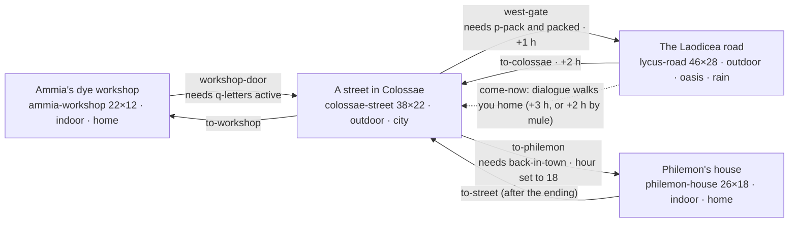

# Chapter 4: *A Letter from Paul*

**Passage:** Philemon 1–25, and Colossians 4:7–18. **Place:** Colossae and the Lycus valley, in the Roman province of Asia, around AD 55–62 (dates uncertain). **Length:** 20–30 minutes. **Content:** [`src/content/chapters/letter-from-paul/`](../../src/content/chapters/letter-from-paul/). **Research:** [`docs/research/letter-from-paul-sources.md`](../research/letter-from-paul-sources.md).

**Status:** Playable end to end on every major branch (headless playthroughs and a browser E2E test). All 42 educational records are AI-assisted drafts awaiting human review; none is approved.

---

## 1. Why this letter, and this angle

We chose **Philemon together with Colossians 4:7–9**.

- **It is a story about a letter.** Colossians names who carried it: Tychicus, with Onesimus, "one of you" (4:7–9). It says the letter should be read aloud, then passed on to Laodicea (4:16), and Paul signs it in his own hand (4:18). The whole life of an ancient letter is in a few verses: dictated, signed, carried, read aloud, explained, passed on. That life is something a player can *do*.
- **It is about reconciliation between real people.** Philemon is short and personal. Paul appeals rather than commands, offers to pay any debt himself, and asks Philemon to welcome Onesimus as he would welcome Paul. The letter never says how Philemon answered. That open ending fits a game that shows consequences but never grades them.
- **It forces honesty about slavery.** Onesimus was, it seems, Philemon's slave, and these letters have a painful history in slavery debates. A chapter here cannot trivialise slavery. It has to show it plainly and leave the hard questions open.
- **The place is rich and little known.** Colossae was a wool town. Strabo says it earned large revenues from a colour named after it. Laodicea is down the valley, and the white terraces of Hierapolis can be seen across it.

**Alternatives considered.** *Philippians* (carried by Epaphroditus, Philippians 2:25–30) is warm and very playable, but its carrier story is thinner and a Roman colony on the Via Egnatia looks a lot like Chapter 1's city. *1 Thessalonians* (read "to all", 5:27) has no named carrier or personal drama. Philemon has both.

**How the fiction sits beside Scripture.** The player is a young member of a fictional household in Colossae: Ammia, a dyer, and her grandchild. The player's own story is a *parallel* one. Kallias, Ammia's apprentice, lied about a ruined batch of wool, left in shame, and now writes asking to come back and work off his debt. The player reads his letter aloud, writes down Ammia's answer, carries it down the road, and decides how far to stand in the middle. Then, at a gathering that is **imagined** (the New Testament does not say where or by whom the letters were read), the player hears Paul's letters read aloud as **labelled paraphrase**. The parallel is deliberately *not* a slave story. Kallias is free, and Chrysis, an enslaved woman at the dye works, says what that difference means. The chapter never invents what Philemon or Onesimus did.

## 2. Governance decisions

| Rule | How this chapter keeps it |
|---|---|
| No invented verses | Scripture records hold references only. The reading is 12 narrator lines of kind `paraphrase`, linked to `rec-para-philemon` and `rec-para-col-4`, checked against the WEB, with no quotation marks. The Scripture Connection shows `[SCRIPTURE TEXT REQUIRES APPROVED TRANSLATION — Philemon 1:1-25]`. |
| Biblical figures never controlled, no invented words | Paul never appears. Philemon, Tychicus and Onesimus appear **only at the gathering**, as silent, non-interactive figures. They have no dialogue, can't be talked to, and have generic appearances. Fictional characters mention them only in ways the text supports: Col 4:7–9 and Phm 13; a rumour is clearly labelled as one. A content test enforces this. |
| The reader is fictional | Zenon, a fictional freed scribe, reads the letters. Whether carriers read letters aloud is disputed (see research claim 15), so the game doesn't put the letters in Tychicus's mouth. |
| Disputed questions stay open | Interpretation records, each with a sensitivity note, cover four questions. **Why was Onesimus away?** Four views, including the minority "estranged brother" view. **Where was Paul in prison?** Rome, Ephesus or Caesarea. **Who wrote Colossians?** **What do the letters say about slavery?** They also cover the "letter from Laodicea" and Nympha/Nymphas. |
| Slavery: honest and serious | Chrysis is written with dignity and never made a puzzle or a purchase. No choice buys, sells or frees anyone (a content test checks this). The history record states the facts and gives no numbers, because no figures are provable. The interpretation record tells the painful history of these letters' use in American slavery debates. |
| No scoring | Trust appears only as words. The summary lists what happened, never a grade. A content test and the E2E test check for scoring language. |
| Research | 76 sources, every one retrieved and checked on 2026-09-25; claim-by-claim notes include five corrections. Nothing is approved. |

## 3. The seven acts

| Act | Where | What happens | Quest stage | Puzzle / choice |
|---|---|---|---|---|
| **1. The news** | Ammia's workshop | Travellers from Paul are at Philemon's house, and the assembly gathers tonight. A rain-soaked letter from Kallias has arrived. | `read` starts | — |
| **2. The letter** | Street, Zenon's table → workshop | Put the letter back in order (letter form, the sender's own hand). Read it aloud to Ammia: every word, softened, or with a plea of your own. Write down her answer. | `read` | `p-sheets` (sequence), `choice-reading` |
| **3. Preparing** | Street → workshop | Learn the weather from Tatia, Attalos or Mount Cadmus. Optionally help Attalos with an unaddressed letter. Find the way on Ammia's sketch, then pack the bag (load 4, a plain choice in conversation). | `road` | `p-whose` (deduction, side quest), `p-pack` (map reading) |
| **4. The road** | The Laodicea road | Milestones, fields, the river. Rain sweeps down the valley. At the dye works by the bridge, read Ammia's letter to Kallias. Optionally match the buyer's shade so he keeps his wage. | `kallias` | `p-alum` (colour mixing, optional) |
| **5. The decision** | The dye works | Answer his worry about the debt, then decide: bring him home now, write down and carry his answer, or leave the next step to him. | `kallias` → `home` | `choice-debt`, `choice-kallias` |
| **6. The gathering** | Philemon's house, at lamp-lighting | The consequences show on the people around you. The letters are read aloud as labelled paraphrase, then the Scripture Connection. | `gathering` | — |
| **7. Reflection and summary** | Panels | Private reflection, then the summary. | complete | — |

## 4. Scenes

- **Ammia's workshop** (`ammia-workshop`): plastered room, rows of dye vats in madder red, woad blue and purple, drying wool, amphorae, a loom, a rug. Includes the travel bag (packing, in conversation: `d-bag`), the spoiled batch Ammia kept, and baskets of madder root.
- **A street in Colossae** (`colossae-street`): a composite. Terracotta roofs, a stoa (colonnade) with shop doorways, and Zenon's writing table under it. Also a potter's stall, a fountain, Tatia's fullery yard (vats, white clay, drying cloth), Philemon's gate, the west gate, and Mount Cadmus's foothills to the south.
- **The Laodicea road** (`lycus-road`): a kerbed Roman highway with two milestones (IIII, V), fields and fig trees. North of it are the river Lycus with reeds and a stone bridge, and far across the valley the white travertine of Hierapolis. There is also a dye works (shed, vats, amphorae, drying skeins) and a waystation with a yard and trough. The weather is clear, then rain (`rain-began`).
- **Philemon's house** (`philemon-house`): a reconstruction. It has a peristyle garden ringed by columns, with a fountain; a triclinium with couches in a U on a mosaic floor; bronze lampstands (they light the room); a guest room with mats laid out (Phm 22); and storerooms.

Every interactive thing and exit is reachable from every spawn (`npm run content:validate`).

## 5. Characters

**Fictional** (`fictional: true`):

| Character | Role | Function |
|---|---|---|
| Ammia | The player's grandmother, a dyer | Wronged, and angry, and not finished with Kallias. Her answer: "The debt is still a debt." |
| Kallias | Her former apprentice | Lied about the red batch and left in shame. Now asks to come home and work off the debt. |
| Zenon | A freed scribe | Teaches letter form, helps sort the sheets, and reads the letters at the gathering. His story shows freed people's duties to their former owners. |
| Attalos | Mule driver | Carries letters for a coin and can't read. Gives the side quest. If helped, he lends his mule. |
| Tatia | Fuller | Warns of rain, and is the owner of the unaddressed letter. |
| Menandros | Potter | Confident and wrong (the unreliable clue). Not part of the assembly. |
| Nikon | Overseer of the dye works | Sets the alum task. |
| Chrysis | Enslaved worker at the dye works | "His trouble is shame. Mine is a bill of sale." |
| Hermon, Melitta | Members of the assembly | Silent background. |

**Named in the New Testament** (`biblicalFigure: true`, silent, not interactive): **Philemon**, **Tychicus** (carries a leather letter case), **Onesimus**. They appear only in Philemon's house and are unlocked in the journal with Scripture and history records.

## 6. Items (bag capacity 4)

| Item | Weight | Why it exists |
|---|---|---|
| Kallias's letter | 0 | The sequence puzzle. |
| Ammia's answer | 0 (essential) | Always travels with you. |
| Bronze coins | 0 (3) | Put 3 on Kallias's account (`my-account`). |
| Bread and cheese | 1 | Share with Kallias or with Chrysis. |
| Hooded wool cloak | 2 | Keeps the letter dry. |
| Kallias's old cloak | 2 | Give it to him in the rain; he wears it at the gathering. |
| Writing tablets and stylus | 1 | Needed to write down and carry his answer (`carry-reply`). |
| Leather letter case | 1 | Keeps the letter dry; shows at your hip. |
| Kallias's answer | 0 | Given if you carry his reply. |
| A letter with no name | 0 | Side quest. |

## 7. Quests

**Main: *Carried by Hand*** (`q-letters`). The stages are:
1. `read`: put the letter in order (`p-sheets`) and read it aloud (`choice-reading`).
2. `road`: optionally learn the weather; ask Ammia the way (`p-pack`); pack the bag (`packed`); leave by the west gate.
3. `kallias`: find him; read him the letter (`read-to-kallias`); optionally match the buyer's shade (`p-alum`); decide (`choice-kallias`).
4. `home`: return (`back-in-town`).
5. `gathering`: arrive, and finish the Scripture Connection (`seen:scripture-connection`).

The outcomes are **Home together** (`come-now`), **An answer carried home** (`carry-reply`), and **The next step left to Kallias** (`leave-it`, alternate).

**Side: *The Mule Driver's Bundle*** (`q-bundle`, optional). Its stages are:
- `look`: find 2 or more of 5 clues.
- `decide`: solve `p-whose`.
- `deliver`: give the letter to Tatia (+1 hour).

**Delivered** raises trust and makes Attalos wait at the waystation with his mule. **Carried back unread** (alternate) happens if you leave town first.

## 8. Puzzles

| Puzzle | Type | Rules | Evidence and fairness |
|---|---|---|---|
| `p-sheets` *Kallias's Letter* | sequence | Order five sheets: greeting → good wishes → confession → request → farewell "in my own hand". Then a conclusion: what is he asking, and where is he? | Zenon explains letter form (optional). The last sheet is in a different, clumsier hand. The conclusion admits that the milestone number washed away. |
| `p-pack` *The Way to the Bridge* | map reading (Chapter 4's own type) | Ammia's sketch of the valley, north at the top. Her written directions: out of the west gate, count four milestones, take the first turning on the **left** (south, since you are walking west) to the river, turn **right** (west) past the waystation to the dye works by the stone bridge — this side of the river. The walk buttons (or the arrow keys) walk to the next landmark or junction; where you are, which way you face and where the road goes are always written out. | Kallias's letter lost the milestone number, and there is more than one dye works by a bridge. Each likely mistake (turning after the third milestone, turning right onto the hill, left at the river, crossing the bridge, walking on to Laodicea) ends at a named wrong place with its own feedback (content test). The road, milestones and dye works are invented, as `rec-rec-road` says. |
| The travel bag (`d-bag`) | a choice, not a puzzle | One thing at a time into a bag that holds 4 (Kallias's old cloak 2, hooded cloak 2, bread 1, tablets 1, letter case 1); things that don't fit are shown with the reason. **If you know rain is coming** (`clue-rain-coming`), the bag can't be tied without the case or the hooded cloak (shown, with the reason). | The things for the road wait beside the bag (they no longer start in the satchel). Tying the bag records `choice-packing` with the same classification as before and sets `packed`. |
| `p-alum` *The Buyer's Shade* | colour mixing (Chapter 4's own type) | Match mulberry (red 3, blue 2) in four dips: the madder vat adds 2 red, the blue vat 2 blue, the rinsing trough takes 1 of each out (never below none). Madder → rinse → madder → blue. | The insight is rinsing while there is no blue yet. Every shade is named as well as shown and given as numbers, so nothing depends on seeing colour. Integrity checks that the target needs exactly the dips allowed. The shades and dips are invented; the record on madder and alum says so. |
| `p-whose` *Whose Letter?* | deduction | Tatia, Zenon or Menandros. Needs 2 reliable clues; the potter's guess is unreliable. | The clues are white clay dust, the torn words "the cloaks you cleaned", a cloth merchant sender, and Zenon's denial. |

Every puzzle has three hint tiers, and only the last explains the answer.

## 9. Choices and what you can see afterwards

| Choice | Options | Consequences |
|---|---|---|
| `choice-reading` | every word · softened · added a plea | **Softened:** Ammia hears a gentler letter. If Kallias comes home, he confesses the lie to her himself; if he writes, his answer says it again. **Plea:** Kallias's trust rises. |
| `choice-packing` | for Kallias · for writing · for rain · food · light load | What you can offer at the bridge; whether the letter blurs; what you carry visibly (letter case, rolled cloak). |
| `choice-debt` | my account (−3 coins) · speak for him · their business | Ammia mentions your coins. **Speak for him:** at the gathering you must choose whether to keep your word. |
| `choice-kallias` | come now · carry his reply · leave it to him | Who stands beside you at the gathering, and where Ammia looks. |

**In the world:**

| What you did | What you see |
|---|---|
| Packed the letter case / Kallias's cloak | A letter case at your hip / a rolled cloak on your back |
| Gave Kallias his cloak | He wears it at the gathering (`wrapped-in-cloak`), and it's gone from your back |
| Brought him home | Kallias stands beside Ammia, and she turns toward him; his place at the vat is empty |
| Carried his answer | Your tablets lie beside Ammia; Kallias is still at the dye works |
| Left it to him | Ammia keeps looking toward the door |
| Matched the buyer's shade | The test skein hangs matched by the vats |
| Helped Attalos | Attalos and his mule wait out the rain at the waystation |
| Walked into the rain | Rain on the road and in the town (`data-weather`), clearing when you get home |

## 10. Time

`hour` is a story counter. It moves:
- from 8;
- +1 when Ammia's answer is written;
- +1 when the side quest's letter is delivered;
- +1 at the west gate;
- +2 at the rain;
- +1 for the alum bath;
- on the way back: +3 walking together, +2 by mule, or +2 by the road exit;
- set to 18 at Philemon's gate.

Every path arrives before lamp-lighting (at most hour 17). The HUD shows sunset at the gathering and the lampstands glow.

## 11. Scripture Connection and summary

- **Title:** "Two Letters Read Aloud".
- **Sections:**
  - the letter to Philemon (reference + paraphrase);
  - the end of Colossians (references + paraphrase);
  - how the letters reached Colossae (carriers, scribes, letter form, reading aloud, house churches);
  - the world of the letters (who's who, the Lycus valley, slavery, Pliny's letter);
  - questions still open (Onesimus, Paul's prison, authorship, slavery, reconciliation).
- **Comparisons:** these depend on your choices, e.g. "Paul offered to take whatever Onesimus owed onto his own account (Philemon 18–19)" if you gave coins. They also mention Chrysis if you talked with her.
- **Reflection prompts:** three.
- **The summary:** lists what happened in concrete terms. Every branch closes with "Every letter in this story reached its reader because somebody carried it."

## 12. For the realism pass (3D)

**New tile kinds** (`src/domain/world.ts`):

| Kind | Solid | Physical thing |
|---|---|---|
| `mosaic` | no | stone tesserae floor with a border band and rosette/diamond panels |
| `roman-road` | no | big fitted paving stones with kerbstones at the edges and wheel ruts |
| `bridge` | no | stone bridge deck with parapets where it meets water |
| `tile-roof` | yes | pitched terracotta tile roof (pan and cover tiles, ridge, eaves); counts as a building |
| `column` | yes | Ionic stone column (moulded base, fluted shaft, volute capital); a beam carries along a colonnade across gaps ≤ 3 tiles |
| `vat` | yes | round dye vat in a plastered stone surround (madder red, woad blue, purple, alum-pale) with a stirring pole |
| `amphorae` | yes | two-handled transport jars leaning together |
| `couch` | yes | triclinium dining couch: wooden frame, mattress, bolster |
| `milestone` | yes | cylindrical milestone on a square base, lines of inscription |
| `travertine` | yes | white travertine terraces with pale-blue pools (land, like cliffs) |
| `garden` | yes | planted bed with stone edging, clipped shrubs, flowers |
| `lampstand` | yes | tall bronze lampstand on three feet with a lit clay lamp (a light source) |
| `fountain` | yes | public fountain: stone basin fed by a spout in a back slab |

- **New carries** (`src/domain/characters.ts`): `tablets` (a scribe's hinged wax tablets and stylus, held against the chest); `scroll-case` (a cylindrical leather letter case on a strap at the hip).
- **New look mark** (`src/domain/world.ts`): `letter-case` (the player's flat leather letter case at the hip).
- **New prop sprites** (`src/game/art/props.ts`): `tablets`, `letter-sheets`, `letter-bundle`, `wool`.
- **Moods:** none added. The street uses `city`, the road `oasis` (a green river valley), and the two interiors `home`.

## 13. Tests

- [`tests/content/letter-from-paul.test.ts`](../../tests/content/letter-from-paul.test.ts) checks:
  - integrity, reachability and lazy loading;
  - four puzzle types, and a genuinely optional side quest;
  - no verse text, and every reading line is a paraphrase without quotation marks;
  - biblical figures silent and non-interactive, Paul and Jesus absent;
  - no scoring language, and slavery never made a transaction or puzzle;
  - disputed questions open with sensitivity notes, fiction and reconstruction labelled, nothing self-approved;
  - sources retrieved and used, a real choice at the dye works, and the travel bag's rules only asking for things you can pack;
  - art support: every tile kind, sprite and carry the chapter uses is painted, colonnade beams, and lampstand lights.
- [`tests/integration/letter-from-paul-playthrough.test.ts`](../../tests/integration/letter-from-paul-playthrough.test.ts) runs five headless playthroughs:
  - *home together* (side quest, alum, coins, cloak, mule);
  - *answer carried* (softened reading, rain rule, bread, tablets);
  - *left to him* (plea, wet letter, Chrysis, side quest failed);
  - *promise kept* (the confession, speaking up, the lost wage);
  - the gates that stop you leaving unprepared.
- [`e2e/letter-from-paul.spec.ts`](../../e2e/letter-from-paul.spec.ts) plays from a new profile to the summary through the accessible UI. `E2E_SHOTS=1` saves `test-results/shots/lfp-*.png`.

## 14. Known gaps

- **Rain is recorded but not drawn.** The world records it on the canvas (`data-weather`); drawing rain belongs to `src/game/scenes`.
- **Captions and footsteps:** The road uses the `oasis` ambience, whose caption mentions palms. A caption such as "[Birdsong, rustling leaves, trickling water]" would suit both chapters (`src/infrastructure/audio/synth-audio.ts`). Footsteps on `mosaic`, `roman-road` and `bridge` fall back to "earth" (`src/application/footsteps.ts`).
- **The 3D pipeline needs these features added:** Blender data export (`npm run art:data`) and people rendering have not been run for this chapter. The new carries and tile kinds need models in `tools/art/`.
- **Silent figures show in the "Go to…" list only if interactive.** They are deliberately not interactive, so a player can walk up to them but cannot select them from the list.
