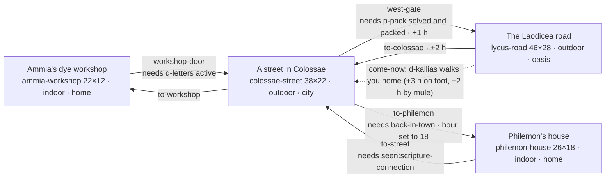

# Chapter 4: *A Letter from Paul*

**Passage:** Philemon 1–25, and Colossians 4:7–18. **Play time:** 20–30 minutes (`estimatedMinutes`), measured by word count at about 20–25 minutes for a brisk adult (see [§11](#11-how-long-it-plays)). **Status:** playable end to end; approval status in [§12](#12-content-and-approval-status).
**Content:** [`src/content/chapters/letter-from-paul/`](../../src/content/chapters/letter-from-paul/) is the source of truth; this document describes the chapter as built. Engine-wide design (controls, puzzle types, the ending contract, the play-time model): [game-design.md](../game-design.md).

**Setting** (`setting` in [`index.ts`](../../src/content/chapters/letter-from-paul/index.ts)): Colossae and the Lycus valley, in the Roman province of Asia, around AD 55–62 (dates uncertain). **Subtitle:** *Carried by hand, read aloud in Colossae.* **Research:** [`docs/research/letter-from-paul-sources.md`](../research/letter-from-paul-sources.md).

---

## 1. The idea and the passage

**Why this letter.** Philemon, read together with the end of Colossians:

- **It is a story about a letter.** Colossians names who carried it: Tychicus, with Onesimus, "one of you" (4:7–9). It asks for the letter to be read, then read in Laodicea too (4:16), and Paul signs it in his own hand (4:18). The whole life of an ancient letter is in a few verses: dictated, signed, carried, read aloud, explained, passed on. A player can *do* each of those things.
- **It is about reconciliation between real people.** Paul appeals rather than commands (Philemon 8–9, 14), offers to take any debt onto his own account (18–19), and asks Philemon to welcome Onesimus as he would welcome Paul (17). The letter never says how Philemon answered. That open ending suits a game that shows consequences and never grades them.
- **It forces honesty about slavery.** Onesimus was, it seems, Philemon's slave, and these letters have a painful history in slavery debates (`rec-interp-slavery`). The chapter shows slavery plainly and leaves the hard questions open.
- **The place is rich and little known.** The Lycus valley lived on wool; Strabo wrote that the Colossians earned large revenues from a colour named after their city (`rec-hist-wool`). Laodicea is down the valley, and the white terraces of Hierapolis can be seen across it (`rec-hist-hierapolis`).

**The player's role.** The player is the grandchild in a fictional household in Colossae: Ammia, a dyer of red wool. Their own story runs *beside* the letters. Kallias, Ammia's former apprentice, ruined a batch of wool, lied about it, quarrelled and left; now he writes asking to come back and work off his debt. The player puts his rain-soaked letter back in order, reads it aloud to Ammia, writes down her answer, finds the way, carries the answer down the Laodicea road, and decides how far to stand between them. Then, at a gathering that is **imagined** (the New Testament does not say where, when or by whom the letters were read: `rec-pl-house`), the player hears Paul's letters read aloud as **labelled paraphrase**.

**How the fiction sits beside Scripture.** The parallel is deliberately *not* a slave story. Kallias is free; Chrysis, an enslaved woman at the dye works, says what that difference means ("His trouble is shame. Mine is a bill of sale."), and a comparison in the Scripture Connection says it again: Onesimus's situation was not Kallias's. The chapter never invents what Philemon or Onesimus did, said or thought; the reading ends "What Philemon said and did next, the letter does not tell us. Neither will this story."

**Passage references the content uses.** Philemon 1–25; Colossians 4:7–9, 4:15–16, 4:18 (and 4:7–18 for the paraphrase); Colossians 1:7 and 4:12–13 (Epaphras); Colossians 2:1; Colossians 3:11; Colossians 3:22–4:1; Romans 16:22; Galatians 6:11, 1 Corinthians 16:21 and 2 Thessalonians 3:17 (the sender's own hand); 1 Thessalonians 5:27; Galatians 3:28; 1 Corinthians 7:20–23; Ephesians 6:21–22; Revelation 1:3. Historical records also cite Colossians 4:13 and 4:16, and Revelation 3:14–22 (Laodicea).

**Guardrails** (each enforced by [`tests/content/letter-from-paul.test.ts`](../../tests/content/letter-from-paul.test.ts)):

- No verse text in content: Scripture records hold references only, and every line of the reading is a narrator line of kind `paraphrase` linked to a paraphrase record, without quotation marks.
- Paul and Jesus never appear. Philemon, Tychicus and Onesimus are present only at the gathering, silent and not interactive.
- No faith, holiness or salvation scoring language anywhere.
- Slavery is never a transaction or a puzzle: no choice buys, sells or frees a person, and no puzzle's text names Chrysis.
- Disputed questions are open, each with a sensitivity note; the invented gathering, reader and road are labelled fiction or reconstruction.

The chapter's governance decisions in full are in [§12](#12-content-and-approval-status).

## 2. Acts

| Act | Where | What happens | Puzzle / choice |
|---|---|---|---|
| **1. The news** | `ammia-workshop` | Morning. Travellers from Paul are at Philemon's house, and the assembly gathers there tonight at lamp-lighting. A rain-soaked letter from Kallias came yesterday with Attalos, its sheets out of order. Ammia hands it over and starts `q-letters`. | — |
| **2. The letter** | `colossae-street` (Zenon's table) → workshop | Zenon explains letter form (optional). Put the five sheets in order and say what Kallias is asking. Read the letter to Ammia: every word, softened, or with a plea of your own. Write down her answer as she dictates it; she signs it. | `p-sheets` (`sequence`), `choice-reading` |
| **3. Preparing** | Street → workshop | Optionally learn the weather (Tatia, Attalos or Mount Cadmus). Optionally help Attalos with a letter whose name the rain washed off. Ask Ammia the way and follow it on her sketch, then pack the travel bag (load 4, a plain choice in conversation, `d-bag`). The west gate stops you until both are done (`d-gate-blocked`). | `p-whose` (`deduction`, optional side quest), `p-pack` (`map`), `choice-packing` |
| **4. The road** | `lycus-road` | Milestones, fields, the river and the white hillside of Hierapolis. Rain sweeps down the valley halfway along. At the dye works by the bridge, Kallias sees you coming in Ammia's red and runs. His vat says what to look for; his red footprints, his cloak on the peg and what Chrysis saw find him on the riverbank, while Nikon's confident guess is wrong. Read him Ammia's letter. Optionally match the buyer's shade so he keeps his wage. Chrysis may ask you to carry three things to her sister Melitta. | `p-hiding` (`deduction`), `p-alum` (`dyeing`, optional), side quest `q-message` |
| **5. The decision** | The dye works | Answer his worry about the debt, then decide: bring him home now, write down and carry his answer, or leave the next step to him. If he comes, he talks on the walk home (why he ran, what happened to the red batch, whether he is afraid, and, if you softened his letter, you can tell him so). | `choice-debt`, `choice-kallias` |
| **6. The gathering** | `colossae-street` → `philemon-house`, at lamp-lighting | Back in town the rain eases and lamps are lit. In the house, the consequences stand around you. If you carry Chrysis's words, Ammia notices you looking for someone and lets you go to Melitta (or you say it can wait, and the message goes home unspoken). If Kallias didn't come, Ammia asks how he looked. Zenon reads the letters aloud as labelled paraphrase; Ammia's response; then the Scripture Connection. | `choice-message` |
| **7. Reflection and summary** | Panels | Private reflection, then the summary. | — |

## 3. Places

| Scene | Size | Kind · mood · ambience · music | Weather | What is there |
|---|---|---|---|---|
| `ammia-workshop` | 22×12 | indoor · `home` · `indoor` · `home` | clear → rain (`rain-began`) → clear (`back-in-town`); indoors, no rain is drawn | Plastered workshop: rows of dye vats, drying cloth, jars, amphorae, an oven, a loom, a rug, bedrolls. The travel bag (`bag`, opens `d-bag` once you hold Ammia's answer), the spoiled batch Ammia kept (`spoiled-wool`), baskets of madder root. Ammia stands here until `back-in-town`. Spawns `start`, `from-street`. |
| `colossae-street` | 38×22 | outdoor · `city` · `market` · `home` | clear → rain (`rain-began`) → clear (`back-in-town`) | A fictional composite (Colossae's city mound has never been excavated: `rec-hist-colossae-site`). Terracotta roofs, a colonnade of Ionic columns with shop doors, Zenon's writing table under it, Menandros's stall, a fountain, Tatia's fullery yard (vats, white clay, drying cloth), Attalos and his mule (until you have been down the road), the gate of Philemon's house, the west gate, Mount Cadmus's foothills to the south. Triggers: `street-intro` (once), and `back-in-town` (on your return once `choice-kallias` is made: starts `d-back-in-town`). Spawns `from-workshop`, `from-road`, `from-philemon`. |
| `lycus-road` | 46×28 | outdoor · `oasis` · `oasis` · `journey` | `weather: 'clear'`; rain when `rain-began` | A kerbed Roman highway (`roman-road`) running west with two milestones (IIII and V), fields and fig trees. North of it: the dye works (shed, vats, amphorae, drying skeins) and the waystation (yard, trough), then the river Lycus with reeds and a stone bridge, and far across the valley the white travertine of Hierapolis. The road, milestones' numbers, bridge, dye works and waystation are invented (`rec-rec-road`); Hierapolis's terraces are real. Triggers: `setting-out`, `shower` (rain, +2 h), `shower-letter` (wet letter if you carry neither case nor hooded cloak), `dye-works` (Kallias runs: `kallias-fled`). Attalos and his mule wait at the waystation if you delivered his letter. Spawn `from-colossae`. |
| `philemon-house` | 26×18 | indoor · `home` · `indoor` · `reflection` | none set (clear) | A reconstruction (`rec-rec-house`): a peristyle garden ringed by Ionic columns with a fountain, a triclinium with couches on a mosaic floor, bronze lampstands (they light the room), a guest room with mats laid out (Philemon 22, `guest-room`), storerooms. Trigger `gathering-arrive` starts `d-gathering-arrive` as you step in. Nobody stands just behind a column of the garden's far row (content test). Spawn `from-street`. |

**Gating.** The workshop door opens once `q-letters` is active. The west gate needs `p-pack` solved and the `packed` flag; otherwise `d-gate-blocked` says why (no letter yet; you don't know the way; nothing packed). Philemon's gate stays shut until `back-in-town`. Philemon's door back out needs `seen:scripture-connection`. Every interactive thing and exit is reachable from every spawn (content test; `npm run content:validate`).

## 4. People

**Fictional** (`fictional: true`, `biblicalFigure: false`); every one has a journal entry except Hermon.

| Character | Role | Function |
|---|---|---|
| `ammia` Ammia | The player's grandmother, a dyer of red wool | Wronged, angry, and not finished with Kallias. Dictates her answer ("The debt is still a debt"), gives the directions (`p-pack`), and waits at the gathering, where she turns toward Kallias, keeps looking at the door, or reads his answer, depending on `choice-kallias`. |
| `kallias` Kallias | Ammia's former apprentice | Left the madder vat for the festival, blamed the madder, quarrelled and left in the winter. Works by the day at Nikon's dye works and has saved eight of the twenty coins. Runs when he sees you; found on the riverbank. Comes home, sends his answer, or decides for himself. |
| `zenon` Zenon | A scribe who writes and reads letters | Teaches letter form and helps sort the sheets. Learned to write while enslaved in a Laodicean merchant's house; freed at thirty, he still owes that family respect and favours. Reads the letters at the gathering, nervously. |
| `attalos` Attalos | A mule driver on the Laodicea road | Brought Kallias's letter; can't read. Gives the side quest `q-bundle`. If helped, he waits out the rain at the waystation and lends his mule for the walk home. |
| `tatia` Tatia | A fuller | Reads the weather from Mount Cadmus; owns the unaddressed letter (twelve more cloaks next month). At the gathering she points out Hermon. |
| `menandros` Menandros | A potter | Not part of the assembly, but sells it lamps. Confident and wrong about the letter: the unreliable clue. |
| `nikon` Nikon | Overseer of the dye works by the bridge | Sets the test-skein task (`alum-task`); pays Kallias at sundown. His guess about where Kallias went is unreliable. |
| `chrysis` Chrysis | An enslaved worker at the dye works | Owned by the works' master in Laodicea. Written with dignity, never made a puzzle or a purchase. Saw which way Kallias ran. May ask you to carry a message to her sister. |
| `melitta` Melitta | A baker's wife of the assembly | Chrysis's sister. Has no lines of her own: narration tells how she takes the message. |
| `hermon` Hermon | An old weaver of the assembly | Silent background at the gathering, not interactive; Tatia describes him. |

**Named in the New Testament** (`fictional: false`, `biblicalFigure: true`): `philemon` Philemon ("Host of the assembly in his house (Philemon 1–2)"), `tychicus` Tychicus ("Carrier of the letter (Colossians 4:7–8)", carrying a leather letter case), `onesimus` Onesimus ("'One of you' (Colossians 4:9)"). They stand only in Philemon's house, have no dialogue and no interaction, and have generic appearances (nothing is known of how they looked). Their journal entries unlock when you see the carriers (`saw-carriers`). Fictional characters mention them only as the text supports: Ammia names Tychicus and Onesimus, and passes on a rumour ("People say he ran off. People say all sorts of things.").

Paul never appears; his words reach the player only through references and labelled paraphrase.

## 5. Quests and stages

### `q-letters` *Carried by Hand* (main)

Started by Ammia in `d-opening` (`autoStart: false`).

| Stage | Title | Objectives |
|---|---|---|
| `read` | A Letter in the Rain | `sort`: solve `p-sheets` · `read-aloud`: make `choice-reading` |
| `road` | Down the Laodicea Road | `weather` (optional): find `clue-rain-coming` · `way`: solve `p-pack` · `pack`: flag `packed` · `leave`: visit `lycus-road` |
| `kallias` | The Dye Works by the Bridge | `where`: solve `p-hiding` (revealed when `kallias-fled`) · `find`: meet Kallias · `deliver`: flag `read-to-kallias` · `alum` (optional): solve `p-alum` (revealed when `alum-task`) · `decide`: make `choice-kallias` |
| `home` | Home Before Lamp-lighting | `return`: flag `back-in-town` |
| `gathering` | The Gathering | `arrive`: visit `philemon-house` · `listen`: flag `seen:scripture-connection` |

Outcomes (by `choice-kallias`): `together` *Home together* (success, `come-now`), `carried` *An answer carried home* (success, `carry-reply`), `left-to-him` *The next step left to Kallias* (alternate, `leave-it`). Journal: `je-letter` on start, `je-gathering` on completion.

### `q-bundle` *The Mule Driver's Bundle* (side, optional)

Started by Attalos (`d-attalos`, "I'll help you"), who gives you `bundle-letter`.

| Stage | Objectives |
|---|---|
| `look` | find at least 2 of the 5 bundle clues (`BUNDLE_CLUES`) |
| `decide` | solve `p-whose` (offered by Attalos once you have 2 clues) |
| `deliver` | give the letter to Tatia (flag `bundle-delivered`, +1 hour) |

Outcomes: `delivered` (success: Attalos trust +2, Tatia +1, unlocks `jh-carriers`; Attalos and his mule then wait at the waystation and lend you the mule if Kallias comes home), `unread` (alternate, `failWhen`: you reached `lycus-road` before delivering it).

### `q-message` *Words for Melitta* (side, optional)

Once Chrysis has told you what her life is (`talked-chrysis`), you can ask whether there is anything you could do for her. She can't write and can't leave: tell her sister Melitta, at the gathering, that she is well, that the master says "perhaps, in two years", and that she still has their mother's comb. Promising starts the quest (and sets `chrysis-message`); saying you can't promise does not.

| Stage | Objectives |
|---|---|
| `carry` | `tell`: give Melitta the message (flag `message-delivered`), every word or without the "perhaps" (`choice-message`) |

Outcomes: `delivered` *Words delivered* (success: Chrysis and Melitta trust +1), `unspoken` *Carried home unspoken* (alternate, `failWhen`: `message-waited`, set when you tell Ammia "It can wait"). No choice buys, sells or frees anyone; the message is words only.

### Items

The travel bag holds a load of 4 (`BAG_CAPACITY` in [`src/content/chapters/letter-from-paul/dialogue/bag.ts`](../../src/content/chapters/letter-from-paul/dialogue/bag.ts)). The chapter starts with only 3 coins; the things for the road wait beside the bag and are given to you as you pack them.

| Item | Weight | How you get it | Why it exists |
|---|---|---|---|
| `kallias-letter` Kallias's letter | 0 | Ammia, in `d-opening` | Opens `p-sheets` at Zenon's table. |
| `ammia-letter` Ammia's answer | 0 (essential) | Ammia, after `choice-reading` | What you carry to Kallias; unlocks the travel bag. |
| `coins` Bronze coins | 0 (you start with 3) | Start of the chapter | Put 3 on Kallias's account (`choice-debt` `my-account`). |
| `bread` Bread and cheese | 1 | The travel bag | Share with Kallias or with Chrysis. |
| `hooded-cloak` Hooded wool cloak | 2 | The travel bag | Keeps the letter dry in the rain. |
| `spare-cloak` Kallias's old cloak | 2 | The travel bag | Give it to him in the rain if he comes home; he wears it at the gathering. Shows rolled on your back. |
| `tablets` Writing tablets and stylus | 1 | The travel bag | Needed to write down and carry his answer (`carry-reply`). |
| `letter-case` Leather letter case | 1 | The travel bag | Keeps the letter dry; shows at your hip. |
| `kallias-reply` Kallias's answer | 0 | Kallias, if you choose `carry-reply` | His answer, on your tablets. |
| `bundle-letter` A letter with no name | 0 | Attalos, starting `q-bundle` | The side quest; given to Tatia. |

**The bag's rules** (`d-bag`): one thing at a time, in or out; anything that doesn't fit is shown with the reason. If you know rain is coming (`clue-rain-coming`), the bag can't be tied without the letter case or the hooded cloak, and says why. Tying it records `choice-packing` (classified in this order: Kallias's cloak → `for-kallias`, tablets → `for-writing`, case or hooded cloak → `for-rain`, bread → `food`, else `light-load`) and sets `packed`.

## 6. Puzzles

| Puzzle | Type | Where | Solution |
|---|---|---|---|
| `p-sheets` Kallias's Letter | `sequence` | Zenon's table, `colossae-street` | greeting → wish → confession → request → own-hand; conclusion: he asks to come back and work off the rest, at the dye works by the bridge |
| `p-pack` The Way to the Bridge | `map` | Ammia, `ammia-workshop` ("Which way is Nikon's dye works?") | West past four milestones, first left to the river, right past the waystation, stop at the dye works by the stone bridge (`nikon`) |
| `p-alum` The Buyer's Shade (optional) | `dyeing` | The test skein, `lycus-road` (once `alum-task`) | Madder → rinse → madder → blue: red 3, blue 2 (mulberry) |
| `p-whose` Whose Letter? (optional side quest) | `deduction` | Attalos, `colossae-street` | Tatia, with 2 reliable clues |
| `p-hiding` Where Did Kallias Go? | `deduction` | Kallias's vat, `lycus-road` | The riverbank by the bridge, with 2 reliable clues |

`map` and `dyeing` are this chapter's own types (the content test checks the chapter uses exactly `sequence`, `map`, `dyeing` and `deduction`). The id `p-pack` is kept from the packing puzzle it replaced because saves and the story name it. Every puzzle has three hint tiers, and only the last gives the answer.

### `p-sheets` Kallias's Letter

Order five sheets, using what each says and how it is written: greeting ("Kallias, to Ammia his teacher: greetings") → good wishes → the confession about the red batch → the request ("eight coins of the twenty … past the milestone marked [the number has run in the rain]") → the farewell "in my own hand", in larger, clumsier letters. Then answer *What is Kallias asking — and where is he?* (the correct option admits that the milestone number washed away). Zenon's optional explanation of letter form sets `learned-letter-form`. Records: `rec-hist-letter-form`, `rec-hist-scribes`. Sets `letter-sorted`.

### `p-pack` The Way to the Bridge

Ammia's sketch of the valley on a wax tablet, north at the top, the town gate on the right. Her directions: out of the west gate down the paved road; count the milestones, and after the fourth take the first turning on the **left** (south) toward the river; where it meets the river turn **right** (west); go past the waystation; Nikon's dye works is next, by the bridge, on this side of the river. The player walks landmark to landmark (buttons or arrow keys); where you are, which way you face and where the road goes are always written out (`aria-live`). Each likely mistake ends at a named wrong place with its own feedback: the dye works by a footbridge (turned too early), the potter's kiln (turned left at the river), the shepherd's hut and the farm (turned right off the road), the road on to Laodicea (walked past), the waystation (stopped short), the dye works across the river and the tannery (crossed). Kallias's letter lost the milestone number and there is more than one dye works by a bridge, which is why you need the way. Record `rec-rec-road` says the road, milestones, bridge and dye works are invented. Sets `knows-the-way`.

### `p-alum` The Buyer's Shade (optional)

Match the buyer's mulberry (red 3, blue 2) in at most four dips: the madder vat adds 2 red, the blue vat 2 blue, the rinsing trough takes 1 of each out (never below none). The insight is rinsing while there is no blue yet. Every one of the 25 shades is named as well as shown and given as numbers, so nothing depends on seeing colour. Integrity checks that the target needs exactly the dips allowed (content test). Record `rec-hist-dyeing`; the explanation says the vats, shades and dips are made up. Sets `alum-set`, +1 hour; if Kallias comes home, Nikon pays his wage (`kallias-paid`).

### `p-whose` Whose Letter? (optional)

Tatia, Zenon or Menandros; needs 2 reliable clues. Evidence: white clay dust in the folds and the torn words "the cloaks you cleaned" (for Tatia), a cloth merchant sender (for Tatia, against Menandros), Zenon's denial (against Zenon); the potter's guess is unreliable. Record `rec-hist-carriers`. Sets `bundle-solved`.

### `p-hiding` Where Did Kallias Go?

Revealed when Kallias runs (`dye-works` trigger sets `kallias-fled`). Options: Laodicea, the waystation, the drying shed, the riverbank by the bridge; needs 2 reliable clues. Red footprints (for the bank, against the waystation); what was seen by the shed door (for the bank, against the shed); his cloak and food still on the peg (against Laodicea); the overseer's guess (for the waystation) is unreliable. Every wrong place is ruled out by a reliable sign (content test). His vat (`d-hiding`) says what to look for and offers the puzzle once two of the four signs are found; Kallias appears on the bank only once it is solved. The puzzle's own text never names Chrysis ("someone working by the shed door"). Record `rec-rec-road`. Sets `kallias-tracked`.

### Clues

| Clue | Source | Reliability | Used by |
|---|---|---|---|
| `clue-rain-coming` Rain by afternoon | Mount Cadmus (examine), Tatia or Attalos | reliable | `q-letters` `weather`; the bag's rain rule |
| `clue-red-prints` Red footprints | By Kallias's vat | reliable | `p-hiding` |
| `clue-cloak-peg` A cloak on the peg | The drying shed door | reliable | `p-hiding` |
| `clue-saw-him-go` Which way he went | Chrysis | reliable | `p-hiding` |
| `clue-nikon-guess` "At the waystation, eating" | Nikon | unreliable (he was counting amphorae) | `p-hiding` |
| `clue-white-dust` White dust in the folds | The letter (Attalos, "Let me look") | reliable | `p-whose` |
| `clue-torn-words` Words through a tear | The letter (Zenon reads it) | reliable | `p-whose` |
| `clue-cloth-merchant` A cloth merchant's letter | Attalos | reliable | `p-whose` |
| `clue-not-zenon` Not Zenon's | Zenon | reliable | `p-whose` |
| `clue-potter-guess` "Letters are for Zenon" | Menandros | unreliable (he never looked) | `p-whose` |

## 7. Choices and consequences

| Choice | Options | What changes |
|---|---|---|
| `choice-reading` | `every-word` · `softened` (leave out the confession) · `added-plea` | **Softened:** Ammia hears a gentler letter. If Kallias comes home he confesses to her himself (`kallias-confessed`); on the walk you can tell him what you left out (`told-kallias`); if he writes, his answer says it again; if you leave it to him, the summary says she heard it when he came. A comparison notes Zenon read Paul's letters "hard parts and all". **Plea:** Kallias trust +1. |
| `choice-packing` | `for-kallias` · `for-writing` · `for-rain` · `food` · `light-load` | Recorded from what is in the bag when you tie it. What you carry decides what you can offer at the bridge (cloak, bread, tablets for `carry-reply`), whether the letter blurs in the rain (`letter-wet`), and what shows on you. |
| `choice-debt` | `my-account` (−3 coins) · `speak-for-him` · `their-business` | **My account:** Kallias trust +2; Ammia mentions your coins after the reading; comparison with Philemon 18–19. **Speak for him:** trust +1; if he comes home, after the reading you choose to keep your word (`spoke-for-kallias`) or stay quiet. |
| `choice-kallias` | `come-now` · `carry-reply` (needs tablets) · `leave-it` | Who stands beside you at the gathering, where Ammia looks, what she says after the reading, the quest outcome, the comparison and the summary (home tomorrow, or three days later). |
| `choice-message` | `every-word` · `softened` (leave out the "perhaps") | What Melitta hears (narration shows how she takes it) and a summary line. Letting it wait fails `q-message` instead. |

Smaller decisions with effects: sharing bread with Kallias (trust +1; Ammia can later be told he hadn't eaten) or Chrysis; giving Kallias his old cloak in the rain (trust +1, `kallias-cloak`); matching the shade (his wage).

**What you can see afterwards:**

| What you did | What you see |
|---|---|
| Packed the letter case / Kallias's cloak | A letter case at your hip (`letter-case`) / a rolled cloak on your back (`cloak-roll`), once packed |
| Gave Kallias his cloak | He wears it at the gathering (`wrapped-in-cloak`), and it's gone from your back |
| Brought him home | Kallias stands beside Ammia, and she faces him; his place at the vat is empty |
| Carried his answer | Your tablets lie beside Ammia (`reply-tablets`); Kallias is back at his vat |
| Left it to him | Ammia faces the door |
| Matched the buyer's shade | The test skein hangs matched by the vats (`alum-bath`) |
| Helped Attalos | Attalos and his mule wait out the rain at the waystation |
| Walked into the rain | Rain on the road and in the town, clearing when you get home |

## 8. Time, weather and light

`hour` is the chapter's story counter (`timeCounter`). It starts at 8 and moves:

| Event | Change |
|---|---|
| Ammia's answer written (`d-ammia`) | +1 |
| The side quest's letter delivered to Tatia | +1 |
| Leaving by the west gate | +1 |
| The rain (`shower` trigger, halfway down the road) | +2 |
| The test skein matched (`p-alum`) | +1 |
| Walking home with Kallias / riding Attalos's mule | +3 / +2 |
| The road exit back to Colossae (`to-colossae`) | +2 |
| Philemon's gate | set to 18 |

On a straight run you reach town between hour 14 and 17, before lamp-lighting; finding Kallias, the walk-home talk and Chrysis's message don't move the clock. The HUD shows sunset at the gathering, and the lampstands glow.

**Weather.** The road starts `clear` and turns to `rain` when `rain-began` is set (by the `shower` trigger; Kallias's first line sets it too, as a safety). The workshop and street turn to rain with the same flag and clear again at `back-in-town`. Rain is drawn outdoors only (`src/game/systems/weather.ts`: interiors and reduced motion get no particles); Philemon's house has no weather.

**Light** (`PLACE_LIGHTS` in [`tools/art/lib/lighting.py`](../../tools/art/lib/lighting.py); the game picks a set by the hour in `src/game/prerendered/select.ts`):

| Place | Sets → light | People lit | When |
|---|---|---|---|
| `ammia-workshop` | `day` → day (room default) | `indoor` | The morning; one set |
| `colossae-street` | `day` → day, `late` → late (outdoor default) | each set's sun | Morning; the `late` set from 15:00, so on the way home on most paths |
| `lycus-road` | `day` → `overcast` | `overcast` | Walked from mid-morning as the rain comes; one set |
| `philemon-house` | `day` → `dusk` | `lamp` | Only at lamp-lighting (hour 18); one set |

## 9. Scripture Connection and summary

**Title:** "Two Letters Read Aloud". The final narrator line before it says the two letters are in the New Testament, and that each part is labelled.

| Section | Records |
|---|---|
| The letter to Philemon | `rec-phm`, `rec-para-philemon` |
| The end of the letter to the Colossians | `rec-col-4-7-9`, `rec-col-4-15-16`, `rec-col-4-18`, `rec-para-col-4` |
| How the letters reached Colossae | `rec-hist-carriers`, `rec-hist-scribes`, `rec-hist-letter-form`, `rec-hist-reading`, `rec-hist-house-church` |
| The world of the letters | `rec-hist-who`, `rec-hist-lycus`, `rec-hist-slavery`, `rec-hist-pliny` |
| Questions that are still open | `rec-interp-onesimus`, `rec-interp-prison`, `rec-interp-authorship`, `rec-interp-slavery`, `rec-interp-reconciliation` |

**The reading** (`d-reading`, read by Zenon): 12 narrator lines of kind `paraphrase`, three linked to `rec-para-col-4` (Colossians 4:7–18) and nine to `rec-para-philemon` (Philemon 1–25), checked against the WEB, without quotation marks.

**Comparisons** (one always; the rest by what you did): you carried a letter, as Tychicus and Onesimus did; `come-now` (Philemon 17); `carry-reply`; `leave-it` (Philemon 8–9, 14); `my-account` (Philemon 18–19); `speak-for-him`; `talked-chrysis` (Onesimus's situation was not Kallias's); a softened reading; `message-delivered` (Colossians 4:7–9).

**Reflection prompts** (three): what making peace asks of the wronged and of the one who did wrong; why Paul asked rather than ordered; someone you could speak up for, or carry a message to, this week.

**Summary.** A recap of what happened (up to ten lines), then concrete consequences, never a grade: how you read the letter, what Kallias did and when he came, his wage, the debt, the cloak, the mule, a wet letter, Tatia's letter, Chrysis, telling Kallias, Melitta's message. Every branch ends "Every letter in this story reached its reader because somebody carried it." Themes: reconciliation, debt, advocacy, honesty, messengers, freedom, welcome (descriptive tags, not points). Summary Scripture records: `rec-phm`, `rec-col-4-7-9`, `rec-col-4-15-16`, `rec-col-4-18`, `rec-epaphras`, `rec-rom-16-22`, `rec-own-hand`, `rec-1th-5-27`, `rec-col-3-22`, `rec-gal-3-28`; history records: `rec-hist-lycus`, `rec-hist-colossae-site`, `rec-hist-wool`, `rec-hist-carriers`, `rec-hist-scribes`, `rec-hist-letter-form`, `rec-hist-reading`, `rec-hist-house-church`, `rec-hist-roads`, `rec-hist-slavery`, `rec-hist-pliny`, `rec-hist-earthquake`.

**Scripture text.** The World English Bible is approved for display (Zac Harlan, 2026-09-26; [`src/content/scripture/translations.ts`](../../src/content/scripture/translations.ts)), and every reference held by this chapter's 15 `scripture` records has a stored WEB passage there (Philemon 1:1–25, Colossians 4:7–9, 4:15–16, 4:18 and the rest), so players see the verse text itself beside each reference. A reference without a stored passage would still show the placeholder `[SCRIPTURE TEXT REQUIRES APPROVED TRANSLATION — …]`. Only `scripture` records show verse text; the paraphrase records show our own words, labelled as paraphrase, and historical records show references only.

## 10. Art

**Pre-rendered places.** All four places are pre-rendered with the **Roman kit**, [`tools/art/lib/kit_roman.py`](../../tools/art/lib/kit_roman.py) (`ROMAN_CHAPTERS = {"letter-from-paul"}`), split into [`roman_town.py`](../../tools/art/lib/roman_town.py) (the street: stuccoed fronts under terracotta tile roofs, the Ionic stoa, paving, the fountain, the fuller's yard, the town wall and west gate, Mount Cadmus's foothills), [`roman_valley.py`](../../tools/art/lib/roman_valley.py) (the road: the kerbed highway, milestones, the stone bridge, the dye works and waystation, wet meadows, Hierapolis's travertine) and [`roman_rooms.py`](../../tools/art/lib/roman_rooms.py) (the workshop floored with red opus signinum, steaming vats and skeins; Philemon's peristyle house with a painted wall, mosaic, couches, lampstands and the garden), with `roman_geom.py`, `roman_materials.py`, `roman_arch.py` and `roman_props.py`. The art is in `public/art/<scene>/`; the light sets are in [§8](#8-time-weather-and-light). Philemon's house is drawn in cutaway with its columns flagged to fade while the player is behind one ([technical art guide](../art/technical-art-guide.md)).

**People sheets** (`public/art/people/`, standing; each with a shadow sheet and a half-resolution copy):

| Sheet | Lights |
|---|---|
| `ammia` | `indoor`, `lamp` |
| `zenon`, `tatia` | `day`, `late`, `lamp` |
| `menandros` | `day`, `late` |
| `attalos` | `day`, `late`, `overcast` |
| `kallias.letter-from-paul` | `overcast`, `lamp`; overlay `@wrapped-in-cloak` in `lamp` |
| `nikon`, `chrysis` | `overcast` |
| `melitta`, `hermon`, `philemon`, `tychicus`, `onesimus` | `lamp` |
| the player's looks (`player-look-1`…`4`) | overlays `@letter-case` and `@cloak-roll`, in every light they can be seen in here |

Kallias's sheet and portrait ids name the chapter (`kallias.letter-from-paul`) because Chapter 3 has a different Kallias.

**Portraits and expressions.** Everyone who speaks has a portrait (`public/art/portraits/`) and one for each expression their lines carry (`public/art/portraits/<expression>/`; manifest [`src/features/portraits/portrait-manifest.json`](../../src/features/portraits/portrait-manifest.json)):

| Speaker | Expressions on their lines |
|---|---|
| `ammia` | glad, sad, surprised, worried |
| `kallias.letter-from-paul` | glad, sad, surprised, worried |
| `zenon` | glad, surprised, worried |
| `chrysis` | glad, sad, surprised |
| `tatia` | glad, surprised |
| `attalos`, `menandros`, `nikon` | glad |

Melitta, Hermon and the three people named in the New Testament never speak and have no portrait. The chapter's expression sheet: [`docs/art/portraits/expressions-letter-from-paul.webp`](../art/portraits/expressions-letter-from-paul.webp).

**Runtime fallback.** Where art is missing, or for anyone the art can't draw, the game paints at runtime (`src/game/art/`), and the content test's art section checks that everything this chapter uses can be painted: the tile kinds `mosaic`, `roman-road`, `bridge`, `tile-roof`, `column`, `vat`, `amphorae`, `couch`, `milestone`, `travertine`, `garden`, `lampstand`, `fountain`; the carries `tablets` and `scroll-case`; the look mark `letter-case`; prop sprites such as `tablets`, `letter-sheets`, `wool`, `vessels`, `pack`, `pack-donkey`.

**Teaser:** none (only Chapter 1 has `hasTeaser`).

## 11. How long it plays

**No test pins this chapter's play time.** [`tests/integration/play-time.test.ts`](../../tests/integration/play-time.test.ts) measures Chapters 1 and 2 only; the content test checks only that there are five puzzles and a script of more than 5,400 words. The model used for the pinned chapters is in [game-design.md §11](../game-design.md#11-how-long-a-chapter-plays).

The owner found the chapter "playing pretty quick" against its 20–30-minute target, so it was made longer on 2026-09-30. Both versions were measured by replaying the headless playthroughs and counting every word a player is shown (each dialogue line and choice, each message, and each puzzle's introduction, clues and explanation; the Scripture Connection and summary not included):

| Path | Before (2026-09-26) | After (2026-09-30) |
|---|---|---|
| *Left to him*: Chrysis talked to, no side quest finished | 2,750 words, 2 puzzles | 3,530 words, 3 puzzles |
| *An answer carried*: no side quest | 2,820 words, 2 puzzles | 3,240 words, 3 puzzles |
| *Home together*: the bundle, the alum, coins, cloak and mule | 3,310 words, 4 puzzles | 3,910 words, 5 puzzles |

At a brisk adult pace (about 300 words a minute, a little over a minute a puzzle, instant travel, two minutes for the ending) that is about **16–17 → 20–21 minutes** on the first two paths and **21 → 25** on the third. A first-time younger player (about 200 words a minute, two minutes a puzzle, walking rather than instant travel) takes about a third longer. Finding Kallias is on the main path, so every player sees it. These figures predate the shared play-time model and were not re-measured with it.

## 12. Content and approval status

**Approval.** The owner, Zac Harlan, approved the AI-drafted records of all four chapters on 2026-09-26 (`APPROVALS` in [`src/content/shared/approvals.ts`](../../src/content/shared/approvals.ts); `withApprovals` applies it in [`index.ts`](../../src/content/chapters/letter-from-paul/index.ts)). An approval covers a record only if every entry in its history is dated on or before the approval (`coveredBy`): a record drafted or changed later is not covered and stays in review until a named person approves it. Provenance stays recorded as AI-assisted.

Of the chapter's 61 records, **58 are approved** and **3 await review**, all fiction added on 2026-09-30 when the chapter was made longer (`LATER_STORY` in [`governance.ts`](../../src/content/chapters/letter-from-paul/governance.ts), status `ai-draft`):

| Record | Kind | Title |
|---|---|---|
| `rec-p-melitta` | fiction | Melitta |
| `rec-e-hiding` | fiction | Kallias runs |
| `rec-e-message` | fiction | Words for Melitta |

The content test checks that these stay in review and that the approval was given by a named human, never by an agent. Dialogue lines carry no governance status of their own; the records are what approval tracks.

**How to check:** `npm run content:publish-check` reports editorial readiness (it fails until every record is approved). With `VITE_CONTENT_MODE=preview` (the default) the game labels each unreviewed record "Awaiting editorial review"; `strict` drops the label.

**Record kinds:** 15 `scripture` (references only), 2 `paraphrase`, 16 `historical`, 2 `reconstruction` (`rec-rec-road`, `rec-rec-house`), 7 `interpretation`, 19 `fiction`.

### Governance presets (`governance.ts`)

`draft()` builds each record's governance: provenance `ai-assisted`, age level `10+` unless set, drafted 2026-09-25 by "Claude (AI-assisted draft)"; status `sources-attached` for records whose claims were checked against retrieved sources (`sourced: true`), otherwise `ai-draft`. `STORY` is the preset for the chapter's own fiction; `LATER_STORY` is the same with a history entry dated 2026-09-30, which is why the approval does not reach it. (The file's comment that "NOTHING is approved" describes the presets before `withApprovals` runs; the statuses players see are the approved ones above.)

### Governance decisions

| Rule | How this chapter keeps it |
|---|---|
| No invented verses | Scripture records hold references only; WEB text comes from the translation registry ([§9](#9-scripture-connection-and-summary)). The reading is 12 narrator lines of kind `paraphrase`, linked to `rec-para-philemon` and `rec-para-col-4`, checked against the WEB, with no quotation marks. |
| Biblical figures never controlled, no invented words | Paul never appears. Philemon, Tychicus and Onesimus appear only at the gathering, silent and not interactive, with generic appearances. Fictional characters mention them only as the text supports (Ammia: Tychicus carried the case from Paul, and Onesimus, of Philemon's household, has been with Paul); a rumour is labelled as one. |
| The reader is fictional | Zenon, a fictional freed scribe, reads the letters. Whether carriers read letters aloud is disputed (research claim 15), so the game doesn't put the letters in Tychicus's mouth. |
| Disputed questions stay open | Interpretation records, each with a sensitivity note: why Onesimus was away (four views, including the minority "estranged brother" view), where Paul was in prison (Rome, Ephesus or Caesarea), who wrote Colossians, what the letters say about slavery, reconciliation in front of everyone, the "letter from Laodicea" and Nympha/Nymphas, and what became of Onesimus. |
| Slavery: honest and serious | Chrysis is written with dignity and never made a puzzle or a purchase; no choice buys, sells or frees anyone. The history record states the facts and gives no numbers, because no figures are provable. The interpretation record tells the painful history of these letters' use in American slavery debates. |
| Invented places labelled | The gathering (`rec-pl-house`), the road and dye works (`rec-rec-road`) and Philemon's house (`rec-rec-house`) are labelled fiction or reconstruction. |
| No scoring | Trust appears only as words. The summary lists what happened, never a grade. The content test and the E2E test check for scoring language. |
| Research | 76 sources, every one retrieved and checked on 2026-09-25 by an AI research assistant (`verified: true` records that retrieval; a human editor must still confirm each citation); the claim-by-claim notes include five corrections. |

## 13. Sources and verification

- **Research:** [`docs/research/letter-from-paul-sources.md`](../research/letter-from-paul-sources.md): 25 claims, each with verdict, confidence, sources and the records that use it.
- **Sources:** [`sources.ts`](../../src/content/chapters/letter-from-paul/sources.ts) (76 entries: the WEB chapter pages, ancient texts, scholarship and reference works). The content test checks that the chapter cites only sources that were retrieved and uses every one it lists.
- **Content test:** [`tests/content/letter-from-paul.test.ts`](../../tests/content/letter-from-paul.test.ts): integrity, reachability and lazy loading; the puzzle types; Ammia's directions and every wrong stop; the shade needing all four dips; a main quest and two optional side quests with alternate outcomes; finding Kallias (two reliable signs, the overseer's guess unreliable); Chrysis's message as words only, Melitta silent; five puzzles and a long script; no verse text; biblical figures silent, Paul and Jesus absent; no scoring language; slavery never a transaction or puzzle; disputed questions open with sensitivity notes; invented places labelled; the 2026-09-30 text in review; approval by a named human; sources retrieved and used; a real choice at the dye works; the bag only offering things you can pack; the road running through rain; and the art support (every standing object and ground drawn, colonnade beams, nobody behind a column at the gathering, the lampstands lit, every prop sprite and carry painted). Art assets for every chapter: [`tests/content/art-assets.test.ts`](../../tests/content/art-assets.test.ts).
- **Integration playthroughs:** [`tests/integration/letter-from-paul-playthrough.test.ts`](../../tests/integration/letter-from-paul-playthrough.test.ts), five runs:
  - *home together*: side quest, the alum bath, three coins, the old cloak, the mule ride (outcome `together`);
  - *an answer carried home*: softened reading, the rain rule at the bag, hooded cloak, bread, tablets, a promise to speak (outcome `carried`);
  - *left to him*: a plea, a wet letter, the side quest failed, Chrysis's words delivered in full, Ammia asks how he looked (outcome `left-to-him`);
  - *keeping a promise*: you tell Kallias on the road, he gives up his wage, the message left unspoken, he confesses, you speak up for him;
  - the gates that stop you leaving unprepared.
- **Play time:** not measured by a test ([§11](#11-how-long-it-plays)).
- **Browser E2E:** [`e2e/letter-from-paul.spec.ts`](../../e2e/letter-from-paul.spec.ts) plays from a new profile to the summary through the accessible UI (`E2E_SHOTS=1` saves `test-results/shots/lfp-*.png`). [`e2e/letter-art.spec.ts`](../../e2e/letter-art.spec.ts) captures every place for art review (not pass/fail).

## 14. Known gaps

- **No play-time test.** This chapter's play time is not pinned by `tests/integration/play-time.test.ts`; the numbers in [§11](#11-how-long-it-plays) are a one-off word count from 2026-09-30 with an older pace model. Adding Chapter 4 to the play-time test would pin a floor.
- **Three records await review** (`rec-p-melitta`, `rec-e-hiding`, `rec-e-message`), so `npm run content:publish-check` still fails for this chapter.
- **Kallias's letter is described as four sheets, but the puzzle has five.** The item description in [`items.ts`](../../src/content/chapters/letter-from-paul/items.ts) says "Four rain-soaked papyrus sheets"; `p-sheets` has five cards.
- **Silent figures are not in the "Go to…" list.** The list offers only interactive things (`destinations()` in `src/application/world-model.ts`), so Philemon, Tychicus, Onesimus and Hermon, deliberately not interactive, can be walked up to but not chosen from it.
- **Walking back and forth adds time.** The road exit back to Colossae always adds 2 hours and the west gate 1, so a player who returns to town before deciding at the dye works can pass hour 17. Philemon's gate still sets the hour to 18, so the gathering is unaffected; the street simply shows its later-day set.
