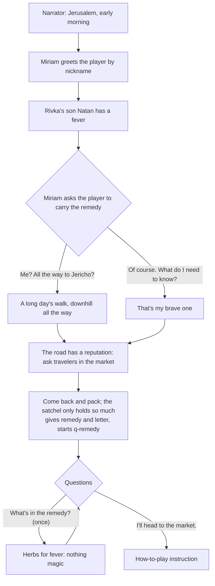
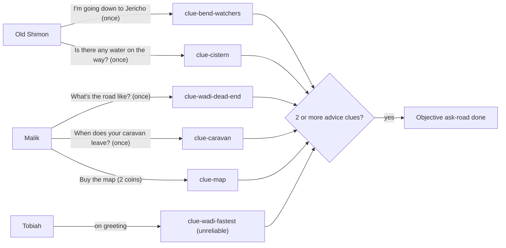
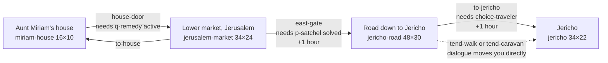
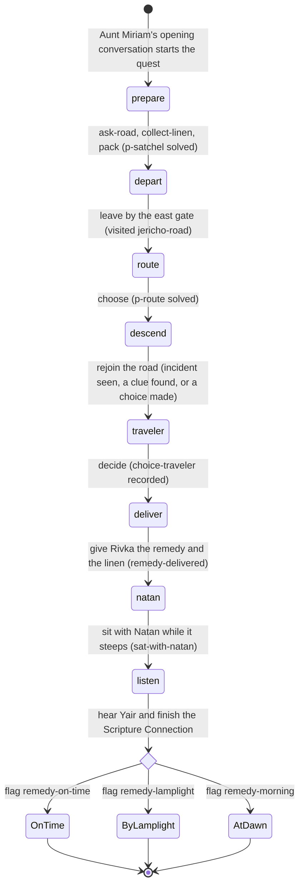
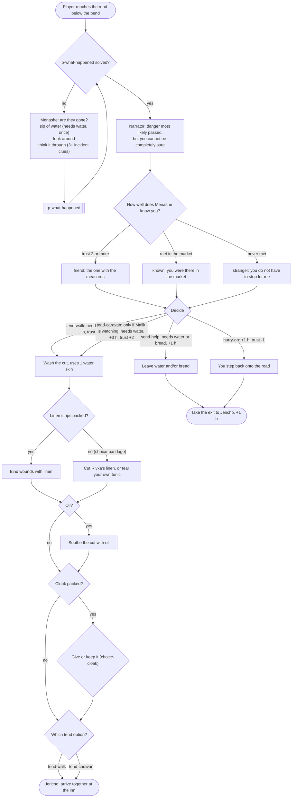
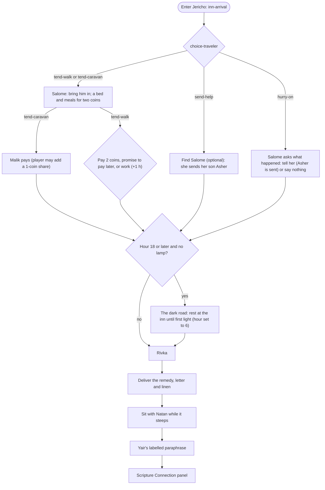

# Chapter 1: *The Road to Jericho*

**Passage:** Luke 10:25–37, the parable of the Good Samaritan (with Deuteronomy 6:5, Leviticus 19:18 and 19:34 behind it). **Play time:** 20–30 minutes for a first-time player (measured in [§11](#11-how-long-it-plays)). **Status:** playable end to end on every major branch; approval status in [§12](#12-content-and-approval-status).
**Content:** [`src/content/chapters/road-to-jericho/`](../../src/content/chapters/road-to-jericho/) is the source of truth; this document describes the chapter as built. Engine-wide design (controls, puzzle types, the ending contract, the play-time model): [game-design.md](../game-design.md).

## 1. The idea and the passage

The player walks the same road as a well-known Bible story and has to make the kinds of decisions its characters faced, before they learn what the story says.

Aunt Miriam, a healer in Jerusalem, asks the player to carry a fever remedy to her friend Rivka in Jericho, with fine linen for Natan's bed. The road down has a reputation for robbers. The player gathers advice, packs a satchel that cannot hold everything, reads the terrain to pick a route, meets a shepherd boy on the ridge who saw men go down toward the bend at dawn, and finds a robbed traveler lying below the bend. That traveler is a Samaritan oil merchant the player may already have met in the market. Whatever the player chooses, the remedy reaches Jericho. There, a fictional fig grower named Yair retells a story he once heard Jesus tell about this same road. The game then shows what Luke 10:25–37 contains, keeping Scripture, paraphrase, history and interpretation clearly apart.

The game never tells the player what the right answer was. It shows what happened because of their choices and asks them to think.

**Guardrails, enforced by [`tests/content/road-to-jericho.test.ts`](../../tests/content/road-to-jericho.test.ts):**

- Every character is fictional; Jesus never appears as a character. The chapter only reports that Yair heard a story he told.
- Lines that retell Scripture (Yair's retelling, Hanan on the Law) are `paraphrase` lines linked to paraphrase records, and the dialogue box labels them. Scripture records hold references, never verse text.
- No motive is given for the priest or the Levite: the test rejects text that pairs them with a ritual-purity motive.
- No faith, holiness or favor scores; the decision at the traveler has at least three options and none is a morality button.

## 2. Acts

The code names Acts 6 and 7 ([`ending.ts`](../../src/content/chapters/road-to-jericho/ending.ts), [`ChapterEnding.tsx`](../../src/features/chapter/ChapterEnding.tsx)). Acts 1–5 are this document's grouping of the scenes and quest stages.

| Act | Where | What happens | Puzzle / choice |
|---|---|---|---|
| **1. The errand** | Aunt Miriam's house | Miriam explains that Natan has a fever, hands over the remedy and a letter, asks the player to collect the linen Rivka ordered from Hadassah, and tells them to ask travelers about the road before packing. Main quest stage `prepare` starts. | — |
| **2. The market** | Lower market, Jerusalem | The player gathers advice from Shimon, Malik and Tobiah, some reliable and some not, and collects Rivka's linen from Hadassah. They can shop (map, linen strips, oil), hear Hadassah's prejudice about Samaritans, ask Hanan about the Law, press Tobiah on his claim, take a message from Shimon to his grandson (*A Message for Eli*), and take up *An Honest Measure*. | `p-measure` (optional), `choice-malik`, `choice-prejudice` |
| **3. Packing and setting out** | Miriam's house → east gate | The satchel holds a load of 6; the starting kit and Rivka's linen weigh 10, so something stays home. Miriam can send a greeting to Salome. The east gate opens once packing is done. | `p-satchel` → `choice-packing` |
| **4. The road down** | The road to Jericho | At the fork, the player weighs evidence and proves the ridge path is safe. Along the ridge they drink and can refill at a cistern, where Eli, Old Shimon's grandson, asks for bread and tells what he saw at dawn. Where the path drops back to the road they find a broken jar, footprints and a man lying in the shade. They work out what happened, then decide what to do; with no linen strips, they choose whether to cut Rivka's linen to bind his wounds. | `p-route`, `p-what-happened`, `choice-eli`, `choice-traveler`, `choice-bandage`, `choice-cloak` |
| **5. Jericho** | Wayside inn, spring, Rivka's courtyard | The decision plays out at the inn (who brings Menashe in, who pays). A striped cloak on the sacks by the gate raises a question: whose is it (*Whose Cloak?*)? If it is dark and the player has no lamp, they rest until dawn. The remedy and the linen go to Rivka; while it steeps, the player sits with Natan and tells him about the road; then Yair comes in from the orchard and tells the story he heard. | `p-cloak` (optional), `choice-inn` |
| **6. Scripture Connection** | Full-screen panel | The passage with a labelled paraphrase, its background in the Law, the historical world, and how Christians have read it. Then comparisons that respond to what the player actually did. | — |
| **7. Reflection and summary** | Full-screen panels | An optional private reflection, then a summary of the journey. Nothing is graded. | — |

### The opening (`d-opening`)

After this, `d-miriam` adapts to progress: "who should I ask?", then Rivka's linen, then "how much can I carry?" (six measures, and "Knowing where to find more is lighter than carrying it"), then goodbye once packed (and, if asked, a greeting for Salome at the inn).

### Gathering advice in the market

The satchel unlocks once any **two** of the six road-advice clues are found and Rivka's linen is collected. Reliability is recorded with each clue and shown in the journal, so the player is expected to notice that Tobiah's claim is weak.

| Conversation | Branch | Effect |
|---|---|---|
| Malik, caravan | "Could your people watch for me on the road?" (only reachable from the once-only caravan question) | `choice-malik: asked`, flag `malik-watching`, Malik trust +1. This unlocks the `tend-caravan` option later. |
| Tobiah | "Have you walked the wadi yourself?" | He admits he hasn't. Flag `tobiah-admitted`. |
| Hadassah | "What's that argument by the bakery?" | She voices a prejudice about Samaritans. Either challenge ("Have you ever actually talked with him?", "Maybe it's better to hear both sides first.") records `choice-prejudice: challenged` and Hadassah trust +1 ("…No, I suppose I haven't"). "Say nothing" records `listened`. |
| Ezer | "How did you measure it?" | The narrator points out that 4 measures in a 5-measure crock wouldn't reach the top anyway: Ezer's test proves nothing. |
| Menashe | "Where are you from?" | Near Shechem, in Samaria. "Not everyone here is glad to see a Samaritan." |
| Hanan | "What's the most important command?" / "Who counts as my neighbor?" | Paraphrase lines (record `rec-para-love-commands`), flag `heard-hanan-law`, journal entry *The two great commands*. |

## 3. Places

Four hand-authored tile maps, written as ASCII grids in TypeScript and validated at build time for schema, referential integrity and reachability from every spawn.

There is no way back from the road to Jerusalem, and no exit out of Jericho. The chapter ends there.

The chapter's emotional arc (safe, busy, exposed, relieved) is carried by the places themselves; each scene's `mood` sets its palette, ambient life and sound ([ADR-0013](../adr/0013-art-direction-system.md)). Weather is `clear` everywhere.

| Place | Mood | Feeling | What you see and hear |
|---|---|---|---|
| `miriam-house` | `home` | intimate, warm, safe | Plastered walls with herbs, shelves, lamp niches and small windows; a bread oven; a loom, mats and bedding. A crackling hearth. |
| `jerusalem-market` | `city` | busy, bright, social | Dressed limestone house fronts; stalls with awnings, baskets, sacks and oil jars; dyers' cloth drying; caravan tents and a trough by the gate; passers-by and pigeons. Voices and clinking pottery. |
| `jericho-road` | `wilderness` | exposed, harsh, lonely | Chalk hills with rock ledges, red cliffs, long hard shadows, very few people; now and then the shadow of a hawk crosses the road. Gusting wind, a soft frame drum. |
| `jericho` | `oasis` | green, golden, relieving | Mudbrick houses with reed roofs and timber beams; palms, a sycamore-fig, reeds by the spring, an irrigation channel feeding garden beds. Birdsong and trickling water. |

### `miriam-house`: Aunt Miriam's house

[`scenes/miriam-house.ts`](../../src/content/chapters/road-to-jericho/scenes/miriam-house.ts): indoor, 16×10. A stone room with an oven, tables, jars, a rug, and a door on the south wall.

| Element | Details |
|---|---|
| Spawns | `start` (7,4) at the beginning of the chapter; `from-market` (7,8) |
| Opening | The chapter's `opening` effect starts `d-opening` automatically on first load |
| Aunt Miriam (npc) | `d-miriam`; her advice changes with progress |
| Travel satchel (use) | Opens `p-satchel`. **Gated:** needs objectives `ask-road` and `collect-linen`; otherwise the player is told why. Hidden once packed. |
| Herb baskets (examine) | Flavour message |
| Exit `house-door` → market | Needs `q-remedy` active (started by the opening conversation) |

### `jerusalem-market`: the lower market, Jerusalem

[`scenes/jerusalem-market.ts`](../../src/content/chapters/road-to-jericho/scenes/jerusalem-market.ts): outdoor, 34×24. A fictional composite near the east gate. The house door is in the north-west. Stalls and a bakery line the paved square around a well. Steps lead up toward the Temple courts in the north. A caravan camp sits in the east, and the east gate is on the east wall.

| Element | Position | Details |
|---|---|---|
| Hadassah, weaver (npc) | (12,7) | `d-hadassah`: hands over Rivka's linen, sells linen strips (1 coin) and raises the Samaritan prejudice |
| Ezer, baker (npc) | (20,7) | `d-ezer`: starts and settles the side quest |
| Menashe, oil merchant (npc) | (17,8) | `d-menashe`: his side of the dispute, sells oil (2 coins) |
| Ezer's measuring vessels (use) | (22,7) | Opens `p-measure`. **Gated:** side quest must be in its `measure` stage |
| Hanan, Levite (npc) | (18,2) | `d-hanan`: by the Temple steps, answers questions about the Law (paraphrase lines) |
| Malik, trader (npc) | (27,14) | `d-malik`: road advice, caravan, map for sale (2 coins) |
| Old Shimon, shepherd (npc) | (30,9) | `d-shimon`: the bend and the ridge cistern; once you know about the cistern, a message for his grandson Eli (starts `q-message`) |
| Tobiah, carter (npc) | (26,13) | `d-tobiah`: confident, unreliable advice; pressed, he promises to say "ask a shepherd" instead |
| Signs and features | — | Temple steps sign, market well, east gate sign, donkeys, trade goods, Tobiah's cart |
| Trigger `market-intro` | around the door | One-time hint: "Travelers here may know about the road — try talking to people." |
| Exit `to-house` | (5,4) | Back to Miriam's house |
| Exit `east-gate` → road | (33,11–12) | **Gated:** `p-satchel` solved. If blocked, `d-gate-blocked` explains what is missing. **+1 hour** when used. |

### `jericho-road`: the road down to Jericho

[`scenes/jericho-road.ts`](../../src/content/chapters/road-to-jericho/scenes/jericho-road.ts): outdoor, 48×30, cliffs and hills. **The fork, the bend, the ridge path and the cistern are fictional** (record `rec-hist-road-surface`). Three zones:

- **The fork** (x ≈ 12–17). The paved road runs east into a narrow bend between red cliffs. A dry wadi drops south. A narrow shepherds' path climbs north onto the ridge.
- **The ridge** (rows 3–5, x ≈ 15–40, then down a gully at x ≈ 38–39). An open path with cairns and a stone cistern.
- **Below the bend** (x ≈ 36–47). The road reappears, with the evidence of the robbery and the injured man in the shade.

The routes are gated by the route puzzle, not by invisible walls. The bend and the wadi entrance are blocked by things the player can examine (`bend-entrance`, `wadi-edge`), and the ridge path is blocked by its own marker until `p-route` is solved. Only the ridge ever opens, so a wrong answer earns feedback, never a dangerous detour.

| Element | Position | Details |
|---|---|---|
| Spawn `from-jerusalem` | (1,13) | |
| Trigger `fork` | (12–13, 12–15) | Once: `d-fork` describes the three ways and tells the player to look around, then use the crossroads marker |
| Crossroads marker (use) | (13,12) | Opens `p-route`. Hidden once solved. |
| Three-stone cairn (examine) | (14,10) | `clue-cairn` |
| Clouds over the western hills | (12,11) | `clue-clouds` |
| The dry wadi (examine, solid) | (15,16) | `clue-mud-line`. Physically blocks the wadi. |
| The road into the bend (examine, solid) | (17,13) | `clue-empty-road`. Physically blocks the bend. |
| Red rocks (examine) | (16,11) | Sets `read-red-rocks`, which unlocks the journal entry *The Ascent of Adummim* |
| Shepherds' path up the ridge | (15,9) | Opens `p-route`. Blocks the ridge until solved. |
| Trigger `drink` | (20, 4–5) | Once, if carrying water: "You drink deeply — and empty a water skin." **−1 water skin.** |
| Trigger `cistern-near` | (24, 4–5) | Once: points out the cistern and cairn |
| Eli, the shepherd boy (npc) | (31,3) | `d-eli`; trigger `eli` (x 30, rows 3–5) starts the conversation as you pass |
| Stone cistern (use) | (27,3) | Once: **+1 water skin**, `clue-cistern`, flag `refilled` |
| Trigger `ridge-end` | (38–39, 9) | Once: flag `incident-seen`, **+2 hours**, `d-incident-arrival` |
| Sandal prints, many footprints, broken jar, empty purse, torn cloth, drag marks | (36–43, 11–16) | The six incident clues |
| Trigger `think` (state trigger) | — | Fires as soon as 3 incident clues are found and `p-what-happened` is unsolved: `d-think` offers to open the puzzle |
| The injured traveler, Menashe (npc) | (44,17) | `d-menashe-road`. Hidden once he travels with the player. |
| Back sign | (0,12) | "Jerusalem is behind you now." |
| Exit `to-jericho` | (47,13–14) | **Gated:** `choice-traveler` recorded. If not, `d-road-exit-blocked` asks "Will you really walk past?" (go back, or keep walking, which counts as `hurry-on`). **+1 hour** when used. |

### `jericho`: Jericho, the city of palm trees

[`scenes/jericho.ts`](../../src/content/chapters/road-to-jericho/scenes/jericho.ts): outdoor, 34×22. In the west is a **fictional** wayside inn with a paved courtyard and well. A line of palms and rocks at x = 14 separates it from the east, which has the spring and pool and Rivka's walled courtyard. The only gap in that line is the road at (14,10).

| Element | Position | Details |
|---|---|---|
| Spawn `from-road` | (1,10) | |
| Trigger `inn-arrival` | (1–2, 9–11) | Once: `d-inn-arrival`, which varies by `choice-traveler` |
| Salome, innkeeper (npc) | (8,7) | `d-salome`: arranging care, sending Asher, general welcome; where the striped cloak came from; Miriam's greeting |
| A cloak with a blue stripe (feature) | (1,6) | `d-cloak`: examine it (`clue-cloak-hem`, `clue-cloak-oil`), then think it through (`p-cloak`). A state trigger points it out once you have arrived. |
| Menashe (npc) + sleeping mat | (5,7), (4,7) | Visible only after `tend-walk` or `tend-caravan`. `d-menashe-inn` |
| Malik (npc) | (10,8) | Visible only after `tend-caravan`. `d-malik-inn` |
| The dark road to Jericho (lamp marker) | (14,10) | **Night blocker.** Visible, and solid on the only gap, when hour ≥ 18 **and** no lamp **and** the player has not rested. Examining it starts `d-night`. |
| The spring (sign) | (17,4) | Flavour message |
| Rivka (npc) | (27,16) | `d-rivka`: delivery, then hands over to Yair |
| Natan (npc) + mat | (29,17) | `d-natan`: before the remedy; then, while it steeps, a conversation about the road (a main-quest stage) that ends as Yair comes in |
| Yair (npc) | (25,16) | `d-yair`: waits until the remedy is delivered and you have sat with Natan, then tells the story |
| Exits | — | None. After the summary the player may keep exploring Jericho. |

### Gating summary

| Gate | Condition | What the player sees if blocked |
|---|---|---|
| Leave the house | `q-remedy` active | "Aunt Miriam is still talking to you." |
| Use the satchel | Objectives `ask-road` (2 of 6 advice clues) and `collect-linen` done | Toast: ask travelers in the market, and bring Rivka's linen |
| East gate | `p-satchel` solved | `d-gate-blocked`: which step is missing |
| Measuring vessels | Side quest in stage `measure` | A description of the crock and pitcher |
| Ridge path | `p-route` solved | The marker opens the route puzzle |
| Bend and wadi | Never open | Solid, examinable clue objects |
| Exit to Jericho | `choice-traveler` recorded | `d-road-exit-blocked`: go back, or keep walking (= `hurry-on`) |
| Cistern | Once only | "You've already filled your water skin here." |
| Road to Rivka at night | Hour < 18, or a lamp, or has rested | The night blocker offers `d-night`, which lets the player rest |
| Yair's story | Remedy delivered, and you have sat with Natan | "Go on in to Rivka first", then "Go and sit with the boy" |

## 4. People

**Everyone the player meets is fictional** (`fictional: true, biblicalFigure: false` for all 13, in [`characters.ts`](../../src/content/chapters/road-to-jericho/characters.ts)). Their names are ordinary names of the period. **Jesus does not appear as a character.** Player looks are four non-gendered presets.

| Character | id | Role | Where | Motivation and function |
|---|---|---|---|---|
| Aunt Miriam | `miriam` | Healer, the player's aunt | House | Wants the remedy to reach Natan but can no longer manage the road. Teaches preparation: "Water is heavy. Knowing where to find more is lighter than carrying it." Her good name later backs the player's promise at the inn. |
| Malik | `malik` | Nabataean trader | Market; inn (caravan branch) | Practical and funny, generous with advice, sometimes for a price. Warns about the wadi, sells a map, and says his caravan leaves at midday by the main road. If asked, his people watch for the player. In the caravan branch he carries Menashe and pays the inn himself. |
| Old Shimon | `shimon` | Shepherd | Market | Slow and observant. Shares the shepherds' ridge path and cistern freely: "Anyone who asks can know it. Most people just don't ask." The most reliable witness. |
| Tobiah | `tobiah` | Carter | Market | Confidently repeats that the wadi is fastest, then admits he has never walked it: the lesson in weighing testimony. Pressed, he promises to tell people to "ask a shepherd". |
| Eli | `eli` | Shepherd boy, Old Shimon's grandson | The ridge, by the cistern | Asks for food, and tells what he saw at first light: four men with nothing to carry going down the gully toward the bend. If he gets his grandfather's message he brings the flock down early, and finds Menashe when no one else was told. |
| Hadassah | `hadassah` | Weaver | Market | Sells linen and hands over Rivka's. Repeats an inherited prejudice about Samaritans ("My mother always said it"), and the player can gently challenge it. |
| Ezer | `ezer` | Baker | Market | Believes Menashe short-changed him. His own test is flawed. Quick-tempered but quick to make things right. |
| Menashe | `menashe` | Samaritan oil merchant (from near Shechem) | Market; road; inn | Wants to keep his good name in a city where "not everyone here is glad to see a Samaritan." Later he is the robbed traveler below the bend. |
| Hanan | `hanan` | A young Levite | Market, by the Temple steps | Kind and thoughtful, "still a student" of the Law, wondering where "neighbor" stops. His lines about the Law are labelled paraphrases. A kind Levite in the market keeps the chapter from implying anything about Levites in general. |
| Salome | `salome` | Innkeeper | Inn | Turns no traveler away. Miriam once set her husband's broken arm. Her son **Asher** is mentioned but is not an on-screen character. |
| Rivka | `rivka` | Miriam's friend in Jericho | Rivka's courtyard | Waiting for the remedy for her son. Her greeting depends on when the player arrives. |
| Natan | `natan` | Rivka's son | Rivka's courtyard | Feverish and curious about robbers. After the remedy: "Mama says the medicine tastes terrible." |
| Yair | `yair` | Rivka's brother, a fig grower | Rivka's courtyard | Heard Jesus tell a story about this road. He retells part of Luke 10 **as a labelled paraphrase** and does not quote it. Luke does not name who was present, so Yair being in the crowd is fiction (record `rec-para-yair`). |

**Relationships.** Some choices adjust trust with a character (for example Menashe +2 for settling the dispute). Trust is clamped and shown only as a phrase: *Wary of you, Unsure about you, Just met, Friendly, Trusts you, Counts you as a friend*. It changes dialogue (Menashe's greeting on the road, and whether he believes your promise to send help) and appears in the summary under "People you met".

## 5. Quests and stages

Quests are declarative data ([`quests.ts`](../../src/content/chapters/road-to-jericho/quests.ts)) run by the deterministic rules engine.

### Main quest: *Rivka's Remedy* (`q-remedy`)

| # | Stage | Objectives (**required**, *optional*) | Advances when |
|---|---|---|---|
| 1 | `prepare`: Get Ready for the Road | **ask-road**: at least 2 of the 6 road-advice clues · **collect-linen**: Rivka's linen from Hadassah · *shop*: own linen strips, map or oil · **pack**: `p-satchel` solved | All required objectives are done |
| 2 | `depart`: Set Out | **leave**: visited `jericho-road` | The player walks through the east gate |
| 3 | `route`: Find a Safe Way Down | *look*: 2 of the 4 fork clues · **choose**: `p-route` solved | The route is proved |
| 4 | `descend`: Along the Ridge | *cistern*: refilled · *meet-eli*: talked with Eli · **rejoin**: `incident-seen`, or any incident clue, or `choice-traveler` made | The player reaches the incident |
| 5 | `traveler`: Someone on the Road | *examine*: 3 incident clues · *understand*: `p-what-happened` solved · **decide**: `choice-traveler` recorded | A decision is made |
| 6 | `deliver`: Bring the Remedy to Rivka | **deliver**: flag `remedy-delivered` | Rivka receives the jar, the letter and the linen |
| 7 | `natan`: While the Remedy Steeps | **keep-company**: flag `sat-with-natan` | You have sat with Natan and told him about the road |
| 8 | `listen`: A Story on the Same Road | **hear**: flag `seen:scripture-connection` | The Scripture Connection panel is finished |

Outcomes, picked when the quest completes: **Delivered before nightfall** (`on-time`, flag `remedy-on-time`), **Delivered by lamplight** (`by-lamplight`, flag `remedy-lamplight`), or **Delivered at dawn** (`at-dawn`, flag `remedy-morning`, an *alternate* outcome). Journal hooks: `je-mission` on start, `je-arrival` on completion.

### Side quest: *An Honest Measure* (`q-honest-measure`)

Ezer says Menashe's jar held less than the 4 measures he paid for. Talking to **either** of them starts the quest.

| # | Stage | Objectives | Advances when |
|---|---|---|---|
| 1 | `listen`: Hear Both Sides | **hear-ezer** (`heard-ezer`) · **hear-menashe** (`heard-menashe`) | The player has heard both sides. Deciding after hearing one side is not possible. |
| 2 | `measure`: Measure Fairly | **measure**: `p-measure` solved (the vessels only work in this stage) | Exactly 4 measures are marked |
| 3 | `settle`: Settle It | **settle**: talk to Ezer, which sets `dispute-settled` | Ezer pours the oil, sees it reach the mark, pays and shakes hands |

| Outcome | Kind | When | Rewards |
|---|---|---|---|
| **Settled fairly** (`settled`) | success | All stages done | Menashe trust +2, Ezer trust +1, **+1 hour**, journal entry *Measuring oil*. In dialogue, Menashe also gives a **flask of oil**. |
| **Left unresolved** (`unresolved`) | alternate (quest status `failed`) | The player reaches `jericho-road` with the quest active but not settled | None. The summary notes the argument was left unsettled. |

If the player never talks to Ezer or Menashe, the quest never starts and the summary doesn't mention it.

### Side quest: *A Message for Eli* (`q-message`)

Offered by Old Shimon once you know about the ridge cistern: tell his grandson Eli to bring the flock down the gully before the sun is low. One stage, `deliver` (*Find Eli*), with one objective, **tell** (`eli-told`), given in Eli's conversation.

| Outcome | Kind | When | Consequence |
|---|---|---|---|
| **Message delivered** (`delivered`) | success | You told Eli | Shimon trust +1. If no one at the inn was told about Menashe, Eli, bringing the flock down early, finds him in the afternoon and runs for the shepherds, instead of shepherds finding him at sunset. |
| **Not delivered** (`undelivered`) | alternate (`failed`) | You reached Jericho without telling him | Shepherds find Menashe at sunset. |

### Side quest: *Whose Cloak?* (`q-cloak`)

A good wool cloak with a blue stripe lies on the sacks by the inn gate (a state trigger points it out as you arrive). Examining it (`d-cloak`) or asking Salome where it came from starts the quest.

| # | Stage | Objectives | Advances when |
|---|---|---|---|
| 1 | `look`: Look Closely | *examine*: 2 of the cloak clues · **identify**: `p-cloak` solved | The player has worked out whose it is |
| 2 | `return`: Tell Salome | **tell**: `cloak-returned` | Salome keeps it for Menashe, or gives it to him if he is at the inn |

Outcome **Back with its owner** (`returned`, success): Salome trust +1, journal *Whose cloak?*. If Menashe is at the inn he says so ("Torn at the hem and smelling of my own oil — but mine"), and still promises to return your cloak if you gave it.

### Items

The satchel's capacity is **6**. The starting kit already weighs **9** (remedy 1, two water skins 4, bread 1, lamp 1, cloak 2), and Rivka's linen adds 1, so packing is a real trade-off. Weightless items (letter, coins, map) never count. Anything with weight that isn't packed "stays safely at home". Source: [`items.ts`](../../src/content/chapters/road-to-jericho/items.ts) and `initial` in [`index.ts`](../../src/content/chapters/road-to-jericho/index.ts).

| Item | id | Weight | How you get it | Why it exists |
|---|---|---|---|---|
| Aunt Miriam's remedy | `remedy` | 1 | From Miriam in the opening | The errand itself. Essential: packing fails without it. |
| Letter to Rivka | `letter` | 0 | From Miriam | Explains how to prepare the remedy. Handed over with it. |
| Linen for Rivka | `linen-bundle` | 1 | From Hadassah (Miriam's errand) | Fine sheets for Natan's bed. Essential: packing fails without it. With no linen strips, a strip can be cut from it to bind Menashe (`choice-bandage`). |
| Bronze coins | `coins` | 0 | 5 at start | Buy the map (2), linen (1) or oil (2). Pay the inn (2) or share Malik's cost (1). |
| Water skin | `water-skin` | 2 each (2 at start, max 3) | Start; +1 at the ridge cistern | The central packing tension. One is drunk on the hot ridge. Needed to give Menashe a sip and to wash his wound. Can be left with him. |
| Bread and dates | `bread` | 1 | Start | Food to share: with Eli on the ridge, or with Menashe. Enables `send-help` even with no water left. |
| Flask of olive oil | `oil` | 1 | Buy from Menashe (2 coins), or his gift for settling the dispute | Soothes the wound. Echoes the oil in the parable. Unlocks the *Oil and wine* history entry. |
| Linen strips | `linen` | 1 | Buy from Hadassah (1 coin) | Binds his wounds. Without it the player cuts Rivka's linen or tears their own tunic. |
| Clay oil lamp | `lamp` | 1 | Start | The chapter's `lightItem`: lets the player walk the last stretch after dark. Without it, a late arrival means resting at the inn until dawn. |
| Spare cloak | `cloak` | 2 | Start | Bulky. If packed, it can be given to the shivering Menashe (`choice-cloak`). |
| Malik's sketch map | `map` | 0 | Buy from Malik (2 coins) | Gives `clue-map`: route evidence for the ridge and against the wadi. |

## 6. Puzzles

Chapter 1 owns the two original resource puzzle types, `packing` and `measuring`; no other chapter uses them ([`tests/content/puzzle-variety.test.ts`](../../tests/content/puzzle-variety.test.ts)). Every puzzle has three hint tiers (only the last explains the answer), an explanation after solving, and no penalty or score. Source: [`puzzles.ts`](../../src/content/chapters/road-to-jericho/puzzles.ts).

| Puzzle | Type | Where | Solution |
|---|---|---|---|
| `p-satchel` Pack the Satchel | `packing` | The travel satchel in Miriam's house, once `ask-road` and `collect-linen` are done | Any load of 6 or less with the remedy, Rivka's linen and enough water (2 skins, or 1 skin if you learned about the cistern). No single right answer. |
| `p-measure` An Honest Measure (optional) | `measuring` | Ezer's measuring vessels, in the side quest's `measure` stage | Fill crock (5) → pour into pitcher (crock 2) → empty the pitcher → pour crock into pitcher (pitcher 2) → fill crock → top up the pitcher (1 moves) → crock holds **4**. |
| `p-route` Which Way Down? | `deduction` | The crossroads marker or the ridge-path marker at the fork | **The ridge**, backed by 2 reliable clues; no unreliable clue presented. |
| `p-what-happened` What Happened Here? | `sequence` | Below the bend, after 3 of the 6 incident clues | Alone → stopped → robbed → robbers left → crawled into the shade; conclusion: they most likely left hours ago, but you can't be completely sure. |
| `p-cloak` Whose Cloak? (optional) | `deduction` | The striped cloak by the inn gate | **Menashe's**, backed by 2 reliable clues (the hem and the oil are enough). |

### `p-satchel`: Pack the Satchel

| | |
|---|---|
| **Rules** (all must hold) | 1. Include the **remedy**. 2. Include **Rivka's linen**. 3. Total weight **≤ 6**. 4. **Enough water**: 2 water skins, *or* 1 water skin **and** the player has learned about the ridge cistern (`clue-cistern`). |
| **Inputs** | Everything owned with weight: remedy (1), linen bundle (1), water skins (2 each), bread (1), lamp (1), cloak (2), plus linen strips (1) and oil (1) if acquired. |
| **Feedback** | Each failing rule shows its own hint, e.g. "One skin of water won't last the whole hot descent — unless you know somewhere to refill it on the way. Did any traveler mention water?" |
| **On success** | Flag `packed`. Unpacked items with weight stay home. `choice-packing` is recorded by the first matching class: **care-kit** (linen strips and oil), **some-care** (either), **provisions** (bread), **warmth-light** (cloak or lamp), **water-only**. Packing is final. |
| **How prior choices change it** | Asking Shimon about water makes a one-skin load valid, which frees 2 weight. Buying linen or oil, or receiving oil for settling the dispute, adds options. The packed load decides what is possible later: tending needs water; linen binds wounds; oil soothes; a cloak can be given; bread allows `send-help` without water; a lamp allows a night walk. |

### `p-measure`: An Honest Measure

Mark exactly **4 measures** in Ezer's big crock so Menashe's oil can be compared fairly. It is done with water: 4 measures of water mark the line, the water goes back into the trough, and Menashe's oil is poured in to see whether it reaches the mark. Crock holds 5, pitcher holds 3, neither has marks in between. Actions: fill from the trough, pour back into the trough, pour one into the other. Hints: T1 which amounts can you make by pouring the 5 into the 3? T2 that leaves exactly 2, so could you save it? T3 the full method. On success: flag `measure-proved`; talking to Ezer settles the dispute (+1 hour, trust, a gift of oil, the journal entry on the *log* measure, record `rec-hist-measures`, which states the unit's exact volume is uncertain). Settling it can push a `tend-walk` arrival into the night ([§8](#8-time-weather-and-light)).

### `p-route`: Which Way Down?

Options: the main road through the bend · the dry wadi · the shepherds' ridge path. **Answer: the ridge**, with `requiredEvidence: 2` reliable clues that support the ridge or argue against another route, and no unreliable clue.

| Bears on | Clues |
|---|---|
| For the ridge | `clue-cairn`, `clue-cistern`, `clue-map` |
| Against the road | `clue-bend-watchers`, `clue-empty-road` |
| Against the wadi | `clue-wadi-dead-end`, `clue-mud-line`, `clue-clouds`, `clue-map` |
| **Unreliable** | `clue-wadi-fastest` (Tobiah): presenting it fails the attempt with the note that he has never walked the wadi |

Wrong route: a targeted nudge. Hints: T1 examine everything at the fork; T2 rule routes out; T3 the ridge, with the cairn and the fresh mud as an example pair. Explanation records: `rec-hist-floods`, `rec-hist-road-danger`. On success: flag `route = ridge`, the ridge opens. What the player learned in Jerusalem can be the whole proof (the browser E2E test solves it with Shimon's two clues); a player who listened poorly can still solve it from the four fork clues.

### `p-what-happened`: What Happened Here?

Opens after **3 of the 6** incident clues, offered by the `think` trigger or from Menashe's "Let me think through what happened here." Cards in order: 1. the traveler walked down from the bend alone (single prints); 2. several people came down from the rocks and stopped him (many prints); 3. they cut his purse and pulled away his cloak, and his jar broke; 4. the robbers went away north up the gully; 5. he dragged himself into the shade (drag marks cross **over** the robbers' prints). Feedback: "*n* of 5 events are in the right place", then the reasoning for the first misplaced one. Conclusion: **correct** "they most likely left hours ago, but you can't be completely sure"; wrong: "hiding nearby", "no robbers, he fell". On success: flag `scene-understood`, which **unlocks the decision**: the choice to stop is made with an honest, uncertain reading of the risk.

### `p-cloak`: Whose Cloak?

Options: Menashe's · someone from Jericho's · the goatherd stole it. **Answer: Menashe's.** Evidence for him: `clue-cloak-hem`, `clue-cloak-oil`, `clue-cloak-found` (also against the goatherd), `clue-torn-cloth` (also against Jericho). **Unreliable:** `clue-blue-stripes` (Salome's "half the cloaks in Jericho"). The cloak itself gives two reliable clues, so a player who skipped the road's clues can still solve it (a content test checks this). On success: flag `cloak-identified`; telling Salome completes *Whose Cloak?*.

### Clues

Twenty-one clues ([`clues.ts`](../../src/content/chapters/road-to-jericho/clues.ts)), each with a source and an explicit reliability. The disagreement between Tobiah and Malik about the wadi is deliberate, so the route puzzle is about **weighing** testimony.

| Group | Clue | Source | Reliability | Used by |
|---|---|---|---|---|
| Road advice | `clue-bend-watchers`: robbers watch the bend when the road is empty | Old Shimon | reliable | `ask-road`; `p-route` |
| | `clue-cistern`: the ridge path has a cistern, marked by three-stone cairns | Old Shimon | reliable | `ask-road`; `p-satchel`; `p-route` |
| | `clue-wadi-dead-end`: the wadi ends at a dry waterfall | Malik | reliable | `ask-road`; `p-route` |
| | `clue-caravan`: Malik's caravan leaves at midday by the main road | Malik | reliable | `ask-road` |
| | `clue-wadi-fastest`: "the wadi is fastest" | Tobiah | **unreliable** | `ask-road`; spoils a `p-route` argument |
| | `clue-map`: the ridge rejoins below the bend; the wadi ends at "the drop" | Malik's map | reliable | `ask-road`; `p-route` |
| At the fork | `clue-cairn`, `clue-mud-line`, `clue-clouds`, `clue-empty-road` | The fork | reliable | `p-route`; optional objective `look` |
| On the ridge | `clue-eli-men`: four men went down the gully toward the bend at first light | Eli | **uncertain** | The narrator's careful reading before the decision |
| Below the bend | `clue-single-prints`, `clue-many-prints`, `clue-broken-jar`, `clue-cut-purse`, `clue-torn-cloth`, `clue-drag-marks` | Below the bend | reliable | `p-what-happened`; `clue-torn-cloth` also `p-cloak` |
| At the inn | `clue-cloak-hem`, `clue-cloak-oil`, `clue-cloak-found` | The cloak, Salome | reliable | `p-cloak` |
| | `clue-blue-stripes`: "half the cloaks in Jericho have a blue stripe" | Salome | **unreliable** | Spoils a `p-cloak` argument |

## 7. Choices and consequences

Eight recorded choices ([`choices.ts`](../../src/content/chapters/road-to-jericho/choices.ts)). Each option carries a plain consequence sentence shown in the summary. Themes are descriptive tags, not virtue points: *Who is my neighbor?, Mercy, Courage and fear, Stewardship, Hospitality, Reconciliation, Discernment*.

| Choice | Where | Options | Immediate effects | Later consequences |
|---|---|---|---|---|
| `choice-packing` | `p-satchel` | care-kit · some-care · provisions · warmth-light · water-only | Unpacked items stay home | Which care is possible, and whether a late arrival can walk on by lamplight |
| `choice-malik` | Malik, after the caravan question | asked | `malik-watching`, Malik trust +1 | Unlocks **tend-caravan** |
| `choice-prejudice` | Hadassah, about the argument | challenged · listened | challenged: Hadassah trust +1 | A summary line: "Hadassah started to rethink what she'd always said about Samaritans." |
| `choice-eli` | Eli, on the ridge (only if you carry bread) | shared · kept | shared: −bread, Eli trust +1 | Without bread, `send-help` needs water |
| `choice-bandage` | Tending Menashe with no linen strips | rivka-linen · tunic | rivka-linen: `cut-bundle`, `bound-wounds`; tunic: `improvised-bandage` | Clean linen or strips of your tunic on him at the inn; Rivka's answer; a Scripture Connection comparison (Luke 10:34) for rivka-linen |
| `choice-traveler` | Menashe on the road, or the road exit | tend-walk · tend-caravan · send-help · hurry-on | Water, time and trust (below) | Who reaches the inn and how; Salome's, Rivka's and Menashe's responses; summary lines; Scripture Connection comparisons; whether night falls |
| `choice-cloak` | While tending, if a cloak was packed | given | −cloak, Menashe trust +1 | Menashe promises to return it in Jerusalem |
| `choice-inn` | Salome, at the inn | paid (2 coins) · promised · worked (+1 h) · malik-paid · sent-asher | Coins, trust or time | Summary lines; Scripture Connection comparisons for *paid* and *promised* |

### The injured traveler (`d-menashe-road`)

This decision weighs safety, supplies, time and prejudice. Each option is something a reasonable, frightened person might do. Impossible options are **shown with the reason**. Tending or sending help is only offered **after** `p-what-happened` is solved; hurrying on is always possible through the road exit (`d-road-exit-blocked`: "Keep walking to Jericho" records `hurry-on` with the same costs).

Menashe's greeting depends on whether you met him: the dialogue controller chooses the entry node *before* recording the meeting, so a player who never spoke to him in the market hears the stranger's lines.

### Jericho

- **Promising to pay later.** Naming Miriam the healer earns Salome's trust: "She set my husband's broken arm years ago."
- **Hurrying on, then telling Salome.** Salome sends Asher and says being afraid on that road is nothing to be ashamed of. The game never scolds.
- **Rivka's response.** "And you stopped for him? … Miriam raised you well" (tended); "And you found a way to get help to him" (sent help); "Oh, child. That road frightens grown men. I'm glad you're safe" (hurried). If a strip was cut from the linen: "Then it has already done more good than any bed sheet. I'll hem the edge myself."
- **Sitting with Natan** (`d-natan`, `sit1`–`sit7`): did you walk alone (or with Eli)? Did you see robbers? Who was the man; what are Samaritans like? Did you help him (honest answers in every branch, and no scolding)? Were you scared? Then Yair comes in with a basket of figs.

### What happens to Menashe

| Decision | Also | Consequence shown in the summary |
|---|---|---|
| tend-walk | — | Reached the inn leaning on your shoulder, recovering in Salome's care |
| tend-caravan | — | Rode to the inn on one of Malik's animals, recovering in Salome's care |
| send-help | Told Salome | Asher brought him in on a donkey, after a long wait alone with what you had left him |
| send-help or hurry-on | Never told anyone | Shepherds found him near sunset and brought him in |
| hurry-on | Told Salome | Asher went to bring him in |
| send-help or hurry-on | Never told anyone, but gave Eli his grandfather's message | Eli, bringing the flock down early, found him in the afternoon and ran for the shepherds |

In every branch Menashe is found and cared for. One line always closes the list: "The remedy reached Jericho because you carried it."

### Choices you can see

Consequences show in the world as content looks (`Entity.looks`, `Chapter.playerLooks`) and features with `visibleWhen`, checked in every playthrough test.

| What you did | What you see |
|---|---|
| Packed water, a lamp or the spare cloak | A water skin at your hip, a lamp at your belt, a rolled cloak on your back |
| Bound Menashe's wounds with linen | Clean linen at his brow and ankle at the inn |
| Had no linen and used your tunic | Strips of your tunic's colour on him, and a torn hem on you |
| Gave him your cloak | He wears it at the inn; it's gone from your back |
| Arranged his care | He lies resting on the mat instead of sitting |
| Left him supplies and ran for help | On the road he sits up to wait, your water skin and bread beside him |
| Told Salome, and Asher went for him | The inn's donkey is gone from the yard and a mat is laid out ready |
| Waited for Malik's caravan | Malik's pack donkey stands in the inn yard |
| Worked for his lodging | The broom you swept with leans by the inn door |
| Delivered the remedy | Natan, feverish on his mat, sits up |

## 8. Time, weather and light

`hour` is the chapter's time counter (`timeCounter: 'hour'`), shown only in words ([game-design.md §9](../game-design.md#9-time-of-day)). It moves only on these events:

| Event | Change |
|---|---|
| Chapter starts | hour = **8** |
| Settling the dispute (side-quest reward) | **+1** |
| Leaving Jerusalem by the east gate | **+1** |
| Reaching the end of the ridge (`ridge-end`) | **+2** |
| Decision: tend-walk / tend-caravan / send-help / hurry-on | **+6 / +3 / +1 / +1** |
| Taking the road exit to Jericho (send-help and hurry-on) | **+1**. The tend options move the player to Jericho through dialogue; their +6 / +3 includes it. |
| Working at the inn to pay for Menashe's care | **+1** |
| Resting at the inn (`d-night`) | set to **6** (first light) |

**Night rule.** At hour **≥ 18**, a player with **no lamp** who has not rested finds the road to Rivka blocked by "The dark road to Jericho". Salome says it is too dark to walk without a lamp, and the player rests until first light. The quest outcome follows: `remedy-morning` if rested, `remedy-lamplight` if hour ≥ 18 (with a lamp), otherwise `remedy-on-time`.

Hours on arrival at Rivka, from headless runs:

| Path | Leave Jerusalem | After ridge | After decision | At Rivka | Delivery |
|---|---|---|---|---|---|
| send-help, no side quest | 9 | 11 | 12 | 13 | Before nightfall |
| hurry-on, side quest settled | 10 | 12 | 13 | 14 | Before nightfall |
| tend-caravan, side quest settled | 10 | 12 | 15 | 15 | Before nightfall |
| tend-walk, no side quest, pay coins | 9 | 11 | 17 | 17 | Before nightfall |
| tend-walk, no side quest, **work** at inn | 9 | 11 | 17 | 18 | Lamp: by lamplight · no lamp: rest, **at dawn** |
| tend-walk, side quest settled | 10 | 12 | 18 | 18+ | Lamp: by lamplight · no lamp: rest, **at dawn** |

None of the errands added in the longer chapter (Rivka's linen, Eli, the cloak, sitting with Natan) moves the clock. The two slowest kinds of help, settling the quarrel and walking Menashe to the inn, together cost the daylight; whether the player packed a lamp decides what that means.

**Weather** is `clear` in every scene; nothing in the story changes it.

**Light.** The places use the default light plans (none is listed in `PLACE_LIGHTS`): Miriam's house has one morning set (`day`, people lit `indoor`); the market, the road and Jericho have a morning set (`day`) and a later-day set (`late`, shown from 15:00). No place has a `night` set: after 18:00 Jericho shows its later-day art, darkened and cooled by the engine's grade and lamp glow; after resting (hour 6) it shows the morning set.

## 9. Scripture Connection and summary

The chapter never presents fiction as Scripture. The connection works in three layers, each labelled.

**1. A fictional retelling, labelled as a paraphrase.** Yair's retelling lines (y2–y5, y7, y8) are `paraphrase` nodes linked to `rec-para-yair`, and the dialogue box says "Yair is retelling Scripture in their own words (Luke 10:29–37) — not a direct quotation." He retells the setting, the story, and Jesus' closing question, then stops himself: "I won't try to tell you the rest word for word. It's better to read it for yourself." Hanan's lines about the Law are labelled the same way (`rec-para-love-commands`).

**2. The Scripture Connection panel**, titled **"A Story on the Same Road"** ([`ending.ts`](../../src/content/chapters/road-to-jericho/ending.ts)). Every block shows its kind as a text badge, its confidence, "Christians may understand this differently" when sensitivity is moderate or high, and expandable sources.

| Section | Records | Kind |
|---|---|---|
| The passage | `rec-luke-10-25-37` · `rec-para-luke-10` | Scripture reference · paraphrase |
| The question behind the story | `rec-hist-love-commands` · `rec-deut-6-5` · `rec-lev-19-18` · `rec-lev-19-34` | historical · Scripture references |
| The world of the story | `rec-hist-descent` · `rec-hist-road-danger` · `rec-hist-samaritans` · `rec-hist-priests-levites` · `rec-hist-oil-wine` · `rec-hist-coins` · `rec-hist-inn` | historical background |
| How Christians have read it | `rec-interp-neighbor` · `rec-interp-augustine` · `rec-interp-fair-reading` | interpretation |

**Scripture text.** Scripture records hold references only; verse text comes from the translation registry ([`translations.ts`](../../src/content/scripture/translations.ts)). The World English Bible (public domain) was approved for display by the owner on 2026-09-26, and the registry stores the text of every Scripture record in the chapter (Luke 10:25–37, Deuteronomy 6:5, Leviticus 19:18 and 19:34, John 4:9, Matthew 20:2, Joshua 15:7 and 18:17, Deuteronomy 34:3, and in the journal Luke 9:52–54 and Isaiah 1:6), so players see the text beside each reference. A reference without a stored passage would show the placeholder `[SCRIPTURE TEXT REQUIRES APPROVED TRANSLATION — …]`.

**Guardrails on the parable:** no motive for the priest or the Levite (records say Luke does not tell us why they passed by); allegorical and moral readings (Augustine) are presented as views traditions weigh differently; the Samaritans are described as a small community that still lives today, with first-century relations strained but not completely broken.

**3. "Your journey and the story": comparisons that depend on choices.** They describe and invite thought; they never grade.

| Shown when | Comparison (summarised) |
|---|---|
| Always | On your road the person in need was a Samaritan. In Jesus' story the one who *showed* mercy was a Samaritan. |
| tend-walk or tend-caravan | What caring cost you (water, supplies, daylight), next to what it cost the Samaritan. |
| send-help | You found another way to help. Helping doesn't always look the same. |
| hurry-on | The danger and your errand were real. Luke doesn't tell us why the priest and the Levite passed by. |
| Dispute settled | Settling a quarrel fairly between a Judean baker and a Samaritan merchant was being a neighbor too. |
| Bandage: Rivka's linen | Compared with the Samaritan binding the man's wounds (Luke 10:34). |
| Inn: paid | Like the Samaritan, who left two denarii and promised to pay more. |
| Inn: promised | Like the Samaritan's promise in Luke 10:35. |

**Reflection** (optional, saved only on the device): 1. When on your journey was it hardest to know the right thing to do? Why? 2. Who is someone you find it hard to think of as a "neighbor"? 3. At the end of the story, Jesus asks which man acted as a neighbor. What would acting as a neighbor look like for you this week?

**Summary** ("Chapter complete: The Road to Jericho"): play time; *Your journey*; *Your choices*; *What happened because of your choices*; *People you met*; *Side quests*; *Discoveries* (clues found, journal entries out of 42); *Themes*; *Scripture references* (`scriptureRecordIds`: Luke 10:25–37, Deuteronomy 6:5, Leviticus 19:18, Leviticus 19:34, John 4:9, Matthew 20:2, Joshua 15:7 and 18:17, Deuteronomy 34:3); *Historical context* (`historyRecordIds`, including `rec-hist-road-surface` and `rec-hist-jericho`). No score, rank, grade or "best ending".

## 10. Art

**Places.** All four places are pre-rendered by the offline Blender pipeline ([technical-art-guide.md](../art/technical-art-guide.md)) into `public/art/<scene id>/`, in their default light plans (§8): `miriam-house` (`day`, people `indoor`), `jerusalem-market`, `jericho-road` and `jericho` (`day` and `late`). The market's houses, wall and paving come from [`kit_masonry.py`](../../tools/art/lib/kit_masonry.py); Jericho's mudbrick houses and courtyards from [`kit_mudbrick.py`](../../tools/art/lib/kit_mudbrick.py); Miriam's room in cutaway from [`kit_interior.py`](../../tools/art/lib/kit_interior.py); terrain, plants and story props from [`kit_ground.py`](../../tools/art/lib/kit_ground.py), [`kit_plants.py`](../../tools/art/lib/kit_plants.py) and [`kit_props.py`](../../tools/art/lib/kit_props.py). The market has its own capture and performance specs ([`e2e/market-art.spec.ts`](../../e2e/market-art.spec.ts), [`e2e/market-perf.spec.ts`](../../e2e/market-perf.spec.ts)); every place is captured by [`e2e/place-art.spec.ts`](../../e2e/place-art.spec.ts).

**People.** Every character and the four player looks have pre-rendered sheets in `public/art/people/` for each light the places they appear in were rendered in (Miriam `indoor`; people outdoors `day` and `late`), with rest sheets for those who sit or lie (Menashe `~sit` and `~lie`) and overlays for every look the story can show (`bandaged`, `rag-bandaged-<colour>`, `wrapped-in-cloak`; on the player `water-skin`, `lamp`, `cloak-roll`, and the `torn-hem` body mark). Sheets are planned from `npm run art:data` and rendered by `npm run art:people`.

**Portraits and expressions.** Everyone who speaks has a rendered portrait ([portraits.md](../art/portraits.md)) in `public/art/portraits/`. Chapter 1's dialogue marks expressions on its lines: `glad` (45 lines), `worried` (19), `surprised` (8), `sad` (5), `angry` (4) and `afraid` (1); every expression a speaker uses is rendered for them (`npm run art:portrait-data`, then `npm run art:portraits -- --missing`), and [`tests/content/portraits.test.ts`](../../tests/content/portraits.test.ts) checks they exist.

**Teaser.** Chapter 1 is the only chapter with a teaser (`hasTeaser: true` in [`src/content/index.ts`](../../src/content/index.ts)): a 57-second film, `public/art/teaser/chapter-1/` (`teaser.webm`, `teaser.mp4`, `poster.webp`), played before a profile's first new game of Chapter 1 and offered again from chapter select. Its words are text cues and its score is composed for the game's synthesiser, both in [`teaser.ts`](../../src/content/chapters/road-to-jericho/teaser.ts); the film is rendered by `node scripts/art-build.mjs teaser` ([technical-art-guide.md §11](../art/technical-art-guide.md#11-the-teaser-film-before-chapter-1)). It never says who the man in the shade is or what the player will do. Tests: [`tests/content/teaser.test.ts`](../../tests/content/teaser.test.ts) (the approved words, exactly; the files; the asset manifest), [`tests/ui/teaser.test.tsx`](../../tests/ui/teaser.test.tsx), [`e2e/teaser.spec.ts`](../../e2e/teaser.spec.ts).

## 11. How long it plays

The owner found the chapter "playing pretty quick. Much shorter than the projected 20 to 30 minutes" (2026-09-30), so it was measured and made longer. [`tests/integration/play-time.test.ts`](../../tests/integration/play-time.test.ts) plays it headlessly and turns what the player is shown into minutes with the model in [`tests/support/play-time.ts`](../../tests/support/play-time.ts) ([game-design.md §11](../game-design.md#11-how-long-a-chapter-plays)). *Direct* does only what the main quest asks; *curious* talks to everyone the story points to, takes up the errands and looks at what it passes.

| Run | Before (steady · brisk) | Now (steady · brisk) |
|---|---|---|
| Direct | 16 min · 10 min | 19.6 min · 12.8 min (3 puzzles) |
| Curious | 29 min · 19 min | 38.6 min · 25.9 min (5 puzzles) |

The test pins the floor: direct at least 18 steady and 12 brisk minutes; curious 30–45 steady and at least 20 brisk. Print today's numbers with `PLAY_TIME=1 npx vitest run --project unit tests/integration/play-time.test.ts --silent=false`.

**What was added, and why it isn't padding:** *Rivka's linen* (a real packing weight, Hadassah's scene for every player, a new dilemma at the traveler, Rivka's answer); *Eli* (a witness on the lonely ridge, a small choice that changes what you can leave with Menashe, and his grandfather's message changes who finds Menashe); *Whose Cloak?* (reads the road's evidence again at the inn); *Sitting with Natan* (the player tells a child what happened on the road before hearing Yair's story); smaller threads (Tobiah pressed, a second question for Hanan, Miriam's greeting for Salome).

## 12. Content and approval status

Every record is AI-assisted (provenance is never changed). The owner, Zac Harlan, approved the AI-drafted content of all four chapters on 2026-09-26 (`APPROVALS` in [`approvals.ts`](../../src/content/shared/approvals.ts), mirrored in [content-governance.md](../content-governance.md)). An approval covers only records drafted and last changed on or before its date (`coveredBy`), so text written later stays awaiting review until a named person approves it. An agent never approves content.

| | Count |
|---|---|
| Records | 57 (including the teaser's) |
| Approved | 51: the chapter as of 2026-09-26, and the teaser's words (`rec-teaser`, approved on their own on 2026-09-27 in `TEASER_APPROVALS`: exactly the words pinned in `tests/content/teaser.test.ts`) |
| Awaiting review | 6, all drafted on 2026-09-30 for the longer chapter |

| Awaiting review | Kind | Title |
|---|---|---|
| `rec-p-eli` | fiction | Eli |
| `rec-e-linen` | fiction | Rivka's linen |
| `rec-e-message` | fiction | A message for Eli |
| `rec-e-eli` | fiction | A boy on the ridge |
| `rec-e-cloak` | fiction | Whose cloak? |
| `rec-e-natan` | fiction | While the remedy steeped |

`npm run content:publish-check` lists everything still in review (it fails until humans approve). In the default `VITE_CONTENT_MODE=preview`, unreviewed records are labelled "Awaiting editorial review" in the game. A content test (`keeps what was added after the approval … awaiting review, never approved`) pins that nothing new was self-approved.

## 13. Sources and verification

**Sources.** Chapter 1's sources are in the shared list, [`src/content/shared/sources.ts`](../../src/content/shared/sources.ts) (the later chapters keep their own `sources.ts`); the claim-by-claim research is [research/source-verification.md](../research/source-verification.md). Only sources that were actually retrieved may be cited (a content test checks this).

**Tests.**

- **Content rules** ([`tests/content/road-to-jericho.test.ts`](../../tests/content/road-to-jericho.test.ts)): integrity, reachability, the lazy registry, at least three puzzle types, a main quest and a side quest with alternate outcomes, no verse text in Scripture records and every retelling a paraphrase, all characters fictional and no Jesus character, no scoring language, no priest/Levite motive, approval only by a named human, only retrieved sources, a real choice at the traveler, the longer chapter's records still in review, Rivka's linen leaving room to choose, the cloak identifiable from the cloak itself, the new people fictional with story records, the new choices real ones.
- **Headless playthroughs** ([`tests/integration/playthrough.test.ts`](../../tests/integration/playthrough.test.ts)): *thorough* (side quest, map, caravan, Malik pays, on time); *hurried* (walk past, tell Salome); *long* (tend and walk, work at the inn, night, rest, dawn); *send-help* (leave supplies, Salome sends Asher); *Eli* (the message, the bread, hurry on, and Eli finds Menashe); *an undelivered message*; *Rivka's linen* (cut a strip, the cloak returned to Menashe at the inn); *Miriam's greeting* (and a cloak kept for a man not yet found); leaving unprepared; the water rule; the gates (the satchel waits for the linen, Yair for Natan).
- **Play time** ([`tests/integration/play-time.test.ts`](../../tests/integration/play-time.test.ts)): §11.
- **Browser end to end** ([`e2e/chapter.spec.ts`](../../e2e/chapter.spec.ts)): new profile → conversation → quest → item → Rivka's linen → packing → save → reload → restore → route → Eli → sequence → decision → inn → the striped cloak → Rivka → Natan → Yair → Scripture Connection (paraphrase label) → reflection → summary (no score language).
- **Puzzle variety** ([`tests/content/puzzle-variety.test.ts`](../../tests/content/puzzle-variety.test.ts)) and this document's own check ([`tests/content/chapter-docs.test.ts`](../../tests/content/chapter-docs.test.ts)).

## 14. Known gaps

Found by reading the code and running the headless harness. None blocks completing the chapter.

| Gap | What happens | Cause | Suggested fix |
|---|---|---|---|
| Satchel capacity is checked only while packing | Linen or oil bought after packing, or oil received for settling the dispute, is added without re-checking the 6-weight limit. | Packing is a one-time puzzle, and purchases don't consult it. | Decide whether this is intended ("carried in hand") or should be blocked or explained. |
| Malik's watch can only be asked once | If the player answers "Safe travels" after the caravan question, `tend-caravan` is closed for the rest of the run. | The caravan question is `once`. | Acceptable as a consequence, but consider a second chance through "Still here?" |
| No night art in Jericho | A late arrival (hour 18 and after, by lamplight) sees the later-day art, darkened by the engine's grade. | No place in the chapter has a `night` set in its light plan. | Add `jericho` to `PLACE_LIGHTS` with a `night` set and render it with its people. |

Fixed since the first design document: Menashe's "stranger" greeting is now reached (`d01d11e`, the dialogue controller chooses the entry before recording the meeting), and "Go to…" now says "You can't get there from here yet." for a target with no path.
