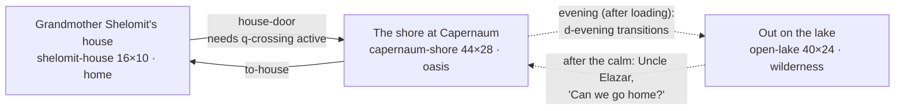

# Chapter 2: "A Storm on Galilee"

**Passage:** Mark 4:35–41 (parallels: Matthew 8:23–27; Luke 8:22–25). **Play time:** 20–30 minutes. **Status:** playable end to end on every major branch; every educational record is an AI-assisted draft awaiting human review ([content-governance.md](../content-governance.md)).

This document describes the chapter **as built**, from [`src/content/chapters/storm-on-galilee/`](../../src/content/chapters/storm-on-galilee/). The research behind it is in [research/storm-on-galilee-sources.md](../research/storm-on-galilee-sources.md). Chapter 1's [game-design.md](../game-design.md) explains the engine features used here.

## 1. The idea

Mark 4:36 says, in passing, that *other boats were with him*. The player is a young member (ungendered, named by their nickname) of a fictional fishing family in Capernaum whose boat is one of those other boats. It is their first night as crew.

They share the storm and the calm, but they never see or hear what happens in the teacher's boat: it is only ever a shape ahead in the dark. Nobody in the story retells it either. When the family is home, the Scripture Connection shows what Mark wrote. The player's choices change only the player's own story — who crossed in their boat, who they helped and how, what the family lost — never the storm, the calm or anything in the text.

**Guardrails, enforced by `tests/content/storm-on-galilee.test.ts`:**

- Jesus is never a character, never visible and never voiced; no entity mentioning the teacher has a character. His words in Mark 4 appear in no dialogue, and no dialogue describes what happened aboard his boat (sleeping, the cushion, the rebuke).
- Lines that retell Scripture (Grandmother on Mark 4:1–2, Dinah on the sower, the evening narration of Mark 4:35–36) are `paraphrase` lines linked to paraphrase records, and the dialogue box labels them.
- Nothing ties the calm, safety or loss to faith: no text says the wind stopped because of the player, and no scores exist.
- Interpretations that differ between traditions are labelled, with sensitivity notes (the nature of the miracle is `high`).

## 2. The seven acts

| Act | Where | What happens | Puzzle / choice |
|---|---|---|---|
| **1. The errand** | Grandmother Shelomit's house | Grandmother explains the crossing: six of Nikanor's jars to the far shore; the fee pays much of what the family owes. Ask Old Hanina about the sky before loading. She gives a lamp, bread, a cloak and a water skin. | — |
| **2. The fishing quarter** | The shore at Capernaum (afternoon, westerly wind) | Gear from Uncle Elazar, jars from Nikanor, Tamar's rule for a squall, Hanina's warning, signs along the shore, the crowd listening to the teacher offshore, Shifra's family planning to follow in a borrowed boat. Optional: measure Nikanor's brine. | `p-brine` (optional), `p-sky` |
| **3. Loading, and evening** | The jetty | Load the boat within ten loads. Evening: the crowd breaks up, the teacher's disciples take him across, other boats follow. Shifra asks if Ami can cross in your boat. | `p-load` → `choice-load`; `choice-ami` |
| **4. The crossing** | Out on the lake (night) | Calm, then a cold wind off the eastern hills: shorten sail in the right order. The storm breaks; the teacher's boat vanishes in the spray. The little boat off the port side is swamping. | `p-sail`; `choice-storm` |
| **5. The calm and home** | The lake; the shore at night | The wind stops all at once. See to the others (the cloak), then turn for home. Grandmother waits on the jetty with a lamp; Nikanor, Shifra's family and the crew respond to what you did. | `choice-cloak` |
| **6. Scripture Connection** | Full-screen panel | Mark's passage (placeholder text plus a labelled paraphrase), the parallels, the world of the story, echoes of older Scripture, and how Christians have read it, with comparisons that respond to your choices. | — |
| **7. Reflection and summary** | Full-screen panels | Private reflection, then the summary. Nothing is graded. | — |

## 3. Places

The shore is one map used twice: in the afternoon, and at night when you come home. Day-only people (Hanina, the crowd) leave; night-only things appear (Grandmother with her lamp, Nikanor waiting, and the consequences below).

| Place | Weather | What you see |
|---|---|---|
| Grandmother's house | (indoors) | A small plastered room: nets hung on poles, an oven, jars and baskets of dried fish, sleeping mats. Grandmother sits mending a net. |
| The shore at Capernaum | `wind` (the afternoon westerly), `clear` from evening | Three houses along a paved lane; a net-drying yard; fish-drying racks; Nikanor's salting place (jars, salt sacks, brine tubs); a pebbly beach with boats drawn up; reeds at the west end; a stone jetty running out into the shallows and deep water, with the family boat moored beside it and Old Hanina sitting at its end; the crowd on the beach facing a boat offshore. |
| Out on the lake | `clear` → `wind` → `storm` → `clear` | The family boat (a hull around walkable deck, the mast just forward of the middle, a raised stern platform), the crew at the oars and the steering oar, the cargo you loaded on deck, the little rowing boat off the port side, the teacher's boat ahead to the east, other boats around. |

## 4. People

All fictional (`fictional: true, biblicalFigure: false`). Names are ordinary names of the period.

| Character | Role | Function |
|---|---|---|
| Grandmother Shelomit | Net-mender | Sends you out; insists you ask Hanina first; waits on the jetty with a lamp. |
| Uncle Elazar | Master of the family boat | Gives the gear; needs the fee; turns for home after the storm. |
| Tamar | Cousin, rower | Teaches the order for a squall (the clue for `p-sail`). |
| Yoezer | Hired man (compare Mark 1:20) | Rows; "I listen to old Hanina." |
| Old Hanina | Retired fisherman | The reliable witness: the worst winds come off the eastern heights, at night too. |
| Nikanor | Salt-fish trader from Magdala | Gives the jars; confidently claims the lake is never rough at night (unreliable: he hardly ever crosses); the optional brine side quest. |
| Shifra, Ami, Oded | A potter's family from the hills | Came to hear the teacher; follow him across in a borrowed rowing boat that leaks. |
| Dinah | A farmer's wife in the crowd | Mentions the parable of the sower (labelled paraphrase). |
| Three listeners | The crowd | Non-speaking. |

## 5. Loading the boat (`p-load`, packing)

Capacity **10** loads. On offer (16): six jars of salted fish (1 each), bailer 1, rope 1, spare oar 2, trammel net 2, lamp 1, bread 1, cloak 1, water skin 1.

| Rule | Detail |
|---|---|
| Bailer | Must go. |
| Within capacity | ≤ 10. |
| Enough jars | At least 4 jars — or at least 2 if you finished Nikanor's brine (he agrees the rest can go with the Magdala boats). |

Classified into `choice-load`: **all-jars** (6) · **jars-and-gear** (≥4 and rope or oar) · **jars-and-net** (≥4 and net) · **light**. What you load decides what you can do in the storm: a rope lets you tow; the spare oar can be thrown; five or more jars means making room costs cargo; a cloak can warm Ami; the lamp lights the dark lake (the chapter's `lightItem`). Hanina laughs at carrying drinking water across a lake of sweet water.

## 6. The other puzzles

| Puzzle | Type | Where | Answer and reasoning |
|---|---|---|---|
| `p-sky` "What Is the Sky Saying?" | deduction | End of the jetty, after Hanina's warning | **A strong wind could rush down after dark**, backed by 2 reliable clues: Hanina's warning, the cold breath off the eastern hills, the Magdala crew hauling their boat up; the clear western sky rules out rain. Nikanor's claim is unreliable and spoils an argument; the afternoon wind is irrelevant evidence. The explanation admits no one can say exactly when or how strong. |
| `p-sail` "Shorten Sail!" | sequence | On the lake, when the gust hits | Brails → yard → oars and bow to the waves → bail (Tamar's order; labelled fiction). Conclusion: keep her bow to the waves, keep bailing, stay near the other boats. |
| `p-brine` "Nikanor's Brine" | measuring (optional) | Nikanor's measuring jars | 7 in an 8-jar using a 5-jar. Relaxes the jar rule for loading. |

## 7. Choices and what you see because of them

| Choice | Options | What you see later |
|---|---|---|
| `choice-load` | all-jars · jars-and-gear · jars-and-net · light | Jars, rope, oar, net, bailer on the deck; lamp and rolled cloak on you; jars you left on the shore's rack at night. |
| `choice-ami` (at evening, only if you met Shifra) | room (≤4 jars) · made-room (leave a jar) · no-room | Ami on your deck during the crossing, or in the little boat. |
| `choice-storm` | take-aboard (throws 3 jars overboard if you carry 5+) · tow (needs the rope) · oar (needs the spare oar) · hold-course | Shifra's family on your deck and their empty boat; the towline to their boat (and on the beach at night); Oded with your oar (and your oar in their boat at night); jars bobbing in the water. Impossible options are shown with the reason ("You didn't bring the rope."). |
| `choice-cloak` | given (to Ami, on your deck or passed across) | Ami wrapped in your cloak on the lake and at home; the cloak gone from your back. |
| Side quest `q-brine` | finished · unfinished | Nikanor's words; the summary. |

Main-quest outcomes: **Home, with the jars** (success) or **Home, lighter than you left** (alternate, if jars went overboard). In every branch everyone comes home: the calm comes the same way whatever you chose.

## 8. Weather and time

| Moment | Hour | Weather |
|---|---|---|
| Start (house, shore) | 16 (late afternoon) | shore `wind` |
| Evening, boats put out | 18 | shore `clear`, lake `clear` |
| Under way | 19 | `clear` |
| Gust (after talking to anyone aboard, or walking forward) | 20 | `wind` |
| Storm breaks (after shortening sail) | 21 (+1 if you bring the family aboard) | `storm` |
| The calm | 23 | `clear` |
| Home | 26 (2 a.m.) | shore `clear` |

Weather comes from `weather` + `weatherChanges` on each scene; the world reports it on the canvas as `data-weather` (drawing it is another workstream).

## 9. Scripture Connection and summary

Title: **"What Happened in the Boat Ahead."** Sections: the passage (`rec-mark-4-35-41` + our paraphrase); the same story in Matthew and Luke (+ "only Mark mentions the other boats"); the world of the story (the lake, storms, the Ginosar boat, "the cushion", nets, the fishing economy); echoes of older Scripture (interpretation + Psalm 107:23–30, Psalm 89:9, Jonah 1:4–6); how Christians have read it (who is this; fear and turning to him; the boat as the Church; views on the miracle; in the same storm).

Comparisons respond to what you did (made room, towed or lent an oar, held course, threw cargo overboard — "In Jonah 1:5, frightened sailors did the same thing" — found room for Ami). Reflection prompts: when you were most afraid; how you would answer "Who then is this?"; who you know in a storm now.

## 10. Notes for the 3D realism pass

**New tile kinds** ([`src/domain/world.ts`](../../src/domain/world.ts)) — each names a real thing:

| Kind | Solid | Model |
|---|---|---|
| `shingle` | no | Pebbly beach of dark basalt and pale limestone pebbles. |
| `deck` | no | Deck planking of the boat you're aboard (planks fore and aft, pegs). |
| `jetty` | no | A breakwater / landing stage of large basalt blocks, running out into the water. |
| `lake` | yes | Open lake water (deep blue-green). |
| `shallows` | yes | Shallow water over pebbles, lighter; foam where it meets the shore. |
| `hull` | yes | The rim (gunwale) of the boat you're aboard; its tiles approximate a lens-shaped hull — paint the curve, not the tiles. |
| `mast` | yes | Mast stepped in the keel, a yard across it, the square sail partly brailed up; shrouds to the rail. |
| `boat` | yes | Neighbouring `boat` tiles form ONE boat shaped to its footprint (long axis = length). Afloat: oars out, steering oar, mast and sail if ≥ 4 tiles long. Drawn up on the beach: mast lowered along the boat, sail rolled on the yard, a heap of net. |
| `nets` | yes | Nets hung between two poles to dry: cork floats on the head rope, stone sinkers on the foot. |
| `rack` | yes | A wooden drying rack of split fish on two trestles. |

**Boats:** model loosely on the Ginosar boat: ~8.2 m × 2.3 m, planked, round-bottomed, one mast, four oars and a helmsman, a raised stern deck where the helmsman stood. The player's family boat on `open-lake` is drawn larger than life (26 × 8 tiles) so four crew and cargo fit on a walkable deck.

**Buildings:** Capernaum's houses were **dark local basalt** fieldstone without mortar, roofed with beams, branches and mud. The painted placeholder uses the `oasis` mood (green, golden, lively — right for the fertile lake shore), whose building material is mudbrick; please model basalt. The lake uses the `wilderness` mood (its wind-blown motes read as spray; its occasional hawk shadow is harmless at night).

**New prop sprites** ([`src/game/art/props.ts`](../../src/game/art/props.ts)): `fish-jars`, `bailer`, `rope`, `oar`, `net-pile`, `floating-jars`, `towline`, `fish-basket`. Reused: `vessels`, `lamp`, `none`.

**New carries** ([`src/domain/characters.ts`](../../src/domain/characters.ts)): `net` (a folded net over the shoulder, drawn over the tunic from every side) and `oar` (held upright, blade up). Used by Grandmother Shelomit and Tamar (net), Uncle Elazar and Oded (oar).

**Look marks used:** `wrapped-in-cloak` (Ami), and on the player `lamp`, `cloak-roll`, `water-skin`.

## 11. Where this is verified

- **Content rules** ([`tests/content/storm-on-galilee.test.ts`](../../tests/content/storm-on-galilee.test.ts)): integrity, reachability, all four puzzle types, an optional side quest, Scripture as references with labelled paraphrase, no Jesus character or voice, no retelling of his boat in the story, no scoring or faith-reward language, nothing self-approved, every source retrieved and used, a real decision with visible constraints, story-driven weather, and that the painter knows every tile kind.
- **Headless playthroughs** ([`tests/integration/storm-on-galilee-playthrough.test.ts`](../../tests/integration/storm-on-galilee-playthrough.test.ts)): four complete branches (tow with Ami aboard and the side quest; full cargo, leave a jar for Ami, jettison to take the family aboard; never met Shifra, hold course with nothing to share; light load after the side quest, the oar, the cloak passed across), plus loading gates, packing and sky rules, and an unfinished side quest.
- **Browser end to end** ([`e2e/storm-on-galilee.spec.ts`](../../e2e/storm-on-galilee.spec.ts)): new profile → Chapter 2 → opening → sky → loading → the lake as `data-weather` goes `clear` → `wind` → `storm` → `clear` → decision → home → Scripture Connection → reflection → summary.

## 12. Known gaps

- **Weather isn't drawn yet** (another workstream); the storm is carried by narration, ambience and `data-weather`.
- **One map for day and night** on the shore: the teacher's boat and other painted boats stay where they are at night; only the hotspot labelling the teacher's boat is removed.
- **The summary's banner art** is the game's shared journey picture (Jerusalem-like hills), not a lake.
- **Mood:** no dedicated lakeside mood (see §10); adding one would touch `direction.ts`, the HUD emblem and tests owned by others.
- **The season** isn't stated. Afternoon westerlies are a summer pattern and the fiercest easterlies are Oct–May; the game says only that winds off the eastern heights "can come at night".
- **Scripture text:** the WEB text of Mark 4 is not in the translation registry, so the panel shows the placeholder even if WEB display is later enabled for Luke 10. Adding it is a human editorial decision.
