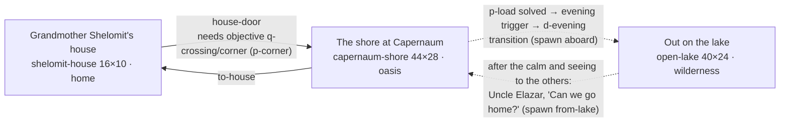

# Chapter 2: *A Storm on Galilee*

**Passage:** Mark 4:35–41 (parallels: Matthew 8:23–27; Luke 8:22–25). **Play time:** about 23 minutes on the main quest alone and 39 for a curious first run, at a steady reading pace (see [§11](#11-how-long-it-plays)). **Status:** playable end to end; approval status in [§12](#12-content-and-approval-status).
**Content:** [`src/content/chapters/storm-on-galilee/`](../../src/content/chapters/storm-on-galilee/) is the source of truth; this document describes the chapter as built. Engine-wide design (controls, puzzle types, the ending contract, the play-time model): [game-design.md](../game-design.md).

Chapter id `storm-on-galilee`, number 2, subtitle *A night on the lake, in one of the other boats*, `contentVersion` `1.0.0-draft`, `estimatedMinutes` 20–30. Setting (as the chapter states it): Capernaum and the Sea of Galilee, early first century AD, during the years of Jesus' public ministry (dates approximate).

## 1. The idea and the passage

Mark 4:36 says, in passing, that *other boats were with him*. The player is a young member (ungendered, named by their nickname) of a fictional fishing family in Capernaum whose boat is one of those other boats. It is their first night as crew.

They share the storm and the calm, but never see or hear what happens in the teacher's boat: it is only ever a shape ahead in the dark. Nobody in the story retells it either; asked about it at home, the player can only say the boat was still out there when the wind dropped. When the family is home, the Scripture Connection shows what Mark wrote. The player's choices change only the player's own story (who crossed in their boat, who they helped and how, what the family lost), never the storm, the calm or anything in the text. In every branch everyone comes home.

**Passages the content uses** (scripture records, references only): Mark 4:35–41, Matthew 8:23–27, Luke 8:22–25, Mark 4:1–9, Mark 5:1, Mark 1:16–21, Luke 5:1–11, Matthew 4:13 and 4:18, Mark 2:1–4, Psalm 107:23–30, Psalm 89:9, Jonah 1:4–6, Matthew 13:47–48, Leviticus 11:9–12. Labelled paraphrases (our words) retell Mark 4:1–2 (`rec-para-shore`, Grandmother in the opening), Mark 4:3–8 (`rec-para-dinah`, Dinah on the sower), Mark 4:35–36 (`rec-para-evening`, the evening narration) and Mark 4:35–41 (`rec-para-mark-4`, in the Scripture Connection).

**Guardrails, enforced by [`tests/content/storm-on-galilee.test.ts`](../../tests/content/storm-on-galilee.test.ts):**

- Jesus is never a character, never visible and never voiced: no character or speaker is named Jesus or the teacher, and no entity labelled with the teacher has a character. His words in Mark 4:35–41 appear in no dialogue, and no dialogue describes what happened aboard his boat (asleep, the cushion, the rebuke).
- Scripture records hold references only (no body). The lines that retell Scripture (`d-opening/n3`, `d-dinah/d2`, `d-evening/ev1`) are `paraphrase` lines linked to paraphrase records, and any line naming Jesus is a paraphrase or a how-to-play instruction, never fiction.
- No faith, holiness or salvation scoring language, and nothing ties the calm, safety or loss to faith or worth (no text says the wind stopped because of the player).
- Every character is fictional (`fictional: true, biblicalFigure: false`) and has a fiction record; every interpretation record carries a sensitivity note, and the views on the miracle (`rec-interp-miracle-views`) are marked `high`.
- The storm decision offers at least four options, none worded as a morality button, and exactly two are shown greyed out with their reason when you lack the gear.

## 2. Acts

| Act | Where | What happens | Puzzle / choice |
|---|---|---|---|
| **1. The errand** | `shelomit-house` | Grandmother explains the crossing: six of Nikanor's jars to the far shore; the fee covers most of what the family owes this season. Ask Old Hanina about the sky before anything goes into the boat. She gives a lamp, bread, your cloak and a water skin, then has you tie the last knots of the family's mark in her net. The door stays shut until you do. | `p-corner` |
| **2. The fishing quarter** | `capernaum-shore` (afternoon, westerly wind) | Gear from Uncle Elazar, jars from Nikanor, Tamar's rule for a squall, Hanina's warning, signs along the shore, Hodaya's Magdala crew hauling their boat up high, the crowd listening to the teacher offshore, Shifra's family planning to follow in a borrowed boat that leaks. Optional: mend Nikanor's torn jar net; help Hodaya haul (she gives you an old bailer, which you can give to Oded); seal the seam of Oded's boat with pitch and tow from Nikanor. | `p-brine` (optional), `p-patch` (optional), `p-sky` |
| **3. Loading, and evening** | The jetty | Load the boat within ten loads and trim her level. Evening: the teacher's disciples leave the crowd and take him across, and other boats go with them (labelled paraphrase). If you talked to Shifra, she asks whether Ami can cross in your boat. | `p-load` → `choice-load`; `choice-ami` |
| **4. The crossing** | `open-lake` (night) | Calm: you can hang your lamp at the stern for the boats behind. Then a cold wind off the eastern hills: shorten sail in the right order. The storm breaks; the little boat off the port side is in trouble (less so if you readied it on the shore). | `p-sail`; `choice-storm` |
| **5. The calm and home** | `open-lake`; `capernaum-shore` at night | The wind stops all at once. See to the others at the port rail (pass your cloak to Ami) before Uncle Elazar turns for home; set the trammel net on the still water if you brought it. Grandmother waits on the jetty with a lamp and sends you to tell Nikanor about his jars first; Shifra's family, Hodaya, Hanina and the crew respond to what you did. | `choice-cloak`, `choice-net` |
| **6. Scripture Connection** | Full-screen panel | *What Happened in the Boat Ahead*: the passage, the parallels, the world of the story, echoes of older Scripture and how Christians have read it, with comparisons that respond to your choices. | — |
| **7. Reflection and summary** | Full-screen panels | Private reflection, then the summary. Nothing is graded. | — |

## 3. Places

The lake has no exits: you reach it and leave it only through dialogue transitions. The shore is one map used twice: in the afternoon, and at night (flag `returned`) when you come home. Afternoon-only things (shown until the `evening` flag) are gone by then: Nikanor at his tubs, the crowd and Dinah, the Magdala boat, the teacher's boat hotspot, the nets waiting on the beach, the torn jar net, and the sky puzzle's hotspot. Old Hanina sits at the end of the jetty both times. Night-only things appear (Grandmother with her lamp, Nikanor waiting, and the consequences in [§7](#7-choices-and-consequences)). Shifra's family stays on the shore; at night Ami sits.

| Place | Size (tiles) | Kind · mood · ambience · music | Weather | What you see |
|---|---|---|---|---|
| `shelomit-house` | 16 × 10 | indoor · `home` · `indoor` · `home` | (indoors) | A small fisher-family room: nets hung on poles, an oven, sacks, jars and baskets of dried fish, a table, sleeping mats. Grandmother sits mending a net (`mending`, which opens `p-corner`). |
| `capernaum-shore` | 44 × 28 | outdoor · `oasis` · `oasis` · `home` | `wind` (the afternoon westerly), `clear` once the `evening` flag is set | Houses along a lane, a net-drying yard, fish-drying racks, Nikanor's salting place (jars, salt sacks, tubs), a pebbly beach with boats drawn up, reeds, and a stone jetty running out into the lake with the family boat moored beside it and Old Hanina sitting at its end; the crowd on the beach facing a boat offshore. |
| `open-lake` | 40 × 24 | outdoor · `wilderness` · `wind` · `tension` | `clear` → `wind` (flag `wind-rising`) → `storm` (flag `storm-broke`) → `clear` (flag `great-calm`) | The family boat as a larger-than-life hull (about 26 × 8 tiles) around a walkable deck with the mast just forward of the middle; the crew at the oars and the steering oar; the cargo you loaded; the little rowing boat off the port side; the teacher's boat ahead to the east; other boats around. |

**Gating:** the house door needs `p-corner`. On the shore, the sky puzzle (`lake-view`) opens only after Hanina's warning (`clue-hanina-east`); the boat (`d-boat`) won't open `p-load` until the sky is read and you have the gear and the jars; the torn jar net opens `p-brine` only at stage `q-brine/measure`. On the lake, the gust comes after any conversation aboard or a walk forward (trigger area near the bow); the storm breaks when `p-sail` is solved; the calm comes when `choice-storm` is made; Uncle Elazar will turn for home only after `saw-to-others`.

**Tile kinds the chapter added** ([`src/domain/world.ts`](../../src/domain/world.ts)), each naming a real thing: `shingle`, `deck`, `jetty` (walkable); `lake`, `shallows`, `hull`, `mast`, `boat`, `nets`, `rack` (solid). The content test checks that every tile kind is one the painter knows, and that no person or spawn stands on water.

## 4. People

All 14 characters are fictional (`fictional: true, biblicalFigure: false`); names are ordinary names of the period. Jesus does not appear, and nobody in the teacher's boat is shown or heard.

| Id | Character | Role | Function |
|---|---|---|---|
| `shelomit` | Grandmother Shelomit | Your grandmother, a net-mender | Sends you out; insists you ask Hanina first; `p-corner`; waits on the jetty with a lamp and opens the Scripture Connection. |
| `elazar` | Uncle Elazar | Master of the family boat | Gives the gear; explains how to seal a seam (`clue-elazar-seam`); steers; turns for home after the storm and offers to set the net. |
| `tamar` | Tamar | Your cousin, a rower | Teaches the order for a squall (`clue-tamar-sail`, the clue for `p-sail`). |
| `yoezer` | Yoezer | A hired man on the family boat | Rows; listens to old Hanina about the weather. |
| `hanina` | Old Hanina | A fisherman who has read the lake for sixty years | The reliable witness (`clue-hanina-east`): the worst winds come off the eastern heights, and can come at night. Laughs at carrying drinking water across a lake of sweet water. Always seated, day and night. |
| `hodaya` | Hodaya | A young fisher from a Magdala crew | Her crew hauls their boat high and stays ashore (`clue-magdala-crew`). Help haul, and she gives you their old bailer. At night she tells how the lamps on the water went out one by one, and then the wind stopped. |
| `nikanor` | Nikanor | A salt-fish trader from Magdala | Gives the jars; claims the lake is never rough at night at this time of year (unreliable: he hardly ever crosses at night, and wants his jars across); the optional jar-net side quest; gives pitch and tow for Oded's boat; waits up at night for news of his jars. |
| `shifra` | Shifra | A potter's wife from the hills | Came to hear the teacher; follows him across in a borrowed rowing boat; asks if Ami can cross with you. |
| `ami` | Ami | Shifra's son | The child in the little boat (or in yours); can be wrapped in your cloak. |
| `oded` | Oded | Shifra's brother, a potter | Borrowed the leaking boat; *Oded's Leaking Boat* (`q-leak`) seals it with him. |
| `dinah` | Dinah | A farmer's wife, in the crowd | Mentions the parable of the sower (labelled paraphrase). |
| `listener-a`, `listener-b`, `listener-c` | A listener | Someone in the crowd | Non-speaking, seated. |

Carried gear (`appearance.carry`): a net over the shoulder for Shelomit, Tamar and Hodaya; an oar for Elazar and Oded; a jar for Yoezer; a basket for Nikanor, Shifra and Dinah; a staff for Hanina and `listener-c`.

## 5. Quests and stages

### `q-crossing` The Crossing (main)

Started by Grandmother in `d-opening`. Journal: `je-mission` on start, `je-home` on completion.

| Stage | Objectives (optional in italics) |
|---|---|
| `prepare` Ready the Boat | `corner` help Grandmother tie the last knots (`p-corner`); *`look-around` find 3 of the six sky clues*; `read-sky` solve `p-sky`; *`sail-lesson` ask Tamar (`clue-tamar-sail`)*; `jars` (flag `got-jars`); `gear` (flag `got-gear`); `load` solve `p-load` |
| `cast-off` Cast Off | `board` visit `open-lake` |
| `crossing` Out on the Lake | `shorten` solve `p-sail`; `decide` make `choice-storm` |
| `after` After the Storm | `others` (flag `saw-to-others`); `return` (flag `returned`) |
| `home` Home Before Dawn | `nikanor` (flag `told-nikanor`); `hear` (flag `seen:scripture-connection`) |

Outcomes: `cargo-lost` **Home, lighter than you left** (alternate, when `jettisoned`); otherwise `cargo-safe` **Home, with the jars** (success).

### `q-brine` Nikanor's Jar Net (side, optional)

Started by offering to help Nikanor. Stages `measure` (solve `p-brine`) → `tell` (show Nikanor: flag `brine-done`). Fails if you reach `open-lake` first. Outcomes: `finished` (Nikanor's trust +2, flag `nikanor-agreed`, which relaxes the jar rule in `p-load`; unlocks `jh-salting`) or `unfinished` (*Left for the morning*). Journal `je-brine`. The ids keep the word "brine" from when this was a brine-measuring puzzle, because saves and story flags name them.

### `q-leak` Oded's Leaking Boat (side, optional)

Started by Oded. Stages `ask` (Uncle Elazar's method: `clue-elazar-seam`) → `pitch` (pitch and tow from Nikanor, or already patched) → `patch` (solve `p-patch`). Fails if you reach `open-lake` first. Outcomes: `patched` (trust +1 with Oded and Shifra) or `unpatched` (*Still leaking*). Journal `je-leak`.

### Items

What you own when `p-load` opens is piled on the jetty (anything with weight). Capacity is 10 loads.

| Id | Name | Weight | How you get it | Why it exists |
|---|---|---|---|---|
| `fish-jar` | Jar of salted fish | 1 (up to 6) | Nikanor gives six (`got-jars`) | The fee; the jar rule in `p-load`; jars left ashore or thrown overboard. |
| `bailer` | Bailing scoop | 1 | Uncle Elazar's gear | Must go aboard. |
| `rope` | Coil of rope | 1 | Uncle Elazar's gear | Lets you tow the little boat. |
| `spare-oar` | Spare oar | 2 | Uncle Elazar's gear | Can be thrown to Oded. |
| `net` | Trammel net | 2 | Uncle Elazar's gear | `choice-net` on the way home. |
| `lamp` | Clay lamp | 1 | Grandmother | The chapter's `lightItem`; hang it at the stern (`lamp-hung`). |
| `bread` | Bread and dried fish | 1 | Grandmother | Ordinary provision; competes for room. |
| `cloak` | Your cloak | 1 | Grandmother | Can warm Ami (`choice-cloak`). |
| `water-skin` | Water skin | 1 | Grandmother | Hanina's joke about sweet water: room better spent. |
| `spare-bailer` | The Magdala crew's old bailer | 1 | Hodaya, after you help haul | Give it to Oded (flag `oded-bailer`); if you keep it, it is on the jetty too. |
| `pitch` | Pitch and tow | 0 | Nikanor, during `q-leak` | Used up by `p-patch`; never on the jetty (no weight). |

Everything Grandmother and Uncle Elazar give, plus the jars, weighs 16, so something always stays ashore. Once loaded, you visibly carry the lamp, the rolled cloak and the water skin if you took them (`playerLooks`).

## 6. Puzzles

| Puzzle | Type | Where | Solution |
|---|---|---|---|
| `p-corner` Grandmother's Corner | `netting` | `shelomit-house`, in the opening (the door waits for it) | Tie column 3 all the way down, column 4 in rows 2, 4, 5, column 2 in rows 4, 5. |
| `p-brine` Nikanor's Jar Net (optional) | `netting` | Nikanor's torn jar net by the salting tubs (stage `q-brine/measure`) | Row 1 at columns 3–5; row 2 at columns 2, 4, 5; rows 3–4 at columns 2–5; row 5 at columns 3–5. |
| `p-patch` Seal the Seam (optional) | `sequence` | Oded's boat, once you have pitch and tow | Rag out → dry → tow → pitch → set; then *it should keep most of the water out, but still bail*. |
| `p-sky` What Is the Sky Saying? | `deduction` | End of the jetty, after Hanina's warning | *A strong wind could rush down after dark*, backed by 2 reliable clues. |
| `p-load` Load the Boat | `trim` | The family boat at the jetty | Any load of 10 or less with the bailer and enough jars, every place within its room, bow/stern and port/starboard each within 1. |
| `p-sail` Shorten Sail! | `sequence` | On the lake, when the gust hits | Brails → yard → oars → bail; then *keep her bow to the waves, keep bailing, stay near the other boats*. |

Trim and netting are Chapter 2's own puzzle types: no other chapter uses them. Every puzzle has three tiers of hints and an explanation (content test). The main quest alone solves four (`p-corner`, `p-sky`, `p-load`, `p-sail`); a curious run solves all six.

### `p-load` (trim)

Choose what goes aboard **and where it goes**, so the boat sits level ([`src/domain/puzzle-trim.ts`](../../src/domain/puzzle-trim.ts)). Capacity **10** loads besides the crew. Four places, each with its own room: **bow** 4, **port side** 3, **starboard side** 3, **stern** 2. The crew sit already and count toward the balance, not the cargo: you in the bow (2), Yoezer to port (3), Tamar to starboard (2), Uncle Elazar steering in the stern (3). Pick something up (from the jetty or a place), then choose where it goes; each place shows its cargo and total, and each pair says in words whether she sits level.

| Rule | Detail |
|---|---|
| `bailer` | The bailer must go. |
| `capacity` | Cargo ≤ 10. |
| `jars` | At least 4 jars, or at least 2 if Nikanor agreed (`nikanor-agreed`, from finishing `q-brine`). |
| Room | No place holds more cargo than its room. |
| `fore-aft` | Bow and stern totals (crew included) within 1. The bow needs more cargo than the stern. |
| `side-to-side` | Port and starboard totals within 1. Starboard needs a little more cargo than port. |

The tier-3 hint gives a worked example (four jars in the bow; bailer and lamp in the stern; the spare oar to port; rope and cloak to starboard: bow 6, stern 5, port 5, starboard 4); a content test checks it loads a level boat. Solving it keeps what is aboard (the rest goes back up to the rack), sets `loaded`, and records `choice-load` by the first matching classification: **all-jars** (6 jars) · **jars-and-gear** (≥ 4 jars and rope or spare oar) · **jars-and-net** (≥ 4 jars and the net) · **light** (anything else). Record: `rec-hist-galilee-boat`.

### `p-sky` (deduction)

*What might the lake do tonight?* Options: a calm night · **a strong wind could rush down after dark** · days of rain from the sea. Two reliable pieces of evidence required.

| Evidence | Reliable | Bears on |
|---|---|---|
| `clue-hanina-east` | yes | supports squall |
| `clue-cold-breath` | yes | supports squall, against calm |
| `clue-magdala-crew` | yes | supports squall, against calm |
| `clue-clear-west` | yes | against rain |
| `clue-nikanor-calm` | **no** | supports calm |

The explanation admits no one can say exactly when or how strong a wind will come. Sets `sky-read`. Record: `rec-hist-storms`.

### `p-sail` (sequence)

Initial order oars, bail, brails, yard; correct order brails → yard → oars → bail, each card backed by `clue-tamar-sail`. Conclusion: raising the sail to run for home and throwing everything overboard at once are wrong; holding the bow to the waves, bailing and staying near the other boats is right. Tamar's order is labelled the game's fiction. Sets `sail-in`; the `squall` trigger then breaks the storm. Record: `rec-recon-boat-handling`.

### `p-corner` and `p-brine` (netting)

A nonogram on a net: the numbers by each row and column are its runs of knots, in order; tie the torn cells so every line matches. Space ties a knot, again leaves it open, again clears it; arrows move. Content tests check each has exactly one mending, the one its full hint describes.

- `p-corner`: 5 × 5, the family's mark (a little boat under sail), loose in columns 2–4. The middle column and row 4 are both 5, so a first-timer learns how the numbers read. Sets `mended-with-grandmother`. Record: `rec-hist-nets`.
- `p-brine`: 7 wide × 5 high, Nikanor's fish mark, torn through columns 2–5. Sets `brine-measured`. Record: `rec-hist-salting`.

### `p-patch` (sequence)

Initial order pitch, set, rag, tow, dry; correct order rag → dry → tow → pitch → set, each backed by `clue-elazar-seam`. Conclusion: *it should keep most of the water out, but they should still bail and stay close to the other boats* (not "for good", not "useless"). The method is labelled simplified. Sets `boat-patched` and uses up the pitch. No record.

### Clues

| Id | Source | Kind | Reliability | Used by |
|---|---|---|---|---|
| `clue-hanina-east` | Old Hanina | witness | reliable | `p-sky`; gates the sky puzzle |
| `clue-cold-breath` | The far shore (examine) | environmental | reliable | `p-sky` |
| `clue-magdala-crew` | The Magdala boat (examine) or Hodaya | witness | reliable | `p-sky` |
| `clue-clear-west` | The western hills (examine) | environmental | reliable | `p-sky` |
| `clue-afternoon-wind` | The water's edge (examine) | environmental | reliable | Counts toward `look-around`; not evidence in `p-sky` |
| `clue-nikanor-calm` | Nikanor | witness | unreliable (he hardly ever crosses at night, and wants his jars across) | `p-sky` (spoils an argument) |
| `clue-tamar-sail` | Tamar (shore or lake) | witness | reliable | `p-sail`; objective `sail-lesson` |
| `clue-elazar-seam` | Uncle Elazar | witness | reliable | `p-patch`; stage `q-leak/ask` |

The first six are `SKY_CLUES`; the optional `look-around` objective completes at three of them.

## 7. Choices and consequences

| Choice | Options | What you see later |
|---|---|---|
| `choice-load` (from `p-load`) | `all-jars` · `jars-and-gear` · `jars-and-net` · `light` | Jars, rope, oar, net and bailer on the deck; lamp and rolled cloak on you; jars you left ashore on the rack at night (`jars-ashore`, flag `left-jars`). |
| `choice-ami` (evening, only if you talked to Shifra) | `room` (fewer than 5 jars aboard) · `made-room` (5 or more: leave a jar on the jetty) · `no-room` | Ami on your deck during the crossing, or in the little boat. |
| `choice-storm` | `take-aboard` (with 5 or more jars, three go overboard: `jettisoned`) · `tow` (needs the rope) · `oar` (needs the spare oar; you lose it) · `hold-course` | Shifra's family on your deck and their empty boat drifting; the towline to their boat (and on the beach at night); Oded with your oar (and your oar in their boat at night); jars bobbing in the water. Impossible options are shown with the reason ("You didn't bring the rope."). Taking them aboard costs an hour. |
| `choice-cloak` | `given` (to Ami, on your deck or passed across the rail; needs the cloak) | Ami wrapped in your cloak on the lake and at home (look mark `wrapped-in-cloak`); the cloak gone from your back. |
| `choice-net` (only if the net is aboard) | `set` · `home` | A catch in the bottom of the boat; home an hour later (hour 27); Nikanor buys the catch, and Uncle Elazar calls it a start. |

Other consequences you see:

| Cause | What changes |
|---|---|
| `q-brine` finished / unfinished | Nikanor's words; fewer jars needed; the summary. |
| `q-leak` sealed / still leaking | If you held course, the little boat is found "low in the water but still afloat" (sealed seam or Hodaya's bailer: `boat-patched` or `oded-bailer`) rather than "swamped to the rails"; Oded and Shifra say so at night. |
| Hodaya's old bailer given to Oded | Shifra bails with it in the storm; Hodaya and the summary mention it. |
| The lamp at the stern (`lamp-hung`) | If you held your own course, the little boat kept your lamp in sight (`followed-lamp`). |

The Scripture Connection's comparisons and the summary's consequences respond to these (see [§9](#9-scripture-connection-and-summary)). The calm comes the same way whatever you chose, and the summary always ends "Everyone who went out with your boat came home."

## 8. Time, weather and light

The chapter's `timeCounter` is `hour`, starting at 16.

| Moment | Hour | Set by | Weather |
|---|---|---|---|
| Start (house, shore) | 16 | `initial.counters` | shore `wind` |
| Evening, the boats put out | 18 | shore trigger `evening` (when `p-load` is solved) | shore `clear`; lake `clear` |
| Under way | 19 | `d-under-way` | `clear` |
| Gust (after any conversation aboard, or a walk forward) | 20 | triggers `gust` / `gust-forward` (+1) | `wind` |
| Storm breaks (after `p-sail`) | 21 | trigger `squall` (+1) | `storm` |
| Taking the family aboard | +1 | `d-small-boat` | `storm` |
| The calm | 23 | `d-calm` | `clear` |
| Home | 26 (2 a.m.), or 27 if you set the net | `d-elazar-lake` | shore `clear` |

Weather comes from `weather` + `weatherChanges` on each scene; the world reports it on the canvas as `data-weather`, and the engine draws the wind, waves, rain and lightning over the art. The other boats' sails are set until the storm breaks and are taken in from then on (content test).

**Which light the art shows** ([`src/game/prerendered/select.ts`](../../src/game/prerendered/select.ts)): a place's `night` set from 18:00 to before 05:00, its `late` set from 15:00. So the house and the shore show their `late` (afternoon) set at the start; the shore changes to its moonlit `night` set as the clock reaches 18:00, as the boats put out; the lake has only a `night` set; the house at night (if you walk back up after the homecoming) shows its lamplit set.

## 9. Scripture Connection and summary

**Title:** *What Happened in the Boat Ahead.* The intro says plainly that the crossing was a made-up story and the passage is Scripture.

| Section | Records |
|---|---|
| The passage | `rec-mark-4-35-41`, `rec-para-mark-4` |
| The same story in Matthew and Luke | `rec-matt-8-23-27`, `rec-luke-8-22-25`, `rec-hist-other-boats` (only Mark mentions the other boats) |
| The world of the story | `rec-hist-lake`, `rec-hist-storms`, `rec-hist-galilee-boat`, `rec-hist-cushion`, `rec-hist-nets`, `rec-hist-fishing-economy` |
| Echoes of older Scripture | `rec-interp-echoes`, `rec-psalm-107-23-30`, `rec-psalm-89-9`, `rec-jonah-1-4-6` |
| How Christians have read it | `rec-interp-who-is-this`, `rec-interp-fear-faith`, `rec-interp-boat-church`, `rec-interp-miracle-views` (sensitivity `high`), `rec-interp-same-storm` |

**Comparisons:** two always (being in one of the "other boats"; being prepared doesn't mean nothing goes wrong), plus one each for: taking the family aboard; towing or lending the oar ("in the same storm" without being "in the same boat"); holding course; jettisoning cargo ("In Jonah 1:5, frightened sailors in a great storm did the same thing"); finding room for Ami; readying the little boat (`boat-patched` or `oded-bailer`).

**Reflection prompts:** when during the crossing you were most afraid and what helped; how you would answer "Who then is this?"; who you know who is in a kind of storm now.

**Summary:** a recap that follows what you did (Grandmother's corner, the sky, Hodaya, the seam, the jar net, loading, the sail, the decision, the calm, the net, home, Nikanor), consequences (who rode out the storm where, the seam, the bailer, the lamp, the catch, Ami and the cloak, the jars lost, left ashore or safe, the jar net), all seven themes (`fear-trust`, `neighbor`, `courage`, `stewardship`, `preparation`, `discernment`, `wonder`), and these Scripture references: Mark 4:35–41, Matthew 8:23–27, Luke 8:22–25, Mark 4:1–9, Mark 5:1, Psalm 107:23–30, Psalm 89:9, Jonah 1:4–6, Mark 1:16–21, Luke 5:1–11. History records: `rec-hist-lake`, `rec-hist-storms`, `rec-hist-galilee-boat`, `rec-hist-cushion`, `rec-hist-nets`, `rec-hist-fishing-economy`, `rec-hist-salting`, `rec-hist-capernaum`, `rec-hist-fish`, `rec-hist-other-boats`.

**Scripture text:** the World English Bible is registered in [`src/content/scripture/translations.ts`](../../src/content/scripture/translations.ts) with `approvedForDisplay: true` (approved by Zac Harlan on 2026-09-26), and every one of this chapter's scripture references has a stored WEB passage (Mark 4:35–41, Matthew 8:23–27, Luke 8:22–25, Mark 4:1–9, Mark 5:1, Mark 1:16–21, Luke 5:1–11, Matthew 4:13 and 4:18, Mark 2:1–4, Psalms 107:23–30, Psalms 89:9, Jonah 1:4–6, Matthew 13:47–48, Leviticus 11:9–12). So players see the WEB text beside each reference, not the placeholder. [`tests/unit/infrastructure/scripture.test.ts`](../../tests/unit/infrastructure/scripture.test.ts) checks that every Scripture reference in every chapter has its text. The scripture records themselves still hold references only.

## 10. Art

Every place is pre-rendered by the offline Blender pipeline ([technical-art-guide.md](../art/technical-art-guide.md)) with the lake kit, [`tools/art/lib/kit_lake.py`](../../tools/art/lib/kit_lake.py) (boats in [`lake_boats.py`](../../tools/art/lib/lake_boats.py), houses in [`lake_houses.py`](../../tools/art/lib/lake_houses.py), materials in [`lake_materials.py`](../../tools/art/lib/lake_materials.py)). The lakeside has its own style: Capernaum's houses are black basalt laid dry, not mudbrick, roofed with beams, branches and packed mud, and a Galilee room gets basalt walls and a basalt-cobbled earth floor. Light sets come from `PLACE_LIGHTS` in [`tools/art/lib/lighting.py`](../../tools/art/lib/lighting.py):

| Place | Light sets (`PLACE_LIGHTS`) | What is modelled |
|---|---|---|
| `shelomit-house` | `late`; `night` rendered in `lamplight` (people lit `indoor` by day, `lamp` at night) | A room in cutaway: basalt walls, a mud-plastered back wall with niches, a basalt-cobbled floor, nets on pegs, small fish drying on a cord, oars against the wall, baskets of dried fish, the oven; at night a lamp burns. |
| `capernaum-shore` | `late`, `night` | Basalt fieldstone houses with basalt doorframes and lintels, beam-and-mud roofs with fish drying on them, a lane of basalt flags; drying nets (floats and sinkers), fish-drying racks, the salter's jars, salt and brine tubs; a shingle beach and foam at the waterline; the jetty of dressed basalt blocks with pierced mooring stones; boats drawn up and moored; the boat the crowd faces has a goat-hair awning, so no one aboard is ever seen. At night Grandmother's lamp lights the jetty. |
| `open-lake` | `night` | The family boat larger than life: planked bulwarks, oars through thole pins, the steering oar, the helmsman's raised deck, a stern lamp after dark, the mast with its yard and half-brailed sail; the boats around, with sails set and furled versions (`*-sail`, `*-sail-furled`); the teacher's boat ahead under its awning. |

The storm itself is not baked: the lake is rendered calm, and the engine draws the wind, waves, rain and lightning over it (the live water surface covers `lake` and `shallows`).

**People sheets** (`public/art/people/`), in the `late` and `night` lights: `shelomit` (standing; seated `~sit` in `indoor` and `lamp` for the house), `elazar`, `tamar.storm-on-galilee` (this chapter's Tamar, distinct from Chapter 3's), `yoezer`, `hodaya`, `nikanor`, `shifra` (plus `~sit` at night), `ami` (plus `~sit`, and `@wrapped-in-cloak` standing and seated), `oded` (plus `~sit` at night); seated only: `hanina~sit`, `dinah~sit`, `listener-a~sit`, `listener-b~sit`, `listener-c~sit`.

**Portraits** (`public/art/portraits/`): a neutral portrait for every speaking character (`shelomit`, `elazar`, `tamar`, `yoezer`, `hanina`, `hodaya`, `nikanor`, `shifra`, `ami`, `oded`, `dinah`). Expressions used by this chapter's dialogue (`expression:` on lines), each with its portrait:

| Character | Expressions used |
|---|---|
| `shelomit` | glad, worried, surprised |
| `elazar` | glad, worried, afraid, surprised |
| `tamar` | glad, worried, afraid, surprised |
| `yoezer` | worried, afraid, surprised |
| `hanina` | glad |
| `hodaya` | glad, worried |
| `nikanor` | glad, sad, surprised |
| `shifra` | glad, worried, sad, surprised |
| `oded` | glad |
| `ami` | glad, worried, afraid |

**Teaser:** none (only Chapter 1 has `hasTeaser` in [`src/content/index.ts`](../../src/content/index.ts)).

Art captures of every place at fixed moments: [`e2e/storm-art.spec.ts`](../../e2e/storm-art.spec.ts) (review only, not pass/fail).

## 11. How long it plays

Measured by [`tests/integration/play-time.test.ts`](../../tests/integration/play-time.test.ts), which pins this chapter, using the model in [`tests/support/play-time.ts`](../../tests/support/play-time.ts) (explained at [game-design.md §11](../game-design.md#11-how-long-a-chapter-plays)): a *steady* first-timer reads every line at 230 words a minute; a *brisk* adult reads at 320 and solves puzzles quickly. *Direct* follows only the main quest; *curious* takes up what the shore offers. Reproduce with `PLAY_TIME=1 npx vitest run --project unit tests/integration/play-time.test.ts --silent=false`.

| Run | Puzzles | Steady | Brisk | Pinned by the test |
|---|---|---|---|---|
| Direct | `p-corner`, `p-sky`, `p-load`, `p-sail` | 22.9 min | 14.7 min | steady ≥ 20, brisk ≥ 13, 4 puzzles |
| Curious | all six | 38.9 min | 25.6 min | steady 30–45, brisk ≥ 20, 6 puzzles |

Measured 2026-10-01. Before the chapter was made longer (Grandmother's corner, Hodaya, *Oded's Leaking Boat*, the lamp at the stern, seeing to the others, the net on the still water, telling Nikanor), it measured 19 · 12 minutes direct and 30 · 20 curious.

## 12. Content and approval status

The owner, Zac Harlan, approved the AI-drafted records of all four chapters on 2026-09-26 (`APPROVALS` in [`src/content/shared/approvals.ts`](../../src/content/shared/approvals.ts), applied through `withApprovals` in the chapter's `index.ts`). `coveredBy` means an approval covers only records drafted, and last changed, on or before its date: a record drafted or changed later is not covered and stays in review until a named person approves it. Approval never changes provenance (still `ai-assisted`).

This chapter has 59 records: 54 approved, 5 awaiting review. The five were drafted on 2026-09-30 when the chapter was made longer (`LATER_RECORDS` in `records.ts`, governance `LONGER_CHAPTERS_DRAFTED`):

| Id | Kind | Title |
|---|---|---|
| `rec-p-hodaya` | fiction | Hodaya |
| `rec-e-corner` | fiction | Grandmother's corner |
| `rec-e-leak` | fiction | A leaking boat |
| `rec-e-lamp` | fiction | A lamp at the stern |
| `rec-e-nikanor` | fiction | News for Nikanor |

All five are fiction, so every educational record is approved; the content test pins both facts (later records stay `ai-draft` with no reviewer; everything else is approved by a named reviewer on 2026-09-26). Check with `npm run content:publish-check`. With `VITE_CONTENT_MODE=preview` (the default) unreviewed content is labelled in the game. The chapter's own [`governance.ts`](../../src/content/chapters/storm-on-galilee/governance.ts) only dates and describes its AI-draft preset (2026-09-25); it makes no chapter-specific decisions. Rules: [content-governance.md](../content-governance.md).

Other counts: 29 dialogues (234 nodes), 8 clues, 11 items, 42 journal entries, 38 sources.

## 13. Sources and verification

- **Research:** [research/storm-on-galilee-sources.md](../research/storm-on-galilee-sources.md), the claim-by-claim record behind the historical, geographical and interpretive notes; [`sources.ts`](../../src/content/chapters/storm-on-galilee/sources.ts) lists the 38 retrieved sources. The content test checks every source was retrieved and is cited, and every historical or reconstruction record states its confidence.
- **Content rules** ([`tests/content/storm-on-galilee.test.ts`](../../tests/content/storm-on-galilee.test.ts)): schema and integrity, reachability, loading as Chapter 2, its own trim and netting puzzles with hints, the trim worked example, one mending per net, the seam order, optional side quests with alternate outcomes, the later records kept in review, the guardrails in [§1](#1-the-idea-and-the-passage), story-driven weather and sails, tile kinds the painter knows, fishing folk with their gear, nobody standing on water.
- **Headless playthroughs** ([`tests/integration/storm-on-galilee-playthrough.test.ts`](../../tests/integration/storm-on-galilee-playthrough.test.ts)), complete branches: the jar-net side quest, Ami aboard, a tow and the cloak; full cargo, a jar left for Ami, jars thrown overboard to take the family aboard; never meeting Shifra and holding course with nothing to share; a light load after the side quest, no room for Ami, the spare oar, the cloak passed across; Hodaya's bailer, a sealed seam, the lamp at the stern, holding course, setting the net, and Nikanor, Hanina and Hodaya at night; and the seam left unsealed (the little boat swamped). Plus: loading refused before the sky is read or the gear is in; loads too heavy, without the bailer or with too few jars rejected; the jar net left for the morning; the door shut until Grandmother's knots are tied.
- **Play time** ([`tests/integration/play-time.test.ts`](../../tests/integration/play-time.test.ts)): see [§11](#11-how-long-it-plays).
- **Scripture text** ([`tests/unit/infrastructure/scripture.test.ts`](../../tests/unit/infrastructure/scripture.test.ts)): every reference has its stored text.
- **Browser end to end** ([`e2e/storm-on-galilee.spec.ts`](../../e2e/storm-on-galilee.spec.ts)): new profile → Chapter 2 → the opening (paraphrase labelled) → Grandmother's corner → the shore (`data-weather` `wind`) → Nikanor's jar net → reading the sky → loading and trimming the boat → evening (`clear`) → the lake as the weather goes `wind` → `storm` → the decision → the calm → home → Nikanor → Scripture Connection → reflection → summary.

## 14. Known gaps

- **The storm is drawn over calm art:** the pre-rendered lake is baked calm; the game's weather (wind, rain, lightning, the swell on the live water surface) carries the storm.
- **No dusk set:** from 18:00 the shore and the lake show their moonlit night sets (the game grades the hour as dusk at first), so the boats put out under a moonlit sky just as the sun goes down. `lighting.py` has a `dusk` light, but this chapter's places don't use it.
- **One map for day and night** on the shore: the teacher's boat and the other boats stay where they are at night; only the hotspot labelling the teacher's boat is removed.
- **The summary's picture** is the game's shared journey art (`JourneyArt`), not a lake.
- **No lakeside mood:** the shore uses `oasis` and the lake `wilderness` (the scene schema allows only `home`, `city`, `wilderness`, `oasis`).
- **The season:** the text hints at summer (the afternoon wind "as it does on most summer afternoons"; Hodaya's boat hauled "higher than she's been all summer"), while the research notes that easterly storms occur October–May. The game says only that winds off the eastern heights "can come at night", and nothing says which wind struck in Mark 4.
- **Stale notes elsewhere:** the research doc's provenance note still says no verse text is stored and that educational records await review; both changed on 2026-09-26 (see [§9](#9-scripture-connection-and-summary) and [§12](#12-content-and-approval-status)). The comment in `items.ts` says everything on offer weighs 15; it weighs 16.
