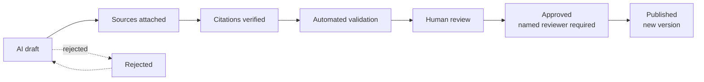

# Content governance: Scripture, history, interpretation and AI

This game teaches about the Bible and its world. That makes **content integrity a product requirement**, not a nice-to-have. This document is the rulebook; most rules are enforced by code and tests, and the rest by the editorial workflow below.

## 1. The non-negotiables

The game must never:

- invent Bible verses, or present fictional dialogue as Scripture;
- present fictional events as biblical fact;
- let the player control God or Jesus, or change Jesus' words or actions;
- quantify salvation, holiness, faith or God's favor (there are **no** such scores — see [ADR-0010](adr/0010-no-numeric-spiritual-scoring.md));
- imply prosperity proves faithfulness, or that suffering means spiritual failure;
- present a disputed theological position as settled;
- describe AI-generated content as divine revelation;
- publish AI-drafted biblical, theological or historical content without human review.

Player choices change **the player's own story** (who they helped, what they carry, who trusts them). They never change Scripture or established events.

## 2. The content model

Every paragraph of educational or narrative text is a `ContentRecord` ([src/domain/content-records.ts](../src/domain/content-records.ts)) with an explicit **kind**, shown to players as a text label (never colour alone):

| Kind | Player-facing label | Rule (enforced by `checkRecordIntegrity`) |
|---|---|---|
| `scripture` | Scripture | A **reference only**. Must not contain verse text — text comes from the Scripture text provider. |
| `paraphrase` | Scripture paraphrase | Must cite the passage it retells; always shown with "In our own words — not a quotation". |
| `historical` | Historical background | Must cite sources (or Scripture) and state a confidence level. |
| `reconstruction` | Historical reconstruction | As historical; used for plausible-but-uncertain details (e.g. what the road looked like). |
| `interpretation` | Interpretation | If denominationally sensitive, must explain why; shown with "Christians may understand this differently". |
| `fiction` | Story (fiction) | The game's own characters and events; may not carry Scripture references. |
| `instruction` | How to play | Gameplay help. |

Each record carries governance metadata: review status, provenance (`ai-assisted`/`human`/`mixed`), reviewer, age level, denominational sensitivity (+ note), historical confidence (`established`, `probable`, `possible`, `tradition`, `uncertain`), editorial notes, version and version history. Sources are catalogued once ([src/content/shared/sources.ts](../src/content/shared/sources.ts)) with URL, locator and a `verified` flag meaning *someone actually retrieved the source and checked the claim*.

Dialogue lines have a kind too. A character retelling Scripture must be a `paraphrase` line linked to a paraphrase record — the integrity checker rejects it otherwise — and the dialogue box shows "Yair is retelling Scripture in their own words (Luke 10:29–37) — not a direct quotation."

## 3. Scripture text

References are stored separately from displayed text ([ADR-0008](adr/0008-scripture-text-provider.md)). The `StaticScriptureProvider` ([src/infrastructure/scripture/scripture-provider.ts](../src/infrastructure/scripture/scripture-provider.ts)) shows verse text **only** when a translation is public-domain or properly licensed **and** marked `approvedForDisplay` by an editor. Otherwise players see exactly:

```
[SCRIPTURE TEXT REQUIRES APPROVED TRANSLATION — Luke 10:25-37]
```

…with a note inviting them to read the passage in their own Bible, alongside the labelled paraphrase.

**The World English Bible (WEB) is shown.** The WEB is in the public domain (eBible.org). Every passage the four chapters cite, 63 in all, was copied programmatically and verbatim from the chapter pages at `https://ebible.org/eng-web/`, with footnote markers removed. Luke 10:25–37 was copied on 2026-09-24 and the rest on 2026-09-26. The parser used on 2026-09-26 reproduced the stored Luke 10:25–37 exactly before it was used for the others. The passages are stored in [src/content/scripture/translations.ts](../src/content/scripture/translations.ts). Display was approved by Zac Harlan on 2026-09-26 (`approvedForDisplay: true`). A test checks that every Scripture reference in every chapter has its text.

### To enable Bible text (a human decision)

1. Open `src/content/scripture/translations.ts` and proofread every verse of the stored passage against <https://ebible.org/eng-web/LUK10.htm>.
2. Set `approvedForDisplay: true` for `WEB`.
3. Record the approval (who, when) in `claude-progress.txt` and in this document's approval log below.
4. Commit with the approver's name in the commit message.
5. Run `npm test` — `tests/unit/infrastructure/scripture.test.ts` asserts the default is off, so update that expectation in the same commit.

"World English Bible" is a trademark: never edit the stored text while keeping that name. To add another translation, add it to `TRANSLATIONS` with accurate license metadata; copyrighted translations need written permission first.

**Approval log:**

| Date | Approver | What |
|---|---|---|
| 2026-09-26 | Zac Harlan (owner, editor) | Display of the stored World English Bible text (`approvedForDisplay: true`) |
| 2026-09-26 | Zac Harlan (owner, editor) | The AI-drafted content of all four chapters. Recorded in [src/content/shared/approvals.ts](../src/content/shared/approvals.ts), which marks each record `approved` with its reviewer and date. Provenance stays `ai-assisted`. An approval covers only records drafted on or before its date (the first entry of each record's history): the records added to Chapters 1 and 2 on 2026-09-30 (`LATER_RECORDS` in each chapter's `records.ts`) are **not** covered, and stay `ai-draft` until a named person approves them. |
| 2026-09-27 | Zac Harlan (owner, editor) | The Chapter 1 teaser script (`rec-teaser`, exactly the words pinned in `tests/content/teaser.test.ts`). Recorded in `TEASER_APPROVALS` in [src/content/shared/approvals.ts](../src/content/shared/approvals.ts). A change to the words needs a new approval. |

## 4. Historical and biblical research rules

For every educational claim:

1. Identify the claim.
2. Attach a source you actually retrieved (add it to `sources.ts`).
3. Record confidence; flag sensitivity.
4. Keep fictional extrapolation separate (the fork, the bend, the cistern, the inn and every character in Chapter 1 are fiction — and are labelled so).

The claim-by-claim research behind Chapter 1 is in [research/source-verification.md](research/source-verification.md). Notable decisions it drove:

- **No motive is given for the priest or the Levite.** Luke gives none; later guesses (e.g. ritual purity) have fed anti-Jewish stereotypes. A test (`tests/content/road-to-jericho.test.ts`) fails if content attributes one.
- **No paved Roman highway.** Judea's engineered Roman roads largely post-date AD 66–70; the game shows a rough track and says so.
- "The place of blood" is presented as a **much later** (AD 404) name; *Adummim* means "red".
- Elevations use sourced figures (≈754 m and ≈258 m below sea level); coin values and the volume of a "log" are marked uncertain.
- Samaritans are a living community; relations in the first century are described as "strained, but not broken".
- The "Inn of the Good Samaritan" is described as a later tradition; the game's inn is fictional.

## 5. The editorial workflow

Content moves through explicit states ([src/domain/content-records.ts](../src/domain/content-records.ts) `transitionReview`), and **AI drafts can never skip a step**:



| Step | Who / what | Tooling |
|---|---|---|
| AI draft | AI assistant or author | `aiDraft()` helper sets `status: 'ai-draft'`, `provenance: 'ai-assisted'` |
| Sources attached | Author / research assistant | `sources.ts`, record `sources: [...]` |
| Citations verified | **Human** checks each citation says what the record claims | Edit status; see research notes |
| Automated validation | Machines | `npm run content:validate`, `tests/content`, integrity checker |
| Human review | Pastor, teacher, historian as appropriate | Review against this document |
| Approved | Reviewer named in `governance.reviewer` | `transitionReview` refuses approval without a reviewer |
| Published | Release | Version bump + history entry |

### Current status of Chapter 1

- 31 educational records; **0 approved**. Records checked against retrieved sources are `sources-attached`; the rest are `ai-draft`.
- In the default **preview** mode (`VITE_CONTENT_MODE=preview`) unapproved educational content is shown with an **"Awaiting editorial review"** label.
- `npm run content:publish-check` lists every record still needing a human reviewer and exits non-zero until all are approved. Use it as the release gate for a "strict" build.

## 6. AI governance

AI may help draft fictional dialogue, side-quest ideas, candidate puzzles, reading-level adjustments, hints, historical summary drafts, consistency checks and play-path tests. Nothing it produces about Scripture, theology or history reaches players without the workflow above.

**There is no chatbot in this game.** The extension point for a future retrieval-augmented study guide is the `StudyGuide` port ([src/application/ports.ts](../src/application/ports.ts)), implemented today by `DisabledStudyGuide`. Any future guide must pass `checkGuideAnswer` ([src/domain/guide-policy.ts](../src/domain/guide-policy.ts)), which already rejects answers that: cite nothing, cite unapproved sources, speak as God/Jesus/a prophet, or present interpretation without acknowledging that traditions differ. A guide must refuse when sources are insufficient, and must never receive journal or reflection text without explicit permission. See [future-aws.md](future-aws.md).

## 7. Interpretation and denominational sensitivity

Where Christian traditions differ, content says so. Chapter 1 presents both the widely shared ethical reading of the parable (show practical mercy across boundaries) and the early allegorical reading (Augustine, *Questions on the Gospels* 2.19 — quoted from a scholarly source), labelled as interpretation with a sensitivity note, and a record on reading the story fairly without stereotyping priests, Levites or Jewish people.

## 8. Checklist for any new content

- [ ] Every record has the right kind; fiction is never labelled as anything else.
- [ ] No verse text outside `translations.ts`.
- [ ] Every historical claim cites a retrieved source and a confidence level.
- [ ] Sensitive interpretations explain the sensitivity and acknowledge differing traditions.
- [ ] No scores of faith/holiness/favor; consequences are concrete facts.
- [ ] `npm run content:validate` and `npm test` pass.
- [ ] Status is `ai-draft`/`sources-attached` until a named human approves.
