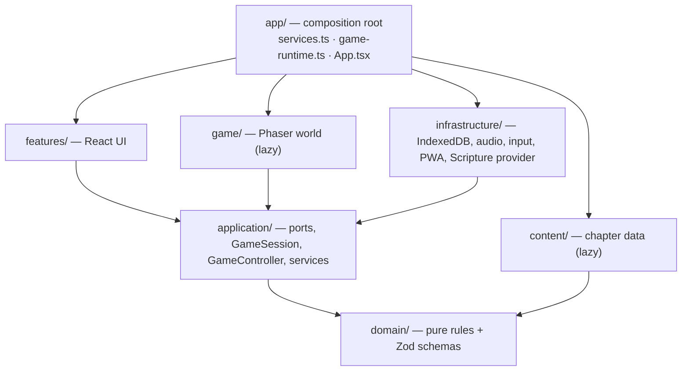

# Executive summary

**Product:** *Witness: A Journey Through Scripture*, a local-first Christian narrative adventure for ages 10+, families, Christian schools and youth groups. It is a React + Phaser 3 + TypeScript progressive web app (PWA).
**This slice:** Chapter 1, *The Road to Jericho*, about 20–30 minutes of play for a first-time player (measured: [chapters/road-to-jericho.md §11](chapters/road-to-jericho.md#11-how-long-it-plays)).
**Status (2026-09-24):** Playable from start to finish on every major branch, in a real browser and headlessly. It works offline after the first visit. All educational content is AI-drafted and **awaiting human review**, and Bible text is **switched off** until a human approves a translation.

---

## In one paragraph

The player carries a fever remedy from Jerusalem down the dangerous road to Jericho. They gather advice in the market (some reliable, some not), pack a satchel too small for everything, prove which route is safe from evidence, and come upon a robbed traveler. That traveler is a Samaritan merchant the player may have helped in the market. The player decides what to do, and the decision has concrete consequences in time, supplies, who helps and who pays. In Jericho, a fictional character retells a story Jesus told about this same road, and the game then shows what Luke 10:25–37 contains, with Scripture, paraphrase, history and interpretation each labelled. It ends with optional private reflection and a summary of what happened. There are no scores of faith or holiness, no combat and no quiz.

## At a glance

| | |
|---|---|
| Scenes | 4: Aunt Miriam's house, the lower market in Jerusalem, the road down to Jericho, Jericho |
| People | 12 characters, all fictional. **Jesus never appears as a character.** |
| Story content | 23 conversations (170 nodes), 2 quests (main quest with 7 stages; optional side quest with 3), 4 puzzles of four different types, 6 recorded choices, 16 clues, 10 items, 36 journal entries |
| Educational content | 50 content records: 10 Scripture references, 3 paraphrases, 12 historical, 1 reconstruction, 5 interpretation, 19 fiction. 33 cited sources. **0 human-approved.** |
| Endings | Every branch completes. The remedy is delivered before nightfall, by lamplight, or at dawn, depending on choices and what was packed. |
| Platform | Static PWA with no backend. Progress lives in the browser's IndexedDB. Works offline after one visit. |
| Size | 153 KB gzip initial download. Phaser and the chapter load lazily (≈377 KB gzip) when a game starts. |

## What was built

### For players

- **Menus and profiles.** Title screen, nickname-only profiles (up to 8 per device, 4 non-gendered looks), and chapter select. All four chapters are playable: *The Road to Jericho*, *A Storm on Galilee*, *A Journey to Bethlehem* and *A Letter from Paul*.
- **The world.** A top-down tile world in Phaser with procedural placeholder art and synthesised placeholder audio (with sound captions). Movement is by keyboard, touch d-pad, pointer (click or tap to walk) or gamepad. A **"Go to…" list** makes the whole chapter playable without precise movement.
- **The story.** Branching dialogue in which choices that can't be taken right now stay visible with the reason. There is a main quest and an optional side quest (*An Honest Measure*). Four puzzles grow out of the story: packing a satchel, measuring with two vessels, choosing a route from evidence, and ordering what happened from tracks. Each has three hint tiers and no penalty.
- **Consequences.** Choices change what the player carries, who helps the injured traveler and how, who pays the inn, what time it is (a story counter, not a clock), and what people say.
- **Learning.** A tabbed journal (people, places, events, clues, history, Scripture, themes, maps, reflections). Every paragraph is labelled by kind. The Scripture Connection panel ends the chapter, followed by optional reflection and a summary with no grading.
- **Saving and accessibility.** Autosave plus three manual save slots per profile, with versioned saves that migrate old formats. Accessibility settings: text size up to 2×, Atkinson Hyperlegible and OpenDyslexic fonts, high contrast, reduced motion, dialogue and walking speed, instant travel, remappable keys, captions and volume channels.

### Under the hood

- **Content is data.** The chapter is plain TypeScript data ([`src/content/chapters/road-to-jericho/`](../src/content/chapters/road-to-jericho/)), checked by Zod schemas, a referential-integrity checker and a reachability check at build time and again on load.
- **A deterministic rules engine.** Declarative conditions and effects, a rules runner that settles quests and journal unlocks after every change, and pure puzzle checkers ([`src/domain/`](../src/domain/)).
- **Content governance in code.** Every record has a kind, sources, confidence, sensitivity, review status and version history. AI drafts can't skip workflow steps, and approval needs a named human ([`content-records.ts`](../src/domain/content-records.ts)). Scripture records hold references only, and verse text comes from a provider that shows a placeholder unless a translation is approved.
- **Privacy by construction.** No accounts and no network calls from game code (the architecture tests forbid `fetch`). Anonymous statistics are off by default, whitelisted and sanitised, and go to a no-op provider in production. Reflections never leave the device.
- **Layered architecture** with enforced boundaries: domain → application → infrastructure / game (Phaser) / features (React), wired in one composition root ([`src/app/services.ts`](../src/app/services.ts)). Cloud sync, sign-in and an AI study guide exist as **interfaces only**.
- **An agent-ready harness.** `init.sh`, `agent-status.sh`, `quality-sweep.sh`, git hooks, a destructive-command guard, a feature registry ([`feature_list.json`](../feature_list.json)), CI, and a manual, main-only GitHub Pages deploy workflow.

## How it is structured

Data flows **Phaser world ⇄ `WorldPort`/`WorldEvent` ⇄ `GameController` ⇄ `GameSession` (domain rules) ⇄ typed `DomainEvent` bus ⇄ `UiStore` ⇄ React**. Phaser never touches game state directly, and React only reads it. The layer rules are executable ([`tests/architecture/layers.test.ts`](../tests/architecture/layers.test.ts)). For details see [architecture.md](architecture.md); for game content see [game-design.md](game-design.md).

## What is verified

| Claim | Evidence |
|---|---|
| The engine, content and UI behave as designed | **304 Vitest tests passing in 32 files**: unit, integration, content, architecture and React UI (jsdom + axe-core) |
| Every major branch can be completed | Four complete headless playthroughs through the real application layer: caravan help with an on-time delivery; hurrying past and telling the innkeeper; tending and walking, arriving after dark, resting, and a dawn delivery; leaving supplies and sending help ([`playthrough.test.ts`](../tests/integration/playthrough.test.ts)) |
| It works in a real browser, on three form factors | **23 Playwright tests passing, 1 intentionally skipped** (keyboard-only play on the phone profile), across desktop Chromium, mobile Chromium (Pixel 7), tablet Chromium (820×1180) and the development server |
| The full chapter can be played in a browser, with save and restore | [`e2e/chapter.spec.ts`](../e2e/chapter.spec.ts): new profile → quest → item → puzzle → choice and consequence → **save → reload → restore** → continue → complete → summary → Scripture references |
| Accessibility basics | axe-core WCAG 2.2 AA scans (including colour contrast and high-contrast mode) in jsdom and in a real browser. Keyboard-only and touch E2E tests. |
| Offline play | After one visit, the app relaunches with no network and starts a chapter from the precache (Chromium) |
| Bundle size | 153 KB gzip initial. Phaser and the chapter are lazy-loaded (≈377 KB gzip). |
| Frame rate | **34–40 fps walking in the market under headless software rendering** (no GPU), with automatic simpler effects on slow devices. 60 fps on real devices has **not yet been confirmed**. |
| Content integrity rules | Content tests: schema and integrity; every character fictional; no Jesus character; no scoring language; no motive given for the priest or Levite; nothing self-approved; only retrieved sources cited |
| Feature registry | **24 of 28 entries passing.** Open: WebKit E2E, translation approval, editorial approval, GitHub branch protection. |

## What is deliberately deferred

The full inventory, with reasons and next steps, is in [deferred-features.md](deferred-features.md). In short:

| Waiting on a **human** | Not yet **verified** | Out of **scope** for the slice |
|---|---|---|
| Proofreading and enabling the stored public-domain WEB text of Luke 10:25–37 | iOS/iPadOS Safari (WebKit) | Chapters 2+ |
| Editorial review and approval of all 31 educational records | 60 fps on real phones and tablets | Cloud saves, accounts, AWS backend (interfaces only) |
| First commit, pushing to GitHub, server-side branch protection | Screen-reader and user testing with young players | AI study guide (policy only), analytics provider (no-op only) |
| | A physical gamepad; first load on slow networks | Voice-over, final art and music, localisation, teacher tools |

### Issues found while writing these documents

These were found by reading the code and running the headless harness. None of them blocks finishing the chapter. They are tracked in [backlog.md](backlog.md) and [risks.md](risks.md).

1. ~~**Menashe's "stranger" greeting on the road is never shown.**~~ Fixed (`d01d11e`): the dialogue controller now chooses where a conversation starts before recording the meeting. Chapter 1's open gaps are in [its document, §14](chapters/road-to-jericho.md#14-known-gaps).
2. **`VITE_CONTENT_MODE=strict` does not block unreviewed content.** In the code it only removes the "Awaiting editorial review" label ([`ContentBlock.tsx`](../src/features/common/ContentBlock.tsx)). Nothing wires `content:publish-check` into the build or the deploy workflow. [deferred-features.md](deferred-features.md) says strict builds fail; the code doesn't support that.
3. ~~**The "Go to…" list includes destinations that can't be reached yet.**~~ Fixed: choosing one now says "You can't get there from here yet."
4. **Satchel capacity is checked only while packing.** Items bought or received afterwards are not re-checked.

## Assumptions

These assumptions shaped the slice. Each one is visible in the code or content, and each can be revisited.

| # | Assumption | Where it shows |
|---|---|---|
| 1 | **Scripture text is a placeholder by default.** No Bible text is shown until a human approves a public-domain or licensed translation. The World English Bible (public domain) text of Luke 10:25–37 is stored verbatim but disabled pending human proofreading. Players see `[SCRIPTURE TEXT REQUIRES APPROVED TRANSLATION — Luke 10:25-37]`, an invitation to read it in their own Bible, and a labelled paraphrase. | [`translations.ts`](../src/content/scripture/translations.ts), [content-governance.md §3](content-governance.md#3-scripture-text) |
| 2 | **Fictional characters only.** All 12 characters are fictional, with ordinary names of the period. No biblical figure is a character. | [`characters.ts`](../src/content/chapters/road-to-jericho/characters.ts), content test |
| 3 | **Jesus never appears as a character**, never speaks in the game, and is never controlled by the player. The chapter only reports, through Yair's labelled paraphrase, that people heard a story he told. | Content test (no Jesus speaker or character) |
| 4 | **Yair is fictional, and so is his presence in the crowd.** Luke does not name who else was present. His retelling is a labelled paraphrase, and he stops short of retelling the rest word for word. | Record `rec-para-yair` |
| 5 | **No motive is stated for the priest or the Levite.** The records say Luke leaves this open and warn that guesses can become stereotypes. | Records `rec-hist-priests-levites`, `rec-interp-fair-reading`; content test |
| 6 | **No backend.** The game is local-first and runs on any static host. There are no accounts and no server, and game code makes no network calls. Cloud sync and sign-in exist only as interfaces (`LocalOnlySync`, `LocalOnlyAuth`). | [`services.ts`](../src/app/services.ts), architecture tests |
| 7 | **Settings are device-level and shared by all profiles**, because accessibility needs must apply before a profile is chosen. | [`settings.ts`](../src/domain/settings.ts) |
| 8 | **Profiles are nickname-only**: up to 20 characters (letters, numbers, spaces, apostrophes, periods, hyphens) plus one of four non-gendered looks. No email, birthday, real name or account. Up to 8 profiles per device. | [`profile.ts`](../src/domain/profile.ts), [`profile-service.ts`](../src/application/profile-service.ts) |
| 9 | **Time of day is a story counter, not a real-time timer.** `hour` starts at 8 and moves only with travel and decisions (+1 leaving Jerusalem, +1 for settling the side quest, +2 at the end of the ridge, +6/+3/+1/+1 for the traveler decision, +1 for the road exit to Jericho, +1 for working at the inn). At hour ≥ 18 without a lamp, the player rests at the inn and delivers at dawn. There is never time pressure. | [road-to-jericho.md §8](chapters/road-to-jericho.md#8-time-weather-and-light) |
| 10 | **The route details are fictional.** The fork, the bend, the shepherds' ridge path, the cairns, the cistern, the wadi ending at a drop, the lower market and the wayside inn are invented or composite, and the game says so. The inn is explicitly *not* the inn in Jesus' story. | Records `rec-hist-road-surface`, `rec-map`, `rec-pl-inn`, `rec-pl-market` |
| 11 | **Setting:** "Judea, early first century AD, during the years of Jesus' public ministry (dates approximate)." The road is shown as a rough track, because scholars think the engineered Roman road network came mostly after AD 66–70. | [`index.ts`](../src/content/chapters/road-to-jericho/index.ts), record `rec-hist-road-surface` |
| 12 | **All educational content is AI-drafted and awaiting human review.** The 31 educational records carry status `sources-attached` or `ai-draft`, none is approved, and the default "preview" mode labels them "Awaiting editorial review". The 33 sources were retrieved and checked by an AI research assistant. A human must still verify citations. | [`governance.ts`](../src/content/shared/governance.ts), [`sources.ts`](../src/content/shared/sources.ts), `npm run content:publish-check` (fails today, by design) |
| 13 | **Money, measures and distances are simplified.** "Bronze coins" and prices are simplified. The market's "measures" don't claim a precise ancient volume (the Hebrew *log* is treated as uncertain). | Records `rec-hist-coins`, `rec-hist-measures` |
| 14 | **Relations between Jews and Samaritans** are described as strained but not completely broken. Samaritans are presented as a living community today, and prejudice is voiced by a character who can be gently challenged, never endorsed. | Record `rec-hist-samaritans`; Hadassah's dialogue |
| 15 | **Readers aged 10+.** Most records target age level `10+`. The robbery is shown only through its aftermath, and there is no combat. | Governance presets; content |
| 16 | **Ancient first aid is history, not medical advice.** The remedy is "nothing magic — just good care". The oil-and-wine record explicitly says it isn't medical advice. | Records `rec-hist-oil-wine`; `d-opening` |
| 17 | **Anonymous statistics are opt-in and currently go nowhere** (`NoopAnalytics` in production). Only whitelisted slugs and integers can ever be sent. | [`analytics.ts`](../src/application/analytics.ts) |
| 18 | **Placeholder art and audio are acceptable for the slice.** Everything is generated in code, so there is nothing to license. There is no voice-over. | [`src/game/art/`](../src/game/art/), [`synth-audio.ts`](../src/infrastructure/audio/synth-audio.ts) |
| 19 | **English only.** | UI strings in components; story text in content |
| 20 | **"Witness" is a working title**, configurable at build time (`VITE_GAME_TITLE`, `VITE_GAME_SHORT_TITLE`). | [`config.ts`](../src/app/config.ts) |
| 21 | **Chromium is the verified browser engine.** WebKit (iPhone, iPad, Safari) hasn't been tested yet. | [`playwright.config.ts`](../playwright.config.ts) |

## Read next

| If you are… | Read |
|---|---|
| A parent or product owner | This page, then [risks.md](risks.md) and [deferred-features.md](deferred-features.md) |
| A content editor, pastor, teacher or historian | [content-governance.md](content-governance.md), then [road-to-jericho.md §9](chapters/road-to-jericho.md#9-scripture-connection-and-summary) |
| A designer | [game-design.md](game-design.md) |
| A developer | [AGENTS.md](../AGENTS.md), [architecture.md](architecture.md), [testing-strategy.md](testing-strategy.md), [backlog.md](backlog.md), [chapter-authoring-guide.md](chapter-authoring-guide.md) |
