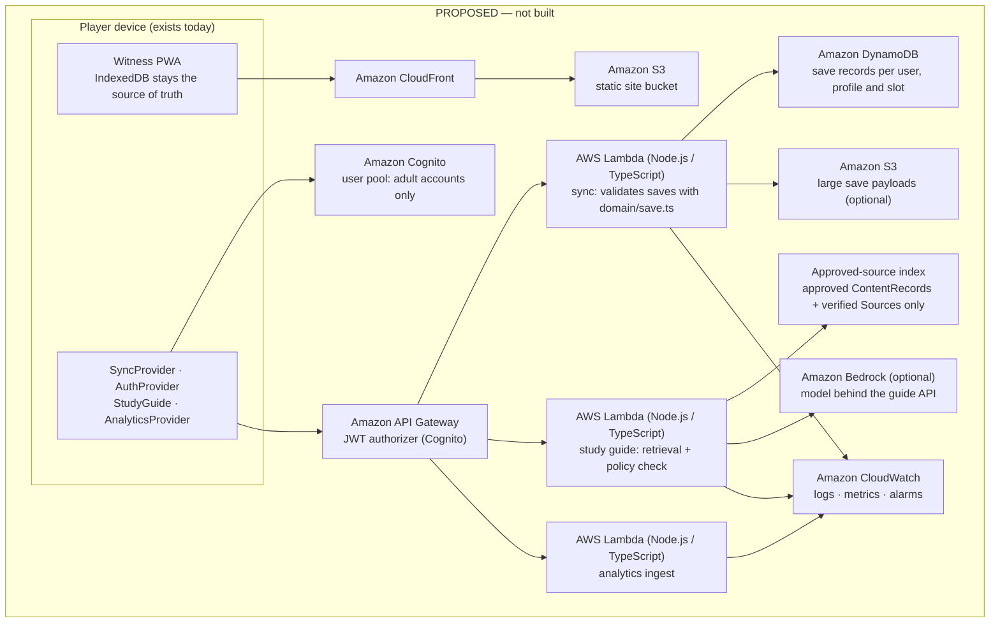

# Future cloud extension points (AWS)

> **Status: NOT IMPLEMENTED.** The game has no backend, no accounts, no cloud storage and no AI features. No code in `src/` calls a network API (the only traffic is the browser loading the app's own files and service worker), and an architecture test enforces that. Section 1 describes the **extension points that exist in code today**. Everything after it is a **proposal** for discussion, not a commitment and not a description of anything built.

Related: [architecture.md](architecture.md) · [ADR-0005 local-first saves](adr/0005-local-first-indexeddb-versioned-saves.md) · [save-data.md](save-data.md) · [content-governance.md](content-governance.md) · [security-privacy.md](security-privacy.md) · [deployment.md](deployment.md)

---

## 1. What exists today: the seams

All four seams are interfaces in [src/application/ports.ts](../src/application/ports.ts). Their local-only implementations are chosen in the composition root, [src/app/services.ts](../src/app/services.ts), which is the only place that would change to plug in cloud versions.

| Port | Interface | Implementation wired today | Behaviour today | Called by |
|---|---|---|---|---|
| `SyncProvider` | `enabled: boolean`, `push(saves: SaveGame[])`, `pull(profileId): SaveGame[]` | `LocalOnlySync` ([infrastructure/sync/local-only.ts](../src/infrastructure/sync/local-only.ts)) | `enabled = false`. `push` does nothing, and `pull` returns `[]`. | Nothing. `AppServices.sync` is wired but unused. |
| `AuthProvider` | `mode: 'local-only' \| 'cloud'`, `currentUserId(): string \| null` | `LocalOnlyAuth` (same file) | `mode = 'local-only'`, and `currentUserId()` resolves `null`. | Nothing. `AppServices.auth` is commented as "the seam for future Cognito sign-in". |
| `StudyGuide` | `available: boolean`, `ask(question, { chapterId, approvedSourceIds }): GuideAnswer` | `DisabledStudyGuide` ([infrastructure/ai/disabled-study-guide.ts](../src/infrastructure/ai/disabled-study-guide.ts)) | `available = false`, and `ask()` resolves `{ kind: 'refusal', reason: 'unavailable' }`. | Nothing. There is no chatbot or guide UI. |
| `AnalyticsProvider` | `name`, `track(event: AnalyticsEvent)` | `NoopAnalytics` in production builds, `LogAnalytics` in development (writes the already-sanitised events to the diagnostics log) | Always behind `AnalyticsService` ([application/analytics.ts](../src/application/analytics.ts)): nothing is tracked unless the device setting `analyticsConsent` is on (default **off**). Only 8 whitelisted events pass, and their properties must be short slugs (`^[a-z0-9][a-z0-9-]{0,63}$`) or integers from 0 to 10 000. | `GameController` (maps domain events) and `SettingsService` (accessibility features enabled) |

The whitelisted analytics vocabulary is: `ChapterStarted`, `ChapterCompleted` (with a play-time *bucket* such as `25-35`, never exact time), `PuzzleAttempted`, `PuzzleCompleted`, `HintRequested`, `AccessibilityFeatureEnabled`, `SaveRestored` and `OptionalQuestCompleted`.

### The study-guide policy

[src/domain/guide-policy.ts](../src/domain/guide-policy.ts) defines the answer contract **now**, so that any future guide is held to it by tests from day one. A `GuideAnswer` is either:

- an answer, with `text`, a `category` (`scripture`, `historical` or `interpretation`), `citations` (`sourceId`, optional `locator`), `uncertainty` (`low`, `medium` or `high`) and `traditionsDiffer`; or
- a refusal, with a `reason` (`insufficient-sources`, `out-of-scope` or `unavailable`).

`checkGuideAnswer(answer, approvedSourceIds)` accepts every refusal and reports these violations for an answer:

| Rule | Violation |
|---|---|
| `must-cite` | No citations at all |
| `approved-sources-only` | A citation whose `sourceId` is not in the approved set |
| `no-divine-persona` | The text speaks as God, Jesus, the Lord, a prophet or the Holy Spirit, for example "I am God", "thus says the Lord" or "I speak for God" |
| `mark-interpretation` | `category` is `interpretation` but `traditionsDiffer` is not `true` |

The type makes `uncertainty` and `category` mandatory, but `checkGuideAnswer` does not judge whether the stated uncertainty is appropriate, or whether a refusal should have been given. Those need evaluation and human review (§5).

### Constraints any cloud feature must respect (already in the code)

- **No network code today.** [tests/architecture/layers.test.ts](../tests/architecture/layers.test.ts) fails on `fetch(`, `XMLHttpRequest`, `navigator.sendBeacon` or `new WebSocket` **anywhere** in `src/`. Adding a backend therefore needs a deliberate, reviewed change to that test. *Proposal:* allow network calls only in a named `src/infrastructure/**` adapter module, and keep the rule for every other file.
- **Reflection text is walled off.** The same test fails if any file under `src/infrastructure/` or any analytics file accesses `.reflection`.
- **Concrete classes are chosen only in `src/app/services.ts`.** Gameplay and UI code talk to ports and must not change when a cloud implementation is added.
- **`VITE_*` variables are public.** They are compiled into the bundle, so no secret or AWS credential may ever be one. A browser client can only hold short-lived user tokens.
- **Guardrails.** `infra/`, `deploy/`, `cdk/`, `terraform/` and `.github/` are sensitive paths (`SENSITIVE_PATH_PATTERNS` in `scripts/lib/policy.sh`) that need human approval. `.claude/settings.json` denies `aws s3 sync/rm`, `aws cloudfront create-invalidation`, `cdk deploy` and `terraform apply/destroy` for agents. Any infrastructure-as-code for the proposals below would live under those rules.

## 2. Proposed architecture (PROPOSED — not built)

Everything inside the "PROPOSED" box except the device is hypothetical. Static hosting on S3 + CloudFront needs **no** backend and is possible with today's build (`VITE_BASE_PATH` handles sub-paths). See [deployment.md](deployment.md).

## 3. Proposed mapping (proposal)

| Seam | Proposed AWS mapping | Design notes (proposal) |
|---|---|---|
| **Hosting** | S3 (private bucket) behind CloudFront | Static files only. The service worker's prompt-to-update flow ([ADR-0006](adr/0006-pwa-prompt-updates.md)) works unchanged. Cache headers must let `sw.js` and `index.html` revalidate. |
| **`AuthProvider`** → `CognitoAuth` | Amazon Cognito user pool with hosted sign-in | `mode = 'cloud'`, and `currentUserId()` returns the Cognito subject. **Accounts belong to adults** (a parent or teacher). Local nickname profiles stay what they are today and are attached to the adult's account. Children never create accounts or enter personal data. Local-only mode stays the default and stays fully functional. |
| **`SyncProvider`** → `CloudSync` | API Gateway (JWT authorizer from Cognito) → Lambda (Node.js/TypeScript) → DynamoDB, with S3 for payloads too large for an item | The Lambda **reuses `src/domain/save.ts`** (`migrateSave`, `SaveGameSchema`). The domain layer depends only on `zod`, so it runs server-side unchanged, and the server rejects exactly what the client would. A DynamoDB key sketch: partition `userId`, sort `profileId#slot`, plus `schemaVersion`, `savedAt` and `contentVersion` as attributes. Conflicts are resolved per slot by `savedAt` with the losing copy kept, never by merging `GameState` fields. A new application-layer `SyncService` would decide when to push and pull, and would **strip `state.reflection` unless the adult has explicitly allowed syncing it** (§4). |
| **`StudyGuide`** → `ApprovedSourceGuide` | API Gateway → Lambda → retrieval over **approved sources only** → optional Amazon Bedrock model | Retrieval corpus: `ContentRecord`s whose `governance.status` is `approved` or `published`, and `Source`s with `verified: true`. Nothing else is indexed. The request carries the question, `chapterId` and `approvedSourceIds` (as the port already defines). **Never** journal or reflection text without explicit permission. The Lambda runs `checkGuideAnswer` before responding and returns a refusal (`insufficient-sources`) instead of guessing. The client runs `checkGuideAnswer` again before display. Model access stays behind this controlled API, so the browser never holds model credentials. |
| **`AnalyticsProvider`** → `CloudAnalytics` | API Gateway → Lambda → CloudWatch (metrics from the whitelisted events) | It receives only what `AnalyticsService` has already sanitised, and only after consent. No user id, device id or IP-derived identifiers are stored, and only aggregate counts are kept. |
| **Observability** | CloudWatch Logs, metrics and alarms for API Gateway and Lambda. Budget alarms. | Logs must never contain free text from players (a convention the client logger already follows), tokens or save payloads. |
| **Secrets** | IAM roles for Lambdas. No long-lived credentials anywhere. | Nothing secret in the client bundle or in `VITE_*`. |

**How it would plug in (proposal):** add `CognitoAuth`, `CloudSync`, `ApprovedSourceGuide` and `CloudAnalytics` classes in `src/infrastructure/**`, implementing the existing ports. Wire them in `src/app/services.ts` behind an explicit build-time or runtime switch. Relax the architecture test's network rule for that one adapter module only. Gameplay, content and UI code would not change.

## 4. Privacy constraints (they apply to any implementation)

1. **Reflection and journal text never leave the device by default.** Saves contain `state.reflection`, the player's free-text end-of-chapter reflection. Uploading `SaveGame` records unchanged would upload it. Any sync must exclude it unless an adult has given explicit, informed and revocable permission. The study guide must **never** receive journal or reflection text without the same explicit permission. (The existing architecture test already stops infrastructure code from reading `.reflection` directly.)
2. **Children's privacy, flagged for legal review.** The audience includes children, and families and classrooms share devices. Regulations such as the US Children's Online Privacy Protection Act (COPPA) and comparable rules elsewhere (for example GDPR provisions on children's data, or the UK Age Appropriate Design Code) **may** apply to any feature that collects or stores data in the cloud. This document **does not assert what any law requires**. Qualified legal review is a prerequisite (§5). Design intentions to bring to that review:
   - adult-held accounts only
   - data minimisation (nickname and look, never a real name, email or birthday for a child)
   - no advertising or profiling
   - clear retention limits
   - deletion that removes cloud copies when a local profile is deleted
3. **Analytics stay opt-in, anonymous and whitelisted.** Consent stays a device-level choice, off by default ([ADR-0007](adr/0007-device-level-settings.md)). The sanitiser stays the gate.
4. **The guide obeys the content rules.** It cites only approved sources, labels whether it is speaking about Scripture, history or interpretation, notes when traditions differ, never speaks as God, Jesus, a prophet or a spiritual authority, and refuses rather than guesses ([content-governance.md §6](content-governance.md#6-ai-governance)).
5. **Local-only must remain first-class.** No gameplay, accessibility or content feature may require an account or a connection.

## 5. Acceptance criteria that would justify adding a backend (proposal)

A backend should be added only when **all** of the following hold:

1. **A demonstrated need that local-first cannot meet.** For example, classrooms need progress to follow a pupil across shared devices, or families ask for cross-device continuation. The need is recorded in the backlog with evidence.
2. **Legal and privacy review is done** for the target regions and age groups, including the children's-privacy questions in §4, with a written data-protection assessment and a retention and deletion policy.
3. **A superseding ADR** extends [ADR-0005](adr/0005-local-first-indexeddb-versioned-saves.md). It defines the sync model and conflict policy, and changes the architecture test's network rule to an explicit allowlist.
4. **Nothing regresses offline.** With cloud features switched off, every existing unit, integration, UI and e2e test passes unchanged. The PWA offline test still passes. A player with no account can finish every chapter.
5. **Save compatibility.** The server validates with the same `migrateSave`/`SaveGameSchema` as the client. Clients newer or older than the server get the existing `unsupported-version` / `migration-failed` handling, never data loss. Reflection text is excluded unless permission is recorded.
6. **Security.** A written threat model. Authentication through Cognito tokens and authorization on every route. Least-privilege IAM. No secrets in the client. Infrastructure as code kept in a sensitive path, with human-approved, human-run deploys (as the guardrails already require).
7. **For the study guide specifically:**
   - There is a corpus of **human-approved** records and **verified** sources (`npm run content:publish-check` passes for the chapters it covers).
   - An evaluation set in which every answer passes `checkGuideAnswer`.
   - Refusals are verified for out-of-scope and under-sourced questions.
   - A sample of answers has been reviewed by named human reviewers.
8. **Operations.** A named owner, CloudWatch alarms, budget alarms, and a documented incident and data-deletion process.

A sensible order, if the criteria are met, would be: static hosting on S3 + CloudFront (no backend) → optional analytics ingest → accounts and sync → the study guide last, because it has the highest governance bar.
