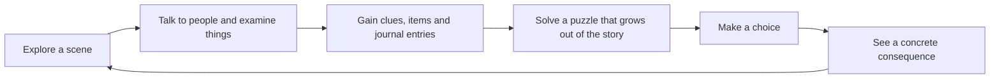

# Game design

**Game:** *Witness: A Journey Through Scripture* (working title, configurable through `VITE_GAME_TITLE`)
**Chapters:** four, each about 20–30 minutes of play for a first-time player ([§6](#6-the-chapters)). Each has its own design document in [chapters/](chapters/).
**Status:** every chapter is playable end to end on every major branch. The owner approved the AI-drafted content of all four chapters on 2026-09-26; text written since then awaits review (each chapter document lists it; see [content-governance.md](content-governance.md)).

This document is the **game-wide** design: what every chapter shares (vision, pillars, the core loop, controls, the shape of a chapter, the puzzle types, time of day, the ending, how play time is measured). What happens in a particular chapter (its acts, places, people, quests, puzzles, choices, art and approval status) is in that chapter's document, which is checked against the content by [`tests/content/chapter-docs.test.ts`](../tests/content/chapter-docs.test.ts). Everything here describes the game **as built**, from [`src/domain/`](../src/domain/), [`src/application/`](../src/application/) and [`src/content/`](../src/content/).

---

## Contents

1. [Vision](#1-vision)
2. [Audience](#2-audience)
3. [Design pillars](#3-design-pillars)
4. [Core loop](#4-core-loop)
5. [Controls](#5-controls)
6. [The chapters](#6-the-chapters)
7. [The shape of a chapter](#7-the-shape-of-a-chapter)
8. [Puzzle types](#8-puzzle-types)
9. [Time of day](#9-time-of-day)
10. [Scripture Connection, reflection and summary](#10-scripture-connection-reflection-and-summary)
11. [How long a chapter plays](#11-how-long-a-chapter-plays)
12. [Known design gaps](#12-known-design-gaps)

---

## 1. Vision

The player lives an ordinary, fictional life beside a well-known Bible passage and has to make the kinds of decisions its people faced, before they learn what the passage says. They carry a remedy down the road of the Good Samaritan, crew one of the "other boats" on the night of the storm on Galilee, live in a Bethlehem house crowded for the registration on the night the shepherds came, and carry a letter in Colossae while Paul's letters are read aloud.

Each chapter keeps Scripture, paraphrase, history and interpretation clearly apart: the player's story is labelled fiction, retellings are labelled paraphrases, and the chapter ends by showing what the passage itself contains. The game never tells the player what the right answer was. It shows what happened because of their choices and asks them to think.

## 2. Audience

| Audience | What they need from a chapter |
|---|---|
| Players aged 10 and up | A real adventure with people to meet, puzzles that make sense, and choices that matter. Short sessions, readable text and no time pressure. |
| Families | Something parents and children can play or talk about together. Nothing personal is collected. It works offline and on shared devices through nickname profiles. |
| Christian schools and youth groups | Content that keeps Scripture, history and interpretation apart, cites its sources, and ends in open reflection questions instead of a quiz. |

Governance metadata targets most records at age level `10+` ([`src/content/shared/governance.ts`](../src/content/shared/governance.ts)).

## 3. Design pillars

The examples are from Chapter 1; every chapter keeps the same pillars, and each chapter's content test enforces them.

| Pillar | What it means in practice | Where it is enforced |
|---|---|---|
| **Learning through play, not quizzes** | Knowledge is used rather than tested. What Shimon says about a cistern lets you pack lighter. Rain in the western hills explains fresh mud in the wadi. Reading footprints in order tells you whether it is safe to stay. There is no quiz anywhere. | Puzzle design (each chapter's `puzzles.ts`) |
| **No combat** | Danger is never fought. It is handled by preparation, evidence and judgement. | Content (no combat system exists in the engine) |
| **No faith, holiness or favor scores** | The engine stores only concrete facts: flags, items, choices, clues, quest progress. Relationships are shown as words ("Friendly", "Trusts you"), never as numbers. The summary has no score, rank or "best ending". | [`game-state.ts`](../src/domain/state/game-state.ts), [`characters.ts` `trustLabel`](../src/domain/characters.ts), [`chapter-summary.ts`](../src/domain/chapter-summary.ts). Content tests reject scoring language; the E2E tests assert the summary contains no "score", "points" or "holiness". |
| **Consequences are concrete** | Choices change what you carry, who is helped and how, who pays, what time it is, and what people say to you. | Each chapter's `choices.ts` and `ending.ts` |
| **Scripture stays Scripture** | Fiction is never shown as Scripture. Retellings are labelled paraphrases. Jesus never appears as a character. No motive is invented where the text gives none. | [`content-records.ts`](../src/domain/content-records.ts) and each chapter's content test in [`tests/content/`](../tests/content/) |
| **Every branch finishes** | No game over, no failed chapter. Every branch completes and gets a non-judgemental response. | The headless playthroughs in [`tests/integration/`](../tests/integration/) |

## 4. Core loop

- Every interaction is either a **conversation** (branching dialogue), an **examination** (a message, often discovering a clue), or a **use** (opening a puzzle, drawing water).
- Discoveries go into the **journal**, where each paragraph is labelled by kind: Scripture, Scripture paraphrase, historical background, historical reconstruction, interpretation or story (fiction).
- The **quest log** always states the next objective in words. The HUD shows the place, the next objective and the time of day in words.
- Time of day is a **story counter**. It moves only when the player travels or decides something, never in real time ([§9](#9-time-of-day)).
- A speaker's portrait shows the **expression** marked on their line (`glad`, `worried`, `sad`, `angry`, `surprised`, `afraid`; neutral otherwise). It is presentation only: the words never change for it.

## 5. Controls

Every action has a keyboard, touch and pointer route. The **"Go to…" list** makes every chapter playable without precise movement: it lists every visible person, object and exit in the scene, then walks the player there and uses it. With the *Instant travel* setting on, it moves the player at once. Triggers along the path still fire. A target with no path says "You can't get there from here yet."

| Action | Keyboard (default, remappable) | Touch | Gamepad (standard mapping) | Pointer |
|---|---|---|---|---|
| Move | Arrow keys or W A S D | Floating stick: drag anywhere on the world, pace by the tilt | D-pad or left stick | Click or tap a tile to walk there (pathfinding) |
| Talk / examine / use | E, Space, Enter | ✋ action button | A (button 0) | Click or tap a person or object, or the on-screen prompt |
| Pause menu | Esc, P | HUD button | Start (B also goes back / closes) | HUD button |
| Journal | J | HUD button | Y | HUD button |
| Satchel | I | HUD button | X | HUD button |
| Quest log | Q | HUD button | Select | HUD button |
| "Go to…" list | G | HUD button | LB (button 4) | HUD button |
| Menus, dialogue, puzzles | Tab / Shift+Tab, Enter or Space, Esc | Tap | D-pad or stick moves between buttons (left/right also steps a drop-down), A presses, B goes back | Click or tap |

- Keys are remapped in **Settings** by pressing the new key. Each action keeps up to three keys, and a key can belong to only one action ([`src/domain/settings.ts`](../src/domain/settings.ts)).
- Touch controls are `auto` by default and can be forced on or off. The stick appears under the thumb wherever it lands (a faint resting stick in the bottom-left corner shows where to touch first); a tap that never steers walks to the spot tapped.
- The gamepad adapter ([`gamepad-source.ts`](../src/infrastructure/input/gamepad-source.ts)) and menu navigation ([`gamepad-navigation.ts`](../src/infrastructure/input/gamepad-navigation.ts)) are unit-tested with a simulated pad, but they have not been tried with a physical controller (see [deferred-features.md](deferred-features.md)).
- Dialogue choices are real buttons. Choices that exist but can't be taken right now stay visible, disabled, with the reason (for example, "You need 2 coins.").
- Every puzzle is playable from the keyboard alone (arrow keys and Space/Enter, no dragging), announces each move to screen readers, and never relies on colour alone.

**Accessibility settings** (device-level, shared by all profiles): text size (1×–2×), font (standard, Atkinson Hyperlegible, OpenDyslexic), high contrast, reduced motion (system/on/off), dialogue text speed (instant to slow), walking speed, instant travel, touch controls, sound captions, mute and five volume channels, and anonymous statistics (off by default).

## 6. The chapters

The chapter registry is [`src/content/index.ts`](../src/content/index.ts); each chapter's content is in `src/content/chapters/<id>/`, and its design document in [chapters/](chapters/README.md).

| # | Chapter | Passage | Player's role | Design document |
|---|---|---|---|---|
| 1 | *The Road to Jericho* | Luke 10:25–37 | Carries a fever remedy from Jerusalem to Jericho and finds a robbed traveler | [road-to-jericho.md](chapters/road-to-jericho.md) |
| 2 | *A Storm on Galilee* | Mark 4:35–41 | A young crew member in one of the "other boats" | [storm-on-galilee.md](chapters/storm-on-galilee.md) |
| 3 | *A Journey to Bethlehem* | Luke 2:1–20 | A child of a Bethlehem household full of relatives home for the registration; one of those who heard the shepherds | [journey-to-bethlehem.md](chapters/journey-to-bethlehem.md) |
| 4 | *A Letter from Paul* | Philemon 1–25, with Colossians 4:7–18 | The grandchild of a dyer in Colossae, carrying another letter beside Paul's; hears his letters read at an imagined gathering | [letter-from-paul.md](chapters/letter-from-paul.md) |

To add a chapter, follow [chapter-authoring-guide.md](chapter-authoring-guide.md).

## 7. The shape of a chapter

Every chapter follows the same seven-act journey, though each groups its scenes differently:

1. **The errand**: someone gives the player a task with a reason to care.
2. **Gathering**: people to meet, advice to weigh (some reliable, some not), an optional side quest.
3. **Preparation**: a puzzle or choice about what to take, with real limits.
4. **The journey**: a puzzle that uses what was learned earlier, and a hard decision with real constraints.
5. **Consequences**: the decision plays out in what people say and what the player sees.
6. **Scripture Connection**: the passage, its world, and how Christians have read it, with comparisons that respond to what the player did.
7. **Reflection and summary**: optional private reflection, then a summary that grades nothing.

Acts 6 and 7 are engine behaviour ([`ChapterEnding.tsx`](../src/features/chapter/ChapterEnding.tsx)); Acts 1–5 are content. Consequences are visible in the world, not only in the summary: content `looks` on entities and the player (`Entity.looks`, `Chapter.playerLooks`) and features with `visibleWhen` show what happened, never who you are.

## 8. Puzzle types

Checkers are pure functions that return feedback about the reasoning ([`src/domain/puzzles.ts`](../src/domain/puzzles.ts), and one `src/domain/puzzle-*.ts` module per newer type). Every puzzle has an intro, **three or more hint tiers** (early tiers nudge; only the last explains the answer) and an explanation of *why* the answer is right. Attempts and hints are counted only for optional anonymous statistics. **There is no penalty and no score.**

The owner asked for different puzzles in each chapter rather than jar filling everywhere. Chapter 1 owns `packing` and `measuring`; each later chapter owns two types no other chapter uses; `deduction` and `sequence` appear in every chapter. [`tests/content/puzzle-variety.test.ts`](../tests/content/puzzle-variety.test.ts) pins this.

| Type | Module | What the player does | Chapters and puzzles |
|---|---|---|---|
| `packing` | `puzzles.ts` | Choose a load within a capacity that satisfies rules | 1: `p-satchel` |
| `measuring` | `puzzles.ts` | Fill and pour between vessels to reach an exact amount | 1: `p-measure` |
| `deduction` | `puzzles.ts` | Pick an answer and back it with enough reliable evidence; unreliable evidence spoils it | 1: `p-route`, `p-cloak` · 2: `p-sky` · 3: `p-lamb` · 4: `p-whose`, `p-hiding` |
| `sequence` | `puzzles.ts` | Put events or steps in order, sometimes then draw a careful conclusion | 1: `p-what-happened` · 2: `p-sail`, `p-patch` · 3: `p-register` · 4: `p-sheets` |
| `trim` | `puzzle-trim.ts` | Load a boat within capacity, placing each load so she sits level | 2: `p-load` |
| `netting` | `puzzle-netting.ts` | A picture logic grid: tie cells so every row and column matches its runs | 2: `p-corner`, `p-brine` |
| `logicGrid` | `puzzle-logic-grid.ts` | Match subjects to options from clues, marking ✗ and ✓ | 3: `p-bread`, `p-kid` |
| `floorplan` | `puzzle-floorplan.ts` | Fit shaped pieces onto a floor grid around fixed things, turning them | 3: `p-room` |
| `map` | `puzzle-map.ts` | Follow written directions on a sketch map | 4: `p-pack` |
| `dyeing` | `puzzle-dyeing.ts` | Reach a named target shade in a limited number of dips | 4: `p-alum` |

The grid types, dyeing and map puzzles are checked for a fair answer when content loads (`chapter-integrity.ts`): exactly one solution, a reachable goal, a target that needs exactly the dips allowed. Each chapter document gives its puzzles' solutions.

## 9. Time of day

Each chapter names a counter as its clock (`timeCounter`, normally `hour`), starts it where its story starts, and moves it only with travel and decisions. It is **never a real-time timer**. The hour runs past midnight (26 is 2 a.m.) and is shown only in words ([`time-of-day.ts`](../src/application/time-of-day.ts)): *Early morning (5 to <9), Morning (<11), Midday (<13), Afternoon (<16), Late afternoon (<18), Sunset (18), Night (19 and later, and before 5)*. A toast announces each change of label.

The clock also chooses the pre-rendered light: a place's `night` set from 18:00 until 05:00 if it has one, else its `late` set from 15:00, else its `day` set ([`select.ts`](../src/game/prerendered/select.ts)). Weather comes from each scene's `weather` and `weatherChanges` and is drawn by the engine over the art. A chapter may name a `lightItem` (Chapter 1's lamp) that lets the player go on after dark.

## 10. Scripture Connection, reflection and summary

Every chapter ends the same way (the ending contract in [chapter-authoring-guide.md](chapter-authoring-guide.md#9-the-ending-contract)):

- **Scripture Connection.** It opens by saying the player's journey was a made-up story and this passage is Scripture. Every block shows its kind as a text badge, its confidence, "Christians may understand this differently" when sensitivity is moderate or high, "Awaiting editorial review" for unreviewed records in the default preview content mode, and expandable sources. Comparisons respond to what the player did; they describe and invite thought, and never grade.
- **Scripture text.** Scripture records hold **references only**. Verse text comes from the translation registry ([`translations.ts`](../src/content/scripture/translations.ts)): the public-domain World English Bible, approved for display by the owner on 2026-09-26, with the passages each chapter uses stored verbatim. A reference without a stored passage shows `[SCRIPTURE TEXT REQUIRES APPROVED TRANSLATION — <reference>]` and invites the player to read it in their own Bible ([content-governance.md §3](content-governance.md#3-scripture-text)).
- **Reflect** (optional): three prompts. The player can think, talk, or write up to 2,000 characters, saved **only on the device**, shown in the journal's Reflections tab, and never sent anywhere (a unit test checks that it never reaches analytics even with consent on).
- **Summary** ([`chapter-summary.ts`](../src/domain/chapter-summary.ts)): play time; *Your journey*; *Your choices* (prompt, chosen option, consequence); *What happened because of your choices*; *People you met* (trust as words); *Side quests*; *Discoveries*; *Themes*; *Scripture references*; *Historical context*. There is **no score, rank, grade or "best ending"**.

## 11. How long a chapter plays

The target is 20–30 minutes of real play for a first-time player. The owner found the chapters "playing pretty quick. Much shorter than the projected 20 to 30 minutes" (2026-09-30), so they were measured and made longer. [`tests/integration/play-time.test.ts`](../tests/integration/play-time.test.ts) plays a chapter headlessly and counts what the player is shown (every dialogue line and choice once, every message, each puzzle's intro and explanation, the Scripture Connection), then turns it into minutes with the model in [`tests/support/play-time.ts`](../tests/support/play-time.ts):

| | Steady first-timer | Brisk adult |
|---|---|---|
| Reading | 230 words a minute, every line | 320 words a minute |
| Choosing | 3 s per set of choices | 2 s |
| Walking and looking | 6 s per thing gone to, 20 s per new place | 4 s, 12 s |
| Puzzles (first solve) | packing 75 s, measuring 120 s, deduction 90 s, sequence 75 s, trim 150 s, netting 120 s, floor plan 150 s, logic grid 150 s, dyeing 100 s, map 100 s | 60% of those |
| Ending | a third of the Scripture Connection read, 45 s reflection, 45 s summary | a fifth; 30 s, 30 s |

Two runs per chapter: **direct** does only what the main quest asks (every line of it read); **curious** talks to everyone the story points to, takes up the errands and looks at what it passes. The test pins a floor so a chapter can't quietly get short again. Today it covers Chapters 1 and 2; Chapters 3 and 4 were measured by counting words in their playthroughs, and their documents say so. Each chapter document's §11 gives its numbers; `PLAY_TIME=1 npx vitest run --project unit tests/integration/play-time.test.ts --silent=false` prints them.

## 12. Known design gaps

Gaps that belong to one chapter are in that chapter's §14. Game-wide:

| Gap | What happens | Suggested fix |
|---|---|---|
| `VITE_CONTENT_MODE=strict` does not block unreviewed content | It only removes the "Awaiting editorial review" label ([`ContentBlock.tsx`](../src/features/common/ContentBlock.tsx)); nothing wires `content:publish-check` into the build or deploy. | See [executive-summary.md](executive-summary.md) and [deferred-features.md](deferred-features.md). |
| Play time is pinned for Chapters 1 and 2 only | Chapters 3 and 4 could get shorter without a test failing. | Add direct and curious runs for them to `tests/integration/play-time.test.ts`. |

See also [executive-summary.md](executive-summary.md), [backlog.md](backlog.md), [risks.md](risks.md), [content-governance.md](content-governance.md) and [chapter-authoring-guide.md](chapter-authoring-guide.md).
