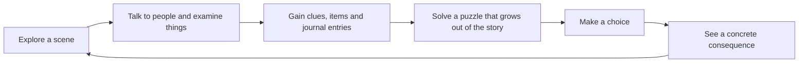
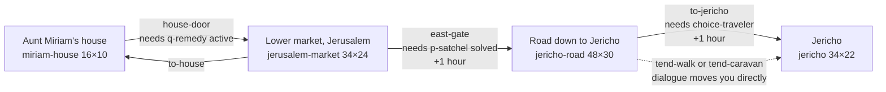
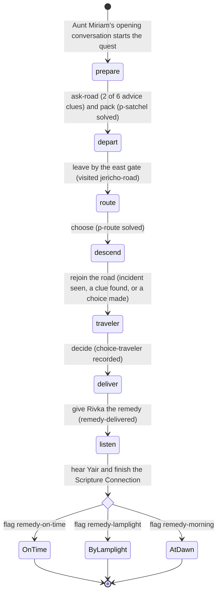
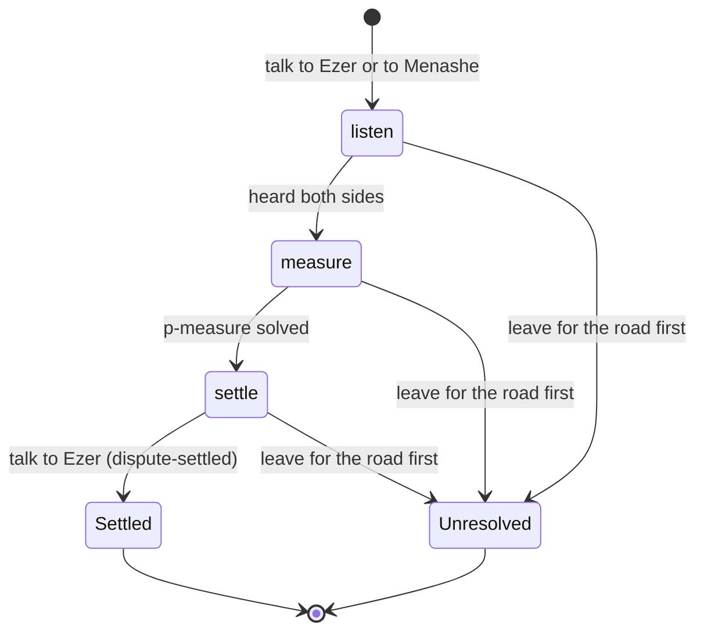
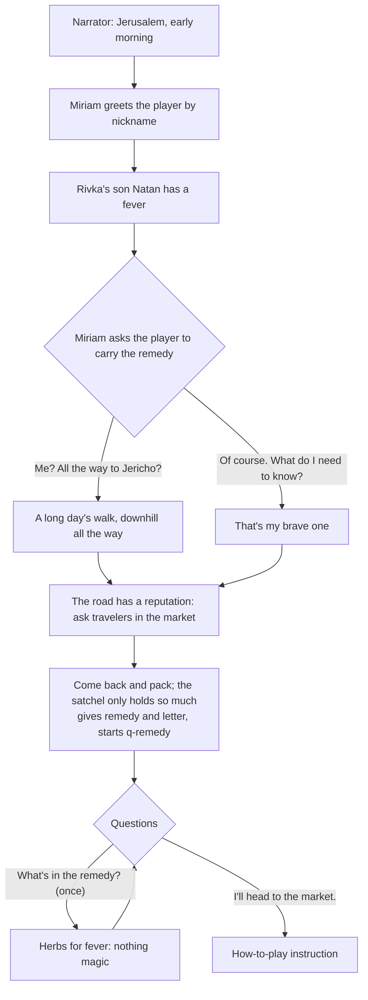
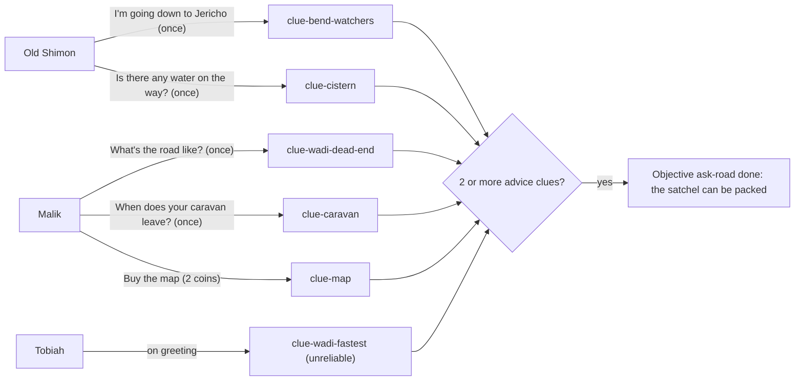
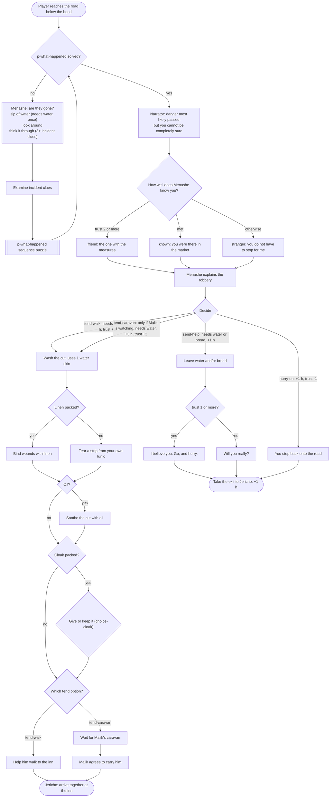
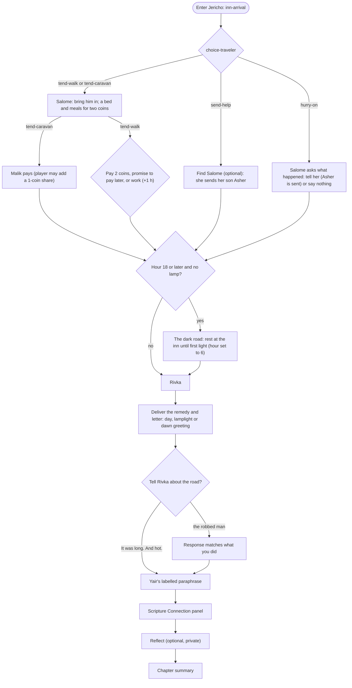

# Game design: Chapter 1, "The Road to Jericho"

**Game:** *Witness: A Journey Through Scripture* (working title, configurable through `VITE_GAME_TITLE`)
**Slice:** Chapter 1, "The Road to Jericho". About 20–30 minutes of play.
**Status:** Playable end to end on every major branch (see [testing](#where-this-is-verified)). All educational content is an AI-assisted draft that no human has reviewed yet (see [content-governance.md](content-governance.md)).

This document describes the game **as built**. Every rule, number and line of dialogue it mentions comes from the content files in [`src/content/chapters/road-to-jericho/`](../src/content/chapters/road-to-jericho/) and the engine in [`src/domain/`](../src/domain/) and [`src/application/`](../src/application/). Where the code does something different from what the content seems to intend, the difference is called out in [Known design gaps](#17-known-design-gaps-in-the-current-build).

---

## Contents

1. [Vision](#1-vision)
2. [Audience](#2-audience)
3. [Design pillars](#3-design-pillars)
4. [Core loop](#4-core-loop)
5. [Controls](#5-controls)
6. [The player journey in seven acts](#6-the-player-journey-in-seven-acts)
7. [Scenes and map plan](#7-scenes-and-map-plan)
8. [Characters](#8-characters)
9. [Items](#9-items)
10. [Clues](#10-clues)
11. [Quest flow](#11-quest-flow)
12. [Dialogue flow](#12-dialogue-flow)
13. [Puzzle specifications](#13-puzzle-specifications)
14. [Choices and consequences](#14-choices-and-consequences)
15. [The Good Samaritan connection](#15-the-good-samaritan-connection)
16. [Reflection and summary](#16-reflection-and-summary)
17. [Known design gaps in the current build](#17-known-design-gaps-in-the-current-build)

---

## 1. Vision

The player walks the same road as a well-known Bible story and has to make the kinds of decisions its characters faced, before they learn what the story says.

Aunt Miriam, a healer in Jerusalem, asks the player to carry a fever remedy to her friend Rivka in Jericho. The road down has a reputation for robbers. The player gathers advice, packs a satchel that cannot hold everything, reads the terrain to pick a route, and finds a robbed traveler lying below the bend. That traveler is a Samaritan oil merchant the player may already have met in the market. Whatever the player chooses, the remedy reaches Jericho. There, a fictional fig grower named Yair retells a story he once heard Jesus tell about this same road. The game then shows what Luke 10:25–37 contains, keeping Scripture, paraphrase, history and interpretation clearly apart.

The game never tells the player what the right answer was. It shows what happened because of their choices and asks them to think.

## 2. Audience

| Audience | What they need from the chapter |
|---|---|
| Players aged 10 and up | A real adventure with people to meet, puzzles that make sense, and choices that matter. Short sessions, readable text and no time pressure. |
| Families | Something parents and children can play or talk about together. Nothing personal is collected. It works offline and on shared devices through nickname profiles. |
| Christian schools and youth groups | Content that keeps Scripture, history and interpretation apart, cites its sources, and ends in open reflection questions instead of a quiz. |

Governance metadata targets most records at age level `10+` ([`src/content/shared/governance.ts`](../src/content/shared/governance.ts)).

## 3. Design pillars

| Pillar | What it means in practice | Where it is enforced |
|---|---|---|
| **Learning through play, not quizzes** | Knowledge is used rather than tested. What Shimon says about a cistern lets you pack lighter. Rain in the western hills explains fresh mud in the wadi. Reading footprints in order tells you whether it is safe to stay. There is no quiz anywhere. | Puzzle design ([`puzzles.ts`](../src/content/chapters/road-to-jericho/puzzles.ts)) |
| **No combat** | Robbers are never met. The player finds only what they left behind. Danger is handled by preparation, evidence and judgement. | Content (no combat system exists in the engine) |
| **No faith, holiness or favor scores** | The engine stores only concrete facts: flags, items, choices, clues, quest progress. Relationships are shown as words ("Friendly", "Trusts you"), never as numbers. The summary has no score, rank or "best ending". | [`game-state.ts`](../src/domain/state/game-state.ts), [`characters.ts` `trustLabel`](../src/domain/characters.ts), [`chapter-summary.ts`](../src/domain/chapter-summary.ts). Content test rejects scoring language, and the E2E test asserts the summary contains no "score", "points" or "holiness". |
| **Consequences are concrete** | Choices change what you carry, who reaches the inn and how, who pays, what time it is, whether you walk at night or rest until dawn, and what people say to you. | [`choices.ts`](../src/content/chapters/road-to-jericho/choices.ts), [`ending.ts`](../src/content/chapters/road-to-jericho/ending.ts) |
| **Scripture stays Scripture** | Fiction is never shown as Scripture. Retellings are labelled paraphrases. Jesus never appears as a character. No motive is given for the priest or the Levite. | [`content-records.ts`](../src/domain/content-records.ts), [`tests/content/road-to-jericho.test.ts`](../tests/content/road-to-jericho.test.ts) |
| **Every branch finishes** | No game over, no failed chapter. Hurrying past the traveler still completes the chapter, reaches Jericho and gets a non-judgemental response. | [`tests/integration/playthrough.test.ts`](../tests/integration/playthrough.test.ts) |

## 4. Core loop

- Every interaction is either a **conversation** (branching dialogue), an **examination** (a message, often discovering a clue), or a **use** (opening a puzzle, drawing water).
- Discoveries go into the **journal**, where each paragraph is labelled by kind: Scripture, Scripture paraphrase, historical background, historical reconstruction, interpretation or story (fiction).
- The **quest log** always states the next objective in words. The HUD shows the place, the next objective and the time of day in words.
- Time of day is a **story counter**. It moves only when the player travels or decides something, never in real time (see [time-of-day model](#time-of-day-model)).

## 5. Controls

Every action has a keyboard, touch and pointer route. The **"Go to…" list** makes the whole chapter playable without precise movement: it lists every visible person, object and exit in the scene, then walks the player there and uses it. With the *Instant travel* setting on, it moves the player at once. Triggers along the path still fire.

| Action | Keyboard (default, remappable) | Touch | Gamepad (standard mapping) | Pointer |
|---|---|---|---|---|
| Move | Arrow keys or W A S D | On-screen d-pad | D-pad or left stick | Click or tap a tile to walk there (pathfinding) |
| Talk / examine / use | E, Space, Enter | ✋ action button | A (button 0) | Click or tap a person or object, or the on-screen prompt |
| Pause menu | Esc, P | HUD button | Start | HUD button |
| Journal | J | HUD button | Y | HUD button |
| Satchel | I | HUD button | X | HUD button |
| Quest log | Q | HUD button | Select | HUD button |
| "Go to…" list | G | HUD button | *(none)* | HUD button |

- Keys are remapped in **Settings** by pressing the new key. Each action keeps up to three keys, and a key can belong to only one action ([`src/domain/settings.ts`](../src/domain/settings.ts)).
- Touch controls are `auto` by default and can be forced on or off.
- The gamepad adapter ([`gamepad-source.ts`](../src/infrastructure/input/gamepad-source.ts)) is implemented but has not been tried with a physical controller (see [deferred-features.md](deferred-features.md)).
- Dialogue choices are real buttons. Choices that exist but can't be taken right now stay visible, disabled, with the reason (for example, "You need 2 coins.").

**Accessibility settings** (device-level, shared by all profiles): text size (1×–2×), font (standard, Atkinson Hyperlegible, OpenDyslexic), high contrast, reduced motion (system/on/off), dialogue text speed (instant to slow), walking speed, instant travel, touch controls, sound captions, mute and five volume channels, and anonymous statistics (off by default).

## 6. The player journey in seven acts

The code names Acts 6 and 7 ([`ending.ts`](../src/content/chapters/road-to-jericho/ending.ts), [`ChapterEnding.tsx`](../src/features/chapter/ChapterEnding.tsx)). Acts 1–5 are this document's grouping of the scenes and quest stages.

| Act | Where | What happens | Main-quest stage | Puzzle / choice |
|---|---|---|---|---|
| **1. The errand** | Aunt Miriam's house | Miriam explains that Natan has a fever, hands over the remedy and a letter, and tells the player to ask travelers about the road before packing. | `prepare` starts | — |
| **2. The market** | Lower market, Jerusalem | The player gathers advice from Shimon, Malik and Tobiah, some reliable and some not. They can shop (map, linen, oil), talk to Hadassah (a prejudice about Samaritans) and Hanan (a question about the Law), and take up the optional side quest *An Honest Measure*. | `prepare` | `p-measure` (optional), `choice-malik`, `choice-prejudice` |
| **3. Packing and setting out** | Miriam's house → east gate | The satchel holds a load of 6 and the starting kit weighs 9, so something stays home. The east gate opens once packing is done. | `prepare` → `depart` | `p-satchel` → `choice-packing` |
| **4. The road down** | The road to Jericho | At the fork, the player weighs evidence and proves the ridge path is safe. Along the ridge they drink and can refill at a cistern. Where the path drops back to the road they find a broken jar, footprints and a man lying in the shade. They work out what happened, then decide what to do. | `route` → `descend` → `traveler` | `p-route`, `p-what-happened`, `choice-traveler`, `choice-cloak` |
| **5. Jericho** | Wayside inn, spring, Rivka's courtyard | The decision plays out at the inn (who brings Menashe in, who pays). If it is dark and the player has no lamp, they rest until dawn. The remedy goes to Rivka, and Yair tells the story he heard. | `deliver` → `listen` | `choice-inn` |
| **6. Scripture Connection** | Full-screen panel | The passage (placeholder text plus a labelled paraphrase), its background in the Law, the historical world, and how Christians have read it. Then comparisons that respond to what the player actually did. | `listen` completes | — |
| **7. Reflection and summary** | Full-screen panels | An optional private reflection, then a summary of the journey, choices, consequences, relationships, discoveries, themes, Scripture references and history. Nothing is graded. | Chapter complete | — |

## 7. Scenes and map plan

Four hand-authored tile maps, written as ASCII grids in TypeScript and validated at build time for schema, referential integrity and reachability from every spawn.

There is no way back from the road to Jerusalem, and no exit out of Jericho. The chapter ends there.

### 7.1 Aunt Miriam's house (`miriam-house`)

[`scenes/miriam-house.ts`](../src/content/chapters/road-to-jericho/scenes/miriam-house.ts): indoor, 16×10. A stone room with an oven, tables, jars, a rug, and a door on the south wall.

| Element | Details |
|---|---|
| Spawns | `start` (7,4) at the beginning of the chapter; `from-market` (7,8) |
| Opening | The chapter's `opening` effect starts `d-opening` automatically on first load |
| Aunt Miriam (npc) | `d-miriam`. Her advice changes with progress: who to ask, then how much you can carry, then goodbye. |
| Travel satchel (use) | Opens `p-satchel`. **Gated:** needs objective `ask-road`. Otherwise the player sees: "Better to learn about the road before deciding what to carry. Ask travelers in the market." Hidden once packed. |
| Herb baskets (examine) | Flavour message |
| Exit `house-door` → market | Needs `q-remedy` active (started by the opening conversation) |

### 7.2 The lower market, Jerusalem (`jerusalem-market`)

[`scenes/jerusalem-market.ts`](../src/content/chapters/road-to-jericho/scenes/jerusalem-market.ts): outdoor, 34×24. This is a fictional composite near the east gate. The house door is in the north-west. Stalls and a bakery line the paved square around a well. Steps lead up toward the Temple courts in the north. A caravan camp sits in the east, and the east gate is on the east wall.

| Element | Position | Details |
|---|---|---|
| Hadassah, weaver (npc) | (12,7) | `d-hadassah`: sells linen (1 coin) and raises the Samaritan prejudice |
| Ezer, baker (npc) | (20,7) | `d-ezer`: starts and settles the side quest |
| Menashe, oil merchant (npc) | (17,8) | `d-menashe`: his side of the dispute, sells oil (2 coins) |
| Ezer's measuring vessels (use) | (22,7) | Opens `p-measure`. **Gated:** side quest must be in its `measure` stage |
| Hanan, Levite (npc) | (18,2) | `d-hanan`: by the Temple steps, answers questions about the Law (paraphrase lines) |
| Malik, trader (npc) | (27,14) | `d-malik`: road advice, caravan, map for sale (2 coins) |
| Old Shimon, shepherd (npc) | (30,9) | `d-shimon`: the bend and the ridge cistern |
| Tobiah, carter (npc) | (26,13) | `d-tobiah`: confident, unreliable advice |
| Signs and features | — | Temple steps sign, market well, east gate sign, donkeys, trade goods, Tobiah's cart |
| Trigger `market-intro` | around the door | One-time hint: "Travelers here may know about the road — try talking to people." |
| Exit `to-house` | (5,4) | Back to Miriam's house |
| Exit `east-gate` → road | (33,11–12) | **Gated:** `p-satchel` solved. If blocked, `d-gate-blocked` explains what is missing: ask travelers first, or pack the satchel. **+1 hour** when used. |

### 7.3 The road down to Jericho (`jericho-road`)

[`scenes/jericho-road.ts`](../src/content/chapters/road-to-jericho/scenes/jericho-road.ts): outdoor, 48×30, cliffs and hills. **The fork, the bend, the ridge path and the cistern are fictional** (record `rec-hist-road-surface`).

The map has three zones:

- **The fork** (x ≈ 12–17). The paved road runs east into a narrow bend between red cliffs. A dry wadi drops south. A narrow shepherds' path climbs north onto the ridge.
- **The ridge** (rows 3–5, x ≈ 15–40, then down a gully at x ≈ 38–39). An open path with cairns and a stone cistern.
- **Below the bend** (x ≈ 36–47). The road reappears, with the evidence of the robbery and the injured man in the shade.

The routes are gated by the route puzzle, not by invisible walls. The bend and the wadi entrance are blocked by things the player can examine (`bend-entrance`, `wadi-edge`), and the ridge path is blocked by its own marker until `p-route` is solved. Only the ridge ever opens, so a wrong answer earns feedback, never a dangerous detour.

| Element | Position | Details |
|---|---|---|
| Spawn `from-jerusalem` | (1,13) | |
| Trigger `fork` | (12–13, 12–15) | Once: `d-fork` describes the three ways and tells the player to look around, then use the crossroads marker |
| Crossroads marker (use) | (13,12) | Opens `p-route`. Hidden once solved. |
| Three-stone cairn (examine) | (14,10) | `clue-cairn` |
| Clouds over the western hills | (12,11) | `clue-clouds` |
| The dry wadi (examine, solid) | (15,16) | `clue-mud-line`. Physically blocks the wadi. |
| The road into the bend (examine, solid) | (17,13) | `clue-empty-road`. Physically blocks the bend. |
| Red rocks (examine) | (16,11) | Sets `read-red-rocks`, which unlocks the journal entry *The Ascent of Adummim* |
| Shepherds' path up the ridge | (15,9) | Opens `p-route`. Blocks the ridge until solved. |
| Trigger `drink` | (20, 4–5) | Once, if carrying water: "You drink deeply — and empty a water skin." **−1 water skin.** |
| Trigger `cistern-near` | (24, 4–5) | Once: points out the cistern and cairn |
| Stone cistern (use) | (27,3) | Once: **+1 water skin**, `clue-cistern`, flag `refilled` |
| Trigger `ridge-end` | (38–39, 9) | Once: flag `incident-seen`, **+2 hours**, `d-incident-arrival` |
| Sandal prints, many footprints, broken jar, empty purse, torn cloth, drag marks | (36–43, 11–16) | The six incident clues |
| Trigger `think` (state trigger) | — | Fires as soon as 3 incident clues are found and `p-what-happened` is unsolved: `d-think` offers to open the puzzle |
| The injured traveler, Menashe (npc) | (44,17) | `d-menashe-road`. Hidden once he travels with the player. |
| Back sign | (0,12) | "Jerusalem is behind you now." |
| Exit `to-jericho` | (47,13–14) | **Gated:** `choice-traveler` recorded. If not, `d-road-exit-blocked` asks "Will you really walk past?" (go back, or keep walking, which counts as `hurry-on`). **+1 hour** when used. |

### 7.4 Jericho, the city of palm trees (`jericho`)

[`scenes/jericho.ts`](../src/content/chapters/road-to-jericho/scenes/jericho.ts): outdoor, 34×22. In the west is a **fictional** wayside inn with a paved courtyard and well. A line of palms and rocks at x = 14 separates it from the east, which has the spring and pool and Rivka's walled courtyard. The only gap in that line is the road at (14,10).

| Element | Position | Details |
|---|---|---|
| Spawn `from-road` | (1,10) | |
| Trigger `inn-arrival` | (1–2, 9–11) | Once: `d-inn-arrival`, which varies by `choice-traveler` |
| Salome, innkeeper (npc) | (8,7) | `d-salome`: arranging care, sending Asher, general welcome |
| Menashe (npc) + sleeping mat | (5,7), (4,7) | Visible only after `tend-walk` or `tend-caravan`. `d-menashe-inn` |
| Malik (npc) | (10,8) | Visible only after `tend-caravan`. `d-malik-inn` |
| The dark road to Jericho (lamp marker) | (14,10) | **Night blocker.** Visible, and solid on the only gap, when hour ≥ 18 **and** no lamp **and** the player has not rested. Examining it starts `d-night`. |
| The spring (sign) | (17,4) | Flavour message |
| Rivka (npc) | (27,16) | `d-rivka`: delivery, then hands over to Yair |
| Natan (npc) + mat | (29,17) | `d-natan`: before and after the remedy |
| Yair (npc) | (25,16) | `d-yair`: waits until the remedy is delivered, then tells the story |
| Exits | — | None. The chapter ends here. After the summary the player may keep exploring Jericho. |

### Gating summary

| Gate | Condition | What the player sees if blocked |
|---|---|---|
| Leave the house | `q-remedy` active | "Aunt Miriam is still talking to you." |
| Use the satchel | Objective `ask-road` done (2 of 6 advice clues) | Toast telling them to ask travelers in the market |
| East gate | `p-satchel` solved | `d-gate-blocked`: which step is missing |
| Measuring vessels | Side quest in stage `measure` | A description of the crock and pitcher |
| Ridge path | `p-route` solved | The marker opens the route puzzle |
| Bend and wadi | Never open | Solid, examinable clue objects |
| Exit to Jericho | `choice-traveler` recorded | `d-road-exit-blocked`: go back, or keep walking (= `hurry-on`) |
| Cistern | Once only | "You've already filled your water skin here." |
| Road to Rivka at night | Hour < 18, or a lamp, or has rested | The night blocker offers `d-night`, which lets the player rest |
| Yair's story | Remedy delivered | "Go on in to Rivka first" |

## 8. Characters

**Everyone the player meets is fictional** (`fictional: true, biblicalFigure: false` for all 12). Their names are ordinary names of the period. **Jesus does not appear as a character.** The chapter only reports that Yair heard a story he told. A content test enforces all of this. Characters are drawn procedurally from appearance data ([`characters.ts`](../src/content/chapters/road-to-jericho/characters.ts)). Player looks are four non-gendered presets.

| Character | id | Role | Where | Motivation and function |
|---|---|---|---|---|
| Aunt Miriam | `miriam` | Healer, the player's aunt | House | Wants the remedy to reach Natan but can no longer manage the road. Teaches preparation: "Water is heavy. Knowing where to find more is lighter than carrying it." Her good name later backs the player's promise at the inn. |
| Malik | `malik` | Nabataean trader | Market; inn (caravan branch) | Practical and funny, and generous with advice, though sometimes for a price. Warns about the wadi, sells a map, and says his caravan leaves at midday by the main road. If asked, his people watch for the player. In the caravan branch he carries Menashe and pays the inn himself. |
| Old Shimon | `shimon` | Shepherd | Market | Slow and observant. Shares the shepherds' ridge path and cistern freely: "Anyone who asks can know it. Most people just don't ask." The most reliable witness. |
| Tobiah | `tobiah` | Carter | Market | Confidently repeats that the wadi is fastest, then admits he has never walked it. He is the lesson in weighing testimony. |
| Hadassah | `hadassah` | Weaver | Market | Sells linen. Repeats an inherited prejudice about Samaritans ("My mother always said it"), and the player can gently challenge it. |
| Ezer | `ezer` | Baker | Market | Believes Menashe short-changed him. His own test is flawed. He is quick-tempered but quick to make things right. |
| Menashe | `menashe` | Samaritan oil merchant (from near Shechem) | Market; road; inn | Wants to keep his good name in a city where "not everyone here is glad to see a Samaritan." Later he is the robbed traveler below the bend. |
| Hanan | `hanan` | A young Levite | Market, by the Temple steps | Kind and thoughtful, "still a student" of the Law, and wondering where "neighbor" stops. His lines about the Law are labelled paraphrases. A kind Levite in the market keeps the chapter from implying anything about Levites in general. |
| Salome | `salome` | Innkeeper | Inn | Turns no traveler away. Miriam once set her husband's broken arm. Her son **Asher** is mentioned but is not an on-screen character. |
| Rivka | `rivka` | Miriam's friend in Jericho | Rivka's courtyard | Waiting for the remedy for her son. Her greeting depends on when the player arrives. |
| Natan | `natan` | Rivka's son | Rivka's courtyard | Feverish and curious about robbers. After the remedy: "Mama says the medicine tastes terrible." |
| Yair | `yair` | Rivka's brother, a fig grower | Rivka's courtyard | Heard Jesus tell a story about this road and can't stop thinking about it. He retells part of Luke 10 **as a labelled paraphrase** and does not quote it. Luke does not name who was present, so Yair being in the crowd is fiction (record `rec-para-yair`). |

**Relationships.** Some choices adjust trust with a character (for example Menashe +2 for settling the dispute). Trust is clamped and shown only as a phrase: *Wary of you, Unsure about you, Just met, Friendly, Trusts you, Counts you as a friend*. It changes dialogue (Menashe's greeting on the road, and whether he believes your promise to send help) and appears in the summary under "People you met".

## 9. Items

The satchel's capacity is **6**. The starting kit already weighs **9**, so packing is a real trade-off. Weightless items (letter, coins, map) never count. Anything with weight that isn't packed "stays safely at home".

| Item | id | Weight | How you get it | Why it exists |
|---|---|---|---|---|
| Aunt Miriam's remedy | `remedy` | 1 | From Miriam in the opening | The errand itself. Essential: packing fails without it. Handed to Rivka at the end. |
| Letter to Rivka | `letter` | 0 | From Miriam | Explains how to prepare the remedy. Handed over with it. |
| Bronze coins | `coins` | 0 | 5 at start | Buy the map (2), linen (1) or oil (2). Pay the inn (2) or share Malik's cost (1). Spending in the market limits the options at the inn. |
| Water skin | `water-skin` | 2 each (2 at start, max 3) | Start. +1 at the ridge cistern | The central packing tension. One is drunk on the hot ridge. Needed to give Menashe a sip and to wash his wound (both tend options). Can be left with him. |
| Bread and dates | `bread` | 1 | Start | Food to share. Enables `send-help` even with no water left. |
| Flask of olive oil | `oil` | 1 | Buy from Menashe (2 coins), or his gift for settling the dispute | Soothes the wound, the way Miriam taught. Echoes the oil in the parable. Unlocks the *Oil and wine* history entry. |
| Linen strips | `linen` | 1 | Buy from Hadassah (1 coin) | Binds his wounds. Without it the player tears a strip from their own tunic. |
| Clay oil lamp | `lamp` | 1 | Start | Lets the player walk the last stretch after dark (delivery "by lamplight"). Without it, a late arrival means resting at the inn until dawn. |
| Spare cloak | `cloak` | 2 | Start | Bulky. If packed, it can be given to the shivering Menashe (`choice-cloak`). |
| Malik's sketch map | `map` | 0 | Buy from Malik (2 coins) | Gives `clue-map`: strong route evidence for the ridge and against the wadi. Unlocks the *The route down* journal entry. |

## 10. Clues

Sixteen clues, each with a source and an explicit reliability. The disagreement between Tobiah and Malik about the wadi is deliberate, so the route puzzle is about **weighing** testimony and not just collecting it ([`clues.ts`](../src/content/chapters/road-to-jericho/clues.ts)).

| Group | Clue | Source | Reliability | Used by |
|---|---|---|---|---|
| Road advice (Jerusalem) | `clue-bend-watchers`: robbers watch the bend when the road is empty | Old Shimon | reliable | `ask-road`; `p-route` (against road) |
| | `clue-cistern`: the ridge path has a cistern, marked by three-stone cairns | Old Shimon | reliable | `ask-road`; `p-satchel` (one water skin is enough); `p-route` (for ridge) |
| | `clue-wadi-dead-end`: the wadi ends at a dry waterfall | Malik | reliable | `ask-road`; `p-route` (against wadi) |
| | `clue-caravan`: Malik's caravan leaves at midday by the main road | Malik | reliable | `ask-road` |
| | `clue-wadi-fastest`: "the wadi is fastest" | Tobiah | **unreliable** (never walked it) | `ask-road`; presenting it spoils a route argument |
| | `clue-map`: the ridge rejoins below the bend, and the wadi ends at "the drop" | Malik's map | reliable | `ask-road`; `p-route` (for ridge, against wadi) |
| At the fork | `clue-cairn`, `clue-mud-line`, `clue-clouds`, `clue-empty-road` | The fork | reliable | `p-route`; optional objective `look` |
| Below the bend | `clue-single-prints`, `clue-many-prints`, `clue-broken-jar`, `clue-cut-purse`, `clue-torn-cloth`, `clue-drag-marks` | Below the bend | reliable | `p-what-happened` (3 needed to open it) |

## 11. Quest flow

Quests are declarative data run by a deterministic engine ([`src/domain/quests.ts`](../src/domain/quests.ts), [`src/domain/rules.ts`](../src/domain/rules.ts)). After every batch of effects, the rules runner re-checks every objective until nothing changes.

### 11.1 Main quest: *Rivka's Remedy* (`q-remedy`)

| # | Stage | Objectives (**required**, *optional*) | Advances when |
|---|---|---|---|
| 1 | `prepare`: Get Ready for the Road | **ask-road**: at least 2 of the 6 road-advice clues · *shop*: own linen, map or oil · **pack**: `p-satchel` solved | Both required objectives are done |
| 2 | `depart`: Set Out | **leave**: visited `jericho-road` | The player walks through the east gate |
| 3 | `route`: Find a Safe Way Down | *look*: 2 of the 4 fork clues · **choose**: `p-route` solved | The route is proved |
| 4 | `descend`: Along the Ridge | *cistern*: refilled · **rejoin**: `incident-seen`, or any incident clue, or `choice-traveler` made | The player reaches the incident |
| 5 | `traveler`: Someone on the Road | *examine*: 3 incident clues · *understand*: `p-what-happened` solved · **decide**: `choice-traveler` recorded | A decision is made |
| 6 | `deliver`: Bring the Remedy to Rivka | **deliver**: flag `remedy-delivered` | Rivka receives the jar and letter |
| 7 | `listen`: A Story on the Same Road | **hear**: flag `seen:scripture-connection` | The Scripture Connection panel is finished |

Outcomes are picked when the quest completes: **Delivered before nightfall** (`remedy-on-time`), **Delivered by lamplight** (`remedy-lamplight`), or **Delivered at dawn** (`remedy-morning`, an *alternate* outcome). Journal hooks: `je-mission` on start, `je-arrival` on completion.

### 11.2 Side quest: *An Honest Measure* (`q-honest-measure`)

Ezer says Menashe's jar held less than the 4 measures he paid for. Talking to **either** of them starts the quest.

| # | Stage | Objectives | Advances when |
|---|---|---|---|
| 1 | `listen`: Hear Both Sides | **hear-ezer** (`heard-ezer`) · **hear-menashe** (`heard-menashe`) | The player has heard both sides. Deciding after hearing one side is not possible. |
| 2 | `measure`: Measure Fairly | **measure**: `p-measure` solved (the vessels only work in this stage) | Exactly 4 measures are marked |
| 3 | `settle`: Settle It | **settle**: talk to Ezer, which sets `dispute-settled` | Ezer pours the oil, sees it reach the mark, pays and shakes hands |

| Outcome | Kind | When | Rewards |
|---|---|---|---|
| **Settled fairly** | success | All stages done | Menashe trust +2, Ezer trust +1, **+1 hour**, journal entry *Measuring oil*. In dialogue, Menashe also gives a **flask of oil**. |
| **Left unresolved** | alternate (quest status `failed`) | The player reaches `jericho-road` with the quest active but not settled | None. The summary notes the argument was left unsettled. |

If the player never talks to Ezer or Menashe, the quest never starts and the summary doesn't mention it.

## 12. Dialogue flow

23 conversations and 170 nodes. Dialogue is data: entry conditions, hidden choices (`when`), visible-but-unavailable choices (`requires` + `unavailableText`), one-time choices (`once`), conditional branches and effects ([`src/domain/dialogue.ts`](../src/domain/dialogue.ts)). Every node has a kind. Lines retelling Scripture are `paraphrase` lines linked to a paraphrase record, and the dialogue box labels them.

### 12.1 Opening (`d-opening`)

After this, `d-miriam` adapts to progress: "who should I ask?", then "how much can I carry?" (six measures, and "Knowing where to find more is lighter than carrying it"), then goodbye once packed.

### 12.2 Market information gathering

The satchel unlocks once any **two** of the six road-advice clues are found. Reliability is recorded with each clue and shown in the journal, so the player is expected to notice that Tobiah's claim is weak.

Other market conversations and what they record:

| Conversation | Branch | Effect |
|---|---|---|
| Malik, caravan | "Could your people watch for me on the road?" (only reachable from the once-only caravan question) | `choice-malik: asked`, flag `malik-watching`, Malik trust +1. This unlocks the `tend-caravan` option later. |
| Tobiah | "Have you walked the wadi yourself?" | He admits he hasn't. Flag `tobiah-admitted`. |
| Hadassah | "What's that argument by the bakery?" | She voices a prejudice about Samaritans. Either challenge ("Have you ever actually talked with him?", "Maybe it's better to hear both sides first.") records `choice-prejudice: challenged` and Hadassah trust +1 ("…No, I suppose I haven't"). "Say nothing" records `listened`. |
| Ezer | "How did you measure it?" | The narrator points out that 4 measures in a 5-measure crock wouldn't reach the top anyway: Ezer's test proves nothing. |
| Menashe | "Where are you from?" | Near Shechem, in Samaria. "Not everyone here is glad to see a Samaritan." |
| Hanan | "What's the most important command?" / "Who counts as my neighbor?" | Paraphrase lines (record `rec-para-love-commands`), flag `heard-hanan-law`, journal entry *The two great commands*. |

### 12.3 The injured traveler (`d-menashe-road`)

This decision weighs safety, supplies, time and prejudice. None of the options is a morality button. Each one is something a reasonable, frightened person might do, and each has concrete consequences later. Options that are impossible are **shown with the reason**, so the constraint is visible. A content test requires at least three options and bans words like "good", "evil", "right thing" and "sin" in their labels.

Tending or sending help is only offered **after** the player has worked out what happened (`p-what-happened`). Before that, Menashe asks whether the robbers are gone, and the player can give him a sip of water, look around, or think it through. Hurrying on is always possible through the road exit.

Notes:

- **Walking past without deciding.** Using the exit before deciding opens `d-road-exit-blocked`. "Keep walking to Jericho" records `hurry-on` with the same time and trust cost as choosing it in the conversation.
- **Malik's caravan.** When the player reminds Malik that he said "travelers must look after each other" (or just says the man needs help), he agrees and carries Menashe on a donkey.
- **Greeting variants.** The diagram shows the variants as authored. In the current build the **stranger** variant is never reached (see [Known design gaps](#17-known-design-gaps-in-the-current-build)).

### 12.4 Jericho

- **Promising to pay later.** Salome asks who the player is to make promises. Naming Miriam the healer earns her trust: "She set my husband's broken arm years ago."
- **Hurrying on, then telling Salome.** Salome sends Asher and says being afraid on that road is nothing to be ashamed of, and that telling someone was a good next step. The game never scolds.
- **Rivka's response to the road story.** "And you stopped for him? … Miriam raised you well" (tended); "And you found a way to get help to him" (sent help); "Oh, child. That road frightens grown men. I'm glad you're safe" (hurried).

## 13. Puzzle specifications

Four puzzle types, each growing out of the story. Checkers are pure functions that return feedback about the reasoning ([`src/domain/puzzles.ts`](../src/domain/puzzles.ts)). Every puzzle has **three hint tiers**: early tiers nudge, and only the last one explains the answer. Attempts and hints are counted only for optional anonymous statistics. **There is no penalty and no score.** After solving, an explanation says *why* the answer is right.

### 13.1 `p-satchel`: Pack the Satchel (packing, resource allocation)

| | |
|---|---|
| **Goal** | Choose a load for the day's walk. |
| **Where / when** | Travel satchel in Miriam's house, once `ask-road` is done. |
| **Rules** (all must hold) | 1. Include the **remedy**. 2. Total weight **≤ 6**. 3. **Enough water**: 2 water skins, *or* 1 water skin **and** the player has learned about the ridge cistern (`clue-cistern`). |
| **Inputs** | Everything owned with weight: remedy (1), water skins (2 each), bread (1), lamp (1), cloak (2), plus linen (1) and oil (1) if acquired. The starting kit weighs 9. |
| **Feedback** | Each failing rule shows its own hint. For example: "One skin of water won't last the whole hot descent — unless you know somewhere to refill it on the way. Did any traveler mention water?" |
| **Hints** | T1: start with what you must carry. T2: water skins are heavy, and knowing where to refill frees room. T3: there's no single right answer; any load of 6 or less with the remedy and enough water works. |
| **Explanation** | Packing within the limit with the remedy and water. "Everything else you chose will shape what you can do on the road." |
| **On success** | Unpacked items with weight stay home. `choice-packing` is recorded by the first matching class: **care-kit** (linen and oil), **some-care** (either), **provisions** (bread), **warmth-light** (cloak or lamp), **water-only**. The satchel disappears and packing is final. |
| **How prior choices change it** | Asking Shimon about water makes a one-skin load valid, which frees 2 weight. Buying linen or oil, or receiving oil for settling the dispute, adds options. The packed load decides what is possible later: tending needs water; linen binds wounds; oil soothes; a cloak can be given; bread allows `send-help` without water; a lamp allows a night walk. |

### 13.2 `p-measure`: An Honest Measure (measuring, environmental logic)

| | |
|---|---|
| **Goal** | Mark exactly **4 measures** in Ezer's big crock, so Menashe's oil can be compared fairly without anyone taking anyone's word for it. |
| **Where / when** | Ezer's measuring vessels, only during the side quest's `measure` stage (after hearing both sides). Optional. |
| **Rules** | Crock holds 5, pitcher holds 3, and neither has marks in between. Actions: fill from the water trough, empty, pour one into the other (pouring stops when the source is empty or the target is full). Solved when the crock holds exactly 4. |
| **Reference solution** | Fill crock (5) → pour into pitcher (crock 2) → empty pitcher → pour crock into pitcher (pitcher 2) → fill crock (5) → pour into pitcher until full (1 moves) → crock holds **4**. |
| **Hints** | T1: which amounts *can* you make exactly by pouring the 5 into the 3? T2: that leaves exactly 2, so could you save it? T3: the full method. |
| **Explanation** | The mark proves the jar was honest when Menashe's oil reaches it. |
| **On success** | Flag `measure-proved`. Talking to Ezer settles the dispute: +1 hour, trust changes, a gift of oil, and the journal entry on the Hebrew *log* measure (record `rec-hist-measures`, which states that the unit's exact volume is uncertain). |
| **How prior choices change it** | Available only if the player heard both sides first. Settling it means Menashe greets the player as a friend on the road (trust ≥ 2) and trusts their promise to send help. It also costs an hour, which can push a `tend-walk` arrival into the night (see [time-of-day model](#time-of-day-model)). |

### 13.3 `p-route`: Which Way Down? (deduction, evidence-backed choice)

| | |
|---|---|
| **Goal** | Choose a route **and** back it up with evidence. |
| **Where / when** | The crossroads marker or the ridge-path marker at the fork. Entering the fork plays `d-fork`, which tells the player to look around first. |
| **Options** | The main road through the bend · the dry wadi · the shepherds' ridge path. **Answer: the ridge.** |
| **Rules** | The player picks an option and presents clues they have actually found. The evidence list shows each found clue with its source and reliability. Tobiah's claim is marked "Questionable", and the reason is shown once he has admitted he never walked the wadi. It succeeds when the answer is the ridge **and** at least **2 reliable** clues either support the ridge or argue against another route, **and** no unreliable clue is presented. |
| **Evidence** | For the ridge: `clue-cairn`, `clue-cistern`, `clue-map`. Against the road: `clue-bend-watchers`, `clue-empty-road`. Against the wadi: `clue-wadi-dead-end`, `clue-mud-line`, `clue-clouds`, `clue-map`. **Unreliable:** `clue-wadi-fastest` (Tobiah). Presenting it fails the attempt with the note that he has never walked the wadi. |
| **Feedback** | Wrong route: a targeted nudge (road: think about Shimon's warning and how empty the road is; wadi: look at the walls and the sky, and remember what Malik said). Right route with too little evidence: "Back it up with 2 pieces of reliable evidence." Irrelevant clues are flagged. |
| **Hints** | T1: examine everything at the fork. T2: rule routes *out*. T3: the ridge, with an example pair (cairn + fresh mud). |
| **Explanation** | The ridge is longer but open, and kept up by shepherds. The wadi can flood after rain in the hills and ends at a drop. The bend is where robbers wait when the road is empty. Records: `rec-hist-floods`, `rec-hist-road-danger`. |
| **On success** | Flag `route = ridge`, the ridge opens, and the stage advances. |
| **How prior choices change it** | What the player learned in Jerusalem can be the whole proof: the browser E2E test solves it with Shimon's two clues and no fork examination. A player who listened poorly can still solve it, because the four fork clues are always there to examine. A player who trusted Tobiah learns why that claim is weak. |

### 13.4 `p-what-happened`: What Happened Here? (sequence, careful conclusion)

| | |
|---|---|
| **Goal** | Put five events in the order the evidence shows, then draw a conclusion that admits its own uncertainty. |
| **Where / when** | Opens after **3 of the 6** incident clues are found, offered automatically by the `think` trigger or from Menashe's "Let me think through what happened here." |
| **Cards (correct order)** | 1. The traveler walked down from the bend alone (single prints). 2. Several people came down from the rocks and stopped him (many prints). 3. They cut his purse and pulled away his cloak; his jar broke (purse, cloth, jar). 4. The robbers went away north up the gully (many prints). 5. He dragged himself into the shade (drag marks cross **over** the robbers' prints). Cards start in a fixed shuffled order, so tests are deterministic. |
| **Feedback** | "*n* of 5 events are in the right place." Then the reasoning for the first misplaced event. |
| **Conclusion** | "What does the evidence tell you about the robbers now?" **Correct:** they most likely left hours ago, but you can't be completely sure (the oil has dried, and the tracks lead away and don't return). **Wrong:** "hiding nearby" (nothing suggests it) and "no robbers, he fell" (a fall doesn't explain a cut purse). |
| **Hints** | T1: what happened first? T2: which marks lie on top of which? T3: the full order. |
| **Explanation** | Reading tracks in order is how you know the drag marks came last. A careful conclusion says what the evidence supports and admits what it can't prove. |
| **On success** | Flag `scene-understood`. **This unlocks the decision:** Menashe's conversation moves to the narrator's summary ("the danger has passed — though you can't be completely sure") and then to the choice. |
| **How prior choices change it** | Which clues were examined determines which cards are backed by evidence. Because the puzzle comes before the decision, the choice to stop is made with an honest, uncertain reading of the risk rather than a guarantee of safety. |

## 14. Choices and consequences

Six recorded choices ([`choices.ts`](../src/content/chapters/road-to-jericho/choices.ts)). Each option carries a plain consequence sentence shown in the summary under "Your choices". Themes are descriptive tags, not virtue points: *Who is my neighbor?, Mercy, Courage and fear, Stewardship, Hospitality, Reconciliation, Discernment*.

| Choice | Where | Options | Immediate effects | Later consequences |
|---|---|---|---|---|
| `choice-packing` | `p-satchel` | care-kit · some-care · provisions · warmth-light · water-only (classified from the load) | Unpacked items stay home | Decides which care is possible (water to wash, linen to bind, oil to soothe, cloak to give, bread to leave) and whether a late arrival can walk on by lamplight |
| `choice-malik` | Malik, after the caravan question | asked | `malik-watching`, Malik trust +1 | Unlocks **tend-caravan**. Summary: "Malik's caravan kept watch for you on the road." |
| `choice-prejudice` | Hadassah, about the argument | challenged · listened | challenged: Hadassah trust +1, and she reconsiders | challenged adds the summary line "Hadassah started to rethink what she'd always said about Samaritans." |
| `choice-traveler` | Menashe on the road, or the road exit | tend-walk · tend-caravan · send-help · hurry-on | See [the decision tree](#123-the-injured-traveler-d-menashe-road) for water, time and trust effects | Who reaches the inn and how. Salome's, Rivka's and Menashe's responses. Summary lines. Which comparisons appear in the Scripture Connection. Whether night falls. |
| `choice-cloak` | While tending, if a cloak was packed | given | −cloak, Menashe trust +1 | Menashe promises to return it in Jerusalem. Summary line. |
| `choice-inn` | Salome, at the inn | paid (2 coins) · promised · worked (+1 h) · malik-paid · sent-asher | Coins, trust or time as listed | Summary lines ("Your coins paid…", "You owe Salome two coins — a promise to keep…", "You worked…", "Malik paid…", "Asher brought Menashe…"). Scripture Connection comparisons for *paid* and *promised*. |

**What happens to Menashe** (summary "What happened because of your choices"):

| Decision | Also | Consequence shown |
|---|---|---|
| tend-walk | — | Reached the inn leaning on your shoulder, recovering in Salome's care |
| tend-caravan | — | Rode to the inn on one of Malik's animals, recovering in Salome's care |
| send-help | Told Salome | Asher brought him in on a donkey. He waited alone a long time with what you had left him. |
| send-help | Never told anyone | Shepherds found him near sunset and brought him in |
| hurry-on | Told Salome | Asher went to bring him in |
| hurry-on | Said nothing | Shepherds found him near sunset and carried him to the inn |

In every branch Menashe is found and cared for. The branches differ in who helped, how long he waited and what it cost. One line always closes the list: "The remedy reached Jericho because you carried it."

### Time-of-day model

`hour` is a chapter counter (`timeCounter: 'hour'`), shown only in words: *Early morning (<9), Morning (<11), Midday (<13), Afternoon (<16), Late afternoon (<18), Sunset (18), Night (19+ and <5)* ([`time-of-day.ts`](../src/application/time-of-day.ts)). A toast announces each change of label. It is **never a real-time timer**: it moves only on the events below.

| Event | Change |
|---|---|
| Chapter starts | hour = **8** |
| Settling the dispute (side-quest reward) | **+1** |
| Leaving Jerusalem by the east gate | **+1** |
| Reaching the end of the ridge (`ridge-end`) | **+2** |
| Decision: tend-walk / tend-caravan / send-help / hurry-on | **+6 / +3 / +1 / +1** |
| Taking the road exit to Jericho (send-help and hurry-on; "keep walking" adds the same +1) | **+1**. The tend options move the player to Jericho through dialogue and don't add this hour, because it is included in their +6 / +3. |
| Working at the inn to pay for Menashe's care | **+1** |
| Resting at the inn (`d-night`) | set to **6** (first light) |

**Night rule.** At hour **≥ 18**, a player with **no lamp** who has not rested finds the road to Rivka blocked by "The dark road to Jericho". Salome says it is too dark to walk without a lamp, and the player rests until first light. Rivka's greeting and the quest outcome follow: `remedy-morning` if rested, `remedy-lamplight` if hour ≥ 18 (with a lamp), otherwise `remedy-on-time`.

Hours on arrival at Rivka, from headless runs of the real application layer:

| Path | Leave Jerusalem | After ridge | After decision | At Rivka | Delivery |
|---|---|---|---|---|---|
| send-help, no side quest | 9 | 11 | 12 | 13 | Before nightfall |
| hurry-on, side quest settled | 10 | 12 | 13 | 14 | Before nightfall |
| tend-caravan, side quest settled | 10 | 12 | 15 | 15 | Before nightfall |
| tend-walk, no side quest, pay coins | 9 | 11 | 17 | 17 | Before nightfall |
| tend-walk, no side quest, **work** at inn | 9 | 11 | 17 | 18 | Lamp: by lamplight · no lamp: rest, **at dawn** |
| tend-walk, side quest settled | 10 | 12 | 18 | 18+ | Lamp: by lamplight · no lamp: rest, **at dawn** |

The two slowest kinds of help, settling the quarrel and walking Menashe to the inn, together cost the daylight. Whether the player packed a lamp decides what that means. Natan is "no worse" at dawn: a late delivery is a real cost, not a catastrophe.

## 15. The Good Samaritan connection

The chapter never presents fiction as Scripture. The connection works in three layers, each labelled.

**1. A fictional retelling, labelled as a paraphrase.** Yair is fictional. His retelling lines (y2–y5, y7, y8) are `paraphrase` nodes linked to record `rec-para-yair`, and the dialogue box says "Yair is retelling Scripture in their own words (Luke 10:29–37) — not a direct quotation." He retells the setting (an expert in the Law asks about eternal life and then "who is my neighbor"), the story (a man robbed on this road, a priest and a Levite who pass by, a Samaritan who stops and cares for him), and Jesus' closing question. He then stops himself: "I won't try to tell you the rest word for word. It's better to read it for yourself." Earlier, the kind young Levite Hanan's lines about the Law are labelled the same way (`rec-para-love-commands`).

**2. The Scripture Connection panel** ([`ending.ts`](../src/content/chapters/road-to-jericho/ending.ts), [`ChapterEnding.tsx`](../src/features/chapter/ChapterEnding.tsx)). It opens with: "Your journey was a made-up story; this passage is Scripture." Every block shows its kind as a text badge, its confidence level, "Christians may understand this differently" when sensitivity is moderate or high, "Awaiting editorial review" (in the default preview content mode), and expandable sources.

| Section | Records | Kind |
|---|---|---|
| The passage | `rec-luke-10-25-37` · `rec-para-luke-10` | Scripture reference · paraphrase |
| The question behind the story | `rec-hist-love-commands` · `rec-deut-6-5` · `rec-lev-19-18` · `rec-lev-19-34` | historical · Scripture references |
| The world of the story | `rec-hist-descent` · `rec-hist-road-danger` · `rec-hist-samaritans` · `rec-hist-priests-levites` · `rec-hist-oil-wine` · `rec-hist-coins` · `rec-hist-inn` | historical background |
| How Christians have read it | `rec-interp-neighbor` · `rec-interp-augustine` · `rec-interp-fair-reading` | interpretation |

**Scripture text.** Scripture records hold **references only**. Verse text comes from a provider that shows it only for an approved, public-domain or licensed translation. Until a human approves one, the panel shows exactly `[SCRIPTURE TEXT REQUIRES APPROVED TRANSLATION — Luke 10:25-37]`, invites the player to read the passage in their own Bible, and places the labelled paraphrase beside it. The public-domain World English Bible text of Luke 10:25–37 is stored but disabled until a human proofreads it ([content-governance.md §3](content-governance.md#3-scripture-text)).

**Guardrails on the parable itself:**

- **No motive for the priest or the Levite.** Records say Luke does not tell us why they passed by, and that guesses can become unfair stereotypes of priests, Levites or Jewish people. A content test rejects text that pairs them with a ritual-purity motive.
- Allegorical and moral readings (Augustine) are presented as views that traditions weigh differently.
- The Samaritans are described as a small community that still lives today. Relations in the first century are described as strained, but not completely broken.

**3. "Your journey and the story": comparisons that depend on choices.** They describe and invite thought. They never grade ("there are no right or wrong scores here").

| Shown when | Comparison (summarised) |
|---|---|
| Always | On your road the person in need was a Samaritan. In Jesus' story the one who *showed* mercy was a Samaritan. Both stretch who counts as a "neighbor". |
| tend-walk or tend-caravan | What caring cost you (water, supplies, daylight), next to what it cost the Samaritan (oil and wine, his animal, his time, two denarii). What did it give you? |
| send-help | You found another way to help. Helping doesn't always look the same. |
| hurry-on | The danger and your errand were real. Luke doesn't tell us why the priest and the Levite passed by. The story leaves room to wonder what makes stopping so hard. |
| Dispute settled | Settling a quarrel fairly between a Judean baker and a Samaritan merchant was being a neighbor too. |
| Inn: paid | Like the Samaritan, who left two denarii (about two days' wages) and promised to pay more. |
| Inn: promised | Like the Samaritan's promise in Luke 10:35. |

## 16. Reflection and summary

**Reflect** (optional). Three prompts:

1. When on your journey was it hardest to know the right thing to do? Why?
2. Who is someone you find it hard to think of as a "neighbor"?
3. At the end of the story, Jesus asks which man acted as a neighbor. What would acting as a neighbor look like for you this week?

The player can think about them, talk about them, or write up to 2,000 characters. The text is saved **only on the device**, is shown in the journal's Reflections tab, and is never sent anywhere. A unit test checks that it never reaches analytics even with consent on.

**Summary** ("Chapter complete: The Road to Jericho"; [`chapter-summary.ts`](../src/domain/chapter-summary.ts)): play time; *Your journey* (a recap filtered by what happened); *Your choices* (prompt, chosen option, consequence); *What happened because of your choices*; *People you met* (trust as words); *Side quests* (outcome title); *Discoveries* (clues found, journal entries out of 36); *Themes*; *Scripture references* (Luke 10:25–37, Deuteronomy 6:5, Leviticus 19:18, Leviticus 19:34, John 4:9, Matthew 20:2, Joshua 15:7 and 18:17, Deuteronomy 34:3); *Historical context* (expandable). There is **no score, rank, grade or "best ending"**. The player can return to the title screen or keep exploring Jericho.

## 17. Known design gaps in the current build

Found while writing this document by reading the code and running the headless harness. None of them blocks completing the chapter.

| Gap | What happens | Cause | Suggested fix |
|---|---|---|---|
| Menashe's "stranger" greeting is never reached | A player who never spoke to Menashe in the market is still told "It's Menashe — the Samaritan oil merchant from the market" and hears the "I know you… from the market" line, not the "You don't have to stop for me. I'm a Samaritan" line. Confirmed with the headless harness. | `DialogueController.start` records meeting the speaker (`meetCharacter`) before choosing the entry node, so `met('menashe')` is always true inside his own conversation ([`dialogue-controller.ts`](../src/application/dialogue-controller.ts)). | Choose the entry node before recording the meeting, or base the variants on a market-only flag (for example `heard-menashe` or `talked:d-menashe`). Add a regression test. |
| Satchel capacity is checked only while packing | Linen or oil bought after packing, or oil received for settling the dispute, is added to the inventory without re-checking the 6-weight limit. | Packing is a one-time puzzle, and purchases don't consult it. | Decide whether this is intended ("carried in hand") or should be blocked or explained. |
| "Go to…" lists places that can't be reached yet | The list shows every visible person, object and exit, including ones behind the route blocker or the night blocker. Choosing an unreachable one does nothing visible; only a warning is logged. | `destinations()` doesn't filter by reachability, and `travelTo` returns silently when there is no path. | Show "can't get there yet" feedback, or mark unreachable entries. |
| Malik's watch can only be asked once | If the player answers "Safe travels" after the caravan question, `tend-caravan` is closed for the rest of the run. | The caravan question is `once`. | Acceptable as a consequence, but consider a second chance through "Still here?" |

## Where this is verified

- **Headless playthroughs** of four complete branches through the real application layer ([`tests/integration/playthrough.test.ts`](../tests/integration/playthrough.test.ts)): *thorough* (side quest, map, caravan, Malik pays, on time); *hurried* (walk past, tell Salome); *long* (tend and walk, work at the inn, night, rest, **dawn**); *send-help* (leave supplies, Salome sends Asher). Two more tests cover leaving unprepared and the water-rule edge cases.
- **Browser end to end** ([`e2e/chapter.spec.ts`](../e2e/chapter.spec.ts)): new profile → conversation → quest → item → packing → save → reload → restore → route → sequence → decision → inn → Rivka → Yair → Scripture Connection (placeholder and paraphrase label) → reflection → summary (no score language).
- **Content rules** ([`tests/content/road-to-jericho.test.ts`](../tests/content/road-to-jericho.test.ts)): integrity, reachability, all characters fictional, no Jesus character, no scoring language, no priest/Levite motive, no self-approval, only retrieved sources, and a real choice at the traveler.

See also [executive-summary.md](executive-summary.md), [backlog.md](backlog.md), [risks.md](risks.md), [content-governance.md](content-governance.md) and [chapter-authoring-guide.md](chapter-authoring-guide.md).
