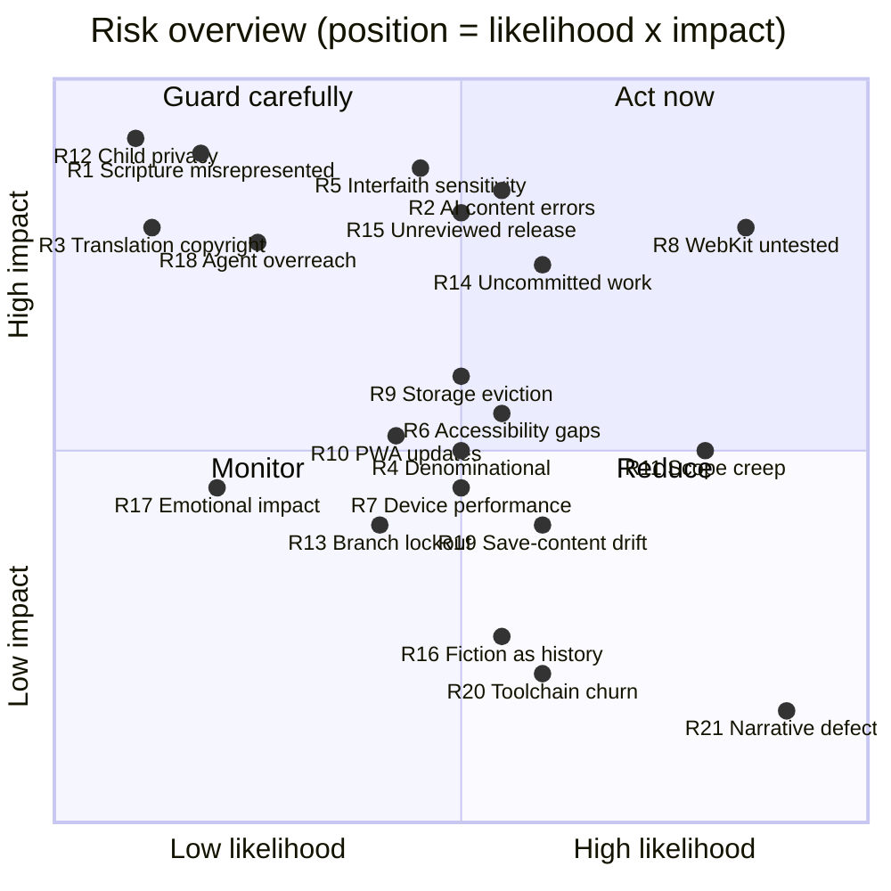

# Risks and mitigations

The risk register for *Witness: A Journey Through Scripture*, Chapter 1 vertical slice. The "mitigation in place" column lists only what exists in the repository today. Anything still to be done is in the "next step" column and in [backlog.md](backlog.md).

**Scales.** *Likelihood:* how likely the risk is to happen (or already be happening) without further action. *Impact:* the harm to players, families, schools or the project if it does. Each is rated Low, Medium or High.

**Top priorities now:** R8 (WebKit untested), R15 (unreviewed content could be released), R2 and R5 (educational and interfaith content needs human review), and R14 (the work isn't committed or pushed anywhere yet).

---

## 1. Content integrity and sensitivity

| ID | Risk | Likelihood | Impact | Mitigation in place | Next step |
|---|---|---|---|---|---|
| **R1** | **Scripture is misrepresented.** Fiction shown as Scripture, invented verses or citations, Jesus portrayed or given words, or Scripture altered. | Low | High | Every record has an explicit **kind** shown in words (Scripture, paraphrase, historical, reconstruction, interpretation, fiction). Scripture records **cannot contain verse text**, only references ([`checkRecordIntegrity`](../src/domain/content-records.ts)). Paraphrases must cite their passage and are shown with "In our own words — not a quotation". Dialogue that retells Scripture must be a `paraphrase` line linked to a paraphrase record. Content tests: every character fictional, no Jesus character or speaker, no embedded verse text ([`road-to-jericho.test.ts`](../tests/content/road-to-jericho.test.ts)). Verse text only comes through the provider, which shows a placeholder by default. | Theological review by named humans (backlog Phase 7). Keep these rules in [chapter-authoring-guide.md](chapter-authoring-guide.md) for Chapter 2. |
| **R2** | **AI-drafted educational content has factual or citation errors.** All 31 educational records were drafted with AI assistance. | Medium | High | Nothing is approved: a content test asserts that no educational record is self-approved, and approval requires a named human ([`transitionReview`](../src/domain/content-records.ts)). 33 sources, each with a URL and access date, were retrieved and checked against their claims by an AI research assistant. Confidence levels (well established, probable, uncertain…) are shown to players. Preview builds label every such record "Awaiting editorial review". `npm run content:publish-check` fails until humans approve. Claim-by-claim notes are in [research/source-verification.md](research/source-verification.md). | A pastor, teacher or historian verifies citations and approves record by record ([content-governance.md](content-governance.md)). Start with the sensitive records: priests and Levites, Samaritans, the Augustine reading. |
| **R3** | **Copyright or trademark problems with Bible translations.** | Low | High | The default is a placeholder, with no Bible text displayed. Only the **public-domain** World English Bible is stored, with licence metadata and the trademark note ("never alter this text while keeping that name"). It is disabled until a human proofreads it. The provider refuses to show any translation marked unlicensed, even if marked approved (tested in [`scripture.test.ts`](../tests/unit/infrastructure/scripture.test.ts)). [`translations.ts`](../src/content/scripture/translations.ts) is a **sensitive path**: commits need a `SECURITY-REVIEW: <approver>` trailer, which agents must never add. | A human proofreads the stored WEB passage verbatim against eBible.org before enabling it. Get written permission before adding any copyrighted translation. |
| **R4** | **Denominational differences.** For example, allegorical vs moral readings of the parable, or a reading that implies God's favor is earned. | Medium | Medium | Interpretations are labelled as interpretation, carry sensitivity notes, and show "Christians may understand this differently" when sensitivity is moderate or high. Both Augustine's Christ-centred reading and the moral reading are presented as views that traditions weigh differently. There are **no faith, holiness or favor scores**, and the content test rejects scoring language. The Scripture Connection comparisons ask questions and never give verdicts. | Review by readers from more than one Christian tradition. Add a note on interpretation to a leader's guide. |
| **R5** | **Interfaith and cultural harm.** Anti-Jewish readings of the priest and Levite, or caricatures of Samaritans or Jewish people. | Medium | High | **No motive is given for the priest or the Levite.** Records say Luke leaves it open and that guesses can become stereotypes. A content test rejects text that pairs them with a purity motive. A kind, thoughtful young Levite (Hanan) appears in the market. A record notes that Jesus and the expert in the Law were Jewish and that the story's challenge is for every listener. Samaritans are described as a living community, and relations as strained but not completely broken. Prejudice is voiced by one fictional character, can be gently challenged, and is never endorsed. The Samaritan merchant is shown to be honest. Sensitivity notes cite scholarship (Ryan 2021). | Sensitivity review with Jewish and Samaritan-informed readers. Widen the automated check, which today only catches ritual-purity motive phrasing. |
| **R16** | **Fictional details are mistaken for history.** The fork, bend, ridge path, cistern, market and inn are invented. | Medium | Low | Records say so explicitly (`rec-hist-road-surface`, `rec-map`, `rec-pl-inn`, which says it is "not meant to be the inn in Jesus' story", and `rec-pl-market`). Fiction carries a "Story (fiction)" badge. The Scripture Connection opens with "Your journey was a made-up story; this passage is Scripture." | Editorial review. Call it out in a leader's guide. |
| **R17** | **Emotional impact on children.** A robbery scene, or guilt after hurrying past. | Low | Medium | The robbery is shown only through its aftermath: no combat and nothing violent on screen. Menashe is found and cared for in **every** branch. Hurrying on gets a non-judgemental response ("Being afraid on that road is nothing to be ashamed of"). The *Courage and fear* record treats fear as normal. Reflection is optional and private. Nothing is scored. | Playtest with 10–12-year-olds and their parents. Add guidance for leaders. |

## 2. Platform and technical

| ID | Risk | Likelihood | Impact | Mitigation in place | Next step |
|---|---|---|---|---|---|
| **R8** | **iOS and iPadOS Safari (WebKit) is untested.** Families are likely to use iPads. Audio unlock, IndexedDB behaviour, canvas sizing and Home Screen install may differ. | High | High | Standard web APIs only. Failures degrade gracefully: audio is optional and every sound has a text equivalent, storage falls back to memory with a warning, and service-worker registration failure is non-fatal. Tracked as registry entry `e2e-webkit-safari` (failing). | Add a `desktop-webkit` Playwright project and run the smoke and chapter specs. Play the full chapter on a real iPad and iPhone, including installed to the Home Screen. |
| **R7** | **Poor performance on low-end phones and tablets.** | Medium | Medium | 146 KB gzip initial download. Phaser and the chapter are lazy-loaded (≈363 KB gzip). Low-power renderer with a 60 fps target and cached canvas textures. Frame rate **measured at 38 fps walking in the market under headless software rendering** (the test floor is 20 fps); automatic quality drops decorative effects when frames stay slow (tested with 8× CPU throttling). | Measure on a mid-range Android phone and an older iPad ([performance.md](performance.md)). Throttled first-load test and a loading indicator. |
| **R6** | **Accessibility gaps that automated checks miss.** | Medium | Medium | axe-core WCAG 2.2 AA checks in jsdom and in a real browser (including contrast and high-contrast mode). Keyboard-only and touch E2E tests. Everything is also available as HTML, with the canvas hidden from assistive technology. A "Go to…" list removes the need for precise movement. Text up to 2×, Atkinson Hyperlegible and OpenDyslexic fonts, reduced motion, captions, no time pressure. Unavailable choices stay visible with the reason. | Screen-reader walkthroughs (NVDA, VoiceOver, TalkBack). Playtest with young and dyslexic players. Assert the canvas `aria-hidden` attributes, which aren't tested today ([accessibility.md](accessibility.md)). |
| **R9** | **Saved progress is lost** through IndexedDB eviction (notably Safari for sites not on the Home Screen), private browsing, or cleared site data. | Medium | Medium | `navigator.storage.persist()` is requested (best effort). If IndexedDB is unavailable, the game falls back to memory and shows a warning that progress will be lost when the page closes. Every save is validated on read, and one unreadable save never hides the others. | Tell players when the browser declines persistent storage (the result is ignored today). Consider a local save export/import. Test the private-mode fallback (no test today). Advise families to install the app. |
| **R10** | **PWA update problems.** A stale version, an update swapped in mid-chapter, or cache bloat. | Medium | Medium | `registerType: 'prompt'` with `skipWaiting: false` and `clientsClaim: false`: a new version waits, and the **title screen** offers "Update now". It is never swapped mid-game. Outdated caches are cleaned up. Registration failure only means online-only play. Sub-path scope and fallback are verified by the build registry entry. | Add an automated test of the update flow. Show the version in the About dialog and in release notes. |
| **R19** | **Saves and content versions drift apart.** A content update renames ids that saved games refer to. | Medium | Medium | The save schema is versioned, with step-by-step migrations tested against fixtures. Tampered and future-version saves are rejected with friendly messages. `contentVersion` is recorded in every save. The dialogue engine handles missing nodes gracefully, and a scene that fails to load shows a recoverable error. | Define a content-compatibility policy (stable ids, content migrations). **Check `contentVersion` on load**, which isn't done today. |
| **R20** | **Toolchain churn.** Recent majors: React 19, Vite 8, Vitest 5, TypeScript 6, ESLint 9. | Medium | Low | `package-lock.json`. Node pinned through `.nvmrc`. Phaser pinned exactly (`3.90.0`). CI runs typecheck, lint, format, all tests, the content check, knip, the build, the quality sweep and E2E. | Regular dependency-update PRs gated by CI. Treat Phaser upgrades as deliberate work. |
| **R21** | **Known narrative and UX defects** found during documentation: Menashe's "stranger" greeting is never shown; "Go to…" does nothing visible for unreachable targets; satchel capacity isn't re-checked after packing. | High (they exist) | Low | Documented in [game-design.md §17](game-design.md#17-known-design-gaps-in-the-current-build). None blocks completing the chapter. | Fix in backlog Phase 9, each with a regression test (US-38). |

## 3. Privacy and safety

| ID | Risk | Likelihood | Impact | Mitigation in place | Next step |
|---|---|---|---|---|---|
| **R12** | **Children's privacy is compromised.** | Low | High | Nickname-only profiles (no email, birthday, real name or account). No backend. Architecture tests forbid `fetch` and `eval` in `src`. Anonymous statistics are **off by default**, go through a whitelist and sanitiser (slugs and integers only), and go to a no-op provider in production. Reflections are stored only on the device, and a test proves they never reach analytics. No AI guide ships, and the future guide policy forbids it from receiving journal or reflection text without permission. | Set host-level Content-Security-Policy headers ([security-privacy.md](security-privacy.md)). Do a formal privacy review of child-data rules before adding any analytics provider or cloud feature. Write a plain-language privacy note for parents. |
| **R15** | **Unreviewed educational content is released publicly as if final.** | Medium | High | The default "preview" content mode labels every unapproved educational record "Awaiting editorial review". Deploying is manual, main-only, and meant to be gated by `github-pages` environment reviewers (once configured). **Gap:** `VITE_CONTENT_MODE=strict` only **removes** that label and blocks nothing. Neither `npm run build` nor the deploy workflow runs `content:publish-check`. The deploy workflow runs typecheck, unit and UI tests and the build, but not E2E. | Make strict mode a real gate (fail the build or hide unapproved records). Add `content:publish-check` to the deploy workflow for public releases. Decide whether a public "preview" deployment is acceptable before editorial approval. Correct the claim in [deferred-features.md](deferred-features.md) that strict builds fail. |

## 4. Project and process

| ID | Risk | Likelihood | Impact | Mitigation in place | Next step |
|---|---|---|---|---|---|
| **R14** | **The work exists only on one machine, uncommitted, with no remote and no server-side protection.** | Medium | High | Local git hooks installed by `init.sh` (pre-commit checks, commit-msg trailer rule, pre-push blocks direct pushes to `main`). Claude Code rules deny destructive and deploy commands. | Make the first commit (when the maintainer asks), push to GitHub, and let CI run. Then apply branch protection (R13). |
| **R13** | **A solo maintainer locks themselves out with branch protection.** GitHub never lets you approve your own PR, so requiring one review with admin enforcement blocks every merge. | Medium | Medium | [`harden-github.sh`](../harden-github.sh) explains this and supports `REQUIRED_REVIEWS=0` (PRs and a green `build-and-test` are still mandatory). `--dry-run` shows every change before it is applied. | Run `REQUIRED_REVIEWS=0 bash harden-github.sh <owner>/<repo>`. Note the recovery path: a repository admin can still edit or remove the rule in repository settings. |
| **R18** | **An AI agent oversteps on sensitive content.** For example, approving records, enabling a translation, or editing workflows or hooks. | Low | High | Sensitive paths (`SENSITIVE_PATH_PATTERNS` in `scripts/lib/policy.sh`) prompt for approval in Claude Code, and committing them needs a human `SECURITY-REVIEW` trailer. Tests assert that no record is self-approved and that the translation is off by default. Deny rules cover merges, releases, workflow dispatch, force-push and deploys. Deploy is manual and main-only. | Server-side protection (R13/R14). Add a `CODEOWNERS` file for `src/content/` and the Scripture registry (none exists yet). When humans do approve content, update the "none self-approved" test deliberately in the same reviewed change. |
| **R11** | **Scope creep.** Starting Chapter 2, cloud sync, an AI guide or analytics before the slice is reviewed and verified on real devices. | High | Medium | [deferred-features.md](deferred-features.md) keeps an explicit out-of-scope list. Cloud, AI guide and analytics exist as **interfaces only**. The feature registry has runnable verifications. New chapters are designed to be content-only. | Finish the human gates (Phase 7) and device verification (Phase 8) before Chapter 2. Add "Later" items only for a concrete need. |

---

## How to use this register

- **Review it** at each phase boundary and before any public deployment.
- **Close a risk** only when its next step is done *and* verified, and link the evidence (a test, a registry entry or a named reviewer).
- **New risks** get the next free ID. Don't renumber, because [backlog.md](backlog.md) refers to these IDs.
