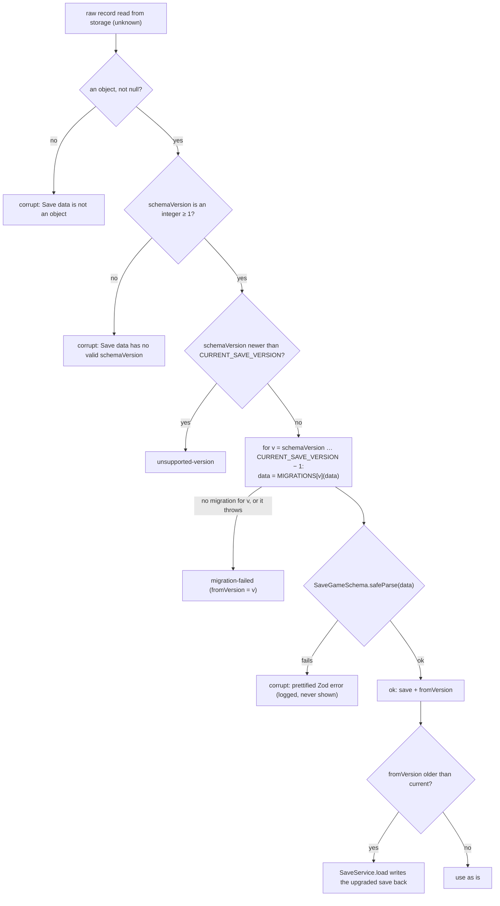

# Save data

How **Witness** stores player progress on the device: the schema, the storage layout, versioning and migrations, failure handling, and how to change the format safely. The decision behind this design is [ADR-0005](adr/0005-local-first-indexeddb-versioned-saves.md).

**Sources of truth:** [src/domain/save.ts](../src/domain/save.ts) (save schema, versions, migrations, error wording) · [src/domain/state/game-state.ts](../src/domain/state/game-state.ts) (the persisted game state) · [src/application/save-service.ts](../src/application/save-service.ts) (build, list, load) · [src/application/autosaver.ts](../src/application/autosaver.ts) · [src/infrastructure/persistence/indexeddb.ts](../src/infrastructure/persistence/indexeddb.ts).

**Principles**

1. **Local only.** Saves never leave the device. There is no server and no network code.
2. **Storage is never trusted.** Every record read back is migrated step by step and then validated against the current Zod schema, on **every** read.
3. **Loading never throws.** `migrateSave()` returns a result object, and one bad save never hides the others.
4. **Only story facts are saved.** `GameState` holds no rendering data (Phaser owns that) and no UI state (the `UiStore` is ephemeral).

---

## 1. Storage layout (IndexedDB)

| Item | Value |
|---|---|
| Database name | `witness-game` (`DB_NAME`) |
| Database version | `1` (`DB_VERSION`). This changes **only** when object stores or indexes change, independently of the save schema version. |
| Upgrade | `openWitnessDb()`: when `oldVersion < 1`, create the three stores below. |
| Access | Only `src/infrastructure/persistence/**` may import `idb` or use `indexedDB` (architecture test). |
| Durability | After opening, `navigator.storage.persist()` is requested on a best-effort basis (failures are ignored). |

| Object store | Key (out-of-line) | Value | Index | Written by | Read by |
|---|---|---|---|---|---|
| `profiles` | `profile.id` | `PlayerProfile` | — | `ProfileService.create / rename / touch / markChapterComplete` | `ProfileService.list()`, which validates each record with `PlayerProfileSchema` and skips invalid ones with a warning |
| `saves` | `save.id` = `` `${profileId}:${slot}` `` | `SaveGame` (any version) | `byProfile` on key path `profileId` | `SaveService.save()`, the write-back after migration in `SaveService.load()`, and `ProfileService.remove()` (deletes all of a profile's saves through a cursor over `byProfile`) | `SaveService.list()` (through `byProfile`), `SaveService.load()` |
| `settings` | the constant `'device'` | `GameSettings` | — | `SettingsService.update / reset` | `SettingsService.load()`, which uses `parseSettings` with a field-by-field fallback |

Records are stored as plain structured-clone data. The repository interfaces (`SaveRepository`, `ProfileRepository`, `SettingsRepository` in [ports.ts](../src/application/ports.ts)) deliberately return **raw `unknown`** from reads, so nothing can skip validation.

**Fallback.** If `indexedDB` is missing or `openWitnessDb()` fails, `createRepositories()` returns the in-memory repositories ([memory-repositories.ts](../src/infrastructure/persistence/memory-repositories.ts), which clone on every read and write) with `status.persistent = false`. The player then sees:

> This browser is not allowing the game to save (private browsing can do this). You can play, but progress will be lost when you close the page.

The message appears on the title screen and as a floating notice in-game.

## 2. Slots and save ids

| Slot | Written when | Shown as |
|---|---|---|
| `auto` | Autosave (§5), "Save and quit to title" | "Autosave" |
| `manual-1`, `manual-2`, `manual-3` | Pause menu → "Save to slot 1/2/3" | "Save slot 1/2/3" |

- A save's id is `saveId(profileId, slot)` = `` `${profileId}:${slot}` ``, so each profile has **at most four saves**, and writing a slot overwrites it.
- The id does **not** include the chapter. With a single playable chapter this is invisible, but a second chapter would share the same four slots per profile (see §8).
- The chapter-select screen groups a profile's saves by `chapterId`. **Continue** loads the most recent one (by `savedAt`), and **Load a saved game** lists them all in slot order (`auto`, `manual-1..3`) with scene name, play time, save time and current objective.
- Starting a **New game** when saves exist asks for confirmation. The existing `auto` slot is overwritten the first time the new game autosaves, and manual slots are kept.
- The UI never deletes individual saves. Removing a profile deletes the profile **and all its saves**. (`SaveService.delete()` exists but has no caller in `src/`.)

## 3. `SaveGame` (schema version 2)

`SaveGameSchema` in [src/domain/save.ts](../src/domain/save.ts):

| Field | Type / constraint | Meaning |
|---|---|---|
| `schemaVersion` | literal `2` (`CURRENT_SAVE_VERSION`) | Save format version. Anything else is migrated or rejected. |
| `id` | non-empty string | `` `${profileId}:${slot}` ``. It is also the IndexedDB key. |
| `profileId` | non-empty string | Owning `PlayerProfile.id`. Indexed by `byProfile`. |
| `slot` | `auto` · `manual-1` · `manual-2` · `manual-3` | See §2. |
| `chapterId` | non-empty string | Chapter this run belongs to (for example `road-to-jericho`). |
| `contentVersion` | non-empty string | `Chapter.contentVersion` at save time (Chapter 1: `1.0.0-draft`). `legacy-v1` for saves migrated from v1. It is recorded, but **not currently compared** on load. |
| `savedAt` | ISO 8601 datetime string | From the injected `Clock` (`new Date(clock.now()).toISOString()`). |
| `label.sceneName` | string | Display name of the current scene (falls back to the scene id). Shown in the load menu. |
| `label.objective` | string or `null` | The HUD's "Next:" line at save time (`currentObjective()`). |
| `state` | `GameState` | The full persistent state (§4). |

The `label` is denormalised, so the load menu can describe a save without loading its chapter.

## 4. `GameState`

`GameStateSchema` in [src/domain/state/game-state.ts](../src/domain/state/game-state.ts). This is the **only** state that is persisted. Only `GameSession` changes it, and every story change goes through the rules runner (see [architecture.md §7](architecture.md#7-the-rules-runner)).

| Field | Type / constraint | Meaning and how it changes |
|---|---|---|
| `chapterId` | non-empty string | Chapter of this run. |
| `sceneId` | non-empty string | Current scene. Set by `enterScene`. |
| `player.x`, `player.y` | finite numbers | Player **tile** position, reported by the world's `playerMoved` event (integer tile coordinates in practice). On restore, the player is drawn at the tile centre. |
| `player.facing` | `up` · `down` · `left` · `right` | Facing direction. |
| `flags` | record of `boolean \| number \| string` | Story flags (`setFlag`). The engine also sets these: `chapter:opened`, `entered:<sceneId>`, `talked:<dialogueId>`, `solved:<puzzleId>`, `seen:scripture-connection`, and each trigger's `onceFlag`. |
| `counters` | record of finite numbers | Numeric facts, for example the chapter's `timeCounter` (`hour`, starting at 8 in Chapter 1). Changed by `adjustCounter` / `setCounter`. |
| `inventory` | record of non-negative integers | Item id → count. Stacks are capped at `Item.maxStack`, and empty stacks are removed. |
| `quests` | record of `QuestProgress` | Quest id → progress (below). A missing entry means `inactive`. |
| `trust` | record of integers | Character id → relationship value, clamped to −2…3 by the rules and shown only as words. |
| `choices` | array of `ChoiceRecord` | Choices in the order made. **The first answer to a choice is kept.** |
| `journal.unlocked` | string[] | Unlocked journal entry ids, in first-unlocked order. |
| `journal.seen` | string[] | Entries the player has opened (drives the "new" badge). |
| `clues` | string[] | Discovered clue ids. |
| `puzzles` | record of `PuzzleProgress` | Puzzle id → progress (below). |
| `visitedScenes` | string[] | Scenes entered through `enterScene`. A new game starts with an empty list, so the start scene is recorded only if the player comes back to it through an exit. |
| `metCharacters` | string[] | Characters met (`meetCharacter`, applied automatically when their dialogue starts). |
| `conversations` | string[] | Dialogues that have ended at least once. |
| `dialogueLog` | array of `DialogueLogEntry`, **max 400** (`MAX_DIALOGUE_LOG`) | Conversation history (nodes shown and choices picked). Older entries are dropped. Also drives `once` choices. |
| `reflection` | `{ text: string (≤ 2000, MAX_REFLECTION_LENGTH), savedAtMs: number }` or `null` | The optional end-of-chapter reflection. **Stored on-device only and never sent anywhere** (§7). Whitespace-only text is stored as `null`. |
| `chapterComplete` | boolean | Set once by the `completeChapter` effect. |
| `playTimeMs` | non-negative number | Play time. The game screen adds 5 000 ms every 5 s while the page is visible and the pause menu is closed. |

**Nested shapes**

| Type | Field | Constraint | Meaning |
|---|---|---|---|
| `QuestProgress` | `status` | `inactive` · `active` · `completed` · `failed` | |
| | `stageId` | string or `null` | Current (or last) stage. |
| | `completedObjectives` | string[] | Objective ids completed (across stages). |
| | `outcomeId` | string or `null` | Set on completion or failure. |
| | `startedAtMs` | non-negative number or `null` | **Play-time** ms when started. |
| `PuzzleProgress` | `status` | `unsolved` · `solved` | |
| | `attempts` | non-negative int | Counted for optional analytics only. There is no penalty. |
| | `hintsUsed` | non-negative int | Highest hint tier revealed. |
| | `solution` | string[] or `null` | Snapshot of the answer, for example the packed satchel. |
| `ChoiceRecord` | `choiceId`, `optionId` | strings | Refers to a chapter `ChoiceDefinition` and one of its options. |
| | `sceneId` | string | Scene where the choice was recorded. |
| | `atMs` | non-negative number | **Play-time** ms (the rules run with `nowMs = playTimeMs`). |
| `DialogueLogEntry` | `dialogueId`, `nodeId` | strings | |
| | `choiceId` | string or `null` | `null` for a node that was shown. The id for a choice picked. |

**Time bases.** `savedAt` (ISO) and `reflection.savedAtMs` come from the wall-clock `Clock`. `ChoiceRecord.atMs` and `QuestProgress.startedAtMs` are **play-time** milliseconds.

## 5. When saves are written

| Trigger | Mechanism | Slot | Timing |
|---|---|---|---|
| Entering a scene | `GameSession.enterScene` publishes `SaveRequested {scene-change}` | `auto` | debounced (600 ms after the last request) |
| A quest stage advances or a quest completes | `stepQuest` emits `SaveRequested {quest-progress}` | `auto` | debounced |
| A puzzle is solved | `PuzzleController.complete` publishes `SaveRequested {puzzle}` | `auto` | debounced |
| The chapter completes | `completeChapter` effect emits `SaveRequested {chapter-complete}` | `auto` | **immediately** (pending debounce cancelled) |
| The page is hidden or closed | `GameScreen` calls `autosaver.flush()` on `pagehide` and `visibilitychange` | `auto` | a pending debounced write runs now |
| Leaving the chapter | `GameRuntime.dispose()` → `Autosaver.dispose()` flushes | `auto` | a pending debounced write runs now |
| Pause → "Save to slot N" | `GameRuntime.saveTo('manual-N')` | `manual-N` | immediately, with a toast |
| Pause → "Save and quit to title" | flush, then `saveTo('auto')` | `auto` | immediately |

All writes go through `Autosaver.write(slot)`, which chains each write after the previous one, so writes never overlap, and then calls `SaveService.save()`. `SaveService.build()` fills the envelope from the current chapter and state. The `SaveRequested` reason `manual` exists in the event type, but the autosaver ignores it, and nothing in `src/` publishes it.

## 6. Failure handling and player-facing messages

`migrateSave()` classifies every problem as a `SaveLoadError`, and `describeLoadError()` turns it into wording without internals:

| Error kind | When | Player sees |
|---|---|---|
| `corrupt` | Not an object. A missing or non-integer `schemaVersion`, or one below 1. The migrated data fails `SaveGameSchema` (for example a negative item count). | *This save could not be read. It may have been damaged. Your other saves are safe.* |
| `unsupported-version` | `schemaVersion` is greater than `CURRENT_SAVE_VERSION` (made by a newer build) | *This save was made by a newer version of the game. Please update the game to load it.* |
| `migration-failed` | No migration is defined for a version, or a migration throws (for example a v1 save whose `inventory` is not a list) | *This older save could not be upgraded to the current version.* |

Other storage outcomes handled by `SaveService`:

| Situation | Result |
|---|---|
| Listing: one or more records fail migration | Readable saves are listed normally. Each unreadable one is added to `unreadable` with its message and shown in a warning box on the chapter-select screen. The id is logged, and the record is left untouched in storage. |
| Listing: the repository itself throws | Logged. The list is empty (no message). |
| Loading: the repository throws | *The save could not be read from this device’s storage.* |
| Loading: no record with that id | *That save no longer exists.* |
| Loading: migration or validation fails | The `describeLoadError` message above, shown on the "Couldn't start" screen with **Back to title**. |
| Loading: writing back the migrated form fails | Logged as a warning. **The load still succeeds**, and migration will run again next time. |
| Saving: the write fails (quota, storage error) | `save()` returns `false` and logs `Save failed`. Autosave shows the toast *Your progress could not be saved on this device.*, and a manual save shows *The game could not be saved.* |

**What validation does not cover.** `SaveGameSchema` checks shape and value constraints, not references to chapter content:

- A save whose `sceneId` doesn't exist in the loaded chapter passes validation. It then fails when the world mounts, and the player gets the recoverable "The game world could not start…" modal.
- `contentVersion` is not compared with the chapter's current `contentVersion`.
- `App.startChapter` does not check that `save.chapterId` matches the chapter being started. The chapter-select screen only offers a chapter's own saves.

## 7. Privacy

- Saves contain the player's **reflection text** and choices. They live only in this browser's IndexedDB.
- The architecture test forbids any access to `.reflection` from `src/infrastructure/**` or analytics code, and the analytics sanitiser only lets slug and integer properties through. A unit test checks that a reflection never appears in analytics output.
- Profiles hold a nickname and a look, with no email, birthday or real name. Deleting a profile deletes its saves.
- There is no export, import or cloud sync. The seams for adding sync later, and the privacy rules any sync must follow, are in [future-aws.md](future-aws.md).

## 8. How to add save version 3

Use this checklist whenever the persisted shape changes. That means any field added, removed, renamed or re-typed in `SaveGameSchema` or `GameStateSchema`, including their nested schemas.

1. **Keep the v2 schema.** Copy the current `SaveGameSchema` (with the `GameStateSchema` it uses) to a frozen `SaveGameV2Schema` (plus a frozen `GameStateV2Schema` if the state changes), the same way `SaveGameV1Schema` is kept. Old saves must stay parseable even after the live schema changes.
2. **Bump the version.** Set `CURRENT_SAVE_VERSION = 3`. `SaveGameSchema.schemaVersion` follows automatically through `z.literal(CURRENT_SAVE_VERSION)`.
3. **Add the migration in the same change.** Add `MIGRATIONS[2] = (raw) => { const v2 = SaveGameV2Schema.parse(raw); return { …v3 shape…, schemaVersion: 3 }; }`. Parse with the *old* schema first, so bad input throws inside the migration and is reported as `migration-failed`. Give every new field a sensible default, and never drop player data silently. `MIGRATIONS[1]` stays as it is: a v1 save goes 1 → 2 → 3 through the loop in `migrateSave`.
4. **Update the history comment** at the top of `src/domain/save.ts` (v1, v2, v3 …).
5. **Add fixtures.** Put a representative real v2 save in `tests/fixtures/saves/v2-<scene>.json` (for example build one with `SaveService.build()` in a test and serialise it), plus a damaged v2 variant if the migration has failure modes.
6. **Extend the tests** in [tests/unit/domain/save-migrations.test.ts](../tests/unit/domain/save-migrations.test.ts):
   - The existing *"has a migration for every version below the current one"* test covers v2 automatically.
   - Add a test that migrates the v2 fixture and asserts the carried-over fields and new defaults.
   - Keep the v1 fixture test: it now exercises the full 1 → 2 → 3 chain.
   - Check idempotence (migrating a current-version save returns it unchanged).
   - Check that the damaged fixture yields `migration-failed`.
7. **Update the browser test** if the load path changes: [e2e/saves.spec.ts](../e2e/saves.spec.ts) seeds IndexedDB with the v1 fixture and loads it.
8. **Don't touch `DB_VERSION`** unless object stores or indexes change. If they do, add a new `if (oldVersion < 2)` block in `openWitnessDb()`'s `upgrade`, and keep the existing block.
9. **Consider the known limits** while changing the format anyway:
   - Chapter-scoped save ids, if more than one chapter becomes playable (today `id = profileId:slot`).
   - Whether `contentVersion` should be checked on load.
10. **Update this document** (§3–4, and the history above), then run `npm run typecheck && npm run lint && npm test` and `npm run test:e2e`.

`GameSettings` has its own `version: 1` literal and no migration table. `parseSettings()` keeps every stored field that is still valid and falls back to defaults field by field. A breaking settings change should bump that version and add an explicit mapping in `parseSettings`.

## 9. The v1 format (kept for migration)

v1 is the minimal Phase-2 engine format. `SaveGameV1Schema` is kept only so that old saves can still be read:

| Field | Type |
|---|---|
| `schemaVersion` | literal `1` |
| `id`, `profileId`, `chapterId` | non-empty strings |
| `slot` | one of the save slots |
| `savedAt` | epoch milliseconds (number) |
| `sceneId` | non-empty string |
| `position` | `{ x, y }` |
| `flags` | record of **boolean** |
| `inventory` | **array of item ids** (a repeated id means several of that item) |

`MIGRATIONS[1]` maps it to v2 as follows:

| v2 field | From v1 |
|---|---|
| `schemaVersion` | `2` |
| `id`, `profileId`, `slot`, `chapterId` | copied |
| `contentVersion` | `'legacy-v1'` |
| `savedAt` | `new Date(v1.savedAt).toISOString()` |
| `label` | `{ sceneName: v1.sceneId, objective: null }` |
| `state.chapterId`, `state.sceneId` | copied |
| `state.player` | `{ x, y }` from `position`, `facing: 'down'` |
| `state.flags` | copied |
| `state.inventory` | the id list counted into a record (`['coins','coins'] → { coins: 2 }`) |
| `state.visitedScenes` | `[v1.sceneId]` |
| every other `GameState` field | its empty or default value (`{}`, `[]`, `null`, `false`, `0`) |

### Migration pipeline

## 10. Fixtures and tests

| Fixture ([tests/fixtures/saves/](../tests/fixtures/saves/)) | Content | Used by |
|---|---|---|
| `v1-market.json` | A valid v1 save in `jerusalem-market`, slot `manual-1`, flags `chapter:opened` and `market-intro`, inventory list with repeated ids | `save-migrations.test.ts` (migration result, idempotence, tamper detection), `services.test.ts` (load + write-back), `e2e/saves.spec.ts` |
| `v1-corrupt-inventory.json` | A v1 save whose `inventory` is a string | `save-migrations.test.ts` → `migration-failed` |
| `future-v99.json` | `schemaVersion: 99` with an unknown field | `save-migrations.test.ts` → `unsupported-version` and the "newer version" wording |
| `garbage.json` | `{ "hello": "world" }` | Not referenced by any test. The same value is tested inline in `save-migrations.test.ts`. |

| Test | What it proves |
|---|---|
| [tests/unit/domain/save-migrations.test.ts](../tests/unit/domain/save-migrations.test.ts) | A migration exists for every version below the current one. v1 → current gives the expected inventory counts, player, flags and ISO `savedAt`, and the result passes `SaveGameSchema`. Migration is idempotent for current saves. A bad v1 save gives `migration-failed`, not a crash. A future save gives `unsupported-version` with a helpful message. `null`, strings, numbers, arrays, objects without a version, and `schemaVersion` 0 or 1.5 are all `corrupt`, with messages that never leak "undefined", "Error" or "zod". A tampered current save (negative coins) is rejected. |
| [tests/unit/application/services.test.ts](../tests/unit/application/services.test.ts) (`SaveService`, `Autosaver`) | Round-trip save → list (with label) → load. Old saves are migrated on load **and written back as v2**. Listing continues when one save is corrupt. Storage failures return `false` / `ok: false` instead of throwing. Autosave debounces bursts into one write and writes immediately on chapter completion. |
| [tests/unit/infrastructure/persistence.test.ts](../tests/unit/infrastructure/persistence.test.ts) | With `fake-indexeddb`: saves are stored and indexed per profile, `deleteForProfile` removes only that profile's saves, and profiles and settings persist across connections. |
| [e2e/saves.spec.ts](../e2e/saves.spec.ts) (desktop Chromium) | In a real browser: seeds IndexedDB (`witness-game` v1) with the v1 fixture plus a broken v2 record, then checks that the chapter screen reports the unreadable save ("could not be read"), that **Load Save slot 1** opens the world in "The lower market, Jerusalem", and that the satchel shows "Bronze coins ×3" (the migrated counts). |
